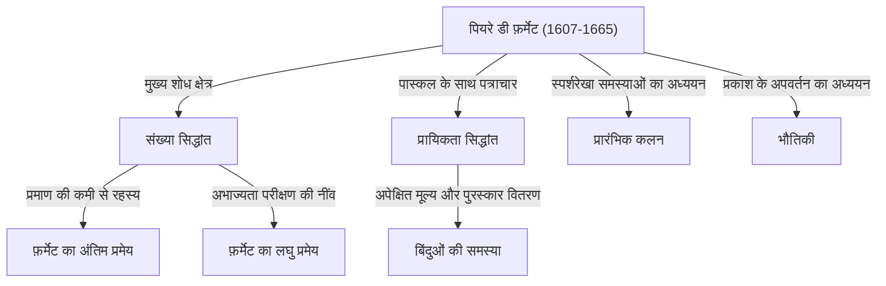

## प्रस्तावना: वह व्यक्ति जिसने गणित का सबसे बड़ा रहस्य छोड़ा

जब गणित के इतिहास में सबसे प्रसिद्ध और नाटकीय कहानी पैदा करने वाले व्यक्ति की बात आती है, तो [पियरे डी फ़र्मेट](https://kenji.blog/hi/p/fermat/) से आगे देखने की आवश्यकता नहीं है। वह कोई पेशेवर गणितज्ञ नहीं थे। वे आमतौर पर एक क्षेत्रीय न्यायाधीश के रूप में काम करते थे और अपने खाली समय में गणित का आनंद लेते थे, जिससे उन्हें **"शौकिया गणितज्ञ"** कहा जाने लगा। हालाँकि, उन्होंने जो उपलब्धियाँ पीछे छोड़ीं, उन्होंने उस समय के यूरोप के सबसे महान दिमागों को चकित कर दिया और उनकी मृत्यु के 350 से अधिक वर्षों बाद भी दुनिया भर के प्रतिभाशाली गणितज्ञों को परेशान करती रहीं।

इस लेख में, हम फ़र्मेट के जीवन, उनकी प्रमुख गणितीय खोजों, और गणित के इतिहास में दर्ज ऐतिहासिक **"फ़र्मेट के अंतिम प्रमेय"** के इर्द-गिर्द बुनी गई रूमानी गाथा की गहराई में उतरेंगे। आइए जानें कि कैसे उन्होंने आधुनिक गणित की नींव रखी और उनकी आश्चर्यजनक अंतर्दृष्टि और कल्पना के स्रोतों को उजागर करें।

## 1. एक न्यायाधीश के रूप में उनका सार्वजनिक चेहरा और गणित के प्रति उनका जुनून

[पियरे डी फ़र्मेट](https://kenji.blog/hi/p/fermat/) का जन्म 1607 के अंत (या कुछ सिद्धांतों के अनुसार 1601) में दक्षिण-पश्चिमी फ्रांस के ब्यूमोंट-डी-लोमग्ने में चमड़े के एक धनी व्यापारी के परिवार में हुआ था। कम उम्र से ही असाधारण रूप से मेधावी, उन्होंने ऑरलियन्स विश्वविद्यालय में कानून की पढ़ाई की और 1631 में, टूलूज़ के पारलेमेंट में पार्षद (न्यायाधीश) का सम्मानजनक पद ग्रहण किया। तब से, उन्होंने अपना पूरा जीवन एक लोक सेवक के रूप में व्यतीत किया।

उस समय के फ्रांस में, राजनीतिक और सामाजिक संघर्षों को रोकने के लिए न्यायाधीशों को अपने सामाजिक दायरे को बहुत अधिक बढ़ाने से बचने के लिए प्रोत्साहित किया जाता था। विडंबना यह है कि इस अलग-थलग माहौल ने फ़र्मेट को वह शांत समय प्रदान किया जिसकी उन्हें आवश्यकता थी, और उन्हें गणित की गहराइयों की ओर प्रेरित किया। उनके लिए, गणित एक शुद्ध आनंद था जिसने उन्हें उनके कर्तव्यों के भारी दबावों से मुक्त किया, न कि कुछ ऐसा जो किसी के द्वारा उन पर थोपा गया हो।

फ़र्मेट को अपने शोध को औपचारिक पत्रों के रूप में प्रकाशित करना पसंद नहीं था; वे अपने विचारों और प्रमाणों को नोटबुक या किताबों के हाशिये में लिख कर, या पेरिस में एक भिक्षु, मारिन मर्सने, जो उस समय एक अकादमिक केंद्र के रूप में कार्य करते थे, के माध्यम से अन्य विद्वानों के साथ पत्रों का आदान-प्रदान करके संतुष्ट थे। वे अपनी खोजों को अन्य गणितज्ञों के सामने **"समस्याओं"** के रूप में प्रस्तुत करने का आनंद लेते थे, उत्तेजक ढंग से उनके समाधान की मांग करते थे। यह भी ज्ञात है कि उन्होंने [रेने डेसकार्टेस](https://kenji.blog/hi/p/descartes/) और [जॉन वालिस](https://kenji.blog/hi/p/wallis/) जैसे महान गणितज्ञों के साथ तीखी बहस की थी।

## 2. संख्या सिद्धांत में असीम योगदान

फ़र्मेट की सबसे बड़ी रुचि और वह क्षेत्र जहाँ उन्होंने अपनी सबसे गहरी छाप छोड़ी, वह था **संख्या सिद्धांत** (वह शाखा जो संख्याओं के गुणों की खोज करती है)। प्राचीन ग्रीक गणितज्ञ [डायोफैंटस](https://kenji.blog/hi/p/diophantus/) की *Arithmetica* पढ़ने के प्रति समर्पित, उन्होंने इससे प्रेरणा लेकर कई अभूतपूर्व प्रमेयों की खोज की।

### 2.1. फ़र्मेट का लघु प्रमेय

एक अत्यंत महत्वपूर्ण प्रमेय जो आधुनिक क्रिप्टोग्राफी (जैसे [RSA](https://kenji.blog/hi/p/modern-cryptography-public-key-hash-signature/) एन्क्रिप्शन) की नींव बनाता है, वह है **फ़र्मेट का लघु प्रमेय**। यह अभाज्य संख्याओं के संबंध में एक आश्चर्यजनक गुण को प्रकट करता है और हमारे आधुनिक इंटरनेट समाज में सुरक्षा तकनीक का खामोशी से समर्थन करता है।

प्रमेय का कथन इस प्रकार है:
किसी भी अभाज्य संख्या $p$ और किसी भी पूर्णांक $a$ के लिए जो $p$ का सह-अभाज्य है (जिसका अर्थ है कि यह $p$ का गुणज नहीं है), निम्नलिखित सर्वांगसमता लागू होती है:

$$
a^{p-1} \equiv 1 \pmod{p} \quad \text{ (जहाँ } p \text{ एक अभाज्य संख्या है)}
$$

दूसरे शब्दों में, यह गुण तय करता है कि "$a$ को $p-1$ की घात तक बढ़ाने और $1$ घटाने पर प्राप्त संख्या हमेशा $p$ से विभाज्य होती है"। उदाहरण के लिए, यदि $p = 5$ और $a = 2$, तो $2^{5-1} = 2^4 = 16$, और $16 - 1 = 15$, जो खूबसूरती से $5$ का गुणज है। यह प्रमेय उन एल्गोरिदम (जैसे फ़र्मेट अभाज्यता परीक्षण) के लिए आधार के रूप में कार्य करता है जो तेज़ी से यह निर्धारित करते हैं कि क्या अत्यंत बड़ी संख्याएँ अभाज्य हैं।

### 2.2. दो वर्गों के योग पर प्रमेय

फ़र्मेट ने अभाज्य संख्याओं के गुणों के संबंध में एक और सुंदर प्रमेय खोजा: "एक अभाज्य संख्या जिसे $4$ से विभाजित करने पर $1$ शेष बचता है, उसे हमेशा ठीक एक तरीके से दो वर्गों (दो पूर्णांकों के वर्गों) के योग के रूप में व्यक्त किया जा सकता है।"

$$
p = x^2 + y^2 \quad \text{ (जहाँ } p \equiv 1 \pmod{4} \text{ )}
$$

उदाहरण के लिए, यदि $p = 5$, तो यह $5 = 1^2 + 2^2$ है; यदि $p = 13$, तो यह $13 = 2^2 + 3^2$ है; यदि $p = 29$, तो यह $29 = 2^2 + 5^2$ है। इसके विपरीत, अभाज्य संख्याएँ जिन्हें $4$ से विभाजित करने पर $3$ शेष बचता है (जैसे $7, 11, 19$) उन्हें कभी भी दो वर्गों के योग के रूप में व्यक्त नहीं किया जा सकता है। फ़र्मेट ने संख्या सिद्धांत में ऐसी गहरी नियमितताओं को क्रमिक रूप से उजागर किया।

### 2.3. फ़र्मेट अभाज्य और सम बहुभुजों की रचना

फ़र्मेट ने अभाज्य संख्याएँ उत्पन्न करने वाले गणितीय सूत्रों पर भी विचार किया। उन्होंने अनुमान लगाया कि $F_n = 2^{2^n} + 1$ रूप की सभी संख्याएँ अभाज्य हैं। वास्तव में, $n=0, 1, 2, 3, 4$ के लिए, परिणाम क्रमशः $3, 5, 17, 257, 65537$ हैं, और ये सभी अभाज्य हैं। इन्हें **फ़र्मेट अभाज्य** कहा जाता है।

हालाँकि, [लियोनहार्ड यूलर](https://kenji.blog/hi/p/euler/) ने बाद में दिखाया कि जब $n=5$, $2^{32} + 1 = 4294967297 = 641 \times 6700417$, इस प्रकार फ़र्मेट के अनुमान को ही गलत साबित कर दिया। फिर भी, [कार्ल फ्रेडरिक गॉस](https://kenji.blog/hi/p/gauss/) द्वारा बाद में यह सिद्ध किया गया कि ये फ़र्मेट अभाज्य गहराई से "परकार और सीधे किनारे (straightedge) के साथ एक नियमित $n$-भुज के निर्माण योग्य होने की शर्तों" से जुड़े थे, जो बाद की पीढ़ियों के लिए ज्यामिति और बीजगणित के संलयन में अत्यंत महत्वपूर्ण भूमिका निभाते हैं।

## 3. अनंत अवरोहण की विधि: फ़र्मेट की तेज तलवार

हालाँकि फ़र्मेट ने शायद ही कभी अपने प्रमेयों के लिए प्रमाण लिखे, एक अनूठी विधि थी जिसके बारे में उन्होंने यह कहते हुए शेखी बघारी थी कि "यह मेरे द्वारा खोजी गई सबसे शक्तिशाली प्रमाण विधि है।" यह **अनंत अवरोहण की विधि (Method of Infinite Descent)** है।

यह विरोधाभास द्वारा प्रमाण का एक रूप है, जिसका मुख्य रूप से यह साबित करने के लिए उपयोग किया जाता है कि "किसी निश्चित शर्त को पूरा करने वाले कोई धनात्मक पूर्णांक समाधान मौजूद नहीं हैं।" तर्क का मूल प्रवाह इस प्रकार है:

1. मान लें कि शर्त को पूरा करने वाला एक धनात्मक पूर्णांक समाधान मौजूद है।
2. गणितीय रूप से दिखाएँ कि उस समाधान से शुरू करके, एक और भी छोटा धनात्मक पूर्णांक समाधान बनाना संभव है जो उसी शर्त को पूरा करता हो।
3. इस प्रक्रिया को दोहराने का अर्थ है कि धनात्मक पूर्णांक समाधान असीम रूप से छोटा होता रहेगा।
4. हालाँकि, चूँकि धनात्मक पूर्णांकों का न्यूनतम मान $1$ होता है, इसलिए उनका अनिश्चित काल तक छोटा होते रहना असंभव है।
5. इसलिए, प्रारंभिक धारणा गलत है, और शर्त को पूरा करने वाला कोई धनात्मक पूर्णांक समाधान मौजूद नहीं है।

इस तकनीक का उपयोग करते हुए, फ़र्मेट ने स्वयं ऐसे प्रमेयों को सिद्ध किया जैसे "एक समकोण त्रिभुज का क्षेत्रफल एक वर्ग संख्या नहीं हो सकता है।" यूलर जैसे बाद के गणितज्ञों ने भी गहराई से अध्ययन किया और फ़र्मेट द्वारा छोड़े गए प्रमेयों को सिद्ध करने के लिए इस अनंत अवरोहण विधि का भारी उपयोग किया।

## 4. प्रायिकता सिद्धांत के एक संस्थापक के रूप में

फ़र्मेट की असाधारण प्रतिभा संख्या सिद्धांत तक ही सीमित नहीं थी। 1654 में, उन्होंने प्रतिभाशाली विचारक और गणितज्ञ [ब्लेज़ पास्कल](https://kenji.blog/hi/p/pascal/) के साथ पत्रों की एक श्रृंखला का आदान-प्रदान किया। इसी पत्राचार को आधुनिक **प्रायिकता सिद्धांत (Probability Theory)** की सुबह माना जाता है।

उनकी चर्चा का उत्प्रेरक जुए से जुड़ा एक सवाल था जिसे **"बिंदुओं की समस्या (Problem of points)"** के रूप में जाना जाता है, जिसे शेवेलियर डी मेरे नामक एक व्यक्ति ने पास्कल के सामने रखा था।
सवाल यह था: "समान कौशल वाले दो खिलाड़ी एक खेल खेल रहे हैं जहाँ एक निश्चित संख्या में राउंड जीतने वाला पहला व्यक्ति पूरा पुरस्कार लेता है। हालाँकि, यदि खेल बीच में ही बाधित हो जाता है, तो जीत और हार की वर्तमान स्थिति के आधार पर पुरस्कार को निष्पक्ष रूप से कैसे विभाजित किया जाना चाहिए?"

यद्यपि फ़र्मेट और पास्कल ने प्रत्येक ने पूरी तरह से अलग गणितीय दृष्टिकोण का उपयोग किया, वे अंततः बिल्कुल उसी निष्कर्ष (प्रायिकता और अपेक्षित मूल्य की वर्तमान अवधारणाओं के आधार पर सही वितरण अनुपात) पर पहुँचे। पास्कल ने द्विपद गुणांक जैसे संयोजन विज्ञान का उपयोग किया, जबकि फ़र्मेट ने सभी संभावित परिणामों को सूचीबद्ध करने और गिनने की एक सुंदर विधि का उपयोग किया। केवल कुछ महीनों तक चलने वाले इस पत्राचार के माध्यम से, गणित की एक स्वतंत्र शाखा के रूप में "प्रायिकता सिद्धांत" का जन्म हुआ।

## 5. कलन और भौतिकी में अग्रणी योगदान

[आइजैक न्यूटन](https://kenji.blog/hi/p/newton/) और गॉटफ्रीड लाइबनिज द्वारा कलन की स्थापना करने से दशकों पहले, फ़र्मेट ने वक्रों पर स्पर्शरेखा खींचने और कार्यों के अधिकतम और न्यूनतम मान खोजने के लिए अपने स्वयं के तरीके तैयार किए थे।

उन्होंने **"Adequality"** नामक एक अवधारणा पेश की। यह एक ऐसी तकनीक है जहाँ एक बहुत छोटी मात्रा $E$ के भिन्न होने पर किसी मान को "लगभग बराबर" माना जाता है, और गणना के अंतिम चरण में $E$ को $0$ के रूप में मानकर चरम मान पाया जाता है। यह अनिवार्य रूप से आधुनिक अवकलन का ही विचार है, और स्वयं न्यूटन ने बाद में टिप्पणी की, "मुझे इस विधि का संकेत फ़र्मेट की स्पर्शरेखा खींचने के तरीके से मिला था।" फ़र्मेट के बिना, कलन के पूरा होने में और भी देरी हो सकती थी।

इसके अलावा, भौतिकी (प्रकाशिकी) के क्षेत्र में, उन्होंने **फ़र्मेट का सिद्धांत** प्रस्तावित किया, जो बताता है कि "प्रकाश दो बिंदुओं के बीच उस पथ पर यात्रा करता है जिसमें कम से कम समय लगता है।" इससे गणितीय रूप से स्नेल के अपवर्तन के नियम की व्युत्पत्ति हुई, आधुनिक प्रकाशिकी का आधार बना, और एक अत्यंत महत्वपूर्ण खोज बन गया जिसके कारण "न्यूनतम क्रिया का सिद्धांत" सामने आया जो बाद के संपूर्ण भौतिकी में व्याप्त है।

## 6. हाशिए में नाटक: फ़र्मेट का अंतिम प्रमेय

इतनी सारी महान उपलब्धियों को पीछे छोड़ने के बावजूद, जो बात स्पष्ट रूप से फ़र्मेट को इतिहास का सबसे प्रसिद्ध गणितज्ञ बनाती है, वह है **"फ़र्मेट के अंतिम प्रमेय"** का अस्तित्व।

[डायोफैंटस](https://kenji.blog/hi/p/diophantus/) की *Arithmetica*, जो उनकी पसंदीदा पुस्तक थी, के खंड 2 में [पाइथागोरस प्रमेय](/hi/p/diverse-proofs-of-pythagorean-theorem/) ( $x^2 + y^2 = z^2$ ) से संबंधित एक गद्यांश के हाशिये में, फ़र्मेट ने लैटिन में निम्नलिखित आश्चर्यजनक नोट लिखा:

> "Cubum autem in duos cubos, aut quadratoquadratum in duos quadratoquadratos, et generaliter nullam in infinitum ultra quadratum potestatem in duas eiusdem nominis fas est dividere cuius rei demonstrationem mirabilem sane detexi. Hanc marginis exiguitas non caperet."
> 
> (एक घन को दो घनों में, या एक चौथी घात को दो चौथी घातों में, या सामान्य रूप से, दूसरी से अधिक किसी भी घात को दो समान घातों में अलग करना असंभव है। मैंने इसका एक **सचमुच अद्भुत प्रमाण** खोज लिया है, जिसे समाहित करने के लिए यह हाशिया बहुत संकीर्ण है।)

एक गणितीय सूत्र के रूप में व्यक्त किया गया, यह अविश्वसनीय रूप से सरल है:

"जब $n$ $3$ के बराबर या उससे बड़ा एक पूर्णांक है, तो कोई धनात्मक पूर्णांक समाधान $(x, y, z)$ मौजूद नहीं हैं जो निम्नलिखित समीकरण को पूरा करते हों।"

$$
x^n + y^n = z^n \quad \text{ (जहाँ } n \ge 3 \text{ )}
$$

1665 में फ़र्मेट के निधन के बाद, उनके सबसे बड़े बेटे क्लेमेंट-सैमुअल ने *Arithmetica* का एक नया संस्करण प्रकाशित किया जिसमें उनके पिता की टिप्पणियां शामिल थीं। वहीं से, दुनिया भर के गणितज्ञों के लिए एक भीषण चुनौती शुरू हुई।

यूलर, लेजेंड्रे, डिरिचलेट, गॉस और सोफी जर्मेन जैसी लगातार प्रतिभाओं ने इस समस्या से निपटा। जबकि $n=3, 4, 5, 7$ के लिए अलग-अलग मामले साबित हुए, कोई भी इसे सभी $n$ के लिए सामान्य रूप से साबित नहीं कर सका।

### 350 साल बाद नाटकीय निष्कर्ष

इसके प्रस्ताव के 350 से अधिक वर्षों तक, यह समस्या गणित की सबसे बड़ी अनसुलझी समस्या के रूप में राज करती रही, जिसे कोई भी हल नहीं कर पाया। 20वीं सदी के उत्तरार्ध में, जब कई लोगों को यह संदेह होने लगा कि "फ़र्मेट ने वास्तव में इसे साबित नहीं किया था (या गलती की थी)", तो एक गणितज्ञ ने अंततः इस दुर्जेय पहेली को समाप्त कर दिया।

वह ब्रिटिश गणितज्ञ [एंड्रयू विल्स](https://kenji.blog/hi/p/wiles/) थे। 10 साल की उम्र में अपनी स्थानीय लाइब्रेरी में इस समस्या का सामना करने के बाद, उन्होंने इसे हल करने के लिए अपना जीवन समर्पित करने की कसम खाई। उन्होंने फ़र्मेट के समय में अकल्पनीय एक भव्य दृष्टिकोण अपनाया, जिसमें जापानी गणितज्ञों [युताका तानियामा](/hi/p/taniyama-yutaka/) और [गोरो शिमुरा](https://kenji.blog/hi/p/shimura-goro/) द्वारा सामने रखे गए **तानियामा-शिमुरा अनुमान**—जिसने प्रस्तावित किया कि "सभी अण्डाकार वक्र मॉड्यूलर हैं"—को फ्रे वक्र (एप्सिलॉन अनुमान) पर केन रिबेट के शोध के साथ जोड़ा गया।

विल्स ने खुद को अपनी अटारी में एकांतवास में रखा, और सात साल के एकांत शोध के बाद, 1995 में पूर्ण प्रमाण प्रकाशित किया। उनका प्रमाण आधुनिक गणित का चरम बिंदु था जो सैकड़ों पृष्ठों में फैला था, 17वीं सदी के गणितीय तरीकों ("सचमुच अद्भुत प्रमाण") से पूरी तरह अलग था जिसकी फ़र्मेट ने संभवतः कल्पना की थी।

क्या फ़र्मेट के पास वास्तव में एक सही प्रमाण था, यह आज भी एक शाश्वत रहस्य बना हुआ है। हालाँकि, यह एक निर्विवाद तथ्य है कि उनके "हाशिये के नोट" ने बाद की पीढ़ियों में गणित के विकास के लिए एक अथाह प्रेरक शक्ति प्रदान की।

## निष्कर्ष: शौकिया गणितज्ञों के राजकुमार की विरासत

[पियरे डी फ़र्मेट](https://kenji.blog/hi/p/fermat/) केवल एक न्यायाधीश थे जिन्हें शिक्षा जगत के आकर्षक मुख्य मंच पर कदम रखना पसंद नहीं था। फिर भी, उन्होंने कागज के टुकड़ों और किताबों के हाशिये में जो विचार लिखे, उन्होंने संख्या सिद्धांत और प्रायिकता से लेकर कलन और प्रकाशिकी तक विविध क्षेत्रों के दरवाजे खोल दिए।

उन्होंने जो सबसे बड़ा रहस्य पीछे छोड़ा, उसने कई सदियों तक अनगिनत गणितज्ञों को मोहित और परेशान किया, इस प्रक्रिया में नए गणितीय सिद्धांतों का पोषण किया। फ़र्मेट का अस्तित्व आज भी हमसे गणित के अनुशासन में निहित अथाह रोमांस और गहराई के बारे में बात करता है। वे निस्संदेह, इतिहास के सबसे महान और आत्मा को झकझोरने वाले **"शौकिया गणितज्ञों के राजकुमार"** हैं।
