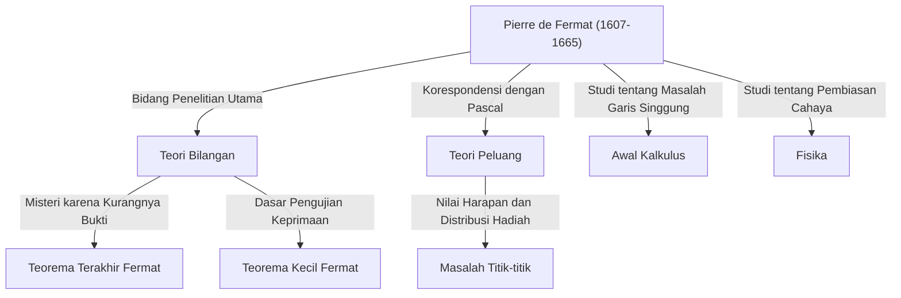

## Pengantar: Pria yang Meninggalkan Misteri Terbesar dalam Matematika

Bila berbicara tentang sosok yang melahirkan kisah paling terkenal dan dramatis dalam sejarah matematika, kita tidak perlu mencari selain [Pierre de Fermat](https://kenji.blog/id/p/fermat/). Ia bukanlah seorang matematikawan profesional. Ia biasanya bekerja sebagai hakim daerah dan menikmati matematika di waktu luangnya, menjadikannya apa yang disebut sebagai **"matematikawan amatir"**. Akan tetapi, pencapaian yang ditinggalkannya membuat takjub pemikir-pemikir terhebat Eropa pada masa itu dan akan terus menyiksa para matematikawan jenius di seluruh dunia selama lebih dari 350 tahun setelah kematiannya.

Dalam artikel ini, kita akan menggali lebih dalam kehidupan [Fermat](https://kenji.blog/id/p/fermat/), penemuan-penemuan matematika utamanya, dan kisah romantis yang mengelilingi **"[Teorema Terakhir Fermat](https://kenji.blog/id/p/fermats-last-theorem/)"** yang monumental dan tetap terukir dalam sejarah matematika. Mari kita telusuri bagaimana ia meletakkan dasar-dasar matematika modern dan mengungkap sumber wawasan serta imajinasinya yang menakjubkan.

## 1. Wajah Publiknya sebagai Hakim dan Hasratnya pada Matematika

[Pierre de Fermat](https://kenji.blog/id/p/fermat/) lahir pada akhir tahun 1607 (atau 1601, menurut beberapa teori) dalam sebuah keluarga pedagang kulit yang kaya raya di Beaumont-de-Lomagne, di barat daya Prancis. Sangat cerdas sejak usia muda, ia belajar hukum di Universitas Orléans dan, pada tahun 1631, mengambil posisi terhormat sebagai penasihat (hakim) di Parlemen Toulouse. Sejak saat itu, ia menghabiskan seluruh hidupnya sebagai pegawai negeri.

Di Prancis pada masa itu, para hakim didorong untuk menghindari memperluas lingkaran sosial mereka terlalu luas guna mencegah konflik politik dan sosial. Ironisnya, lingkungan yang terisolasi ini justru memberi [Fermat](https://kenji.blog/id/p/fermat/) waktu tenang yang ia butuhkan, mendorongnya menuju kedalaman matematika. Baginya, matematika adalah kegembiraan murni yang membebaskannya dari tekanan berat tugas-tugasnya, bukan sesuatu yang dipaksakan kepadanya oleh siapa pun.

[Fermat](https://kenji.blog/id/p/fermat/) tidak suka menerbitkan penelitiannya sebagai makalah formal; ia merasa puas dengan hanya mencatat ide-ide dan pembuktiannya di buku catatan atau di margin buku, atau dengan bertukar surat dengan para sarjana lain melalui [Marin Mersenne](https://kenji.blog/id/p/mersenne/), seorang biarawan di Paris yang bertindak sebagai pusat akademik pada saat itu. Ia menikmati menyajikan penemuannya sebagai **"masalah"** kepada matematikawan lain, secara provokatif menuntut penyelesaian dari mereka. Ia juga dikenal sering terlibat dalam perdebatan sengit dengan matematikawan besar seperti [René Descartes](https://kenji.blog/id/p/descartes/) dan [John Wallis](https://kenji.blog/id/p/wallis/).

## 2. Kontribusi Besar pada Teori Bilangan

Minat terbesar [Fermat](https://kenji.blog/id/p/fermat/) dan bidang di mana ia meninggalkan jejak terdalamnya adalah **Teori Bilangan** (cabang yang mengeksplorasi sifat-sifat bilangan). Karena sangat gemar membaca *Arithmetica* karya matematikawan Yunani kuno [Diophantus](https://kenji.blog/id/p/diophantus/), ia menarik inspirasi dari buku tersebut untuk menemukan banyak teorema yang inovatif.

### 2.1. [Teorema Kecil Fermat](https://kenji.blog/id/p/fermats-little-theorem/)

Sebuah teorema yang sangat penting dan membentuk dasar kriptografi modern (seperti enkripsi [RSA](https://kenji.blog/id/p/modern-cryptography-public-key-hash-signature/)) adalah **[Teorema Kecil Fermat](https://kenji.blog/id/p/fermats-little-theorem/)**. Teorema ini mengungkapkan sifat yang mengejutkan mengenai bilangan prima dan secara diam-diam mendukung teknologi keamanan dalam masyarakat internet modern kita.

Pernyataan teorema tersebut adalah sebagai berikut:
Untuk sembarang bilangan prima $p$ dan sembarang bilangan bulat $a$ yang relatif prima terhadap $p$ (berarti bukan kelipatan dari $p$), kekongruenan berikut berlaku:

$$
a^{p-1} \equiv 1 \pmod{p} \quad \text{ (di mana } p \text{ adalah bilangan prima)}
$$

Dengan kata lain, sifat tersebut mendiktekan bahwa "bilangan yang diperoleh dengan memangkatkan $a$ dengan $p-1$ dan dikurangi $1$ selalu habis dibagi oleh $p$". Sebagai contoh, jika $p = 5$ dan $a = 2$, maka $2^{5-1} = 2^4 = 16$, dan $16 - 1 = 15$, yang dengan indah merupakan kelipatan dari $5$. Teorema ini berfungsi sebagai dasar untuk algoritma (seperti uji keprimaan [Fermat](https://kenji.blog/id/p/fermat/)) yang dengan cepat menentukan apakah bilangan yang sangat besar adalah bilangan prima.

### 2.2. Teorema Jumlah Dua Kuadrat

[Fermat](https://kenji.blog/id/p/fermat/) menemukan teorema indah lainnya mengenai sifat-sifat bilangan prima: "Bilangan prima yang bersisa $1$ jika dibagi $4$ selalu dapat dinyatakan dengan tepat satu cara sebagai jumlah dari dua buah kuadrat (kuadrat dari dua bilangan bulat)."

$$
p = x^2 + y^2 \quad \text{ (di mana } p \equiv 1 \pmod{4} \text{ )}
$$

Sebagai contoh, jika $p = 5$, maka $5 = 1^2 + 2^2$; jika $p = 13$, maka $13 = 2^2 + 3^2$; jika $p = 29$, maka $29 = 2^2 + 5^2$. Sebaliknya, bilangan prima yang bersisa $3$ jika dibagi $4$ (seperti $7, 11, 19$) tidak akan pernah bisa dinyatakan sebagai jumlah dari dua buah kuadrat. [Fermat](https://kenji.blog/id/p/fermat/) berturut-turut mengungkap keteraturan yang mendalam seperti itu dalam teori bilangan.

### 2.3. Bilangan Prima [Fermat](https://kenji.blog/id/p/fermat/) dan Konstruksi Segi Banyak Beraturan

[Fermat](https://kenji.blog/id/p/fermat/) juga mempertimbangkan rumus matematika yang menghasilkan bilangan prima. Ia menduga bahwa semua bilangan dalam bentuk $F_n = 2^{2^n} + 1$ adalah bilangan prima. Memang, untuk $n=0, 1, 2, 3, 4$, hasilnya berturut-turut adalah $3, 5, 17, 257, 65537$, dan semuanya adalah bilangan prima. Ini disebut **Bilangan prima [Fermat](https://kenji.blog/id/p/fermat/)**.

Namun, [Leonhard Euler](https://kenji.blog/id/p/euler/) kemudian menunjukkan bahwa ketika $n=5$, $2^{32} + 1 = 4294967297 = 641 \times 6700417$, sehingga menyangkal dugaan [Fermat](https://kenji.blog/id/p/fermat/) itu sendiri. Meski begitu, [Carl Friedrich Gauss](https://kenji.blog/id/p/gauss/) di kemudian hari membuktikan bahwa bilangan prima [Fermat](https://kenji.blog/id/p/fermat/) ini memiliki hubungan erat dengan "syarat-syarat agar segi-$n$ beraturan dapat dikonstruksi menggunakan jangka dan penggaris tanpa skala", memainkan peran yang sangat penting dalam perpaduan geometri dan aljabar untuk generasi berikutnya.

## 3. Metode Penurunan Tak Terhingga: Pedang Tajam [Fermat](https://kenji.blog/id/p/fermat/)

Meskipun [Fermat](https://kenji.blog/id/p/fermat/) jarang menuliskan bukti untuk teorema-teoremanya, ada sebuah metode unik yang ia banggakan sebagai "metode pembuktian paling kuat yang pernah saya temukan." Metode ini adalah **Metode Penurunan Tak Terhingga** (Method of Infinite Descent).

Ini adalah bentuk pembuktian melalui kontradiksi, terutama digunakan untuk membuktikan bahwa "tidak ada solusi bilangan bulat positif yang memenuhi suatu kondisi tertentu." Alur dasar argumennya adalah sebagai berikut:

1. Asumsikan bahwa ada solusi bilangan bulat positif yang memenuhi kondisi tersebut.
2. Tunjukkan secara matematis bahwa mulai dari solusi tersebut, dimungkinkan untuk membuat solusi bilangan bulat positif yang bahkan lebih kecil yang memenuhi kondisi yang sama.
3. Mengulangi prosedur ini menyiratkan bahwa solusi bilangan bulat positif tersebut akan terus menjadi lebih kecil secara tak terhingga.
4. Namun, karena bilangan bulat positif memiliki nilai minimum $1$, tidak mungkin bagi bilangan-bilangan tersebut untuk terus mengecil tanpa batas.
5. Oleh karena itu, asumsi awal adalah salah, dan tidak ada solusi bilangan bulat positif yang memenuhi kondisi tersebut.

Menggunakan teknik ini, [Fermat](https://kenji.blog/id/p/fermat/) sendiri membuktikan proposisi seperti "luas segitiga siku-siku tidak mungkin berupa bilangan kuadrat." Matematikawan di kemudian hari seperti Euler juga mempelajari secara mendalam dan sangat memanfaatkan metode penurunan tak terhingga ini untuk membuktikan teorema-teorema yang ditinggalkan [Fermat](https://kenji.blog/id/p/fermat/).

## 4. Sebagai Pendiri Teori Peluang

Bakat luar biasa [Fermat](https://kenji.blog/id/p/fermat/) tidak terbatas pada teori bilangan. Pada tahun 1654, ia bertukar serangkaian surat dengan pemikir dan matematikawan jenius [Blaise Pascal](https://kenji.blog/id/p/pascal/). Korespondensi inilah yang dianggap sebagai awal mula **Teori Peluang** modern.

Katalisator dari diskusi mereka adalah pertanyaan terkait perjudian yang dikenal sebagai **"Masalah titik-titik"** (Problem of points), yang dibawa ke [Pascal](https://kenji.blog/id/p/pascal/) oleh seorang pria bernama Chevalier de Méré.
Pertanyaannya adalah: "Dua pemain dengan keterampilan yang sama sedang memainkan permainan di mana orang pertama yang memenangkan sejumlah ronde tertentu akan mengambil seluruh hadiah. Namun, jika permainan dihentikan di tengah jalan, bagaimana hadiah tersebut harus dibagi secara adil berdasarkan keadaan menang dan kalah saat itu?"

Meskipun [Fermat](https://kenji.blog/id/p/fermat/) dan [Pascal](https://kenji.blog/id/p/pascal/) masing-masing menggunakan pendekatan matematika yang sama sekali berbeda, mereka pada akhirnya mencapai kesimpulan yang persis sama (rasio distribusi yang benar berdasarkan konsep peluang dan nilai harapan saat ini). [Pascal](https://kenji.blog/id/p/pascal/) menggunakan kombinatorika seperti koefisien binomial, sedangkan [Fermat](https://kenji.blog/id/p/fermat/) menggunakan metode elegan untuk menghitung dan mendaftar semua kemungkinan hasil. Melalui korespondensi yang hanya berlangsung beberapa bulan ini, "teori peluang" lahir sebagai cabang matematika yang independen.

## 5. Kontribusi Perintis pada Kalkulus dan Fisika

Berdekade-dekade sebelum [Isaac Newton](https://kenji.blog/id/p/newton/) dan [Gottfried Leibniz](https://kenji.blog/id/p/leibniz/) menetapkan kalkulus, [Fermat](https://kenji.blog/id/p/fermat/) telah merancang metodenya sendiri untuk menggambar garis singgung pada kurva dan menemukan nilai maksimum serta minimum dari fungsi.

Ia memperkenalkan sebuah konsep yang disebut **"Adequality"**. Ini adalah teknik di mana suatu nilai diperlakukan sebagai "hampir sama" ketika kuantitas kecil $E$ divariasikan, dan nilai ekstrem ditemukan dengan memperlakukan $E$ sebagai $0$ pada tahap akhir perhitungan. Pada dasarnya ini adalah gagasan utama dari diferensiasi modern, dan Newton sendiri kemudian berkomentar, "Saya mendapat petunjuk tentang metode ini dari cara [Fermat](https://kenji.blog/id/p/fermat/) menggambar garis singgung." Tanpa [Fermat](https://kenji.blog/id/p/fermat/), penyelesaian kalkulus mungkin akan lebih tertunda lagi.

Selain itu, di bidang fisika (optik), ia mengusulkan **Prinsip [Fermat](https://kenji.blog/id/p/fermat/)**, yang menyatakan bahwa "cahaya merambat di antara dua titik di sepanjang lintasan yang membutuhkan waktu paling singkat." Hal ini secara matematis menurunkan hukum pembiasan Snellius, membentuk dasar optik modern, dan menjadi penemuan yang sangat penting yang mengarah pada "prinsip aksi terkecil" yang melintasi keseluruhan fisika di masa mendatang.

## 6. Drama di Margin Buku: [Teorema Terakhir Fermat](https://kenji.blog/id/p/fermats-last-theorem/)

Meskipun meninggalkan begitu banyak pencapaian besar, hal yang secara tegas menjadikan [Fermat](https://kenji.blog/id/p/fermat/) sebagai matematikawan paling terkenal dalam sejarah adalah eksistensi **"[Teorema Terakhir Fermat](https://kenji.blog/id/p/fermats-last-theorem/)"**.

Di margin sebuah bagian mengenai teorema [Pythagoras](https://kenji.blog/id/p/pythagoras/) ( $x^2 + y^2 = z^2$ ) pada Volume 2 buku favoritnya, *Arithmetica* karya [Diophantus](https://kenji.blog/id/p/diophantus/), [Fermat](https://kenji.blog/id/p/fermat/) menulis catatan mencengangkan berikut ini dalam bahasa Latin:

> "Cubum autem in duos cubos, aut quadratoquadratum in duos quadratoquadratos, et generaliter nullam in infinitum ultra quadratum potestatem in duas eiusdem nominis fas est dividere cuius rei demonstrationem mirabilem sane detexi. Hanc marginis exiguitas non caperet."
> 
> (Tidak mungkin memisahkan sebuah kubus menjadi dua buah kubus, atau pangkat empat menjadi dua buah pangkat empat, atau secara umum, pangkat apa pun yang lebih tinggi dari pangkat dua, menjadi dua buah pangkat yang sama. Saya telah menemukan sebuah **pembuktian yang benar-benar menakjubkan** untuk hal ini, yang mana margin ini terlalu sempit untuk memuatnya.)

Dinyatakan sebagai rumus matematika, ini sangatlah sederhana:

"Ketika $n$ adalah bilangan bulat lebih besar dari atau sama dengan $3$, tidak ada solusi bilangan bulat positif $(x, y, z)$ yang memenuhi persamaan berikut."

$$
x^n + y^n = z^n \quad \text{ (di mana } n \ge 3 \text{ )}
$$

Setelah [Fermat](https://kenji.blog/id/p/fermat/) meninggal dunia pada tahun 1665, putra sulungnya Clément-Samuel menerbitkan edisi baru *Arithmetica* yang menyertakan anotasi ayahnya. Dari sanalah, sebuah tantangan yang melelahkan bagi matematikawan di seluruh dunia dimulai.

Para jenius berturut-turut seperti Euler, [Legendre](https://kenji.blog/id/p/legendre/), Dirichlet, Gauss, dan Sophie Germain mengatasi masalah ini. Meskipun kasus-kasus individu untuk $n=3, 4, 5, 7$ berhasil dibuktikan, tak seorang pun bisa membuktikannya secara umum untuk semua $n$.

### Kesimpulan Dramatis 350 Tahun Kemudian

Selama lebih dari 350 tahun setelah dikemukakan, masalah ini bertahta sebagai "masalah matematika terbesar yang belum terpecahkan," tidak dapat dipecahkan oleh siapa pun. Pada paruh kedua abad ke-20, ketika banyak orang mulai curiga bahwa "[Fermat](https://kenji.blog/id/p/fermat/) sebenarnya belum membuktikannya (atau telah membuat kesalahan)," seorang matematikawan akhirnya mengakhiri teka-teki yang menakutkan ini.

Dia adalah matematikawan Inggris, [Andrew Wiles](https://kenji.blog/id/p/wiles/). Setelah menemukan masalah tersebut di perpustakaan setempat pada usia 10 tahun, ia bersumpah untuk mendedikasikan hidupnya demi memecahkannya. Ia mengambil pendekatan besar yang tak terbayangkan di zaman [Fermat](https://kenji.blog/id/p/fermat/), menggabungkan **Konjektur Taniyama-Shimura**—yang mengusulkan bahwa "semua kurva eliptik adalah modular," diajukan oleh matematikawan Jepang [Yutaka Taniyama](https://kenji.blog/id/p/taniyama-yutaka/) dan [Goro Shimura](https://kenji.blog/id/p/shimura-goro/)—dengan penelitian Ken Ribet tentang kurva Frey (konjektur epsilon).

Wiles mengurung diri di loteng rumahnya dan, setelah tujuh tahun penelitian yang sepi, mempublikasikan bukti lengkapnya pada tahun 1995. Buktinya merupakan puncak matematika modern yang membentang ratusan halaman, sama sekali berbeda dari metode matematika abad ke-17 ("pembuktian yang benar-benar menakjubkan") yang mungkin dibayangkan [Fermat](https://kenji.blog/id/p/fermat/).

Apakah [Fermat](https://kenji.blog/id/p/fermat/) benar-benar memiliki bukti yang tepat tetap menjadi misteri abadi hingga saat ini. Namun, merupakan fakta yang tak terbantahkan bahwa "catatan di margin" miliknya memberikan kekuatan pendorong yang tak terukur bagi perkembangan matematika di generasi-generasi berikutnya.

## Kesimpulan: Warisan Sang Pangeran Amatir

[Pierre de Fermat](https://kenji.blog/id/p/fermat/) hanyalah seorang hakim yang tidak tertarik melangkah ke panggung utama dunia akademis yang glamor. Namun, ide-ide yang ia catat di secarik kertas dan di margin buku telah membuka lebar pintu ke berbagai bidang mulai dari teori bilangan dan peluang hingga kalkulus dan optik.

Misteri terbesar yang ia tinggalkan memikat sekaligus menyiksa banyak sekali matematikawan selama beberapa abad, memelihara teori-teori matematika baru dalam prosesnya. Eksistensi [Fermat](https://kenji.blog/id/p/fermat/) sendiri terus berbicara kepada kita hari ini tentang romansa dan kedalaman yang tak habis-habisnya yang terkandung dalam disiplin matematika. Ia, tanpa diragukan lagi, adalah **"Pangeran Amatir"** terbesar dan paling menggetarkan jiwa dalam sejarah.
