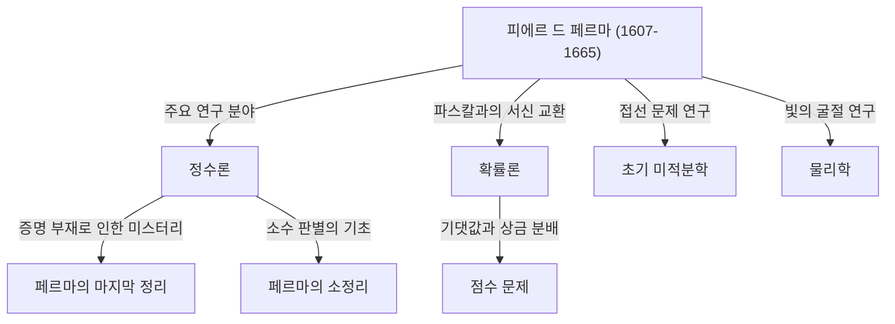

## 서론: 수학사 최대의 미스터리를 남긴 남자

수학의 역사에서 가장 유명하고 극적인 이야기를 만들어낸 인물을 꼽으라면 단연 [피에르 드 페르마](https://kenji.blog/p/fermat/)([Pierre de Fermat](https://kenji.blog/p/fermat/))를 들 수 있습니다. 그는 직업적인 수학자가 아니었습니다. 평소에는 지방 법원의 판사로 일하며 여가 시간에 수학을 즐겼던, 이른바 **"아마추어 수학자"**였습니다. 하지만 그가 남긴 업적은 당시 유럽 최고의 지성들을 경탄하게 만들었고, 사후 350년이 넘도록 전 세계의 천재 수학자들을 괴롭히게 됩니다.

이 글에서는 페르마의 생애부터 그가 남긴 주요 수학적 발견, 그리고 수학사에 길이 남을 금자탑 **"[페르마의 마지막 정리](https://kenji.blog/p/fermats-last-theorem/)"**를 둘러싼 낭만적인 이야기까지 깊이 있게 파헤쳐 봅니다. 그가 어떻게 현대 수학의 기초를 다졌는지, 그 놀라운 통찰력과 상상력의 원천을 밝혀봅시다.

## 1. 판사로서의 표면적 얼굴과 수학에 대한 열정

[피에르 드 페르마](https://kenji.blog/p/fermat/)는 1607년 말(일부 학설에 따르면 1601년) 프랑스 남서부의 보몽-드-로마뉴라는 마을에서 부유한 피혁 상인의 가정에 태어났습니다. 아주 어릴 때부터 매우 총명했던 그는 오를레앙 대학에서 법학을 공부했고, 1631년에는 툴루즈 고등법원의 칙선 고문관(판사)이라는 명예로운 직책을 맡게 됩니다. 이후 그는 평생을 공무원으로 보냈습니다.

당시 프랑스에서는 판사들이 정치적, 사회적 갈등을 피하기 위해 인맥을 너무 넓히지 않는 것이 권장되었습니다. 아이러니하게도 이러한 고립된 환경은 페르마에게 필요한 조용한 시간을 제공했고, 그를 수학의 깊은 심연으로 이끌었습니다. 그에게 수학은 직무의 무거운 압박에서 벗어나게 해주는 순수한 기쁨이었으며, 누군가에 의해 강요된 것이 아니었습니다.

페르마는 자신의 연구 결과를 공식적인 논문으로 출판하는 것을 좋아하지 않았습니다. 그는 아이디어와 증명을 노트나 책의 여백에 적어 두거나, 당시 학술적 중심지 역할을 했던 파리의 수사 [마랭 메르센](https://kenji.blog/p/mersenne/)([Marin Mersenne](https://kenji.blog/p/mersenne/))을 통해 다른 학자들과 편지를 주고받는 것으로 만족했습니다. 그는 자신의 발견을 다른 수학자들에게 **"문제"**로 제시하며 도발적으로 해답을 요구하는 것을 즐겼습니다. 또한 [르네 데카르트](https://kenji.blog/p/descartes/)([René Descartes](https://kenji.blog/p/descartes/)), [존 월리스](https://kenji.blog/p/wallis/)([John Wallis](https://kenji.blog/p/wallis/))와 같은 위대한 수학자들과 격렬한 논쟁을 벌인 것으로도 유명합니다.

## 2. 정수론에 대한 막대한 기여

페르마의 가장 큰 관심사이자 그가 가장 깊은 족적을 남긴 분야는 **정수론**(수의 성질을 탐구하는 분야)입니다. 고대 그리스의 수학자 [디오판토스](https://kenji.blog/p/diophantus/)([Diophantus](https://kenji.blog/p/diophantus/))의 저서 *산술(Arithmetica)*을 애독했던 그는, 그 책에서 영감을 얻어 수많은 획기적인 정리를 발견했습니다.

### 2.1. [페르마의 소정리](https://kenji.blog/p/fermats-little-theorem/)

현대 암호 이론(RSA 암호 등)의 근간을 이루는 매우 중요한 정리가 바로 **[페르마의 소정리](https://kenji.blog/p/fermats-little-theorem/)**입니다. 이는 소수에 관한 놀라운 성질을 보여주며, 현대 인터넷 사회의 보안 기술을 묵묵히 뒷받침하고 있습니다.

정리의 내용은 다음과 같습니다.
임의의 소수 $p$와 $p$와 서로소인(즉, $p$의 배수가 아닌) 임의의 정수 $a$에 대해 다음 합동식이 성립합니다.

$$
a^{p-1} \equiv 1 \pmod{p} \quad \text{ (여기서 } p \text{ 는 소수)}
$$

즉, "$a$를 $p-1$ 제곱한 수에서 $1$을 뺀 수는 항상 $p$로 나누어 떨어진다"는 성질입니다. 예를 들어, $p = 5$, $a = 2$인 경우 $2^{5-1} = 2^4 = 16$이 되고, $16 - 1 = 15$는 아름답게도 $5$의 배수가 됩니다. 이 정리는 매우 큰 수가 소수인지 여부를 빠르게 판별하는 알고리즘(페르마 소수 판별법)의 기초가 됩니다.

### 2.2. 두 제곱수의 합 정리

페르마는 소수의 성질에 관해 또 하나의 아름다운 정리를 발견했습니다. "$4$로 나누어 $1$이 남는 소수는 항상 단 한 가지 방법으로 두 개의 제곱수(정수의 제곱)의 합으로 나타낼 수 있다"는 것입니다.

$$
p = x^2 + y^2 \quad \text{ (여기서 } p \equiv 1 \pmod{4} \text{ )}
$$

예를 들어, $p = 5$인 경우 $5 = 1^2 + 2^2$입니다. $p = 13$인 경우 $13 = 2^2 + 3^2$입니다. $p = 29$인 경우 $29 = 2^2 + 5^2$입니다. 반대로 $4$로 나누어 $3$이 남는 소수($7, 11, 19$ 등)는 결코 두 제곱수의 합으로 나타낼 수 없습니다. 페르마는 이처럼 정수론의 심오한 규칙성을 차례차례 밝혀냈습니다.

### 2.3. 페르마 소수와 정다각형의 작도

페르마는 소수를 만들어내는 수학식에 대해서도 고찰했습니다. 그는 $F_n = 2^{2^n} + 1$ 형태의 수는 모두 소수일 것이라고 추측했습니다. 실제로 $n=0, 1, 2, 3, 4$일 때 결과는 각각 $3, 5, 17, 257, 65537$이며, 이들은 모두 소수입니다. 이를 **페르마 소수**라고 부릅니다.

그러나 훗날 [레온하르트 오일러](https://kenji.blog/p/euler/)([Leonhard Euler](https://kenji.blog/p/euler/))가 $n=5$일 때 $2^{32} + 1 = 4294967297 = 641 \times 6700417$이 됨을 보여 페르마의 추측 자체는 반증되었습니다. 그럼에도 불구하고 이 페르마 소수는 나중에 [카를 프리드리히 가우스](https://kenji.blog/p/gauss/)([Carl Friedrich Gauss](https://kenji.blog/p/gauss/))에 의해 "정$n$각형이 눈금 없는 자와 컴퍼스로 작도 가능하기 위한 조건"과 깊이 관련되어 있음이 증명되어, 후세의 기하학과 대수학의 융합에 있어 매우 중요한 역할을 했습니다.

## 3. 무한 강하법: 페르마의 날카로운 검

페르마는 자신의 정리에 대한 증명을 거의 남기지 않았지만, 그 스스로 "내가 발견한 가장 강력한 증명 방법"이라고 자랑했던 독특한 기법이 있습니다. 그것이 바로 **무한 강하법**(Method of Infinite Descent)입니다.

이는 귀류법의 일종으로, 주로 "어떤 조건을 만족하는 양의 정수해는 존재하지 않는다"는 것을 증명하는 데 사용됩니다. 논증의 기본적인 흐름은 다음과 같습니다.

1. 조건을 만족하는 양의 정수해가 존재한다고 가정한다.
2. 그 해로부터 출발하여, 같은 조건을 만족하는 더 작은 양의 정수해를 만들어낼 수 있음을 수학적으로 보여준다.
3. 이 과정을 반복하면 양의 정수해가 무한히 계속 작아지게 된다.
4. 그러나 양의 정수는 최소값 $1$을 가지므로, 무한히 계속 작아지는 것은 불가능하다.
5. 따라서 최초의 가정은 틀렸으며, 조건을 만족하는 양의 정수해는 존재하지 않는다.

이 기법을 사용하여 페르마 자신은 "직각삼각형의 넓이는 제곱수가 될 수 없다"는 명제 등을 증명했습니다. 후대의 수학자 오일러 역시 페르마가 남긴 정리들을 증명하기 위해 이 무한 강하법을 깊이 연구하고 적극적으로 활용했습니다.

## 4. 확률론의 창시자 중 한 명으로서

페르마의 뛰어난 재능은 정수론에만 국한되지 않았습니다. 1654년, 그는 천재 사상가이자 수학자인 [블레즈 파스칼](https://kenji.blog/p/pascal/)([Blaise Pascal](https://kenji.blog/p/pascal/))과 여러 통의 편지를 주고받습니다. 이 서신 교환이야말로 근대적인 **확률론**(Probability Theory)의 여명으로 여겨집니다.

논의의 촉매제가 된 것은 슈발리에 드 메레(Chevalier de Méré)라는 인물이 파스칼에게 가져온 **"점수 문제"**(Problem of points)로 알려진 도박 관련 질문이었습니다.
질문은 이러했습니다. "실력이 같은 두 플레이어가 게임을 하여, 먼저 일정 횟수를 이긴 쪽이 상금을 독식한다. 그런데 게임이 중간에 중단되었을 경우, 그때까지의 승패 상황에 따라 어떻게 상금을 공정하게 분배해야 하는가?"

페르마와 파스칼은 각자 완전히 다른 수학적 접근 방식을 사용했지만, 최종적으로는 완전히 똑같은 결론(현재의 확률과 기댓값 개념에 기반한 올바른 분배 비율)에 도달했습니다. 파스칼은 이항계수와 같은 조합론을 활용했고, 페르마는 발생 가능한 모든 결과를 나열하고 세는 우아한 방법을 사용했습니다. 불과 몇 달에 걸친 이 서신 교환을 통해 "확률론"이 수학의 독립된 한 분야로 탄생하게 되었습니다.

## 5. 미적분학과 물리학에 대한 선구적 기여

[아이작 뉴턴](https://kenji.blog/p/newton/)([Isaac Newton](https://kenji.blog/p/newton/))과 [고트프리트 라이프니츠](https://kenji.blog/p/leibniz/)([Gottfried Leibniz](https://kenji.blog/p/leibniz/))가 미적분학을 확립하기 수십 년 전, 페르마는 곡선의 접선을 그리고 함수의 최대값과 최소값을 찾는 독자적인 방법을 고안했습니다.

그는 **"적등법"**(Adequality)이라는 개념을 도입했습니다. 이는 아주 작은 양 $E$를 변화시켰을 때 값을 "거의 같은" 것으로 취급하고, 계산의 마지막 단계에서 $E$를 $0$으로 취급하여 극값을 찾는 기법입니다. 이것은 본질적으로 현대 미분법의 아이디어 그 자체이며, 뉴턴 자신도 훗날 "나는 페르마의 접선을 그리는 방법에서 이 방법의 힌트를 얻었다"고 회고했습니다. 페르마가 없었다면 미적분학의 완성은 더욱 늦어졌을지도 모릅니다.

또한 물리학(광학) 분야에서도 그는 "빛은 두 점 사이를 이동할 때 시간이 가장 짧게 걸리는 경로를 따라 진행한다"는 **페르마의 원리**(Fermat's Principle)를 제안했습니다. 이로부터 스넬의 굴절 법칙이 수학적으로 유도되었고, 근대 광학의 기초를 형성했으며, 훗날 물리학 전반을 관통하는 "최소 작용의 원리"로 이어지는 극히 중요한 발견이 되었습니다.

## 6. 여백의 드라마: [페르마의 마지막 정리](https://kenji.blog/p/fermats-last-theorem/)

이토록 수많은 위대한 업적을 남겼음에도 불구하고, 페르마를 역사상 가장 유명한 수학자로 만든 것은 단연코 **"[페르마의 마지막 정리](https://kenji.blog/p/fermats-last-theorem/)"**([Fermat's Last Theorem](https://kenji.blog/p/fermats-last-theorem/))의 존재입니다.

그의 애독서인 [디오판토스](https://kenji.blog/p/diophantus/)의 *산술* 2권, 피타고라스의 정리( $x^2 + y^2 = z^2$ )에 관한 구절의 여백에 페르마는 라틴어로 다음과 같은 놀라운 메모를 남겼습니다.

> "Cubum autem in duos cubos, aut quadratoquadratum in duos quadratoquadratos, et generaliter nullam in infinitum ultra quadratum potestatem in duas eiusdem nominis fas est dividere cuius rei demonstrationem mirabilem sane detexi. Hanc marginis exiguitas non caperet."
> 
> (세제곱수를 두 개의 세제곱수로, 또는 네제곱수를 두 개의 네제곱수로, 혹은 일반적으로 제곱보다 큰 어떤 거듭제곱수도 같은 지수를 가진 두 개의 거듭제곱수로 나누는 것은 불가능하다. 나는 이것에 대한 **참으로 놀라운 증명**을 발견했으나, 이 여백이 너무 좁아 여기에 적지 않는다.)

수학식으로 표현하면 믿을 수 없을 정도로 간단합니다.

"$n$이 $3$ 이상의 정수일 때, 다음 방정식을 만족하는 양의 정수해 $(x, y, z)$는 존재하지 않는다."

$$
x^n + y^n = z^n \quad \text{ (여기서 } n \ge 3 \text{ )}
$$

1665년 페르마가 세상을 떠난 후, 장남 클레망-사뮈엘이 아버지의 주석을 포함한 *산술*의 새로운 판을 출판했습니다. 그곳에서부터 전 세계 수학자들의 처절한 도전이 시작되었습니다.

오일러, 르장드르, 디리클레, 가우스, 소피 제르맹과 같은 역대 천재들이 이 문제에 도전했습니다. $n=3, 4, 5, 7$ 등의 개별적인 경우에 대해서는 증명되었지만, 누구도 모든 $n$에 대해 일반적인 증명을 해내지 못했습니다.

### 350년 후의 극적인 결말

이 문제는 제시된 후 350년이 넘는 세월 동안 아무도 풀지 못한 채 "수학계 최대의 미해결 문제"로 군림했습니다. 20세기 후반, 많은 사람들이 "페르마는 사실 증명하지 못했을 것이다(혹은 착각했을 것이다)"라고 의심하기 시작할 무렵, 한 수학자가 마침내 이 가공할 난제에 종지부를 찍습니다.

영국의 수학자 [앤드루 와일즈](https://kenji.blog/p/wiles/)([Andrew Wiles](https://kenji.blog/p/wiles/))입니다. 10살 때 동네 도서관에서 이 문제를 접한 그는 일생을 바쳐 풀겠다고 다짐했습니다. 그는 일본의 수학자 [타니야마 유타카](https://kenji.blog/p/taniyama-yutaka/)와 [시무라 고로](https://kenji.blog/p/shimura-goro/)가 제안한 "모든 타원곡선은 모듈러이다"라는 **타니야마-시무라 추측**과 플라이 곡선에 대한 켄 리벳(Ken Ribet)의 연구(엡실론 추측)를 결합하는, 페르마 시대에는 상상도 할 수 없었던 웅대한 접근 방식을 취했습니다.

와일즈는 다락방에 은둔하며 7년간의 고독한 연구 끝에 1995년 완전한 증명을 발표했습니다. 그의 증명은 수백 페이지에 달하는 현대 수학의 집대성이었으며, 페르마가 머릿속에 그렸을 법한 17세기의 수학적 방법("참으로 놀라운 증명")과는 완전히 다른 것이었습니다.

페르마가 정말로 올바른 증명을 가지고 있었는지는 오늘날까지도 영원한 수수께끼로 남아 있습니다. 그러나 그의 "여백의 메모"가 후세 수학 발전에 헤아릴 수 없는 원동력을 제공했다는 것만은 부인할 수 없는 사실입니다.

## 결론: 아마추어 수학의 왕이 남긴 유산

[피에르 드 페르마](https://kenji.blog/p/fermat/)는 화려한 학술계의 주 무대에 오르는 것을 좋아하지 않았던 평범한 판사였습니다. 그러나 그가 종이 쪼가리나 책의 여백에 끄적거린 아이디어들은 정수론, 확률론, 미적분학, 광학에 이르는 다양한 분야의 문을 활짝 열어젖혔습니다.

그가 남긴 가장 큰 미스터리는 수세기에 걸쳐 셀 수 없이 많은 수학자들을 매료시키고 괴롭혔으며, 그 과정에서 새로운 수학 이론들을 길러냈습니다. 페르마의 존재 그 자체는 수학이라는 학문이 품고 있는 마르지 않는 낭만과 심오함을 오늘날에도 우리에게 말해주고 있습니다. 그는 의심할 여지 없이 역사상 가장 위대하고 사람의 마음을 뒤흔든 **"아마추어 수학의 왕"**입니다.
