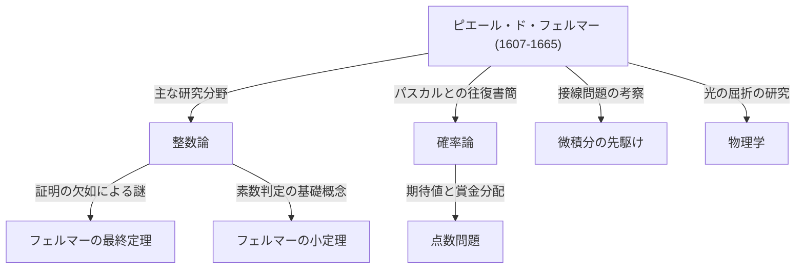

## はじめに：数学史最大のミステリーを残した男

数学の歴史において、最も有名で、かつ最もドラマチックな物語を生み出した人物と言えば、[ピエール・ド・フェルマー](https://kenji.blog/p/fermat/)（[Pierre de Fermat](https://kenji.blog/p/fermat/)）を置いて他にいないでしょう。彼は職業的な数学者ではありませんでした。普段は地方の裁判官として働き、余暇に数学を楽しむという、いわゆる **「アマチュア数学者」** でした。しかし、彼が残した業績は、当時のヨーロッパ最高の頭脳たちを驚嘆させ、さらには死後350年以上にわたって世界中の天才数学者たちを悩ませることになります。

この記事では、[フェルマー](https://kenji.blog/p/fermat/)の生涯から、彼の遺した主要な数学的発見、そして数学史に残る金字塔 **「[フェルマーの最終定理](https://kenji.blog/p/fermats-last-theorem/)」** にまつわるロマンあふれる物語まで、深く掘り下げて解説します。彼がいかにして現代数学の基礎を築いたのか、その驚くべき洞察力と発想の源泉に迫りましょう。

## 1. 裁判官としての表の顔と、数学への情熱

[ピエール・ド・フェルマー](https://kenji.blog/p/fermat/)は、1607年末（または1601年という説もあります）にフランスの南西部、ボーモン＝ド＝ロマーニュという町で裕福な皮革商人の家庭に生まれました。彼は若い頃から非常に聡明で、オルレアン大学で法学を修めると、1631年にはトゥールーズの高等法院で勅選顧問官（裁判官）という名誉ある職に就きます。以降、彼は生涯を公務員として全うしました。

当時のフランスでは、裁判官は政治的・社会的な争いを避けるため、あまり人付き合いを広げないことが良しとされていました。この孤立した環境が、皮肉にも[フェルマー](https://kenji.blog/p/fermat/)に静かな時間を与え、彼を数学の深淵へと向かわせることになります。彼にとって数学は、職務の重圧から解放されるための純粋な喜びであり、誰かに強要されるものではありませんでした。

[フェルマー](https://kenji.blog/p/fermat/)は自分の研究成果を論文として出版することを好まず、アイデアや証明をノートや本の余白に書き留めたり、当時の学術的なハブであったパリの修道士マラン・メルセンヌ（Marin Mersenne）を通じて、他の学者たちと手紙のやり取りをするだけで満足していました。彼は自らの発見を **「問題」** として他の数学者に提示し、挑発的に解答を求めることを楽しんでいました。ルネ・デカルト（René Descartes）やジョン・ウォリス（[John Wallis](https://kenji.blog/p/wallis/)）といった大数学者たちとも激しい論争を繰り広げたことで知られています。

## 2. 整数論への多大なる貢献

[フェルマー](https://kenji.blog/p/fermat/)の最大の関心事であり、最も深い足跡を残した分野が **整数論** （数の性質を探求する分野）です。古代ギリシャの数学者ディオファントス（[Diophantus](https://kenji.blog/p/diophantus/)）の著書『算術（Arithmetica）』を愛読していた彼は、そこからインスピレーションを得て、数々の画期的な定理を発見しました。

### 2.1. [フェルマーの小定理](https://kenji.blog/p/fermats-little-theorem/)

現代の暗号理論（[RSA](https://kenji.blog/p/modern-cryptography-public-key-hash-signature/)暗号など）の根幹をなす非常に重要な定理が **[フェルマーの小定理](https://kenji.blog/p/fermats-little-theorem/)** です。これは素数に関する驚くべき性質を示しており、現代のインターネット社会におけるセキュリティ技術を陰で支えています。

定理の主張は以下の通りです。
任意の素数 $p$ と、 $p$ と互いに素な（つまり $p$ の倍数ではない）任意の整数 $a$ に対して、以下の合同式が成り立ちます。

$$
a^{p-1} \equiv 1 \pmod{p} \quad \text{ (ここで } p \text{ は素数 )}
$$

つまり、「 $a$ を $p-1$ 乗した数から $1$ を引いた数は、必ず $p$ で割り切れる」という性質です。例えば、 $p = 5$ , $a = 2$ の場合、 $2^{5-1} = 2^4 = 16$ となり、 $16 - 1 = 15$ は見事に $5$ の倍数となります。この定理は、非常に巨大な数が素数であるかどうかを高速に判定するアルゴリズム（[フェルマー](https://kenji.blog/p/fermat/)テスト）の基礎となっています。

### 2.2. 二平方和定理

[フェルマー](https://kenji.blog/p/fermat/)は素数の性質について、もう一つ美しい定理を発見しています。「 $4$ で割って $1$ 余る素数は、常に二つの平方数（整数の2乗）の和としてただ一通りに表すことができる」というものです。

$$
p = x^2 + y^2 \quad \text{ (ここで } p \equiv 1 \pmod{4} \text{ )}
$$

例えば、 $p = 5$ の場合は $5 = 1^2 + 2^2$ 、 $p = 13$ の場合は $13 = 2^2 + 3^2$ 、 $p = 29$ の場合は $29 = 2^2 + 5^2$ となります。逆に $4$ で割って $3$ 余る素数（ $7, 11, 19$ など）は、決して二つの平方数の和で表すことはできません。このような数論の奥深い規則性を、[フェルマー](https://kenji.blog/p/fermat/)は次々と見出していきました。

### 2.3. [フェルマー](https://kenji.blog/p/fermat/)素数と正多角形の作図

[フェルマー](https://kenji.blog/p/fermat/)は素数を作り出す数式についても考察しました。彼は、 $F_n = 2^{2^n} + 1$ の形で表される数はすべて素数であると予想しました。実際、 $n=0, 1, 2, 3, 4$ のとき、それぞれ $3, 5, 17, 257, 65537$ となり、これらはすべて素数です。これらは **[フェルマー](https://kenji.blog/p/fermat/)素数** と呼ばれます。

しかし、後にレオンハルト・[オイラー](https://kenji.blog/p/euler/)（Leonhard Euler）が $n=5$ のとき $2^{32} + 1 = 4294967297 = 641 \times 6700417$ となることを示し、フェルマーの予想自体は反証されました。それでも、このフェルマー素数は、カール・フリードリヒ・ガウス（[Carl Friedrich Gauss](https://kenji.blog/p/gauss/)）によって「正 $n$ 角形が定規とコンパスで作図可能であるための条件」に深く関わっていることが証明され、後世の幾何学と代数学の融合において極めて重要な役割を果たしました。

## 3. 無限降下法：[フェルマー](https://kenji.blog/p/fermat/)の鋭い剣

[フェルマー](https://kenji.blog/p/fermat/)は自分の定理の証明をほとんど書き残しませんでしたが、彼自身が「私が発見した最も強力な証明方法」と誇っていた独自の手法があります。それが **無限降下法** （Method of Infinite Descent）です。

これは背理法の一種であり、主に「ある条件を満たす正の整数解は存在しない」ことを証明するために使われます。論法の基本的な流れは以下のようになります。

1. もし条件を満たす正の整数解が存在すると仮定する。
2. その解から出発して、同じ条件を満たす、より小さな正の整数解を作り出すことができることを数学的に示す。
3. この手順を繰り返すと、正の整数解が無限に小さくなり続けることになる。
4. しかし、正の整数には $1$ という最小値が存在するため、無限に小さくなり続けることは不可能である。
5. したがって、最初の仮定が誤りであり、条件を満たす正の整数解は存在しない。

[フェルマー](https://kenji.blog/p/fermat/)はこの手法を使って、「直角三角形の面積は平方数にならない」という命題などを自ら証明しています。後の数学者オイラーも、[フェルマー](https://kenji.blog/p/fermat/)の遺した定理を証明するために、この無限降下法を深く研究し大いに活用しました。

## 4. 確率論の創始者の一人として

[フェルマー](https://kenji.blog/p/fermat/)の類まれなる才能は、整数論だけにとどまりませんでした。1654年、彼は天才思想家・数学者であるブレーズ・パスカル（[Blaise Pascal](https://kenji.blog/p/pascal/)）と数通の手紙を交わします。この往復書簡こそが、近代的な **確率論** （Probability Theory）の幕開けとされています。

議論の発端は、シュヴァリエ・ド・メレという人物から[パスカル](https://kenji.blog/p/pascal/)に持ち込まれた **「点数問題」** と呼ばれるギャンブルに関する問いでした。
「同じ実力の二人のプレイヤーがゲームをして、先に一定回数勝った方が賞金を総取りする。しかし、ゲームが途中で中断されてしまった場合、その時点での勝敗の状況に応じて、どのように賞金を分配するのが公平か？」というものです。

[フェルマー](https://kenji.blog/p/fermat/)とパスカルは、それぞれ全く異なる数学的アプローチを用いながらも、最終的に全く同じ結論（現在の確率・期待値の概念に基づいた正しい分配比率）に到達しました。パスカルは二項係数などの組み合わせ論を駆使し、[フェルマー](https://kenji.blog/p/fermat/)は起こり得る全ての場合を列挙して数え上げるという洗練された手法を用いました。このわずか数ヶ月の書簡交換によって、数学の独立した一分野としての「確率論」が誕生したのです。

## 5. 微分積分学と物理学への先駆的貢献

アイザック・[ニュートン](https://kenji.blog/p/newton/)（Isaac Newton）とゴットフリート・ライプニッツ（Gottfried Leibniz）が微積分学を確立するよりも数十年早く、[フェルマー](https://kenji.blog/p/fermat/)は曲線の接線を引く方法や、関数の最大値・最小値を求める独自の手法を考案していました。

彼は **「擬等式」** （Adequality）と呼ばれる概念を導入しました。これは、ある極小量 $E$ を変化させたときに、値が「ほぼ等しい」と見なし、計算の最終段階で $E$ を $0$ として扱うことで極値を求める手法です。これは本質的に現代の微分法の考え方そのものであり、[ニュートン](https://kenji.blog/p/newton/)自身も後に「私はフェルマーの接線を引く方法からヒントを得た」と語っています。[フェルマー](https://kenji.blog/p/fermat/)がいなければ、微積分学の完成はさらに遅れていたかもしれません。

また物理学（光学）の分野でも、彼は「光は空間を進む際、最短時間で到達できる経路を通る」という **[フェルマー](https://kenji.blog/p/fermat/)の原理** （[Fermat](https://kenji.blog/p/fermat/)'s Principle）を提唱しました。これからスネルの屈折の法則が数学的に導き出され、近代光学の基礎となるとともに、後の物理学全体を貫く「最小作用の原理」へと繋がっていく極めて重要な発見となりました。

## 6. 余白のドラマ：[フェルマーの最終定理](https://kenji.blog/p/fermats-last-theorem/)

これほどまでに数々の偉大な業績を残した[フェルマー](https://kenji.blog/p/fermat/)ですが、彼を歴史上最も有名な数学者たらしめているのは、間違いなく **「フェルマーの最終定理」** （[Fermat's Last Theorem](https://kenji.blog/p/fermats-last-theorem/)）の存在です。

[フェルマー](https://kenji.blog/p/fermat/)は、愛読書であるディオファントスの『算術』の第2巻、[ピタゴラス](https://kenji.blog/p/pythagoras/)の定理（ $x^2 + y^2 = z^2$ ）に関する記述の余白に、ラテン語で次のような驚くべきメモを書き込みました。

> "Cubum autem in duos cubos, aut quadratoquadratum in duos quadratoquadratos, et generaliter nullam in infinitum ultra quadratum potestatem in duas eiusdem nominis fas est dividere cuius rei demonstrationem mirabilem sane detexi. Hanc marginis exiguitas non caperet."
> 
> （立方数を二つの立方数の和に分けることはできない。4乗数を二つの4乗数の和に分けることもできない。一般に、2乗より大きい乗数を、同じ乗数の二つの和に分けることは不可能である。私はこの命題の **真に驚くべき証明** を見つけたが、それを記すにはこの余白は狭すぎる。）

数式で表すと、非常にシンプルです。

「 $n$ が $3$ 以上の整数のとき、次の方程式を満たす正の整数の組 $(x, y, z)$ は存在しない。」

$$
x^n + y^n = z^n \quad \text{ (ここで } n \ge 3 \text{ )}
$$

1665年に[フェルマー](https://kenji.blog/p/fermat/)がこの世を去った後、長男のクレマン＝サミュエルが父親の書き込みを含めた『算術』の新しい版を出版しました。そこから、世界中の数学者による壮絶な挑戦が始まりました。

[オイラー](https://kenji.blog/p/euler/)、ルジャンドル、ディリクレ、[ガウス](https://kenji.blog/p/gauss/)、ソフィー・ジェルマンといった歴代の天才たちがこの問題に挑み、 $n=3, 4, 5, 7$ などの個別のケースについては証明されましたが、すべての $n$ に対して一般的に証明することは誰にもできませんでした。

### 350年後の劇的な結末

この問題は、提示されてから350年以上もの間、誰にも解かれることなく「数学界最大の未解決問題」として君臨し続けました。「[フェルマー](https://kenji.blog/p/fermat/)は実は証明できていなかったのではないか（あるいは勘違いをしていたのではないか）」と多くの人が疑い始めた20世紀後半、ついに一人の数学者がこの難問に終止符を打ちます。

イギリスの数学者、[アンドリュー・ワイルズ](https://kenji.blog/p/wiles/)（Andrew Wiles）です。彼は10歳のときに地元の図書館でこの問題に出会い、人生をかけて解くことを誓いました。彼は、日本の数学者である谷山豊と志村五郎によって提唱された「すべての楕円曲線はモジュラーである」という **谷山＝志村予想** と、ケン・リベット（Ken Ribet）によるフライ曲線の研究（イプシロン予想）を組み合わせるという、[フェルマー](https://kenji.blog/p/fermat/)の時代には想像もつかなかった壮大なアプローチをとりました。

[ワイルズ](https://kenji.blog/p/wiles/)は屋根裏部屋に引きこもり、7年間の孤独な研究の末、1995年に完全な証明を発表しました。彼の証明は数百ページにも及ぶ現代数学の集大成であり、[フェルマー](https://kenji.blog/p/fermat/)が思い描いたであろう17世紀の数学的手法（「真に驚くべき証明」）とは全く異なるものでした。

[フェルマー](https://kenji.blog/p/fermat/)が本当に正しい証明を持っていたのかどうか、今となっては永遠の謎です。しかし、その「余白の書き込み」が、後世の数学の発展に計り知れない原動力を与えたことだけは紛れもない事実です。

## 結論：アマチュア数学の王が遺したもの

[ピエール・ド・フェルマー](https://kenji.blog/p/fermat/)は、華やかな学術の表舞台に出ることを好まない一介の裁判官でした。しかし、彼がノートの切れ端や本の余白に書き留めたアイデアは、整数論、確率論、微積分学、光学といった多岐にわたる分野の扉を大きく開きました。

彼が遺した最大のミステリーは、数世紀にわたって数え切れないほどの数学者たちを魅了し、苦悩させ、そして新たな数学の理論を育て上げました。[フェルマー](https://kenji.blog/p/fermat/)の存在そのものが、数学という学問が持つ尽きることのないロマンと深遠さを、今なお私たちに語りかけています。彼こそは、間違いなく歴史上最も偉大で、最も人々の心を揺さぶった **「アマチュア数学の王」** なのです。
