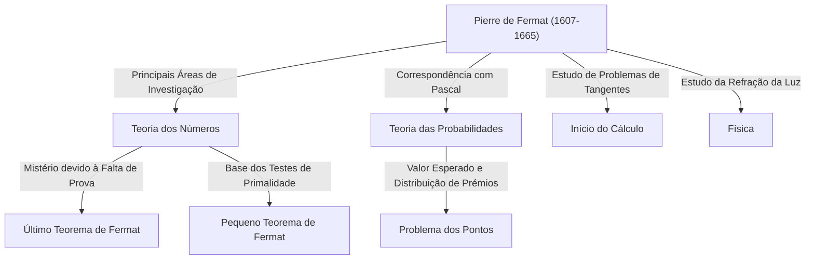

## Introdução: O Homem Que Deixou o Maior Mistério da Matemática

Ao falar da figura que gerou a história mais famosa e dramática da história da matemática, não é preciso procurar além de [Pierre de Fermat](https://kenji.blog/pt/p/fermat/). Ele não era um matemático profissional. Normalmente, trabalhava como juiz regional e desfrutava da matemática no seu tempo livre, o que o tornou um chamado **"matemático amador"**. No entanto, as realizações que deixou surpreenderam as mentes mais brilhantes da Europa na época e atormentariam matemáticos geniais em todo o mundo durante mais de 350 anos após a sua morte.

Neste artigo, vamos aprofundar a vida de [Fermat](https://kenji.blog/pt/p/fermat/), as suas principais descobertas matemáticas e a saga romântica em torno do monumental **"Último Teorema de [Fermat](https://kenji.blog/pt/p/fermat/)"** que permanece gravado na história da matemática. Vamos explorar como ele lançou as bases da matemática moderna e descobrir as fontes da sua surpreendente perspicácia e imaginação.

## 1. A Sua Face Pública como Juiz e a Sua Paixão pela Matemática

[Pierre de Fermat](https://kenji.blog/pt/p/fermat/) nasceu no final de 1607 (ou 1601, de acordo com algumas teorias) no seio de uma rica família de comerciantes de couro em Beaumont-de-Lomagne, no sudoeste de França. Excecionalmente brilhante desde tenra idade, estudou direito na Universidade de Orleães e, em 1631, assumiu o honroso cargo de conselheiro (juiz) no Parlamento de Toulouse. A partir de então, passou toda a sua vida como funcionário público.

Na França da época, os juízes eram encorajados a evitar expandir demasiado os seus círculos sociais para evitar conflitos políticos e sociais. Ironicamente, este ambiente isolado proporcionou a [Fermat](https://kenji.blog/pt/p/fermat/) o tempo de sossego de que necessitava, impulsionando-o para as profundezas da matemática. Para ele, a matemática era uma pura alegria que o libertava das pesadas pressões dos seus deveres, e não algo que lhe fosse imposto por alguém.

[Fermat](https://kenji.blog/pt/p/fermat/) não gostava de publicar as suas investigações sob a forma de artigos formais; contentava-se em anotar as suas ideias e provas em cadernos ou nas margens de livros, ou trocando cartas com outros estudiosos através de Marin Mersenne, um frade em Paris que funcionava como um centro académico na época. Ele gostava de apresentar as suas descobertas como **"problemas"** a outros matemáticos, exigindo de forma provocatória as suas soluções. Sabe-se também que se envolveu em debates acesos com grandes matemáticos, como René Descartes e [John Wallis](https://kenji.blog/pt/p/wallis/).

## 2. Imensas Contribuições para a Teoria dos Números

O maior interesse de [Fermat](https://kenji.blog/pt/p/fermat/) e o campo onde deixou a sua marca mais profunda foi a **Teoria dos Números** (o ramo que explora as propriedades dos números). Dedicado à leitura da *Arithmetica* do antigo matemático grego [Diofanto](https://kenji.blog/pt/p/diophantus/), inspirou-se nela para descobrir numerosos teoremas revolucionários.

### 2.1. Pequeno Teorema de [Fermat](https://kenji.blog/pt/p/fermat/)

Um teorema notavelmente importante que constitui a base da criptografia moderna (como a encriptação [RSA](https://kenji.blog/pt/p/modern-cryptography-public-key-hash-signature/)) é o **Pequeno Teorema de [Fermat](https://kenji.blog/pt/p/fermat/)**. Revela uma propriedade surpreendente relativamente aos números primos e apoia silenciosamente a tecnologia de segurança na nossa moderna sociedade baseada na Internet.

O enunciado do teorema é o seguinte:
Para qualquer número primo $p$ e qualquer número inteiro $a$ que seja coprimo de $p$ (o que significa que não é um múltiplo de $p$), verifica-se a seguinte congruência:

$$
a^{p-1} \equiv 1 \pmod{p} \quad \text{ (onde } p \text{ é um número primo)}
$$

Por outras palavras, a propriedade dita que "o número obtido ao elevar $a$ à potência de $p-1$ e subtrair $1$ é sempre divisível por $p$". Por exemplo, se $p = 5$ e $a = 2$, então $2^{5-1} = 2^4 = 16$, e $16 - 1 = 15$, que é belamente um múltiplo de $5$. Este teorema serve de base para algoritmos (como o teste de primalidade de [Fermat](https://kenji.blog/pt/p/fermat/)) que determinam rapidamente se números extremamente grandes são primos.

### 2.2. Teorema da Soma de Dois Quadrados

[Fermat](https://kenji.blog/pt/p/fermat/) descobriu outro belo teorema relativamente às propriedades dos números primos: "Um número primo que deixa um resto de $1$ quando dividido por $4$ pode sempre ser expresso de uma e uma só maneira como a soma de dois quadrados (os quadrados de dois números inteiros)."

$$
p = x^2 + y^2 \quad \text{ (onde } p \equiv 1 \pmod{4} \text{ )}
$$

Por exemplo, se $p = 5$, é $5 = 1^2 + 2^2$; se $p = 13$, é $13 = 2^2 + 3^2$; se $p = 29$, é $29 = 2^2 + 5^2$. Inversamente, números primos que deixam um resto de $3$ quando divididos por $4$ (como $7, 11, 19$) nunca podem ser expressos como a soma de dois quadrados. [Fermat](https://kenji.blog/pt/p/fermat/) foi descobrindo sucessivamente estas regularidades profundas na teoria dos números.

### 2.3. Primos de [Fermat](https://kenji.blog/pt/p/fermat/) e a Construção de Polígonos Regulares

[Fermat](https://kenji.blog/pt/p/fermat/) também considerou fórmulas matemáticas que geram números primos. Conjeturou que todos os números da forma $F_n = 2^{2^n} + 1$ são primos. De facto, para $n=0, 1, 2, 3, 4$, os resultados são $3, 5, 17, 257, 65537$, respetivamente, e todos eles são primos. Estes são chamados **Primos de [Fermat](https://kenji.blog/pt/p/fermat/)**.

No entanto, [Leonhard Euler](https://kenji.blog/pt/p/euler/) mostrou mais tarde que quando $n=5$, $2^{32} + 1 = 4294967297 = 641 \times 6700417$, refutando assim a própria conjetura de Fermat. Ainda assim, Carl Friedrich Gauss provou mais tarde que estes primos de [Fermat](https://kenji.blog/pt/p/fermat/) estavam profundamente ligados às "condições para que um polígono regular de $n$ lados seja construível com compasso e régua sem escala", desempenhando um papel extremamente importante na fusão da geometria e da álgebra para as gerações posteriores.

## 3. O Método da Descida Infinita: A Espada Afiada de [Fermat](https://kenji.blog/pt/p/fermat/)

Embora [Fermat](https://kenji.blog/pt/p/fermat/) raramente escrevesse as provas dos seus teoremas, havia um método único do qual ele se gabava como "o método de prova mais poderoso que descobri". Este é o **Método da Descida Infinita**.

É uma forma de prova por contradição, usada principalmente para provar que "não existem soluções inteiras positivas que satisfaçam uma determinada condição". O fluxo básico do argumento é o seguinte:

1. Suponha-se que existe uma solução inteira positiva que satisfaz a condição.
2. Mostrar matematicamente que a partir dessa solução, é possível criar uma solução inteira positiva ainda menor que satisfaz a mesma condição.
3. Repetir este procedimento implica que a solução inteira positiva continuaria a tornar-se infinitamente menor.
4. No entanto, uma vez que os números inteiros positivos têm um valor mínimo de $1$, é impossível que continuem a tornar-se mais pequenos indefinidamente.
5. Portanto, a suposição inicial é falsa e não existe nenhuma solução inteira positiva que satisfaça a condição.

Utilizando esta técnica, o próprio [Fermat](https://kenji.blog/pt/p/fermat/) provou proposições como "a área de um triângulo retângulo não pode ser um número quadrado". Matemáticos posteriores como Euler também estudaram profundamente e utilizaram intensamente este método da descida infinita para provar teoremas que [Fermat](https://kenji.blog/pt/p/fermat/) deixou para trás.

## 4. Como Fundador da Teoria das Probabilidades

O extraordinário talento de [Fermat](https://kenji.blog/pt/p/fermat/) não se limitava à teoria dos números. Em 1654, trocou uma série de cartas com o genial pensador e matemático [Blaise Pascal](https://kenji.blog/pt/p/pascal/). Esta mesma correspondência é considerada a aurora da **Teoria das Probabilidades** moderna.

O catalisador para a sua discussão foi uma pergunta relacionada com o jogo conhecida como o **"Problema dos pontos"**, trazida a [Pascal](https://kenji.blog/pt/p/pascal/) por um homem chamado Chevalier de Méré.
A pergunta era: "Dois jogadores de igual habilidade estão a jogar um jogo em que o primeiro a ganhar um certo número de rondas leva o prémio total. No entanto, se o jogo for interrompido a meio, como deve o prémio ser dividido de forma justa com base no estado atual de vitórias e derrotas?"

Embora [Fermat](https://kenji.blog/pt/p/fermat/) e Pascal tenham empregado cada um abordagens matemáticas inteiramente diferentes, chegaram finalmente à mesma conclusão (o rácio de distribuição correto com base nos conceitos atuais de probabilidade e valor esperado). Pascal utilizou combinatória, como coeficientes binomiais, enquanto [Fermat](https://kenji.blog/pt/p/fermat/) utilizou um método elegante de enumerar e contar todos os resultados possíveis. Através desta correspondência que durou apenas alguns meses, a "teoria das probabilidades" nasceu como um ramo independente da matemática.

## 5. Contribuições Pioneiras para o Cálculo e a Física

Décadas antes de [Isaac Newton](https://kenji.blog/pt/p/newton/) e Gottfried Leibniz estabelecerem o cálculo, [Fermat](https://kenji.blog/pt/p/fermat/) tinha concebido os seus próprios métodos para traçar tangentes a curvas e encontrar os valores máximos e mínimos de funções.

Introduziu um conceito chamado **"Adeigualdade"** (Adequality). Trata-se de uma técnica em que um valor é tratado como "quase igual" quando uma quantidade minúscula $E$ é variada, e o valor extremo é encontrado tratando $E$ como $0$ na fase final do cálculo. Esta é essencialmente a própria ideia da diferenciação moderna, e o próprio Newton observou mais tarde: "Tive a pista deste método a partir da forma de [Fermat](https://kenji.blog/pt/p/fermat/) traçar tangentes". Sem [Fermat](https://kenji.blog/pt/p/fermat/), a conclusão do cálculo poderia ter sido ainda mais adiada.

Além disso, no campo da física (ótica), propôs o **Princípio de [Fermat](https://kenji.blog/pt/p/fermat/)**, que afirma que "a luz viaja entre dois pontos ao longo do caminho que requer o tempo mais curto". Isto derivou matematicamente a lei de refração de Snell, formou a base da ótica moderna e tornou-se uma descoberta extremamente importante que conduziu ao "princípio da menor ação" que atravessa a totalidade da física posterior.

## 6. Drama nas Margens: [O Último Teorema de Fermat](https://kenji.blog/pt/p/fermats-last-theorem/)

Apesar de ter deixado para trás tantas grandes realizações, o que inequivocamente faz de [Fermat](https://kenji.blog/pt/p/fermat/) o matemático mais famoso da história é a existência do **"Último Teorema de [Fermat](https://kenji.blog/pt/p/fermat/)"**.

Nas margens de uma passagem relativa ao teorema de Pitágoras ( $x^2 + y^2 = z^2$ ) no Volume 2 do seu livro favorito, a *Arithmetica* de [Diofanto](https://kenji.blog/pt/p/diophantus/), [Fermat](https://kenji.blog/pt/p/fermat/) escreveu a seguinte nota surpreendente em latim:

> "Cubum autem in duos cubos, aut quadratoquadratum in duos quadratoquadratos, et generaliter nullam in infinitum ultra quadratum potestatem in duas eiusdem nominis fas est dividere cuius rei demonstrationem mirabilem sane detexi. Hanc marginis exiguitas non caperet."
> 
> (É impossível separar um cubo em dois cubos, ou uma quarta potência em duas quartas potências, ou, em geral, qualquer potência superior à segunda, em duas potências iguais. Descobri uma **demonstração verdadeiramente maravilhosa** disto, mas esta margem é demasiado estreita para a conter.)

Expresso como uma fórmula matemática, é incrivelmente simples:

"Quando $n$ é um número inteiro maior ou igual a $3$, não existem soluções inteiras positivas $(x, y, z)$ que satisfaçam a seguinte equação."

$$
x^n + y^n = z^n \quad \text{ (onde } n \ge 3 \text{ )}
$$

Após o falecimento de [Fermat](https://kenji.blog/pt/p/fermat/) em 1665, o seu filho mais velho Clément-Samuel publicou uma nova edição da *Arithmetica* que incluía as anotações do seu pai. A partir daí, começou um desafio extenuante para matemáticos de todo o mundo.

Génios sucessivos como Euler, [Legendre](https://kenji.blog/pt/p/legendre/), Dirichlet, Gauss e Sophie Germain enfrentaram este problema. Embora casos individuais para $n=3, 4, 5, 7$ tenham sido provados, ninguém o conseguiu provar de forma geral para todo o $n$.

### A Conclusão Dramática 350 Anos Depois

Durante mais de 350 anos após a sua proposta, este problema reinou como o "maior problema por resolver da matemática", sem ser resolvido por ninguém. Na segunda metade do século XX, quando muitos começaram a suspeitar que "[Fermat](https://kenji.blog/pt/p/fermat/) não o tinha realmente provado (ou tinha cometido um erro)", um matemático finalmente pôs fim a este formidável enigma.

Tratava-se do matemático britânico [Andrew Wiles](https://kenji.blog/pt/p/wiles/). Tendo-se deparado com o problema na sua biblioteca local aos 10 anos de idade, jurou dedicar a sua vida a resolvê-lo. Adotou uma abordagem grandiosa, inimaginável na época de Fermat, combinando a **Conjetura de Taniyama-Shimura** — que propunha que "todas as curvas elípticas são modulares", apresentada pelos matemáticos japoneses Yutaka Taniyama e [Goro Shimura](https://kenji.blog/pt/p/shimura-goro/) — com a investigação de Ken Ribet sobre as curvas de Frey (a conjetura epsilon).

Wiles isolou-se no seu sótão e, após sete anos de investigação solitária, publicou a prova completa em 1995. A sua prova foi o culminar da matemática moderna abrangendo centenas de páginas, inteiramente diferente dos métodos matemáticos do século XVII ("demonstração verdadeiramente maravilhosa") que [Fermat](https://kenji.blog/pt/p/fermat/) provavelmente imaginou.

Se [Fermat](https://kenji.blog/pt/p/fermat/) possuía realmente uma prova correta, continua a ser um mistério eterno até hoje. No entanto, é um facto inegável que a sua "nota na margem" proporcionou uma força motriz imensurável para o desenvolvimento da matemática nas gerações posteriores.

## Conclusão: O Legado do Príncipe dos Amadores

[Pierre de Fermat](https://kenji.blog/pt/p/fermat/) era apenas um juiz que não gostava de subir ao palco principal e glamoroso do mundo académico. No entanto, as ideias que ele anotou em pedaços de papel e nas margens de livros abriram as portas de par em par a campos tão diversos como a teoria dos números, a probabilidade, o cálculo e a ótica.

O maior mistério que ele deixou para trás cativou e atormentou inúmeros matemáticos ao longo de vários séculos, nutrindo novas teorias matemáticas no processo. A própria existência de [Fermat](https://kenji.blog/pt/p/fermat/) continua a falar-nos hoje do romance inesgotável e da profundidade que a disciplina da matemática encerra. Ele é, sem dúvida, o **"Príncipe dos Amadores"** mais grandioso e comovente da história.
