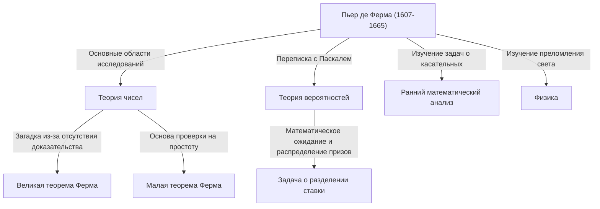

## Введение: Человек, оставивший величайшую загадку математики

Когда речь заходит о человеке, породившем самую известную и драматичную историю в математике, невозможно не вспомнить Пьера де Ферма. Он не был профессиональным математиком. Обычно он работал региональным судьей, а математикой увлекался в свободное время, за что его прозвали **«математиком-любителем»**. Тем не менее, оставленные им достижения поразили величайшие умы Европы того времени и продолжали мучить гениальных математиков по всему миру на протяжении более 350 лет после его смерти.

В этой статье мы подробно рассмотрим жизнь Ферма, его главные математические открытия и романтическую сагу, окружающую монументальную **«Великую теорему Ферма»**, навсегда вошедшую в историю математики. Давайте выясним, как он заложил основы современной математики, и раскроем источники его поразительной проницательности и воображения.

## 1. Публичное лицо судьи и страсть к математике

[Пьер де Ферма](https://kenji.blog/ru/p/fermat/) родился в конце 1607 года (или в 1601 году, согласно некоторым теориям) в семье богатого торговца кожей в Бомон-де-Ломань, на юго-западе Франции. Исключительно умный с юных лет, он изучал право в Орлеанском университете и в 1631 году занял почетную должность советника (судьи) в парламенте Тулузы. С тех пор он всю свою жизнь провел на государственной службе.

Во Франции того времени судьям рекомендовалось избегать слишком широкого круга общения, чтобы предотвратить политические и социальные конфликты. По иронии судьбы, эта изолированная среда предоставила Ферма необходимое ему спокойное время, подтолкнув его к глубинам математики. Для него математика была чистой радостью, освобождавшей от тяжелого бремени обязанностей, а не тем, что кто-то ему навязывал.

Ферма не любил публиковать свои исследования в виде официальных статей; он довольствовался тем, что записывал свои идеи и доказательства в тетрадях или на полях книг, либо обменивался письмами с другими учеными через Марена Мерсенна — парижского монаха, служившего в то время своеобразным академическим центром. Ему нравилось представлять свои открытия в виде **«задач»** другим математикам, провокационно требуя их решения. Известно также, что он вступал в ожесточенные споры с такими великими математиками, как [Рене Декарт](https://kenji.blog/ru/p/descartes/) и [Джон Валлис](https://kenji.blog/ru/p/wallis/).

## 2. Огромный вклад в теорию чисел

Самый большой интерес Ферма и область, в которой он оставил самый глубокий след, — это **теория чисел** (раздел, изучающий свойства чисел). Будучи преданным читателем «Арифметики» древнегреческого математика [Диофант](https://kenji.blog/ru/p/diophantus/)а, он черпал в ней вдохновение для открытия множества новаторских теорем.

### 2.1. [Малая теорема Ферма](https://kenji.blog/ru/p/fermats-little-theorem/)

Чрезвычайно важной теоремой, составляющей основу современной криптографии (такой как шифрование [RSA](https://kenji.blog/ru/p/modern-cryptography-public-key-hash-signature/)), является **[Малая теорема Ферма](https://kenji.blog/ru/p/fermats-little-theorem/)**. Она раскрывает удивительное свойство простых чисел и незримо поддерживает технологии безопасности в нашем современном интернет-обществе.

Утверждение теоремы звучит следующим образом:
Для любого простого числа $p$ и любого целого числа $a$, взаимно простого с $p$ (то есть не являющегося кратным $p$), справедливо следующее сравнение:

$$
a^{p-1} \equiv 1 \pmod{p} \quad \text{ (где } p \text{ — простое число)}
$$

Другими словами, это свойство гласит, что «число, полученное возведением $a$ в степень $p-1$ и вычитанием $1$, всегда делится на $p$ без остатка». Например, если $p = 5$ и $a = 2$, то $2^{5-1} = 2^4 = 16$, а $16 - 1 = 15$, что прекрасно кратно $5$. Эта теорема служит основой для алгоритмов (таких как тест простоты Ферма), которые быстро определяют, являются ли чрезвычайно большие числа простыми.

### 2.2. Теорема о сумме двух квадратов

Ферма открыл еще одну красивую теорему о свойствах простых чисел: «Простое число, дающее остаток $1$ при делении на $4$, всегда может быть представлено единственным способом в виде суммы двух квадратов (квадратов двух целых чисел)».

$$
p = x^2 + y^2 \quad \text{ (где } p \equiv 1 \pmod{4} \text{ )}
$$

Например, если $p = 5$, то $5 = 1^2 + 2^2$; если $p = 13$, то $13 = 2^2 + 3^2$; если $p = 29$, то $29 = 2^2 + 5^2$. И наоборот, простые числа, дающие остаток $3$ при делении на $4$ (например, $7, 11, 19$), никогда не могут быть представлены в виде суммы двух квадратов. Ферма последовательно раскрывал такие глубокие закономерности в теории чисел.

### 2.3. Простые числа Ферма и построение правильных многоугольников

Ферма также рассматривал математические формулы, генерирующие простые числа. Он предположил, что все числа вида $F_n = 2^{2^n} + 1$ являются простыми. Действительно, для $n=0, 1, 2, 3, 4$ результаты составляют $3, 5, 17, 257, 65537$ соответственно, и все они простые. Они называются **простыми числами Ферма**.

Однако позже [Леонард Эйлер](https://kenji.blog/ru/p/euler/) показал, что при $n=5$, $2^{32} + 1 = 4294967297 = 641 \times 6700417$, тем самым опровергнув саму гипотезу Ферма. Тем не менее, [Карл Фридрих Гаусс](https://kenji.blog/ru/p/gauss/) позже доказал, что эти простые числа Ферма глубоко связаны с «условиями, при которых правильный $n$-угольник можно построить с помощью циркуля и линейки», сыграв чрезвычайно важную роль в слиянии геометрии и алгебры для последующих поколений.

## 3. Метод бесконечного спуска: острый меч Ферма

Хотя Ферма редко записывал доказательства своих теорем, был один уникальный метод, которым он хвастался как «самым мощным методом доказательства, который я открыл». Это **Метод бесконечного спуска**.

Это форма доказательства от противного, в основном используемая для того, чтобы доказать, что «не существует положительных целочисленных решений, удовлетворяющих определенному условию». Основная логика аргументации такова:

1. Предположим, что существует положительное целочисленное решение, удовлетворяющее условию.
2. Математически показать, что, начиная с этого решения, можно создать еще меньшее положительное целочисленное решение, удовлетворяющее тому же условию.
3. Повторение этой процедуры означает, что положительное целочисленное решение будет продолжать бесконечно уменьшаться.
4. Однако, поскольку положительные целые числа имеют минимальное значение $1$, они не могут уменьшаться бесконечно.
5. Следовательно, первоначальное предположение ложно, и не существует положительного целочисленного решения, удовлетворяющего условию.

Используя этот метод, сам Ферма доказал такие утверждения, как «площадь прямоугольного треугольника не может быть квадратным числом». Более поздние математики, такие как Эйлер, также глубоко изучили и широко использовали этот метод бесконечного спуска для доказательства теорем, оставленных Ферма.

## 4. Как один из основателей теории вероятностей

Необычайный талант Ферма не ограничивался теорией чисел. В 1654 году он обменялся серией писем с гениальным мыслителем и математиком Блезом Паскалем. Именно эта переписка считается рассветом современной **теории вероятностей**.

Катализатором их дискуссии послужил вопрос, связанный с азартными играми, известный как **«задача о разделении ставки»**, заданный Паскалю человеком по имени шевалье де Мере.
Вопрос заключался в следующем: «Два игрока равного мастерства играют в игру, в которой тот, кто первым выиграет определенное количество раундов, забирает весь приз. Однако, если игра прерывается на полпути, как следует справедливо разделить приз, основываясь на текущем состоянии побед и поражений?»

Хотя Ферма и Паскаль использовали совершенно разные математические подходы, в конечном итоге они пришли к абсолютно одинаковому выводу (правильному соотношению распределения, основанному на современных концепциях вероятности и математического ожидания). Паскаль использовал комбинаторику, такую как биномиальные коэффициенты, в то время как Ферма применил элегантный метод перечисления и подсчета всех возможных исходов. Благодаря этой переписке, длившейся всего несколько месяцев, «теория вероятностей» зародилась как независимая ветвь математики.

## 5. Новаторский вклад в математический анализ и физику

За десятилетия до того, как [Исаак Ньютон](https://kenji.blog/ru/p/newton/) и [Готфрид Лейбниц](https://kenji.blog/ru/p/leibniz/) создали математический анализ, Ферма разработал собственные методы проведения касательных к кривым и нахождения максимальных и минимальных значений функций.

Он ввел понятие, называемое **«Адекватноcть»** (Adequality). Это метод, при котором значение рассматривается как «почти равное» при изменении бесконечно малой величины $E$, а экстремальное значение находится путем приравнивания $E$ к $0$ на последнем этапе вычислений. По сути, это и есть сама идея современного дифференцирования, и сам Ньютон позже заметил: «Намек на этот метод я получил из способа Ферма проводить касательные». Без Ферма завершение создания математического анализа могло бы быть отложено еще дальше.

Кроме того, в области физики (оптики) он предложил **Принцип Ферма**, который гласит, что «свет распространяется между двумя точками по пути, требующему наименьшего времени». Это математически вывело закон преломления Снеллиуса, легло в основу современной оптики и стало чрезвычайно важным открытием, которое привело к «принципу наименьшего действия», пронизывающему всю последующую физику.

## 6. Драма на полях: [Великая теорема Ферма](https://kenji.blog/ru/p/fermats-last-theorem/)

Несмотря на такое количество великих достижений, то, что безоговорочно делает Ферма самым известным математиком в истории, — это существование **«Великой теоремы Ферма»**.

На полях отрывка, касающегося теоремы Пифагора ( $x^2 + y^2 = z^2$ ) во втором томе его любимой книги «Арифметика» [Диофант](https://kenji.blog/ru/p/diophantus/)а, Ферма написал на латыни следующее поразительное примечание:

> "Cubum autem in duos cubos, aut quadratoquadratum in duos quadratoquadratos, et generaliter nullam in infinitum ultra quadratum potestatem in duas eiusdem nominis fas est dividere cuius rei demonstrationem mirabilem sane detexi. Hanc marginis exiguitas non caperet."
> 
> (Невозможно разложить куб на два куба, или биквадрат на два биквадрата, или, вообще, любую степень выше второй — на две такие же степени. Я нашел этому поистине **чудесное доказательство**, но эти поля слишком узки, чтобы вместить его.)

Выраженная в виде математической формулы, она невероятно проста:

«Если $n$ — целое число, большее или равное $3$, не существует положительных целочисленных решений $(x, y, z)$, удовлетворяющих следующему уравнению.»

$$
x^n + y^n = z^n \quad \text{ (где } n \ge 3 \text{ )}
$$

После того как Ферма скончался в 1665 году, его старший сын Клеман-Самуэль опубликовал новое издание «Арифметики», включавшее аннотации отца. С этого момента для математиков всего мира началось изнурительное испытание.

Сменявшие друг друга гении, такие как Эйлер, Лежандр, Дирихле, Гаусс и Софи Жермен, брались за эту проблему. Хотя были доказаны отдельные случаи для $n=3, 4, 5, 7$, никто не мог доказать ее в общем виде для всех $n$.

### Драматическое завершение 350 лет спустя

На протяжении более 350 лет после своего выдвижения эта проблема царствовала как «величайшая нерешенная проблема математики», не решенная никем. Во второй половине 20-го века, когда многие начали подозревать, что «Ферма на самом деле не доказал ее (или допустил ошибку)», один математик наконец положил конец этой грозной головоломке.

Это был британский математик [Эндрю Уайлс](https://kenji.blog/ru/p/wiles/). Столкнувшись с этой проблемой в местной библиотеке в возрасте 10 лет, он поклялся посвятить свою жизнь ее решению. Он использовал грандиозный подход, невообразимый во времена Ферма, объединив **Гипотезу Таниямы-Шимуры** — которая предполагала, что «все эллиптические кривые являются модулярными», выдвинутую японскими математиками Ютакой Таниямой и Горо Шимурой — с исследованиями Кена Рибета по кривым Фрея (гипотеза эпсилон).

Уайлс уединился на своем чердаке и после семи лет одиноких исследований в 1995 году опубликовал полное доказательство. Его доказательство стало кульминацией современной математики, охватывающей сотни страниц, и совершенно отличалось от математических методов 17-го века («поистине чудесного доказательства»), которые, вероятно, представлял себе Ферма.

Действительно ли Ферма владел правильным доказательством, остается вечной загадкой и по сей день. Однако неоспоримым фактом является то, что его «заметка на полях» стала неизмеримой движущей силой развития математики для последующих поколений.

## Заключение: Наследие «Принца любителей»

[Пьер де Ферма](https://kenji.blog/ru/p/fermat/) был всего лишь судьей, не желавшим выходить на гламурную главную сцену академического мира. И все же идеи, которые он записывал на клочках бумаги и на полях книг, широко распахнули двери в самые разные области: от теории чисел и вероятностей до математического анализа и оптики.

Оставленная им величайшая загадка очаровывала и мучила бесчисленных математиков на протяжении нескольких столетий, порождая при этом новые математические теории. Само существование Ферма продолжает говорить нам сегодня о неисчерпаемой романтике и глубине, которые таит в себе дисциплина математики. Он, без сомнения, является самым великим и волнующим душу **«Принцем любителей»** в истории.
