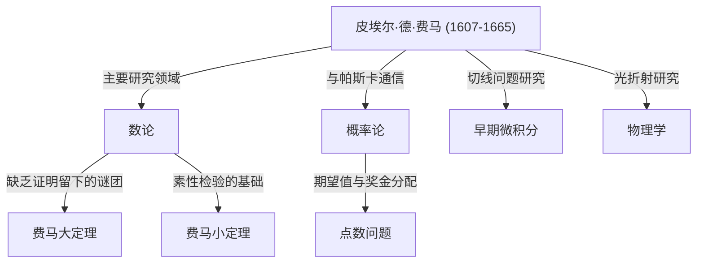

## 引言：留下数学史最大谜团的男人

说起在数学史上创造出最著名、最具戏剧性故事的人物，非[皮埃尔·德·费马](https://kenji.blog/zh-cn/p/fermat/)（[Pierre de Fermat](https://kenji.blog/zh-cn/p/fermat/)）莫属。他并不是一位职业数学家。他平时作为地方法官工作，在业余时间享受数学，这使他被称为 **“业余数学家”**。然而，他留下的成就震惊了当时欧洲最伟大的头脑，并在他死后的 350 多年里，继续折磨着全世界的天才数学家们。

在这篇文章中，我们将深入探讨费马的一生、他主要的数学发现，以及围绕着名垂数学史的丰碑—— **“[费马大定理](https://kenji.blog/zh-cn/p/fermats-last-theorem/)”** 展开的浪漫传奇。让我们来探索他是如何奠定现代数学基础的，并揭开他惊人洞察力和想象力的源泉。

## 1. 作为法官的公众形象与对数学的热情

[皮埃尔·德·费马](https://kenji.blog/zh-cn/p/fermat/)于 1607 年底（也有理论认为是 1601 年）出生在法国西南部博蒙德洛马涅的一个富裕皮革商家庭。他从小就非常聪明，在奥尔良大学学习法律，并于 1631 年在图卢兹高等法院担任了享有盛誉的议员（法官）一职。从那时起，他终生都在担任公职。

在当时的法国，法官被鼓励避免过度扩大社交圈，以防止政治和社会冲突。讽刺的是，这种孤立的环境恰恰为费马提供了他所需要的安静时间，驱使他走向数学的深渊。对他来说，数学是一种纯粹的乐趣，将他从沉重的职务压力中解放出来，而不是任何人强加给他的东西。

费马不喜欢将他的研究作为正式论文发表；他满足于在笔记本或书的空白处记下他的想法和证明，或者通过当时充当学术中心的巴黎修道士[马兰·梅森](https://kenji.blog/zh-cn/p/mersenne/)（Marin Mersenne）与其他学者交流信件。他喜欢把自己的发现作为 **“问题”** 提交给其他数学家，挑衅地要求他们给出解答。众所周知，他还与[勒内·笛卡尔](/zh-cn/p/descartes/)（René Descartes）和[约翰·沃利斯](/zh-cn/p/wallis/)（[John Wallis](https://kenji.blog/zh-cn/p/wallis/)）等伟大的数学家进行过激烈的辩论。

## 2. 对数论的巨大贡献

费马最大的兴趣所在，也是他留下最深印记的领域是 **数论**（探索数字性质的分支）。他致力于阅读古希腊数学家[丢番图](https://kenji.blog/zh-cn/p/diophantus/)（[Diophantus](https://kenji.blog/zh-cn/p/diophantus/)）的《算术》（Arithmetica），从中汲取灵感，发现了许多开创性的定理。

### 2.1. [费马小定理](https://kenji.blog/zh-cn/p/fermats-little-theorem/)

构成[现代密码学](/zh-cn/p/modern-cryptography-public-key-hash-signature/)（如 [RSA](https://kenji.blog/zh-cn/p/modern-cryptography-public-key-hash-signature/) 加密）基础的一个非常重要的定理就是 **[费马小定理](https://kenji.blog/zh-cn/p/fermats-little-theorem/)**。它揭示了一个关于素数的惊人性质，并在我们现代互联网社会中默默地支撑着安全技术。

该定理的表述如下：
对于任何素数 $p$ 和任何与 $p$ 互素（即不是 $p$ 的倍数）的整数 $a$，以下同余式成立：

$$
a^{p-1} \equiv 1 \pmod{p} \quad \text{ (其中 } p \text{ 是素数)}
$$

换句话说，该性质表明“将 $a$ 的 $p-1$ 次方减去 $1$ 后得到的数字，总是能被 $p$ 整除”。例如，如果 $p = 5$ 且 $a = 2$，那么 $2^{5-1} = 2^4 = 16$，而 $16 - 1 = 15$，它完美地是 $5$ 的倍数。这个定理是快速确定极大数字是否为素数的算法（如费马素性检验）的基础。

### 2.2. 二平方和定理

费马发现了另一个关于素数性质的美丽定理：“除以 $4$ 余 $1$ 的素数，总是可以用唯一的方式表示为两个平方数（两个整数的平方）之和。”

$$
p = x^2 + y^2 \quad \text{ (其中 } p \equiv 1 \pmod{4} \text{ )}
$$

例如，如果 $p = 5$，它是 $5 = 1^2 + 2^2$；如果 $p = 13$，它是 $13 = 2^2 + 3^2$；如果 $p = 29$，它是 $29 = 2^2 + 5^2$。相反，除以 $4$ 余 $3$ 的素数（如 $7, 11, 19$）永远不能表示为两个平方数之和。费马在数论中陆续揭示了这样深刻的规律。

### 2.3. 费马素数与正多边形的作图

费马还思考了生成素数的数学公式。他猜想所有形式为 $F_n = 2^{2^n} + 1$ 的数字都是素数。事实上，当 $n=0, 1, 2, 3, 4$ 时，结果分别为 $3, 5, 17, 257, 65537$，这些全部都是素数。这些被称为 **费马素数**。

然而，[莱昂哈德·欧拉](https://kenji.blog/zh-cn/p/euler/)（Leonhard Euler）后来证明，当 $n=5$ 时，$2^{32} + 1 = 4294967297 = 641 \times 6700417$，从而反驳了费马的猜想本身。尽管如此，[卡尔·弗里德里希·高斯](/zh-cn/p/gauss/)（[Carl Friedrich Gauss](https://kenji.blog/zh-cn/p/gauss/)）后来证明，这些费马素数与“用圆规和直尺可作正 $n$ 边形的条件”密切相关，在后世几何学和代数学的融合中发挥了极其重要的作用。

## 3. 无限递降法：费马的利剑

虽然费马很少写下他定理的证明，但他有一种自豪地称为“我发现的最强大的证明方法”的独特方法。这就是 **无限递降法**（Method of Infinite Descent）。

它是一种反证法，主要用于证明“不存在满足特定条件的正整数解”。论证的基本流程如下：

1. 假设存在满足条件的正整数解。
2. 在数学上证明，从该解出发，可以创造出一个更小的满足相同条件的正整数解。
3. 重复这个过程意味着正整数解将不断变得无限小。
4. 然而，由于正整数的最小值为 $1$，它们不可能无限期地变小。
5. 因此，最初的假设是错误的，不存在满足条件的正整数解。

利用这项技术，费马亲自证明了诸如“直角三角形的面积不可能是平方数”等命题。后来的数学家如欧拉也深入研究并大量使用这种无限递降法，来证明费马留下的定理。

## 4. 作为概率论的奠基人之一

费马非凡的才华并不局限于数论。1654 年，他与天才思想家、数学家[布莱兹·帕斯卡](https://kenji.blog/zh-cn/p/pascal/)（[Blaise Pascal](https://kenji.blog/zh-cn/p/pascal/)）交换了一系列信件。正是这次通信被认为是现代 **概率论**（Probability Theory）的开端。

他们讨论的催化剂是一个被称为 **“点数问题”**（Problem of points）的赌博相关问题，由一位名叫切瓦利埃·德·梅雷（Chevalier de Méré）的人带给帕斯卡。
问题是：“两个实力相当的玩家进行一场游戏，谁先赢得一定数量的回合就拿走全部奖金。但是，如果游戏在中途被打断，如何根据当前的胜负情况公平地分配奖金？”

虽然费马和帕斯卡各自采用了完全不同的数学方法，但他们最终得出了完全相同的结论（基于当前概率和期望值概念的正确分配比例）。帕斯卡使用了组合数学（如二项式系数），而费马则使用了一种优雅的方法，即枚举和计算所有可能的结果。通过这段仅持续了几个月的通信，“概率论”作为数学的一个独立分支诞生了。

## 5. 对微积分和物理学的先驱性贡献

在[艾萨克·牛顿](https://kenji.blog/zh-cn/p/newton/)（Isaac Newton）和[戈特弗里德·莱布尼茨](/zh-cn/p/leibniz/)（[Gottfried Leibniz](https://kenji.blog/zh-cn/p/leibniz/)）建立微积分的几十年前，费马就已经设计出了他自己求曲线切线和求函数最大值与最小值的方法。

他引入了一个叫做 **“准等式”**（Adequality）的概念。这是一种在极小量 $E$ 变化时，将数值视为“几乎相等”的技术，并在计算的最后阶段将 $E$ 视为 $0$ 来求极值。这本质上就是现代微分的思想，牛顿本人后来也说：“我从费马画切线的方法中得到了这种方法的启发。”如果没有费马，微积分的完成可能会进一步推迟。

此外，在物理学（光学）领域，他提出了 **费马原理**（[Fermat](https://kenji.blog/zh-cn/p/fermat/)'s Principle），即“光在两点之间传播时，走的是需要时间最短的路径。”这在数学上推导出了斯涅尔折射定律，构成了现代光学的基础，并成为一项极其重要的发现，引出了贯穿后世物理学整体的“最小作用量原理”。

## 6. 页边空白处的戏剧：[费马大定理](https://kenji.blog/zh-cn/p/fermats-last-theorem/)

尽管留下了如此多伟大的成就，但毫无疑问，让费马成为历史上最著名的数学家的，是 **“[费马大定理](https://kenji.blog/zh-cn/p/fermats-last-theorem/)”**（[Fermat's Last Theorem](https://kenji.blog/zh-cn/p/fermats-last-theorem/)）的存在。

在他最喜欢的书——[丢番图](https://kenji.blog/zh-cn/p/diophantus/)的《算术》第 2 卷关于[毕达哥拉斯](/zh-cn/p/pythagoras/)定理（ $x^2 + y^2 = z^2$ ）的一段话的空白处，费马用拉丁文写下了以下令人震惊的笔记：

> "Cubum autem in duos cubos, aut quadratoquadratum in duos quadratoquadratos, et generaliter nullam in infinitum ultra quadratum potestatem in duas eiusdem nominis fas est dividere cuius rei demonstrationem mirabilem sane detexi. Hanc marginis exiguitas non caperet."
> 
> （将一个立方数分成两个立方数之和，或一个四次方数分成两个四次方数之和，或者一般地将任何高于二次的乘方分成两个同次乘方之和，这是不可能的。我对此发现了一个 **真正绝妙的证明**，但这里的空白处太小，写不下。）

用数学公式表示，它极其简单：

“当 $n$ 是大于或等于 $3$ 的整数时，不存在满足以下方程的正整数解 $(x, y, z)$。”

$$
x^n + y^n = z^n \quad \text{ (其中 } n \ge 3 \text{ )}
$$

在费马于 1665 年去世后，他的长子克莱芒-萨缪尔出版了包含他父亲批注的新版《算术》。从那时起，全世界数学家们开始了艰苦卓绝的挑战。

欧拉、勒让德、狄利克雷、高斯和索菲·热尔曼等历代天才都曾解决过这个问题。虽然 $n=3, 4, 5, 7$ 等个别情况被证明了，但没有人能对所有的 $n$ 进行普遍证明。

### 350 年后戏剧性的结局

在它被提出后的 350 多年里，这个问题作为“数学界最大的未解之谜”一直未被任何人解开。在 20 世纪下半叶，当许多人开始怀疑“费马实际上并没有证明它（或者犯了一个错误）”时，一位数学家终于终结了这个可怕的难题。

那就是英国数学家[安德鲁·怀尔斯](https://kenji.blog/zh-cn/p/wiles/)（Andrew Wiles）。他在 10 岁时在当地图书馆偶然发现了这个问题，便发誓要倾尽毕生精力去解决它。他采取了费马时代无法想象的宏大方法，将由日本数学家[谷山丰](/zh-cn/p/taniyama-yutaka/)和[志村五郎](https://kenji.blog/zh-cn/p/shimura-goro/)提出的“所有椭圆曲线都是模形式的” **谷山-志村猜想**，与肯·里贝特（Ken Ribet）关于弗雷曲线的研究（epsilon 猜想）结合起来。

怀尔斯将自己关在阁楼里，经过七年孤独的研究，于 1995 年发表了完整的证明。他的证明是长达数百页的现代数学集大成之作，与费马可能设想的 17 世纪数学方法（“真正绝妙的证明”）截然不同。

费马是否真的拥有正确的证明，至今仍是一个永恒的谜团。然而，不可否认的事实是，他的“页边笔记”为后世数学的发展提供了不可估量的动力。

## 结论：业余数学家之王的遗产

[皮埃尔·德·费马](https://kenji.blog/zh-cn/p/fermat/)只是一位法官，他不喜欢步入学术界光鲜亮丽的主舞台。然而，他写在纸片上和书本空白处的思想，却敞开了通往数论、概率论、微积分和光学等不同领域的大门。

他留下的最大谜团在几个世纪里吸引并折磨了无数数学家，在此过程中孕育了新的数学理论。费马的存在本身，至今仍在向我们诉说着数学这门学科所蕴含的取之不尽的浪漫与深邃。毫无疑问，他是历史上最伟大、最动人心魄的 **“业余数学家之王”**。
