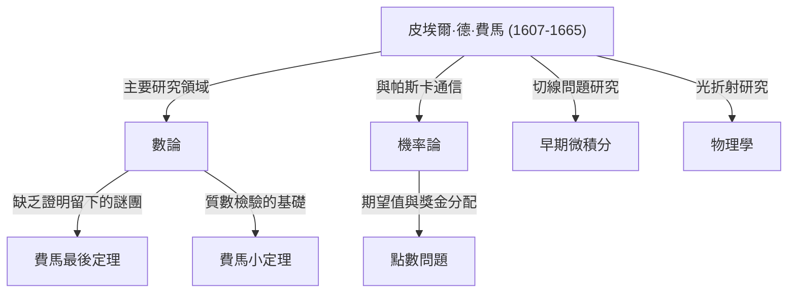

## 引言：留下數學史最大謎團的男人

說起在數學史上創造出最著名、最具戲劇性故事的人物，非[皮埃爾·德·費馬](https://kenji.blog/zh-tw/p/fermat/)（[Pierre de Fermat](https://kenji.blog/zh-tw/p/fermat/)）莫屬。他並不是一位職業數學家。他平時作為地方法官工作，在業餘時間享受數學，這使他被稱為 **「業餘數學家」**。然而，他留下的成就震驚了當時歐洲最偉大的頭腦，並在他死後的 350 多年裡，繼續折磨著全世界的天才數學家們。

在這篇文章中，我們將深入探討費馬的一生、他主要的數學發現，以及圍繞著名垂數學史的豐碑—— **「[費馬最後定理](https://kenji.blog/zh-tw/p/fermats-last-theorem/)」** 展開的浪漫傳奇。讓我們來探索他是如何奠定現代數學基礎的，並揭開他驚人洞察力和想像力的源泉。

## 1. 作為法官的公眾形象與對數學的熱情

[皮埃爾·德·費馬](https://kenji.blog/zh-tw/p/fermat/)於 1607 年底（也有理論認為是 1601 年）出生在法國西南部博蒙德洛馬涅的一個富裕皮革商家庭。他從小就非常聰明，在奧爾良大學學習法律，並於 1631 年在土魯斯高等法院擔任了享有盛譽的議員（法官）一職。從那時起，他終生都在擔任公職。

在當時的法國，法官被鼓勵避免過度擴大社交圈，以防止政治和社會衝突。諷刺的是，這種孤立的環境恰恰為費馬提供了他所需要的安靜時間，驅使他走向數學的深淵。對他來說，數學是一種純粹的樂趣，將他從沉重的職務壓力中解放出來，而不是任何人強加給他的東西。

費馬不喜歡將他的研究作為正式論文發表；他滿足於在筆記本或書的空白處記下他的想法和證明，或者透過當時充當學術中心的巴黎修道士[馬蘭·梅森](https://kenji.blog/zh-tw/p/mersenne/)（[Marin Mersenne](https://kenji.blog/zh-tw/p/mersenne/)）與其他學者交流信件。他喜歡把自己的發現作為 **「問題」** 提交給其他數學家，挑釁地要求他們給出解答。眾所周知，他還與[勒內·笛卡兒](https://kenji.blog/zh-tw/p/descartes/)（[René Descartes](https://kenji.blog/zh-tw/p/descartes/)）和[約翰·沃利斯](https://kenji.blog/zh-tw/p/wallis/)（[John Wallis](https://kenji.blog/zh-tw/p/wallis/)）等偉大的數學家進行過激烈的辯論。

## 2. 對數論的巨大貢獻

費馬最大的興趣所在，也是他留下最深印記的領域是 **數論**（探索數字性質的分支）。他致力於閱讀古希臘數學家[丟番圖](https://kenji.blog/zh-tw/p/diophantus/)（[Diophantus](https://kenji.blog/zh-tw/p/diophantus/)）的《算術》（Arithmetica），從中汲取靈感，發現了許多開創性的定理。

### 2.1. [費馬小定理](https://kenji.blog/zh-tw/p/fermats-little-theorem/)

構成現代密碼學（如 RSA 加密）基礎的一個非常重要的定理就是 **[費馬小定理](https://kenji.blog/zh-tw/p/fermats-little-theorem/)**。它揭示了一個關於質數的驚人性質，並在我們現代網際網路社會中默默地支撐著安全技術。

該定理的表述如下：
對於任何質數 $p$ 和任何與 $p$ 互質（即不是 $p$ 的倍數）的整數 $a$，以下同餘式成立：

$$
a^{p-1} \equiv 1 \pmod{p} \quad \text{ (其中 } p \text{ 是質數)}
$$

換句話說，該性質表明「將 $a$ 的 $p-1$ 次方減去 $1$ 後得到的數字，總是能被 $p$ 整除」。例如，如果 $p = 5$ 且 $a = 2$，那麼 $2^{5-1} = 2^4 = 16$，而 $16 - 1 = 15$，它完美地是 $5$ 的倍數。這個定理是快速確定極大數字是否為質數的演算法（如費馬質數檢驗）的基礎。

### 2.2. 二平方和定理

費馬發現了另一個關於質數性質的美麗定理：「除以 $4$ 餘 $1$ 的質數，總是可以唯一地表示為兩個平方數（兩個整數的平方）之和。」

$$
p = x^2 + y^2 \quad \text{ (其中 } p \equiv 1 \pmod{4} \text{ )}
$$

例如，如果 $p = 5$，它是 $5 = 1^2 + 2^2$；如果 $p = 13$，它是 $13 = 2^2 + 3^2$；如果 $p = 29$，它是 $29 = 2^2 + 5^2$。相反，除以 $4$ 餘 $3$ 的質數（如 $7, 11, 19$）永遠不能表示為兩個平方數之和。費馬在數論中陸續揭示了這樣深刻的規律。

### 2.3. 費馬質數與正多邊形的作圖

費馬還思考了生成質數的數學公式。他猜想所有形式為 $F_n = 2^{2^n} + 1$ 的數字都是質數。事實上，當 $n=0, 1, 2, 3, 4$ 時，結果分別為 $3, 5, 17, 257, 65537$，這些全部都是質數。這些被稱為 **費馬質數**。

然而，萊昂哈德·歐拉（[Leonhard Euler](https://kenji.blog/zh-tw/p/euler/)）後來證明，當 $n=5$ 時，$2^{32} + 1 = 4294967297 = 641 \times 6700417$，從而反駁了費馬的猜想本身。儘管如此，[卡爾·弗里德里希·高斯](https://kenji.blog/zh-tw/p/gauss/)（[Carl Friedrich Gauss](https://kenji.blog/zh-tw/p/gauss/)）後來證明，這些費馬質數與「用圓規和直尺可作正 $n$ 邊形的條件」密切相關，在後世幾何學和代數學的融合中發揮了極其重要的作用。

## 3. 無限遞降法：費馬的利劍

雖然費馬很少寫下他定理的證明，但他有一種自豪地稱為「我發現的最強大的證明方法」的獨特方法。這就是 **無限遞降法**（Method of Infinite Descent）。

它是一種反證法，主要用於證明「不存在滿足特定條件的正整數解」。論證的基本流程如下：

1. 假設存在滿足條件的正整數解。
2. 在數學上證明，從該解出發，可以創造出一個更小的滿足相同條件的正整數解。
3. 重複這個過程意味著正整數解將不斷變得無限小。
4. 然而，由於正整數的最小值為 $1$，它們不可能無限期地變小。
5. 因此，最初的假設是錯誤的，不存在滿足條件的正整數解。

利用這項技術，費馬親自證明了諸如「直角三角形的面積不可能是平方數」等命題。後來的數學家如歐拉也深入研究並大量使用這種無限遞降法，來證明費馬留下的定理。

## 4. 作為機率論的奠基人之一

費馬非凡的才華並不侷限於數論。1654 年，他與天才思想家、數學家[布萊茲·帕斯卡](https://kenji.blog/zh-tw/p/pascal/)（[Blaise Pascal](https://kenji.blog/zh-tw/p/pascal/)）交換了一系列信件。正是這次通信被認為是現代 **機率論**（Probability Theory）的開端。

他們討論的催化劑是一個被稱為 **「點數問題」**（Problem of points）的賭博相關問題，由一位名叫切瓦利埃·德·梅雷（Chevalier de Méré）的人帶給帕斯卡。
問題是：「兩個實力相當的玩家進行一場遊戲，誰先贏得一定數量的回合就拿走全部獎金。但是，如果遊戲在中途被打斷，如何根據目前的勝負情況公平地分配獎金？」

雖然費馬和帕斯卡各自採用了完全不同的數學方法，但他們最終得出了完全相同的結論（基於當前機率和期望值概念的正確分配比例）。帕斯卡使用了組合數學（如二項式係數），而費馬則使用了一種優雅的方法，即枚舉和計算所有可能的結果。透過這段僅持續了幾個月的通信，「機率論」作為數學的一個獨立分支誕生了。

## 5. 對微積分和物理學的先驅性貢獻

在[艾薩克·牛頓](https://kenji.blog/zh-tw/p/newton/)（[Isaac Newton](https://kenji.blog/zh-tw/p/newton/)）和戈特弗里德·萊布尼茲（[Gottfried Leibniz](https://kenji.blog/zh-tw/p/leibniz/)）建立微積分的幾十年前，費馬就已經設計出了他自己求曲線切線和求函數最大值與最小值的方法。

他引入了一個叫做 **「準等式」**（Adequality）的概念。這是一種在極小量 $E$ 變化時，將數值視為「幾乎相等」的技術，並在計算的最後階段將 $E$ 視為 $0$ 來求極值。這本質上就是現代微分的思想，牛頓本人後來也說：「我從費馬畫切線的方法中得到了這種方法的啟發。」如果沒有費馬，微積分的完成可能會進一步推遲。

此外，在物理學（光學）領域，他提出了 **費馬原理**（Fermat's Principle），即「光在兩點之間傳播時，走的是需要時間最短的路徑。」這在數學上推導出了司乃耳折射定律，構成了現代光學的基礎，並成為一項極其重要的發現，引出了貫穿後世物理學整體的「最小作用量原理」。

## 6. 頁邊空白處的戲劇：[費馬最後定理](https://kenji.blog/zh-tw/p/fermats-last-theorem/)

儘管留下了如此多偉大的成就，但毫無疑問，讓費馬成為歷史上最著名的數學家的，是 **「[費馬最後定理](https://kenji.blog/zh-tw/p/fermats-last-theorem/)」**（[Fermat's Last Theorem](https://kenji.blog/zh-tw/p/fermats-last-theorem/)）的存在。

在他最喜歡的書——[丟番圖](https://kenji.blog/zh-tw/p/diophantus/)的《算術》第 2 卷關於畢達哥拉斯定理（ $x^2 + y^2 = z^2$ ）的一段話的空白處，費馬用拉丁文寫下了以下令人震驚的筆記：

> "Cubum autem in duos cubos, aut quadratoquadratum in duos quadratoquadratos, et generaliter nullam in infinitum ultra quadratum potestatem in duas eiusdem nominis fas est dividere cuius rei demonstrationem mirabilem sane detexi. Hanc marginis exiguitas non caperet."
> 
> （將一個立方數分成兩個立方數之和，或一個四次方數分成兩個四次方數之和，或者一般地將任何高於二次的乘方分成兩個同次乘方之和，這是不可能的。我對此發現了一個 **真正絕妙的證明**，但這裡的空白處太小，寫不下。）

用數學公式表示，它極其簡單：

「當 $n$ 是大於或等於 $3$ 的整數時，不存在滿足以下方程式的正整數解 $(x, y, z)$。」

$$
x^n + y^n = z^n \quad \text{ (其中 } n \ge 3 \text{ )}
$$

在費馬於 1665 年去世後，他的長子克萊芒-薩繆爾出版了包含他父親批注的新版《算術》。從那時起，全世界數學家們開始了艱苦卓絕的挑戰。

歐拉、勒讓德、狄利克雷、高斯和索菲·熱爾曼等歷代天才都曾解決過這個問題。雖然 $n=3, 4, 5, 7$ 等個別情況被證明了，但沒有人能對所有的 $n$ 進行普遍證明。

### 350 年後戲劇性的結局

在它被提出後的 350 多年裡，這個問題作為「數學界最大的未解之謎」一直未被任何人解開。在 20 世紀下半葉，當許多人開始懷疑「費馬實際上並沒有證明它（或者犯了一個錯誤）」時，一位數學家終於終結了這個可怕的難題。

那就是英國數學家[安德魯·懷爾斯](https://kenji.blog/zh-tw/p/wiles/)（[Andrew Wiles](https://kenji.blog/zh-tw/p/wiles/)）。他在 10 歲時在當地圖書館偶然發現了這個問題，便發誓要傾盡畢生精力去解決它。他採取了費馬時代無法想像的宏大方法，將由日本數學家[谷山豐](https://kenji.blog/zh-tw/p/taniyama-yutaka/)和[志村五郎](https://kenji.blog/zh-tw/p/shimura-goro/)提出的「所有橢圓曲線都是模形式的」 **谷山-志村猜想**，與肯·里貝特（Ken Ribet）關於弗雷曲線的研究（epsilon 猜想）結合起來。

懷爾斯將自己關在閣樓裡，經過七年孤獨的研究，於 1995 年發表了完整的證明。他的證明是長達數百頁的現代數學集大成之作，與費馬可能設想的 17 世紀數學方法（「真正絕妙的證明」）截然不同。

費馬是否真的擁有正確的證明，至今仍是一個永遠的謎團。然而，不可否認的事實是，他的「頁邊筆記」為後世數學的發展提供了不可估量的動力。

## 結論：業餘數學家之王的遺產

[皮埃爾·德·費馬](https://kenji.blog/zh-tw/p/fermat/)只是一位法官，他不喜歡步入學術界光鮮亮麗的主舞台。然而，他寫在紙片上和書本空白處的思想，卻敞開了通往數論、機率論、微積分和光學等不同領域的大門。

他留下的最大謎團在幾個世紀裡吸引並折磨了無數數學家，在此過程中孕育了新的數學理論。費馬的存在本身，至今仍在向我們訴說著數學這門學科所蘊含的取之不盡的浪漫與深邃。毫無疑問，他是歷史上最偉大、最動人心魄的 **「業餘數學家之王」**。
