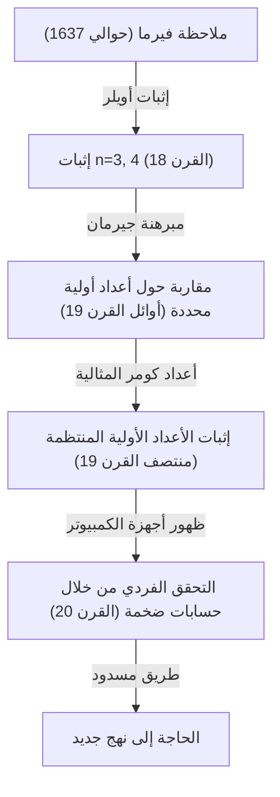
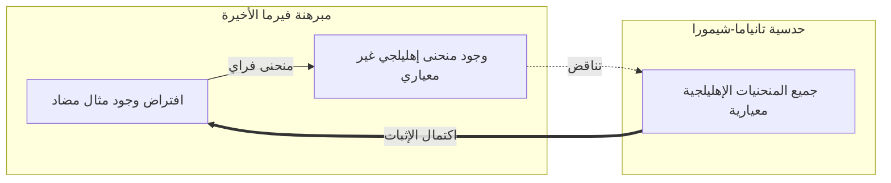

## 1. مقدمة: أشهر لغز رياضي في العالم

في تاريخ الرياضيات، هناك مسألة سحرت وعذبت معظم الناس. إنها **مبرهنة فيرما الأخيرة** (Fermat's Last Theorem). بدأ الدراما الرياضية الملحمية التي استمرت لـ 360 عامًا من ملاحظة قصيرة تركها بيير دي فيرما، وهو قاض فرنسي في القرن السابع عشر وعالم رياضيات هاوٍ، في هامش كتابه المفضل "الحساب" (Arithmetica) لديوفانتس.

محتوى المبرهنة بحد ذاته بسيط بما يكفي ليفهمه حتى طالب في المرحلة الإعدادية.

$$
x^n + y^n = z^n
$$

"عندما يكون $n$ عددًا طبيعيًا أكبر من أو يساوي 3، لا توجد مجموعة من الأعداد الطبيعية غير الصفرية $x, y, z$ تلبي هذه المعادلة."

ومع ذلك، كان إثبات هذا الادعاء البسيط رحلة صعبة تفوق الخيال بالنسبة للبشرية. في هذا المقال، سنتتبع تاريخ كيف ولدت **مبرهنة فيرما الأخيرة**، وما هو نوع علماء الرياضيات الذين تحدوها، وكيف تم إثباتها في النهاية.

## 2. "سحر الشيطان" المتروك في الهامش

لم يكن بيير دي فيرما عالم رياضيات محترفًا. كان يعمل قاضيًا في محكمة تولوز العليا، وكان يستمتع بالرياضيات في أوقات فراغه. ومع ذلك، يقال إن حدسه الرياضي وموهبته كانا في أعلى مستوى في ذلك الوقت وأسسا أسس نظرية الأعداد الحديثة.

كان لدى فيرما عادة تدوين الأفكار والنظريات التي خطرت بباله أثناء القراءة في هوامش الكتب. من بين الملاحظات التي تركها، كانت "المبرهنة الأخيرة" هي الوحيدة التي ظلت غير مثبتة حتى النهاية. ترك فيرما الملاحظة الشهيرة التالية في الهامش:

> "لدي إثبات مذهل حقًا لهذه المبرهنة، لكن الهامش ضيق جدًا بحيث لا يمكنني كتابته هنا."

أصبحت هذه الكلمات رسالة تحدٍ لعلماء الرياضيات في الأجيال القادمة. هل كان يمتلك حقًا الإثبات؟ يعتقد العديد من علماء الرياضيات المعاصرين أنه لا بد من وجود خطأ في مكان ما في إثبات فيرما. ذلك لأن الإثبات النهائي تطلب نظريات رياضية حديثة متقدمة لم تكن موجودة في عصر فيرما.

## 3. تحديات وإحباطات العباقرة

بعد وفاة فيرما، تم إثبات النظريات الأخرى التي تركها واحدة تلو الأخرى، لكن هذه المبرهنة الأخيرة وحدها وقفت كجدار عازل. حاول العديد من علماء الرياضيات إثباتها لقيم معينة من $n$.

- **ليونهارت أويلر** : نجح أويلر، أعظم عالم رياضيات في القرن الثامن عشر، في إثبات الحالات التي يكون فيها $n = 3$ و $n = 4$ (يقال إن فيرما نفسه أثبت الحالة التي يكون فيها $n = 4$).
- **صوفي جيرمان** : في أوائل القرن التاسع عشر، أوضحت عالمة الرياضيات صوفي جيرمان أن المبرهنة صحيحة بالنسبة للأعداد الأولية التي تستوفي شروطًا معينة (تُسمى اليوم "أعداد صوفي جيرمان الأولية"). كانت هذه خطوة كبيرة نحو الإثبات العام.
- **إرنست كومر** : في منتصف القرن التاسع عشر، قدم كومر مفهوم "الأعداد المثالية" وأثبت المبرهنة للعديد من الأعداد الأولية تسمى الأعداد الأولية المنتظمة.

ومع ذلك، كان الهدف المتمثل في إثبات المبرهنة لجميع الأعداد الطبيعية اللانهائية $n$ لا يزال بعيد المنال.

## 4. جسر الرياضيات الحديثة: حدسية تانياما-شيمورا

مع دخول القرن العشرين، ارتبطت مبرهنة فيرما الأخيرة بمجال آخر من الرياضيات بدا وكأنه لا علاقة له بها تمامًا. إنها **حدسية تانياما-شيمورا**.

في عام 1955، قدم عالما الرياضيات اليابانيان الشابان يوتاكا تانياما وغورو شيمورا تخمينًا جريئًا بأن "جميع المنحنيات الإهليلجية هي معيارية".

- **المنحنيات الإهليلجية** : منحنى يعبر عنه بمعادلة بالشكل $y^2 = x^3 + ax + b$.
- **النماذج المعيارية** : دوال خاصة ذات تناسق عالٍ جدًا على المستوى المعقد.

أحدث هذا التخمين، الذي يفيد بأن "المنحنيات الإهليلجية" و"النماذج المعيارية" - وهما مفهومان من مجالات مختلفة تمامًا - هما في الواقع نفس الشيء، صدمة في مجتمع الرياضيات في ذلك الوقت.

ثم في الثمانينيات، أشار غيرهارد فراي إلى أنه إذا كان هناك مثال مضاد لمبرهنة فيرما الأخيرة (أي وجود أعداد طبيعية تلبي المعادلة $A^n + B^n = C^n$)، فإن المنحنى الإهليلجي الناتج عنه، والذي يسمى **منحنى فراي**، سيكون له خصائص شاذة ولن **يكون معياريًا أبدًا**. بعد ذلك، أثبت كين ريبيت بدقة فكرة فراي هذه.

ونتيجة لذلك، إذا تم إثبات **حدسية تانياما-شيمورا**، فإن **مبرهنة فيرما الأخيرة** ستُثبت تلقائيًا أيضًا.

## 5. مجد أندرو وايلز

عالم الرياضيات البريطاني **أندرو وايلز** هو الذي ألهم بشدة بهذا التطور الدرامي. لقد قرأ كتابًا عن مبرهنة فيرما الأخيرة في المكتبة عندما كان في العاشرة من عمره وقرر أن يصبح عالم رياضيات.

علق وايلز جميع أبحاثه الأخرى وحبس نفسه في عليته لمحاولة إثبات **حدسية تانياما-شيمورا** في سرية تامة. بعد سبع سنوات من البحث الانفرادي، في يونيو 1993، في نهاية محاضرة في جامعة كامبريدج، كتب استنتاج الإثبات على السبورة وأعلن بهدوء: "أعتقد أنني سأتوقف هنا". غطت القاعة تصفيقات مدوية.

ومع ذلك، لم تنته الدراما هنا. أثناء عملية المراجعة، تم اكتشاف عيب قاتل في الإثبات. وقف وايلز على حافة اليأس، لكنه عمل على التصحيح بمساعدة طالبه السابق ريتشارد تايلور.

بعد حوالي عام من النضال، في سبتمبر 1994، حصل وايلز أخيرًا على وميض من الإلهام. من خلال الجمع بين نهج تخلى عنه سابقًا والنهج الحالي، اكتمل الإثبات الكامل أخيرًا. في عام 1995، تم نشر ورقته البحثية رسميًا، وتم أخيرًا حل أكبر لغز في مجتمع الرياضيات الذي استمر 360 عامًا.

## 6. خاتمة

إن إثبات **مبرهنة فيرما الأخيرة** له معنى يتجاوز مجرد حل مسألة قديمة. العديد من الأساليب والنظريات الرياضية التي تم تطويرها في هذه العملية (مثل نظرية إيواساوا وطريقة كوليفاجين-فلاخ) تعمل كأدوات قوية في الرياضيات الحديثة.

لقد أصبح اللغز الذي تركه عالم رياضيات هاوٍ في هامش أحد الكتب نجمًا مرشدًا لعلماء الرياضيات لعدة قرون، مما وسع حدود المعرفة البشرية. يمكن القول إن مبرهنة فيرما الأخيرة هي نصب تذكاري أبدي يرمز إلى عظمة الروح البشرية التي تستمر في تحدي المستحيل.
