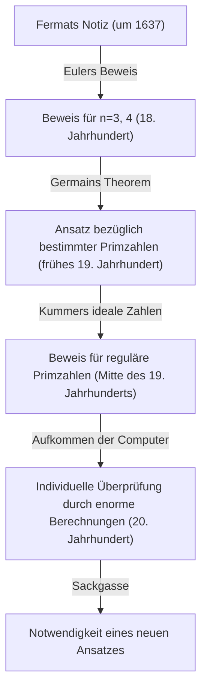
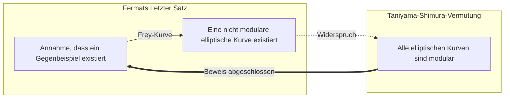

## 1. Einführung: Das berühmteste Mathematikrätsel der Welt

In der Geschichte der Mathematik gibt es ein Problem, das die meisten Menschen fasziniert und gequält hat. Das ist **[Fermats Letzter Satz](https://kenji.blog/de/p/fermats-last-theorem/)** (Fermat's Last Theorem). Ein kurzes Memo, das von Pierre de Fermat, einem französischen Richter und Amateurmathematiker des 17. Jahrhunderts, am Rand seines Lieblingsbuchs „Arithmetica“ von [Diophantus](https://kenji.blog/de/p/diophantus/) hinterlassen wurde, war der Beginn eines grandiosen mathematischen Dramas, das 360 Jahre dauerte.

Der Inhalt des Theorems selbst ist so einfach, dass selbst ein Mittelschüler ihn verstehen kann.

$$
x^n + y^n = z^n
$$

„Wenn $n$ eine natürliche Zahl größer oder gleich 3 ist, existiert keine Gruppe von von null verschiedenen natürlichen Zahlen $x, y, z$, die diese Gleichung erfüllt.“

Doch der Beweis dieser einfachen Behauptung war für die Menschheit ein unvorstellbar schwieriger Weg. Dieser Artikel verfolgt die Geschichte, wie **[Fermats Letzter Satz](https://kenji.blog/de/p/fermats-last-theorem/)** entstand, welche Mathematiker ihn herausforderten und wie er schließlich bewiesen wurde.

## 2. Der am Rand hinterlassene „teuflische Zauber“

[Pierre de Fermat](https://kenji.blog/de/p/fermat/) war kein professioneller Mathematiker. Er arbeitete als Richter am Parlament von Toulouse und genoss die Mathematik in seiner Freizeit. Seine mathematische Intuition und sein Talent gehörten jedoch zum höchsten Niveau der Zeit, und es wird gesagt, dass er die Grundlage der modernen Zahlentheorie legte.

[Fermat](https://kenji.blog/de/p/fermat/) hatte die Angewohnheit, Ideen und Theoreme, die ihm beim Lesen einfielen, in die Ränder der Bücher zu schreiben. Unter den Notizen, die er hinterließ, blieb dieser „Letzte Satz“ als einziger bis zum Ende unbewiesen. [Fermat](https://kenji.blog/de/p/fermat/) hinterließ das folgende berühmte Zitat am Rand:

> „Ich habe einen wahrhaft wunderbaren Beweis für diesen Satz gefunden, doch der Rand ist zu schmal, um ihn hier zu notieren.“

Diese Worte wurden zu einer Herausforderung für Mathematiker späterer Generationen. Hatte er wirklich einen Beweis? Die meisten modernen Mathematiker glauben, dass der Beweis, den [Fermat](https://kenji.blog/de/p/fermat/) hatte, irgendwo fehlerhaft gewesen sein muss. Der Grund dafür ist, dass der endgültige Beweis hochentwickelte Theorien der modernen Mathematik erforderte, die zu [Fermat](https://kenji.blog/de/p/fermat/)s Zeit noch nicht existierten.

## 3. Herausforderungen und Rückschläge von Genies

Nach [Fermat](https://kenji.blog/de/p/fermat/)s Tod wurden die anderen Theoreme, die er hinterlassen hatte, nacheinander bewiesen, aber nur dieser letzte Satz blieb als unüberwindbare Wand stehen. Viele Mathematiker versuchten, ihn für bestimmte Werte von $n$ zu beweisen.

- **[Leonhard Euler](https://kenji.blog/de/p/euler/)**: Der größte Mathematiker des 18. Jahrhunderts, Euler, gelang es, den Beweis für die Fälle $n = 3$ und $n = 4$ zu erbringen (es wird auch gesagt, dass [Fermat](https://kenji.blog/de/p/fermat/) selbst den Fall $n = 4$ bewiesen hatte).
- **Sophie Germain**: Anfang des 19. Jahrhunderts zeigte die Mathematikerin Sophie Germain, dass das Theorem für bestimmte Primzahlen (heute als „Sophie-Germain-Primzahlen“ bekannt) gilt. Dies war ein großer Schritt in Richtung eines allgemeinen Beweises.
- **[Ernst Kummer](https://kenji.blog/de/p/kummer/)**: Mitte des 19. Jahrhunderts führte [Kummer](https://kenji.blog/de/p/kummer/) das Konzept der „idealen Zahlen“ ein und bewies das Theorem für viele Primzahlen, die als reguläre Primzahlen bezeichnet werden.

Das Ziel, das Theorem für alle unendlich vielen natürlichen Zahlen $n$ zu beweisen, blieb jedoch in weiter Ferne.

## 4. Die Brücke zur modernen Mathematik: Taniyama-Shimura-Vermutung

Im 20. Jahrhundert wurde [Fermats Letzter Satz](https://kenji.blog/de/p/fermats-last-theorem/) mit einem scheinbar völlig unzusammenhängenden Bereich der Mathematik verknüpft. Das war die **Taniyama-Shimura-Vermutung**.

Im Jahr 1955 stellten [Yutaka Taniyama](https://kenji.blog/de/p/taniyama-yutaka/) und [Goro Shimura](https://kenji.blog/de/p/shimura-goro/), zwei junge japanische Mathematiker, eine kühne Vermutung auf: „Alle elliptischen Kurven sind modular.“

- **Elliptische Kurven**: Kurven, die durch Gleichungen in der Form $y^2 = x^3 + ax + b$ ausgedrückt werden.
- **Modulformen**: Spezielle Funktionen mit extrem hoher Symmetrie in der komplexen Ebene.

Die Vermutung, dass „elliptische Kurven“ und „Modulformen“, Konzepte aus völlig unterschiedlichen Bereichen, eigentlich dasselbe sind, schockierte die mathematische Welt der damaligen Zeit.

In den 1980er Jahren schlug Gerhard Frey vor, dass, wenn ein Gegenbeispiel zu [Fermat](https://kenji.blog/de/p/fermat/)s Letztem Satz existiert (d. h. es existieren natürliche Zahlen, die $A^n + B^n = C^n$ erfüllen), die daraus resultierende elliptische Kurve, die sogenannte **Frey-Kurve**, abnormale Eigenschaften aufweisen und **nicht modular sein könnte**. Später bewies Ken Ribet diese Idee von Frey streng.

Dadurch bedeutete der Beweis der **Taniyama-Shimura-Vermutung** automatisch auch den Beweis von **[Fermat](https://kenji.blog/de/p/fermat/)s Letztem Satz**.

## 5. Der Ruhm von [Andrew Wiles](https://kenji.blog/de/p/wiles/)

Dieser dramatische Verlauf inspirierte den britischen Mathematiker **[Andrew Wiles](https://kenji.blog/de/p/wiles/)** stark. Er war ein Mann, der bereits im Alter von 10 Jahren in einer Bibliothek auf ein Buch über [Fermat](https://kenji.blog/de/p/fermat/)s Letzten Satz stieß und beschloss, Mathematiker zu werden.

Wiles unterbrach alle anderen Forschungen, schloss sich auf dem Dachboden ein und arbeitete heimlich am Beweis der **Taniyama-Shimura-Vermutung**. Nach 7 Jahren einsamer Forschung schrieb er im Juni 1993 am Ende seines Vortrags an der Universität Cambridge die Schlussfolgerung seines Beweises auf die Tafel und erklärte leise: „Ich denke, ich werde hier aufhören.“ Der Saal brach in tosenden Applaus aus.

Doch das Drama endete hier nicht. Im Begutachtungsprozess wurde ein fataler Fehler im Beweis entdeckt. Wiles stand am Rande der Verzweiflung, arbeitete jedoch mit Hilfe seines ehemaligen Schülers Richard Taylor an der Korrektur.

Nach etwa einem Jahr des Kampfes hatte Wiles im September 1994 endlich eine Erleuchtung. Durch die Kombination eines früher verworfenen Ansatzes mit dem aktuellen Ansatz war der vollständige Beweis endlich vollbracht. 1995 wurde seine Arbeit offiziell veröffentlicht, und das größte Rätsel der mathematischen Welt, das 360 Jahre gedauert hatte, war endlich gelöst.

## 6. Fazit

Der Beweis von **[Fermat](https://kenji.blog/de/p/fermat/)s Letztem Satz** hat eine weitreichendere Bedeutung als nur die Lösung eines alten Problems. Die zahlreichen mathematischen Methoden und Theorien, die dabei entwickelt wurden (wie z. B. die Iwasawa-Theorie und die Kolyvagin-Flach-Methode), fungieren als mächtige Werkzeuge in der modernen Mathematik.

Das Geheimnis, das ein Amateurmathematiker im Rand eines Buches hinterließ, wurde zum Leitstern für Mathematiker über Jahrhunderte hinweg und erweiterte die Grenzen des menschlichen Wissens. [Fermats Letzter Satz](https://kenji.blog/de/p/fermats-last-theorem/) ist ein ewiges Monument, das die Größe des menschlichen Geistes symbolisiert, der immer wieder das Unmögliche herausfordert.
