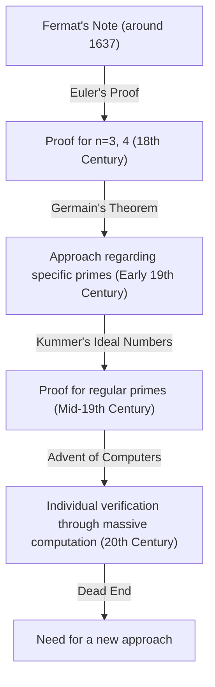
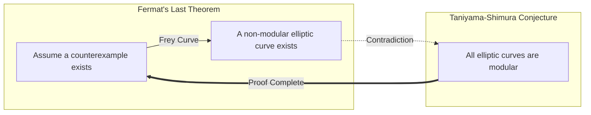

## 1. Introduction: The Most Famous Mathematical Mystery in the World

In the history of mathematics, there is a problem that has fascinated and tormented the greatest number of people. That is **[Fermat's Last Theorem](https://kenji.blog/p/fermats-last-theorem/)**. From a short note left in the margin of his favorite book, [Diophantus](https://kenji.blog/p/diophantus/)'s "Arithmetica," by [Pierre de Fermat](https://kenji.blog/p/fermat/), a 17th-century French judge and amateur mathematician, a grand mathematical drama spanning 360 years began.

The content of the theorem itself is simple enough for a junior high school student to understand.

$$
x^n + y^n = z^n
$$

"When $n$ is a natural number greater than or equal to 3, there are no non-zero natural numbers $x, y, z$ that satisfy this equation."

However, proving this simple assertion was a journey of unimaginable difficulty for humanity. In this article, we will trace the history of how **[Fermat's Last Theorem](https://kenji.blog/p/fermats-last-theorem/)** was born, what kind of mathematicians challenged it, and how it was finally proven.

## 2. The "Devil's Temptation" Left in the Margin

[Pierre de Fermat](https://kenji.blog/p/fermat/) was not a professional mathematician. He enjoyed mathematics in his spare time while working as a judge at the Parlement of Toulouse. However, his mathematical intuition and talent were at the highest level of his time, and he is considered to have built the foundation of modern number theory.

Fermat had a habit of writing down ideas and theorems that came to him while reading in the margins of his books. Among the notes he left behind, the one that remained unproven until the end was this "Last Theorem." Fermat left the following famous words in the margin:

> "I have a truly marvelous demonstration of this proposition which this margin is too narrow to contain."

These words became a letter of challenge to mathematicians of later generations. Did he really have a proof? Most modern mathematicians believe that the proof Fermat had must have contained an error somewhere. This is because the final proof required highly advanced theories of modern mathematics that did not exist in Fermat's time.

## 3. The Challenges and Frustrations of Geniuses

After Fermat's death, other theorems he left behind were proven one after another, but this Last Theorem stood as an insurmountable wall. Many mathematicians attempted to prove it for specific values of $n$.

- **[Leonhard Euler](https://kenji.blog/p/euler/)**: The greatest mathematician of the 18th century, Euler succeeded in proving the cases for $n = 3$ and $n = 4$ (it is said that Fermat himself had proven the case for $n = 4$).
- **Sophie Germain**: In the early 19th century, female mathematician Sophie Germain showed that the theorem holds for primes satisfying specific conditions (today called "Sophie Germain primes"). This was a major step toward a general proof.
- **[Ernst Kummer](https://kenji.blog/p/kummer/)**: In the mid-19th century, Kummer introduced the concept of "ideal numbers" and proved the theorem for a large class of prime numbers called regular primes.

However, the goal of proving it for all infinite natural numbers $n$ still remained far out of reach.

## 4. The Bridge of Modern Mathematics: The Taniyama-Shimura Conjecture

Entering the 20th century, [Fermat's Last Theorem](https://kenji.blog/p/fermats-last-theorem/) became connected to a completely seemingly unrelated field of mathematics. That was the **Taniyama-Shimura Conjecture**.

In 1955, [Yutaka Taniyama](https://kenji.blog/p/taniyama-yutaka/) and [Goro Shimura](https://kenji.blog/p/shimura-goro/), two young Japanese mathematicians, made a bold conjecture: "All elliptic curves are modular."

- **Elliptic Curves**: Curves represented by an equation of the form $y^2 = x^3 + ax + b$.
- **Modular Forms**: Special functions with very high symmetry on the complex plane.

This conjecture, which stated that "elliptic curves" and "modular forms"—concepts from completely different fields—were actually the same thing, shocked the mathematical world at the time.

Then, in the 1980s, Gerhard Frey suggested that if a counterexample to [Fermat's Last Theorem](https://kenji.blog/p/fermats-last-theorem/) existed (that is, if there were natural numbers satisfying $A^n + B^n = C^n$), the elliptic curve created from it, called the **Frey curve**, would have abnormal properties and **could not possibly be modular**. Later, Ken Ribet rigorously proved this idea of Frey's.

As a result, if the **Taniyama-Shimura Conjecture** could be proven, **[Fermat's Last Theorem](https://kenji.blog/p/fermats-last-theorem/)** would automatically be proven as well.

## 5. The Glory of [Andrew Wiles](https://kenji.blog/p/wiles/)

It was **[Andrew Wiles](https://kenji.blog/p/wiles/)**, a British-born mathematician, who was strongly inspired by this dramatic development. He is a person who encountered a book on [Fermat's Last Theorem](https://kenji.blog/p/fermats-last-theorem/) in a library when he was 10 years old and aspired to become a mathematician.

Wiles suspended all his other research and secluded himself in his attic to work secretly on proving the **Taniyama-Shimura Conjecture**. After seven years of solitary research, in June 1993, at the end of a lecture at Cambridge University, he wrote the conclusion of his proof on the blackboard and quietly declared, "I think I'll stop here." The venue was enveloped in thunderous applause.

However, the drama did not end here. During the peer review process, a fatal flaw was discovered in the proof. Wiles was pushed to the brink of despair, but with the help of his former student, Richard Taylor, he tackled the revision work.

After about a year of struggle, in September 1994, Wiles finally had an epiphany. By combining a previously abandoned approach with his current approach, the complete proof was finally finished. In 1995, his paper was officially published, and the greatest mystery in the mathematical world for 360 years was finally solved.

## 6. Conclusion

The proof of **[Fermat's Last Theorem](https://kenji.blog/p/fermats-last-theorem/)** has a meaning beyond simply solving an old problem. The numerous mathematical methods and theories developed in the process (for example, Iwasawa theory and the Kolyvagin-Flach method) now function as powerful tools in modern mathematics.

A mystery left in the margin of a book by a single amateur mathematician became a guiding star for mathematicians over centuries and pushed the limits of human intellect. [Fermat's Last Theorem](https://kenji.blog/p/fermats-last-theorem/) can be said to be an eternal monument symbolizing the greatness of the human spirit that continues to challenge the impossible.
