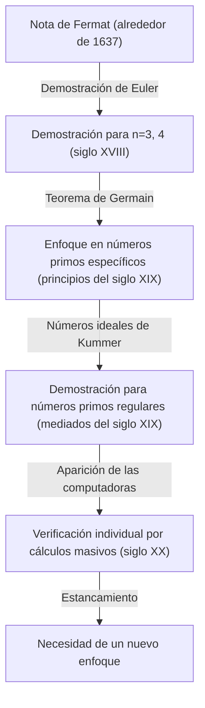
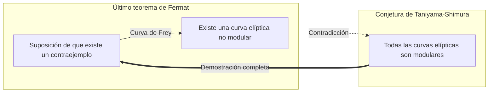

## 1. Introducción: El misterio matemático más famoso del mundo

En la historia de las matemáticas, hay un problema que ha cautivado y atormentado a más personas que cualquier otro. Ese es el **Último teorema de Fermat** (Fermat's Last Theorem). Un grandioso drama matemático de 360 años de duración comenzó con una breve nota dejada en el margen del amado libro "Aritmética" de Diofanto por Pierre de Fermat, un juez francés y matemático aficionado del siglo XVII.

El contenido del teorema en sí es tan simple que incluso un estudiante de secundaria puede entenderlo.

$$
x^n + y^n = z^n
$$

"Cuando $n$ es un número natural mayor o igual a 3, no existe un conjunto de números naturales distintos de cero $x, y, z$ que satisfagan esta ecuación."

Sin embargo, demostrar esta simple afirmación fue un camino inimaginablemente difícil para la humanidad. En este artículo, rastrearemos la historia de cómo nació este **Último teorema de Fermat**, qué matemáticos lo intentaron y cómo finalmente se demostró.

## 2. La "fascinación del diablo" dejada en los márgenes

Pierre de Fermat no era un matemático profesional. Trabajaba como juez del Parlamento de Toulouse y disfrutaba de las matemáticas en su tiempo libre. Sin embargo, su intuición y talento matemáticos estaban al más alto nivel en ese momento, y se dice que sentó las bases de la teoría de números moderna.

Fermat tenía la costumbre de escribir en los márgenes de sus libros las ideas y teoremas que se le ocurrían mientras leía. Entre las notas que dejó, la que quedó sin demostrar hasta el final fue este "último teorema". Fermat dejó las siguientes famosas palabras en el margen:

> "He descubierto una demostración verdaderamente maravillosa de esta proposición, pero este margen es demasiado estrecho para contenerla."

Estas palabras se convirtieron en un desafío para los matemáticos de generaciones posteriores. ¿Realmente tenía una demostración? La mayoría de los matemáticos modernos creen que la demostración de Fermat debe haber tenido un error en alguna parte. Esto se debe a que la demostración final requería una teoría matemática moderna muy avanzada que no existía en la época de Fermat.

## 3. Desafíos y frustraciones de los genios

Después de la muerte de Fermat, los otros teoremas que dejó fueron demostrados uno tras otro, pero solo este último teorema se mantuvo como un muro infranqueable. Muchos matemáticos intentaron probarlo para valores específicos de $n$.

- **Leonhard Euler**: El mejor matemático del siglo XVIII, Euler, logró demostrar los casos para $n = 3$ y $n = 4$ (se dice que el propio Fermat había demostrado $n = 4$).
- **Sophie Germain**: A principios del siglo XIX, la matemática Sophie Germain demostró que el teorema era válido para ciertos números primos que cumplen condiciones específicas (hoy llamados "números primos de Sophie Germain"). Este fue un gran paso hacia una demostración general.
- **Ernst Kummer**: A mediados del siglo XIX, Kummer introdujo el concepto de "números ideales" y demostró el teorema para muchos números primos, llamados números primos regulares.

Sin embargo, el objetivo de probarlo para todos los infinitos números naturales $n$ seguía estando muy lejos.

## 4. Un puente de las matemáticas modernas: La conjetura de Taniyama-Shimura

En el siglo XX, el último teorema de Fermat se vinculó con otra rama de las matemáticas que parecía completamente ajena a primera vista. Esa es la **Conjetura de Taniyama-Shimura**.

En 1955, Yutaka Taniyama y Goro Shimura, jóvenes matemáticos japoneses, hicieron una audaz conjetura: "Todas las curvas elípticas son modulares".

- **Curvas elípticas**: Curvas representadas por ecuaciones de la forma $y^2 = x^3 + ax + b$.
- **Formas modulares**: Funciones especiales con un nivel muy alto de simetría en el plano complejo.

Esta conjetura, que postula que "curvas elípticas" y "formas modulares", conceptos de campos completamente diferentes, son en realidad lo mismo, conmocionó al mundo matemático de la época.

Luego, en la década de 1980, Gerhard Frey sugirió que si existiera un contraejemplo del último teorema de Fermat (es decir, si hubiera números naturales que satisficieran $A^n + B^n = C^n$), la curva elíptica creada a partir de él, llamada **curva de Frey**, tendría propiedades anormales y **no podría ser modular**. Más tarde, Ken Ribet demostró rigurosamente esta idea de Frey.

Como resultado, si se probaba la **Conjetura de Taniyama-Shimura**, automáticamente se probaría también el **Último teorema de Fermat**.

## 5. La gloria de Andrew Wiles

Fuertemente inspirado por este desarrollo dramático estuvo **Andrew Wiles**, un matemático nacido en Gran Bretaña. Se dice que se encontró con un libro sobre el último teorema de Fermat en la biblioteca cuando tenía 10 años, lo que lo motivó a convertirse en matemático.

Wiles suspendió todas sus otras investigaciones y se encerró en su ático para intentar probar en secreto la **Conjetura de Taniyama-Shimura**. Después de 7 años de investigación solitaria, en junio de 1993, al final de una conferencia en la Universidad de Cambridge, escribió la conclusión de la demostración en la pizarra y declaró en voz baja: "Creo que me detendré aquí". El salón estalló en un atronador aplauso.

Sin embargo, el drama no terminó aquí. Durante el proceso de revisión por pares, se encontró un defecto fatal en la demostración. Wiles estuvo al borde de la desesperación, pero con la ayuda de su antiguo alumno, Richard Taylor, trabajó para corregirlo.

Después de aproximadamente un año de lucha, en septiembre de 1994, Wiles finalmente tuvo una epifanía. Al combinar un enfoque que había abandonado anteriormente con su enfoque actual, la demostración completa finalmente se terminó. En 1995, su artículo fue publicado oficialmente y el mayor misterio en el mundo matemático, que había durado 360 años, finalmente se resolvió.

## 6. Conclusión

La demostración del **Último teorema de Fermat** tiene un significado mucho más profundo que simplemente resolver un viejo problema. Los numerosos métodos y teorías matemáticas desarrollados en el proceso (por ejemplo, la teoría de Iwasawa y el método de Kolyvagin-Flach) sirven hoy como poderosas herramientas en las matemáticas modernas.

El misterio dejado en el margen de un libro por un solo matemático aficionado se convirtió en la estrella guía para los matemáticos durante siglos, empujando los límites del conocimiento humano. El último teorema de Fermat se puede decir que es un monumento eterno que simboliza la grandeza del espíritu humano, que continúa desafiando lo imposible.
