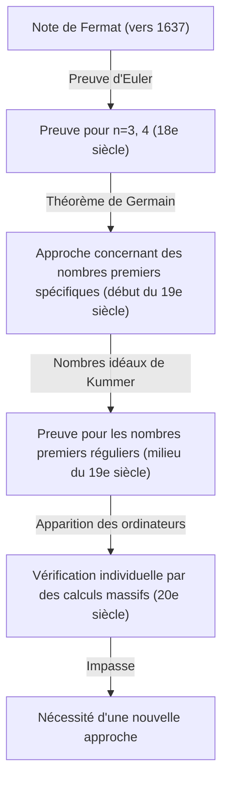
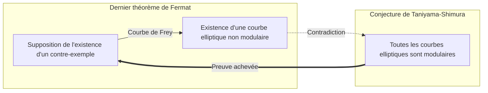

## 1. Introduction : Le mystère mathématique le plus célèbre au monde

Dans l'histoire des mathématiques, il y a un problème qui a fasciné et tourmenté le plus grand nombre de personnes. Il s'agit du **dernier théorème de [Fermat](https://kenji.blog/fr/p/fermat/)** (Fermat's Last Theorem). C'est à partir d'une courte note laissée dans la marge de son livre de chevet, l'« Arithmétique » de Diophante, par [Pierre de Fermat](https://kenji.blog/fr/p/fermat/), juge français du XVIIe siècle et mathématicien amateur, qu'a commencé un drame mathématique épique qui a duré 360 ans.

Le contenu du théorème lui-même est si simple qu'un collégien peut le comprendre.

$$
x^n + y^n = z^n
$$

« Lorsqu'un entier naturel $n$ est supérieur ou égal à 3, il n'existe aucun ensemble d'entiers naturels non nuls $x, y, z$ qui satisfasse cette équation. »

Cependant, prouver cette simple affirmation fut un parcours d'une difficulté inimaginable pour l'humanité. Dans cet article, nous retracerons l'histoire de la façon dont ce **dernier théorème de [Fermat](https://kenji.blog/fr/p/fermat/)** est né, quels mathématiciens l'ont défié, et enfin comment il a été prouvé.

## 2. La « fascination du diable » laissée dans la marge

[Pierre de Fermat](https://kenji.blog/fr/p/fermat/) n'était pas un mathématicien professionnel. Il appréciait les mathématiques pendant son temps libre, tout en travaillant comme juge au Parlement de Toulouse. Cependant, son intuition et son talent mathématiques étaient au plus haut niveau de l'époque, et il est considéré comme ayant jeté les bases de la théorie des nombres moderne.

[Fermat](https://kenji.blog/fr/p/fermat/) avait l'habitude d'écrire dans les marges de ses livres les idées et les théorèmes qui lui venaient à l'esprit pendant ses lectures. Parmi les notes qu'il a laissées, celle qui est restée non prouvée jusqu'à la fin est ce « dernier théorème ». [Fermat](https://kenji.blog/fr/p/fermat/) a laissé les célèbres mots suivants dans la marge :

> « J'ai trouvé une merveilleuse démonstration de cette proposition, mais la marge est trop étroite pour la contenir. »

Ces mots sont devenus un défi pour les mathématiciens des générations futures. Avait-il vraiment une preuve ? La plupart des mathématiciens modernes pensent qu'il devait y avoir une erreur quelque part dans la preuve que [Fermat](https://kenji.blog/fr/p/fermat/) possédait. En effet, la preuve finale nécessitait des théories mathématiques modernes très avancées qui n'existaient pas à l'époque de [Fermat](https://kenji.blog/fr/p/fermat/).

## 3. Les défis et les échecs des génies

Après la mort de [Fermat](https://kenji.blog/fr/p/fermat/), les autres théorèmes qu'il avait laissés ont été prouvés les uns après les autres, mais seul ce dernier théorème s'est dressé comme un mur. De nombreux mathématiciens ont tenté de le prouver pour des valeurs spécifiques de $n$.

- **[Leonhard Euler](https://kenji.blog/fr/p/euler/)** : Le plus grand mathématicien du XVIIIe siècle, Euler, a réussi à le prouver pour les cas $n = 3$ et $n = 4$ (on dit que [Fermat](https://kenji.blog/fr/p/fermat/) lui-même l'avait prouvé pour $n = 4$).
- **Sophie Germain** : Au début du XIXe siècle, la mathématicienne Sophie Germain a montré que le théorème était valable pour des nombres premiers satisfaisant certaines conditions (aujourd'hui appelés « nombres premiers de Sophie Germain »). Ce fut un grand pas vers une preuve générale.
- **[Ernst Kummer](https://kenji.blog/fr/p/kummer/)** : Au milieu du XIXe siècle, [Kummer](https://kenji.blog/fr/p/kummer/) a introduit le concept de « nombre idéal » et a prouvé le théorème pour de nombreux nombres premiers appelés nombres premiers réguliers.

Cependant, l'objectif de le prouver pour tous les entiers naturels $n$, qui sont infinis, restait encore hors de portée.

## 4. Le pont des mathématiques modernes : La conjecture de Taniyama-Shimura

Au XXe siècle, le dernier théorème de [Fermat](https://kenji.blog/fr/p/fermat/) allait se lier à un autre domaine des mathématiques qui semblait n'avoir aucun rapport. Il s'agit de la **conjecture de Taniyama-Shimura**.

En 1955, [Yutaka Taniyama](https://kenji.blog/fr/p/taniyama-yutaka/) et [Goro Shimura](https://kenji.blog/fr/p/shimura-goro/), de jeunes mathématiciens japonais, ont émis la conjecture audacieuse que « toutes les courbes elliptiques sont modulaires ».

- **Courbe elliptique** : Une courbe représentée par une équation de la forme $y^2 = x^3 + ax + b$.
- **Forme modulaire** : Une fonction spéciale possédant une symétrie extrêmement élevée sur le plan complexe.

Cette conjecture affirmant que la « courbe elliptique » et la « forme modulaire », des concepts de domaines complètement différents, sont en réalité la même chose, a choqué la communauté mathématique de l'époque.

Puis, dans les années 1980, Gerhard Frey a suggéré que s'il existait un contre-exemple au dernier théorème de [Fermat](https://kenji.blog/fr/p/fermat/) (c'est-à-dire s'il existait des entiers naturels satisfaisant $A^n + B^n = C^n$), alors la courbe elliptique créée à partir de celui-ci, appelée **courbe de Frey**, aurait des propriétés anormales et **ne pourrait pas être modulaire**. Plus tard, Ken Ribet a rigoureusement prouvé cette idée de Frey.

De ce fait, prouver la **conjecture de Taniyama-Shimura** prouverait automatiquement le **dernier théorème de [Fermat](https://kenji.blog/fr/p/fermat/)**.

## 5. La gloire d'[Andrew Wiles](https://kenji.blog/fr/p/wiles/)

Celui qui a été fortement stimulé par ce développement dramatique était le mathématicien d'origine britannique **[Andrew Wiles](https://kenji.blog/fr/p/wiles/)**. Il avait découvert un livre sur le dernier théorème de [Fermat](https://kenji.blog/fr/p/fermat/) dans une bibliothèque à l'âge de 10 ans et avait alors décidé de devenir mathématicien.

Wiles a interrompu toutes ses autres recherches et s'est enfermé dans son grenier pour s'attaquer secrètement à la preuve de la **conjecture de Taniyama-Shimura**. Après 7 ans de recherche solitaire, en juin 1993, à la fin d'une conférence à l'Université de Cambridge, il a écrit la conclusion de sa preuve au tableau noir et a déclaré calmement : « Je pense que je vais m'arrêter ici. » La salle a été envahie par un tonnerre d'applaudissements.

Cependant, le drame ne s'arrête pas là. Au cours du processus d'évaluation par les pairs, une faille fatale a été découverte dans la preuve. Wiles s'est retrouvé au bord du désespoir, mais avec l'aide de son ancien étudiant Richard Taylor, il s'est attelé au travail de correction.

Après environ un an de lutte acharnée, en septembre 1994, Wiles a enfin eu une illumination. En combinant une approche qu'il avait précédemment abandonnée avec son approche actuelle, la preuve complète était enfin achevée. En 1995, son article a été officiellement publié, et le plus grand mystère du monde mathématique, vieux de 360 ans, a enfin été résolu.

## 6. Conclusion

La preuve du **dernier théorème de [Fermat](https://kenji.blog/fr/p/fermat/)** a une signification bien plus grande que la simple résolution d'un vieux problème. Les nombreuses méthodes et théories mathématiques développées au cours de ce processus (telles que la théorie d'Iwasawa et la méthode de Kolyvagin-Flach) fonctionnent aujourd'hui comme des outils puissants pour les mathématiques modernes.

Le mystère laissé dans la marge d'un livre par un mathématicien amateur est devenu une étoile qui a guidé les mathématiciens pendant des siècles et repoussé les limites de la connaissance humaine. [Le dernier théorème de Fermat](https://kenji.blog/fr/p/fermats-last-theorem/) peut être considéré comme un monument éternel symbolisant la grandeur de l'esprit humain qui continue de défier l'impossible.
