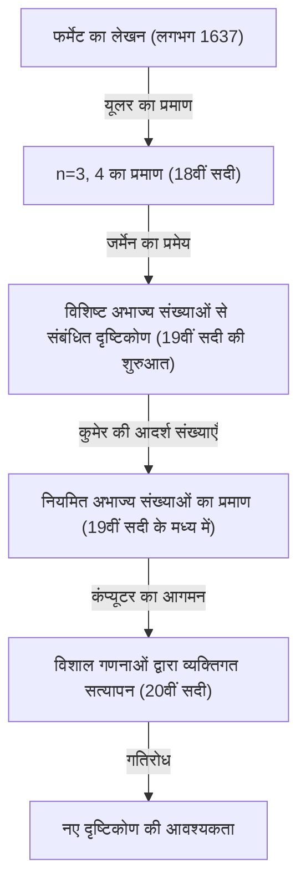
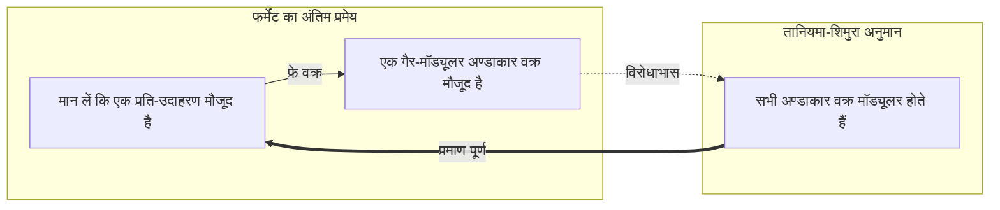

## 1. प्रस्तावना: दुनिया का सबसे प्रसिद्ध गणितीय रहस्य

गणित के इतिहास में, एक ऐसी समस्या है जिसने सबसे अधिक लोगों को आकर्षित किया है और साथ ही पीड़ित भी किया है। वह है **[फर्मेट का अंतिम प्रमेय](https://kenji.blog/hi/p/fermats-last-theorem/)** (Fermat's Last Theorem)। 17वीं सदी के फ्रांसीसी न्यायाधीश और शौकिया गणितज्ञ पियरे डी फर्मेट ने अपनी पसंदीदा पुस्तक, [डायोफैंटस](https://kenji.blog/hi/p/diophantus/) की 'अरिथमेटिका' के हाशिये में एक छोटा सा नोट छोड़ा था, जिससे 360 वर्षों के एक महाकाव्य गणितीय नाटक की शुरुआत हुई।

प्रमेय की सामग्री इतनी सरल है कि एक मिडिल स्कूल का छात्र भी इसे समझ सकता है।

$$
x^n + y^n = z^n
$$

"जब $n$ 3 या उससे बड़ी एक प्राकृत संख्या है, तो 0 के अलावा प्राकृत संख्याओं $x, y, z$ का कोई ऐसा सेट मौजूद नहीं है जो इस समीकरण को संतुष्ट करता हो।"

हालाँकि, इस सरल दावे को सिद्ध करना मानवता के लिए अकल्पनीय रूप से कठिन यात्रा थी। इस लेख में, हम इस बात का इतिहास खोजेंगे कि यह **[फर्मेट का अंतिम प्रमेय](https://kenji.blog/hi/p/fermats-last-theorem/)** कैसे उत्पन्न हुआ, किन गणितज्ञों ने इसे चुनौती दी, और अंततः इसे कैसे सिद्ध किया गया।

## 2. हाशिये में छोड़ा गया "शैतान का आकर्षण"

पियरे डी फर्मेट पेशेवर गणितज्ञ नहीं थे। उन्होंने टूलूज़ के उच्च न्यायालय में एक न्यायाधीश के रूप में काम किया और अपने खाली समय में गणित का आनंद लिया। हालाँकि, उनका गणितीय अंतर्ज्ञान और प्रतिभा उस समय के उच्चतम स्तर पर थी, और कहा जाता है कि उन्होंने आधुनिक संख्या सिद्धांत की नींव रखी थी।

फर्मेट की आदत थी कि वे पढ़ते समय जो भी विचार या प्रमेय सोचते, उन्हें किताबों के हाशिये में लिख देते थे। उन्होंने जो नोट्स छोड़े थे, उनमें से केवल यह "अंतिम प्रमेय" ही था जो अंत तक बिना सिद्ध हुए रह गया। फर्मेट ने हाशिये में निम्नलिखित प्रसिद्ध शब्द छोड़े:

> "मेरे पास इस प्रस्ताव का वास्तव में एक अद्भुत प्रमाण है, लेकिन हाशिया इतना छोटा है कि इसे यहाँ नहीं लिखा जा सकता।"

ये शब्द भविष्य के गणितज्ञों के लिए एक चुनौती बन गए। क्या उनके पास वास्तव में प्रमाण था? आधुनिक गणितज्ञों का अधिकांश हिस्सा मानता है कि फर्मेट के प्रमाण में कहीं न कहीं गलती रही होगी। इसका कारण यह है कि अंतिम प्रमाण के लिए आधुनिक गणित के ऐसे उन्नत सिद्धांतों की आवश्यकता थी जो फर्मेट के समय में मौजूद ही नहीं थे।

## 3. प्रतिभाओं की चुनौती और विफलता

फर्मेट की मृत्यु के बाद, उनके द्वारा छोड़े गए अन्य प्रमेयों को एक-एक करके सिद्ध किया गया, लेकिन केवल यह अंतिम प्रमेय एक दीवार की तरह खड़ा रहा। कई गणितज्ञों ने विशिष्ट $n$ के लिए इसे सिद्ध करने का प्रयास किया।

- **[लियोनहार्ड यूलर](https://kenji.blog/hi/p/euler/)** : 18वीं सदी के सबसे महान गणितज्ञ यूलर ने $n = 3$ और $n = 4$ के मामलों के लिए प्रमाण में सफलता प्राप्त की (कहा जाता है कि $n = 4$ को फर्मेट ने खुद सिद्ध किया था)।
- **सोफी जर्मेन** : 19वीं सदी की शुरुआत में, महिला गणितज्ञ सोफी जर्मेन ने दिखाया कि प्रमेय कुछ विशेष शर्तों को पूरा करने वाली अभाज्य संख्याओं (जिन्हें आज "सोफी जर्मेन अभाज्य संख्याएँ" कहा जाता है) के लिए सत्य है। यह सामान्य प्रमाण की दिशा में एक बड़ा कदम था।
- **अर्नस्ट कुमेर** : 19वीं सदी के मध्य में, कुमेर ने "आदर्श संख्या" की अवधारणा पेश की और कई अभाज्य संख्याओं के लिए प्रमेय को सिद्ध किया जिन्हें नियमित अभाज्य कहा जाता है।

हालाँकि, अनंत सभी प्राकृत संख्याओं $n$ के लिए इसे सिद्ध करने का लक्ष्य अभी भी दूर था।

## 4. आधुनिक गणित का पुल: तानियमा-शिमुरा अनुमान

20वीं सदी में, [फर्मेट का अंतिम प्रमेय](https://kenji.blog/hi/p/fermats-last-theorem/) गणित के एक अन्य क्षेत्र से जुड़ गया जो पहली नज़र में पूरी तरह से असंबंधित प्रतीत होता था। वह था **तानियमा-शिमुरा अनुमान**।

1955 में, युवा जापानी गणितज्ञों युताका तानियमा और [गोरो शिमुरा](https://kenji.blog/hi/p/shimura-goro/) ने एक साहसिक अनुमान लगाया कि "सभी अण्डाकार वक्र मॉड्यूलर होते हैं।"

- **अण्डाकार वक्र** : $y^2 = x^3 + ax + b$ के रूप वाले समीकरण द्वारा दर्शाए गए वक्र।
- **मॉड्यूलर रूप** : जटिल तल पर अत्यधिक उच्च समरूपता वाले विशेष कार्य।

इस अनुमान ने कि "अण्डाकार वक्र" और "मॉड्यूलर रूप", जो पूरी तरह से अलग क्षेत्रों की अवधारणाएं हैं, वास्तव में एक ही हैं, उस समय गणितीय दुनिया को चौंका दिया।

फिर, 1980 के दशक में, गेरहार्ड फ्रे ने सुझाव दिया कि यदि फर्मेट के अंतिम प्रमेय का कोई प्रति-उदाहरण मौजूद है (यानी, प्राकृत संख्याएँ जो $A^n + B^n = C^n$ को संतुष्ट करती हैं), तो उससे बनाया गया **फ्रे वक्र** नामक अण्डाकार वक्र में असामान्य गुण होंगे और वह **मॉड्यूलर नहीं हो सकता**। बाद में, केन रिबेट ने फ्रे के इस विचार को सख्ती से सिद्ध किया।

नतीजतन, यदि **तानियमा-शिमुरा अनुमान** सिद्ध हो जाता है, तो **[फर्मेट का अंतिम प्रमेय](https://kenji.blog/hi/p/fermats-last-theorem/)** स्वतः ही सिद्ध हो जाएगा।

## 5. [एंड्रयू विल्स](https://kenji.blog/hi/p/wiles/) की महिमा

इस नाटकीय विकास से ब्रिटिश गणितज्ञ **[एंड्रयू विल्स](https://kenji.blog/hi/p/wiles/)** बहुत प्रेरित हुए। वह एक ऐसे व्यक्ति हैं जिन्होंने 10 साल की उम्र में पुस्तकालय में फर्मेट के अंतिम प्रमेय पर एक किताब पढ़ी थी और गणितज्ञ बनने का फैसला किया था।

विल्स ने अपने सभी अन्य शोध रोक दिए और चुपके से अपने अटारी में छिपकर **तानियमा-शिमुरा अनुमान** को सिद्ध करने का प्रयास किया। 7 वर्षों के एकांत शोध के बाद, जून 1993 में, कैम्ब्रिज विश्वविद्यालय में एक व्याख्यान के अंत में, उन्होंने ब्लैकबोर्ड पर अपने प्रमाण का निष्कर्ष लिखा और शांति से घोषणा की, "मुझे लगता है कि मैं यहीं रुकूँगा।" सभागार तालियों की गड़गड़ाहट से गूंज उठा।

लेकिन, नाटक यहाँ समाप्त नहीं होता है। सहकर्मी-समीक्षा की प्रक्रिया के दौरान, प्रमाण में एक घातक खामी पाई गई। विल्स निराशा के कगार पर थे, लेकिन उन्होंने अपने पूर्व छात्र रिचर्ड टेलर की मदद से इसे सुधारने पर काम किया।

लगभग 1 साल के संघर्ष के बाद, सितंबर 1994 में, विल्स को अंततः प्रेरणा मिली। एक बार छोड़े गए दृष्टिकोण और वर्तमान दृष्टिकोण को मिलाकर, अंततः एक पूर्ण प्रमाण तैयार किया गया। 1995 में, उनका पेपर आधिकारिक तौर पर प्रकाशित हुआ, और 360 वर्षों तक गणितीय दुनिया का सबसे बड़ा रहस्य अंततः सुलझ गया।

## 6. निष्कर्ष

**[फर्मेट का अंतिम प्रमेय](https://kenji.blog/hi/p/fermats-last-theorem/)** का प्रमाण केवल एक पुरानी समस्या के समाधान से कहीं अधिक अर्थ रखता है। इस प्रक्रिया में विकसित कई गणितीय विधियाँ और सिद्धांत (जैसे, इवासावा सिद्धांत और कोल्यवागिन-फ्लैच विधि) आधुनिक गणित के शक्तिशाली उपकरणों के रूप में कार्य करते हैं।

एक शौकिया गणितज्ञ द्वारा किताब के हाशिये में छोड़ा गया रहस्य, सदियों तक गणितज्ञों का मार्गदर्शन करने वाला तारा बन गया, जिसने मानवीय ज्ञान की सीमाओं को आगे बढ़ाया। फर्मेट के अंतिम प्रमेय को असंभव को चुनौती देने वाली मानवीय भावना की महानता का प्रतीक एक शाश्वत स्मारक कहा जा सकता है。
