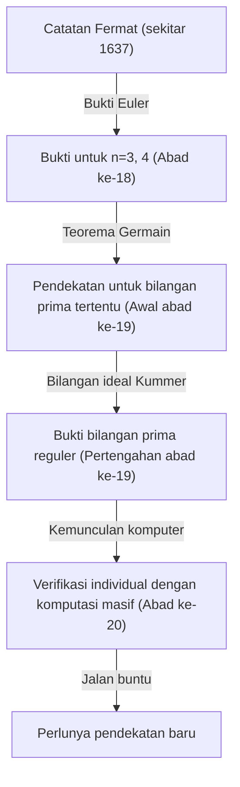
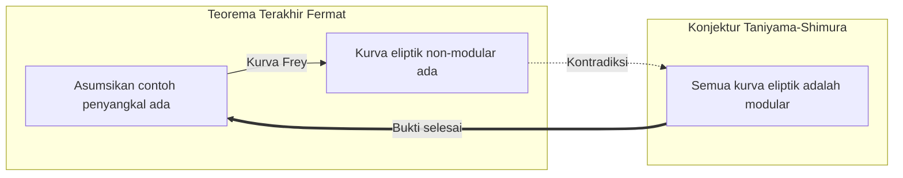

## 1. Pendahuluan: Misteri Matematika Paling Terkenal di Dunia

Dalam sejarah matematika, ada sebuah masalah yang telah memikat dan menyiksa paling banyak orang. Itulah **Teorema Terakhir Fermat** (Fermat's Last Theorem). Dari sebuah catatan singkat yang ditinggalkan di margin buku favoritnya, "Arithmetica" karya Diophantus, oleh hakim Prancis abad ke-17 dan matematikawan amatir Pierre de Fermat, dimulailah drama matematika epik selama 360 tahun.

Isi teoremanya sendiri sangat sederhana sehingga bahkan siswa sekolah menengah pertama pun dapat memahaminya.

$$
x^n + y^n = z^n
$$

"Ketika $n$ adalah bilangan asli lebih besar dari atau sama dengan 3, tidak ada himpunan bilangan asli tak nol $x, y, z$ yang memenuhi persamaan ini."

Namun, membuktikan klaim sederhana ini adalah perjalanan yang sangat sulit bagi umat manusia, yang melampaui imajinasi. Dalam artikel ini, kita akan menelusuri sejarah bagaimana **Teorema Terakhir Fermat** ini lahir, matematikawan macam apa yang menantangnya, dan bagaimana akhirnya dibuktikan.

## 2. "Pesona Iblis" yang Tertinggal di Margin

Pierre de Fermat bukanlah matematikawan profesional. Ia menikmati matematika di waktu luangnya sambil bekerja sebagai hakim di pengadilan tinggi Toulouse. Namun, intuisi dan bakat matematikanya berada pada level tertinggi pada saat itu, dan ia dianggap telah meletakkan dasar bagi teori bilangan modern.

Fermat memiliki kebiasaan menuliskan ide dan teorema yang ia pikirkan saat membaca di margin buku. Di antara catatan yang ia tinggalkan, "Teorema Terakhir" ini adalah yang dibiarkan tak terbuktikan hingga akhir. Fermat meninggalkan ungkapan terkenal berikut di margin:

> "Saya memiliki bukti yang benar-benar menakjubkan untuk proposisi ini, tetapi marginnya terlalu sempit untuk menuliskannya di sini"

Kata-kata ini menjadi surat tantangan bagi para matematikawan di generasi berikutnya. Apakah dia benar-benar memiliki buktinya? Sebagian besar matematikawan modern percaya bahwa pasti ada kesalahan dalam bukti yang dimiliki Fermat. Alasannya adalah bahwa bukti akhir memerlukan teori matematika modern tingkat lanjut yang belum ada pada masa Fermat.

## 3. Tantangan dan Kegagalan Para Jenius

Setelah kematian Fermat, teorema-teorema lain yang ia tinggalkan dibuktikan satu per satu, tetapi Teorema Terakhir ini berdiri sebagai tembok penghalang. Banyak matematikawan mencoba membuktikannya untuk $n$ tertentu.

- **Leonhard Euler**: Matematikawan terbesar abad ke-18, Euler, berhasil membuktikan kasus $n = 3$ dan $n = 4$ (dikatakan bahwa Fermat sendiri yang membuktikan $n = 4$).
- **Sophie Germain**: Pada awal abad ke-19, matematikawan wanita Sophie Germain menunjukkan bahwa teorema tersebut berlaku untuk bilangan prima yang memenuhi kondisi tertentu (sekarang disebut "Bilangan Prima Sophie Germain"). Ini adalah langkah besar menuju bukti umum.
- **Ernst Kummer**: Pada pertengahan abad ke-19, Kummer memperkenalkan konsep "bilangan ideal" dan membuktikan teorema untuk banyak bilangan prima yang disebut bilangan prima reguler.

Namun, tujuan untuk membuktikan semua bilangan asli $n$ yang tak terhingga masih jauh dari jangkauan.

## 4. Jembatan Matematika Modern: Konjektur Taniyama-Shimura

Memasuki abad ke-20, Teorema Terakhir Fermat akan dikaitkan dengan bidang matematika lain yang tampaknya sama sekali tidak berhubungan. Itulah **Konjektur Taniyama-Shimura**.

Pada tahun 1955, matematikawan muda Jepang Yutaka Taniyama dan Goro Shimura membuat dugaan yang berani bahwa "semua kurva eliptik adalah modular."

- **Kurva eliptik**: Kurva yang direpresentasikan oleh persamaan bentuk seperti $y^2 = x^3 + ax + b$.
- **Bentuk modular**: Fungsi khusus yang memiliki simetri sangat tinggi pada bidang kompleks.

Dugaan bahwa "kurva eliptik" dan "bentuk modular", konsep dari bidang yang sama sekali berbeda, sebenarnya sama, mengejutkan dunia matematika pada saat itu.

Kemudian pada tahun 1980-an, Gerhard Frey menyarankan bahwa jika ada contoh penyangkal dari Teorema Terakhir Fermat (yaitu, ada bilangan asli yang memenuhi $A^n + B^n = C^n$), maka kurva eliptik yang dibuat darinya, yang disebut **kurva Frey**, akan memiliki sifat abnormal dan **tidak bisa menjadi modular**. Setelah itu, Ken Ribet dengan ketat membuktikan ide Frey ini.

Dengan ini, membuktikan **Konjektur Taniyama-Shimura** akan secara otomatis membuktikan **Teorema Terakhir Fermat**.

## 5. Kejayaan Andrew Wiles

Matematikawan Inggris **Andrew Wiles** sangat terinspirasi oleh perkembangan dramatis ini. Ia adalah orang yang bercita-cita menjadi matematikawan setelah menemukan buku tentang Teorema Terakhir Fermat di perpustakaan ketika ia berusia 10 tahun.

Wiles menghentikan semua penelitian lainnya dan mengurung diri di loteng untuk secara rahasia mencoba membuktikan **Konjektur Taniyama-Shimura**. Setelah 7 tahun penelitian sendirian, pada Juni 1993, di akhir kuliahnya di Universitas Cambridge, ia menuliskan kesimpulan buktinya di papan tulis dan dengan tenang menyatakan, "Saya ingin berhenti di sini." Aula diliputi oleh tepuk tangan meriah.

Namun, dramanya tidak berakhir di sini. Selama proses tinjauan sejawat, cacat fatal ditemukan dalam buktinya. Wiles berada di ambang keputusasaan, tetapi dengan bantuan mantan muridnya Richard Taylor, ia mulai bekerja untuk memperbaikinya.

Setelah sekitar setahun berjuang keras, pada September 1994, Wiles akhirnya mendapatkan inspirasi. Dengan menggabungkan pendekatan yang pernah ditinggalkannya dengan pendekatan saat ini, bukti lengkapnya akhirnya selesai. Pada tahun 1995, makalahnya secara resmi diterbitkan, dan misteri terbesar dunia matematika selama 360 tahun akhirnya terpecahkan.

## 6. Penutup

Bukti **Teorema Terakhir Fermat** memiliki arti lebih dari sekadar pemecahan satu masalah lama. Banyak metode dan teori matematika yang dikembangkan dalam proses tersebut (seperti teori Iwasawa dan metode Kolyvagin-Flach) berfungsi sebagai alat yang ampuh dalam matematika modern.

Misteri yang ditinggalkan oleh seorang matematikawan amatir di margin sebuah buku telah menjadi bintang penunjuk arah bagi para matematikawan selama berabad-abad dan memperluas batas pengetahuan manusia. Teorema Terakhir Fermat dapat dikatakan sebagai monumen abadi yang melambangkan kebesaran jiwa manusia yang terus menantang hal yang tidak mungkin.
