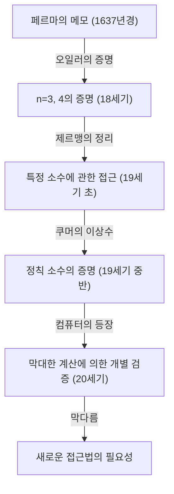
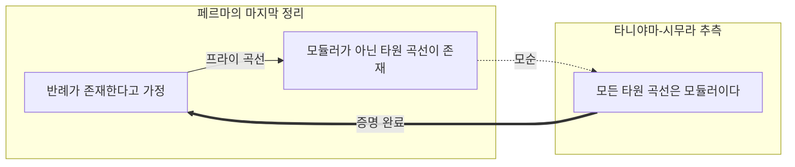

## 1. 시작하며: 세계에서 가장 유명한 수학의 수수께끼

수학의 역사에서 가장 많은 사람들을 매료시키고 또 괴롭혀온 문제가 있습니다. 그것이 바로 **[페르마의 마지막 정리](https://kenji.blog/ko/p/fermats-last-theorem/)** (Fermat's Last Theorem)입니다. 17세기 프랑스의 판사이자 아마추어 수학자였던 피에르 드 페르마가 애독서였던 [디오판토스](https://kenji.blog/ko/p/diophantus/)의 『산술』의 여백에 남긴 짧은 메모에서 360년에 이르는 장대한 수학적 드라마가 시작되었습니다.

정리의 내용 자체는 중학생도 이해할 수 있을 정도로 간단합니다.

$$
x^n + y^n = z^n
$$

「 $n$ 이 3 이상의 자연수일 때, 이 방정식을 만족하는 0 이 아닌 자연수 $x, y, z$ 의 쌍은 존재하지 않는다.」

그러나 이 간단한 주장을 증명하는 것은 인류에게 상상을 초월하는 험난한 여정이었습니다. 본 기사에서는 이 **[페르마의 마지막 정리](https://kenji.blog/ko/p/fermats-last-theorem/)** 가 어떻게 생겨났고, 어떤 수학자들이 도전했으며, 마침내 어떻게 증명되었는지 그 역사를 되짚어 봅니다.

## 2. 여백에 남겨진「악마의 유혹」

[피에르 드 페르마](https://kenji.blog/ko/p/fermat/)는 프로 수학자가 아니었습니다. 그는 툴루즈 고등법원의 판사로 일하면서 여가 시간에 수학을 즐겼습니다. 그러나 그의 수학적 직관과 재능은 당시 최고 수준이었으며, 현대 정수론의 기초를 다졌다고 평가받습니다.

페르마는 독서 중에 떠오른 아이디어나 정리를 책의 여백에 적어두는 버릇이 있었습니다. 그가 남긴 메모 중에서 마지막까지 증명되지 않고 남아있던 것이 바로 이「마지막 정리」입니다. 페르마는 다음과 같은 유명한 말을 여백에 남겼습니다.

> 「나는 이 명제의 진정으로 놀라운 증명을 가지고 있지만, 여백이 너무 좁아서 여기에 적을 수는 없다」

이 말이 후세의 수학자들에게 보내는 도전장이 되었습니다. 정말로 그는 증명을 가지고 있었을까요? 현대 수학자들의 대부분은 페르마가 가졌던 증명 어딘가에 오류가 있었을 것이라고 생각합니다. 왜냐하면 최종적인 증명에는 페르마 시대에는 존재하지 않았던 고도의 현대 수학 이론이 필수 불가결했기 때문입니다.

## 3. 천재들의 도전과 좌절

페르마의 사후, 그가 남긴 다른 정리들은 차례차례 증명되어 갔지만, 이 마지막 정리만은 벽으로 앞을 가로막았습니다. 많은 수학자들이 특정한 $n$ 에 대해 증명을 시도했습니다.

- **[레온하르트 오일러](https://kenji.blog/ko/p/euler/)** : 18세기 최고의 수학자 오일러는 $n = 3$ 및 $n = 4$ 인 경우의 증명에 성공했습니다( $n = 4$ 는 페르마 자신이 증명했다는 설도 있습니다).
- **소피 제르맹** : 19세기 초, 여성 수학자 소피 제르맹은 특정 조건을 만족하는 소수(오늘날 '소피 제르맹 소수'라 불림)에 대해 정리가 성립함을 보여주었습니다. 이는 일반적인 증명을 향한 큰 진전이었습니다.
- **에른스트 쿠머** : 19세기 중반, 쿠머는「이상수」라는 개념을 도입하여, 정칙 소수라 불리는 많은 소수들에 대해 정리를 증명했습니다.

하지만 무한히 많은 모든 자연수 $n$ 에 대해 증명한다는 목표에는 여전히 한참 미치지 못했습니다.

## 4. 현대 수학의 가교: 타니야마-시무라 추측

20세기에 들어서며, [페르마의 마지막 정리](https://kenji.blog/ko/p/fermats-last-theorem/)는 언뜻 보기에 전혀 관계없는 다른 수학 분야와 연결되게 됩니다. 그것이 **타니야마-시무라 추측** 입니다.

1955년, 일본의 젊은 수학자인 [타니야마 유타카](https://kenji.blog/ko/p/taniyama-yutaka/)와 [시무라 고로](https://kenji.blog/ko/p/shimura-goro/)는「모든 타원 곡선은 모듈러이다」라는 대담한 추측을 세웠습니다.

- **타원 곡선** : $y^2 = x^3 + ax + b$ 와 같은 형태의 방정식으로 표현되는 곡선.
- **모듈러 형식** : 복소평면 위에서 매우 높은 대칭성을 가지는 특수한 함수.

전혀 다른 분야의 개념인「타원 곡선」과「모듈러 형식」이 사실은 같은 것이라는 이 추측은 당시 수학계에 충격을 주었습니다.

그리고 1980년대, 게르하르트 프라이가 만약 [페르마의 마지막 정리](https://kenji.blog/ko/p/fermats-last-theorem/)에 반례가 존재한다면(즉 $A^n + B^n = C^n$ 을 만족하는 자연수가 있다면), 그로부터 만들어지는 **프라이 곡선** 이라 불리는 타원 곡선은 이상한 성질을 가지며 **모듈러가 될 수 없다** 고 시사했습니다. 이후 켄 리벳이 이 프라이의 아이디어를 엄밀하게 증명했습니다.

이로써 **타니야마-시무라 추측** 을 증명하면 자동으로 **[페르마의 마지막 정리](https://kenji.blog/ko/p/fermats-last-theorem/)** 도 증명되는 결과가 되었습니다.

## 5. 앤드루 와일스의 영광

이 극적인 전개에 강한 자극을 받은 사람이 영국 출신의 수학자 **앤드루 와일스** 였습니다. 그는 10살 무렵 도서관에서 [페르마의 마지막 정리](https://kenji.blog/ko/p/fermats-last-theorem/) 책을 만나고 수학자를 지망하게 된 인물입니다.

와일스는 다른 모든 연구를 중단하고 다락방에 틀어박혀 비밀리에 **타니야마-시무라 추측** 의 증명에 도전했습니다. 7년간의 고독한 연구 끝에, 1993년 6월 케임브리지 대학에서의 강연 마지막에 그는 칠판에 증명의 결론을 적으며「여기서 끝마치고 싶습니다」라고 조용히 선언했습니다. 회장은 우레와 같은 박수에 휩싸였습니다.

하지만 드라마는 여기서 끝나지 않습니다. 피어 리뷰(동료 심사) 과정에서 증명에 치명적인 결함이 발견된 것입니다. 와일스는 절망의 늪에 빠졌지만, 과거의 제자인 리처드 테일러의 도움을 받아 수정 작업에 몰두했습니다.

약 1년간의 고투 끝에 1994년 9월, 와일스는 마침내 번뜩이는 영감을 얻습니다. 과거에 포기했던 접근법과 현재의 접근법을 결합함으로써 마침내 완전한 증명이 완성된 것입니다. 1995년 그의 논문은 정식으로 출판되었고, 360년에 걸친 수학계 최대의 수수께끼는 마침내 해결되었습니다.

## 6. 마치며

**[페르마의 마지막 정리](https://kenji.blog/ko/p/fermats-last-theorem/)** 의 증명은 단순히 하나의 오래된 문제가 풀렸다는 것 이상의 의미를 지닙니다. 그 과정에서 발전한 수많은 수학적 기법과 이론(예를 들어 이와사와 이론이나 콜리바긴-플라흐 방법 등)은 현대 수학의 강력한 도구로 기능하고 있습니다.

한 명의 아마추어 수학자가 책의 여백에 남긴 수수께끼는 수 세기에 걸쳐 수학자들을 이끄는 별이 되었고, 인류의 지적 한계를 넓혔습니다. [페르마의 마지막 정리](https://kenji.blog/ko/p/fermats-last-theorem/)는 불가능에 끊임없이 도전하는 인간 정신의 위대함을 상징하는 영원한 기념비라 할 수 있을 것입니다.
