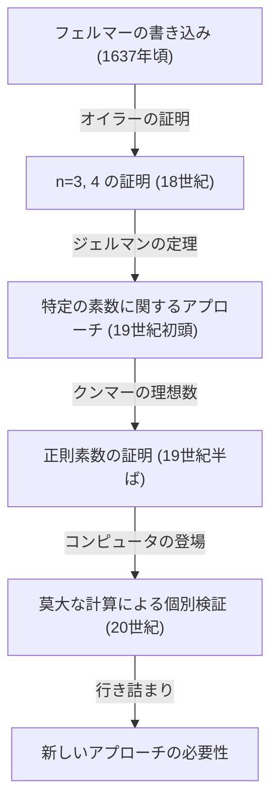
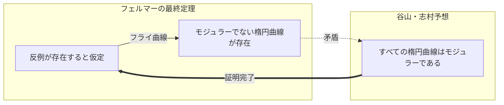

## 1. はじめに：世界で最も有名な数学の謎

数学の歴史において、最も多くの人々を魅了し、そして苦しめてきた問題があります。それが **[フェルマーの最終定理](https://kenji.blog/p/fermats-last-theorem/)** （Fermat's Last Theorem）です。17世紀のフランスの裁判官であり、アマチュア数学者であった[ピエール・ド・フェルマー](/p/fermat/)が、愛読書であった[ディオファントス](https://kenji.blog/p/diophantus/)の『算術』の余白に書き残した短いメモから、360年にも及ぶ壮大な数学的ドラマが始まりました。

定理の内容自体は、中学生でも理解できるほどシンプルです。

$$
x^n + y^n = z^n
$$

「 $n$ が3以上の自然数であるとき、この方程式を満たす 0 でない自然数 $x, y, z$ の組は存在しない。」

しかし、このシンプルな主張を証明することは、人類にとって想像を絶する困難な道程でした。本記事では、この **[フェルマーの最終定理](https://kenji.blog/p/fermats-last-theorem/)** がどのように生まれ、どのような数学者たちが挑み、そして最終的にどのようにして証明されたのか、その歴史を辿ります。

## 2. 余白に書き残された「悪魔の魅惑」

[ピエール・ド・フェルマー](https://kenji.blog/p/fermat/)は、プロの数学者ではありませんでした。彼はトゥールーズの高等法院の裁判官として働きながら、余暇に数学を楽しんでいました。しかし、その数学的直感と才能は当時の最高レベルにあり、現代の数論の基礎を築いたとされています。

[フェルマー](https://kenji.blog/p/fermat/)は、読書中に思いついたアイデアや定理を本の余白に書き込む癖がありました。彼が残した書き込みの中で、最後まで証明されずに残ったのが、この「最終定理」です。[フェルマー](https://kenji.blog/p/fermat/)は次のような有名な言葉を余白に書き残しました。

> 「私はこの命題の真に驚くべき証明をもっているが、余白が狭すぎるのでここに記すことはできない」

この言葉が、後世の数学者たちへの挑戦状となりました。本当に彼は証明を持っていたのでしょうか？ 現代の数学者たちの多くは、[フェルマー](https://kenji.blog/p/fermat/)の持っていた証明にはどこかに誤りがあっただろうと考えています。なぜなら、最終的な証明には、[フェルマー](https://kenji.blog/p/fermat/)の時代には存在しなかった高度な現代数学の理論が必要不可欠だったからです。

## 3. 天才たちの挑戦と挫折

[フェルマー](https://kenji.blog/p/fermat/)の死後、彼が残した他の定理は次々と証明されていきましたが、この最終定理だけは壁として立ちはだかりました。多くの数学者が特定の $n$ について証明を試みました。

- **レオンハルト・[オイラー](https://kenji.blog/p/euler/)** ：18世紀最大の数学者オイラーは、 $n = 3$ および $n = 4$ の場合の証明に成功しました（ $n = 4$ は[フェルマー](https://kenji.blog/p/fermat/)自身が証明していたとも言われます）。
- **ソフィー・ジェルマン** ：19世紀初頭、女性数学者ソフィー・ジェルマンは、特定の条件を満たす素数（今日「ソフィー・ジェルマン素数」と呼ばれる）について、定理が成り立つことを示しました。これは一般的な証明への大きな一歩でした。
- **[エルンスト・クンマー](https://kenji.blog/p/kummer/)** ：19世紀半ば、[クンマー](https://kenji.blog/p/kummer/)は「理想数」という概念を導入し、正則素数と呼ばれる多くの素数について定理を証明しました。

しかし、無限にあるすべての自然数 $n$ について証明するという目標には、依然として遠く及びませんでした。

## 4. 現代数学の架け橋：谷山・志村予想

20世紀に入り、[フェルマーの最終定理](https://kenji.blog/p/fermats-last-theorem/)は、一見全く関係のない別の数学の分野と結びつくことになります。それが **谷山・志村予想** です。

1955年、日本の若い数学者である[谷山豊](https://kenji.blog/p/taniyama-yutaka/)と[志村五郎](https://kenji.blog/p/shimura-goro/)は、「すべての楕円曲線はモジュラーである」という大胆な予想を立てました。

- **楕円曲線** ： $y^2 = x^3 + ax + b$ のような形の方程式で表される曲線。
- **モジュラー形式** ：複素平面上で非常に高い対称性を持つ特殊な関数。

全く異なる分野の概念である「楕円曲線」と「モジュラー形式」が実は同じものであるというこの予想は、当時の数学界に衝撃を与えました。

そして1980年代、ゲルハルト・フライが、もし[フェルマーの最終定理](https://kenji.blog/p/fermats-last-theorem/)に反例が存在する（つまり $A^n + B^n = C^n$ を満たす自然数がある）ならば、そこから作られる **フライ曲線** と呼ばれる楕円曲線は異常な性質を持ち、 **モジュラーにはなり得ない** ことを示唆しました。その後、ケン・リベットがこのフライのアイデアを厳密に証明しました。

これにより、 **谷山・志村予想** を証明すれば、自動的に **[フェルマーの最終定理](https://kenji.blog/p/fermats-last-theorem/)** も証明されることになったのです。

## 5. [アンドリュー・ワイルズ](https://kenji.blog/p/wiles/)の栄光

この劇的な展開に強い刺激を受けたのが、イギリス出身の数学者 **[アンドリュー・ワイルズ](https://kenji.blog/p/wiles/)** でした。彼は10歳の頃に図書館で[フェルマーの最終定理](https://kenji.blog/p/fermats-last-theorem/)の本に出会い、数学者を志したという人物です。

[ワイルズ](https://kenji.blog/p/wiles/)は、他のすべての研究を中断し、屋根裏部屋にこもって秘密裏に **谷山・志村予想** の証明に挑みました。7年間の孤独な研究の末、1993年6月、ケンブリッジ大学での講演の最後に、彼は黒板に証明の結論を書き、「ここで終わりにしたいと思います」と静かに宣言しました。会場は万雷の拍手に包まれました。

しかし、ドラマはここでは終わりません。査読の過程で、証明に致命的な欠陥が発見されたのです。[ワイルズ](https://kenji.blog/p/wiles/)は絶望の淵に立たされましたが、かつての教え子であるリチャード・テイラーの協力を得て修正作業に取り組みました。

約1年の苦闘の末、1994年9月、[ワイルズ](https://kenji.blog/p/wiles/)はついにひらめきを得ます。かつて放棄したアプローチと現在のアプローチを組み合わせることで、ついに完全な証明が完成したのです。1995年、彼の論文は正式に出版され、360年にわたる数学界最大の謎はついに解決されました。

## 6. おわりに

**[フェルマーの最終定理](https://kenji.blog/p/fermats-last-theorem/)** の証明は、単に一つの古い問題が解けたという以上の意味を持っています。その過程で発展した数々の数学的手法や理論（例えば、岩澤理論やコリヴァギン＝フラッハ法など）は、現代数学の強力なツールとして機能しています。

一人のアマチュア数学者が本の余白に書き残した謎は、何世紀にもわたって数学者たちを導く星となり、人類の知の限界を押し広げました。[フェルマーの最終定理](https://kenji.blog/p/fermats-last-theorem/)は、不可能に挑戦し続ける人間の精神の偉大さを象徴する、永遠のモニュメントと言えるでしょう。
