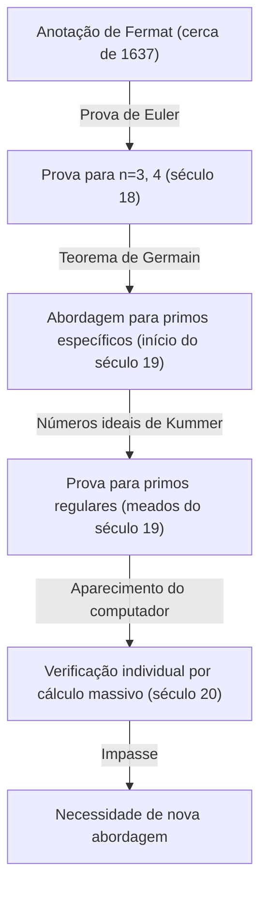
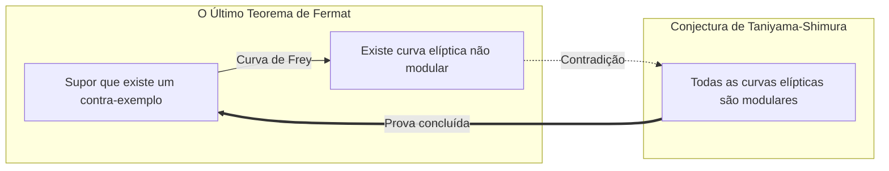

## 1. Introdução: O mistério matemático mais famoso do mundo

Na história da matemática, existe um problema que fascinou e atormentou a maior quantidade de pessoas. Esse é **[O Último Teorema de Fermat](https://kenji.blog/pt/p/fermats-last-theorem/)** (Fermat's Last Theorem). De uma breve nota deixada na margem de seu livro favorito, "Arithmetica" de [Diofanto](/pt/p/diophantus/), pelo juiz e matemático amador francês do século 17, [Pierre de Fermat](https://kenji.blog/pt/p/fermat/), começou um drama matemático épico que durou 360 anos.

O conteúdo do teorema em si é tão simples que até um estudante do ensino fundamental pode entender.

$$
x^n + y^n = z^n
$$

"Quando $n$ é um número natural maior ou igual a 3, não existe conjunto de números naturais diferentes de 0, $x, y, z$, que satisfaça esta equação."

No entanto, provar esta afirmação simples foi um caminho incrivelmente difícil para a humanidade. Neste artigo, rastrearemos a história de como **[O Último Teorema de Fermat](https://kenji.blog/pt/p/fermats-last-theorem/)** nasceu, que tipos de matemáticos o desafiaram e, finalmente, como ele foi provado.

## 2. A "fascinação do diabo" deixada na margem

[Pierre de Fermat](https://kenji.blog/pt/p/fermat/) não era um matemático profissional. Ele trabalhava como juiz no parlamento de Toulouse e desfrutava da matemática em seu tempo livre. No entanto, sua intuição matemática e talento estavam no mais alto nível de sua época, e diz-se que ele lançou as bases da teoria dos números moderna.

[Fermat](https://kenji.blog/pt/p/fermat/) tinha o hábito de escrever na margem de seus livros as ideias e teoremas que lhe ocorriam durante a leitura. Entre as anotações que ele deixou, a que permaneceu sem ser provada até o fim foi este "último teorema". [Fermat](https://kenji.blog/pt/p/fermat/) deixou a seguinte frase famosa escrita na margem:

> "Eu tenho uma demonstração verdadeiramente maravilhosa desta proposição, mas esta margem é muito estreita para contê-la."

Essas palavras se tornaram um desafio para os matemáticos das gerações futuras. Será que ele realmente tinha uma prova? A maioria dos matemáticos modernos acredita que a prova que [Fermat](https://kenji.blog/pt/p/fermat/) tinha possuía algum erro em algum lugar. Isso porque a prova final exigia indispensavelmente teorias de matemática moderna avançada que não existiam na época de [Fermat](https://kenji.blog/pt/p/fermat/).

## 3. O desafio e a frustração dos gênios

Após a morte de [Fermat](https://kenji.blog/pt/p/fermat/), os outros teoremas que ele deixou foram provados um após o outro, mas apenas este último teorema se ergueu como um muro. Muitos matemáticos tentaram prová-lo para $n$ específicos.

- **[Leonhard Euler](https://kenji.blog/pt/p/euler/)**: Euler, o maior matemático do século 18, conseguiu provar para os casos em que $n = 3$ e $n = 4$ (diz-se que o próprio [Fermat](https://kenji.blog/pt/p/fermat/) havia provado para $n = 4$).
- **Sophie Germain**: No início do século 19, a matemática Sophie Germain demonstrou que o teorema é válido para números primos que satisfazem certas condições (hoje chamados de "primos de Sophie Germain"). Este foi um grande passo em direção a uma prova geral.
- **[Ernst Kummer](https://kenji.blog/pt/p/kummer/)**: Em meados do século 19, [Kummer](https://kenji.blog/pt/p/kummer/) introduziu o conceito de "números ideais" e provou o teorema para muitos números primos chamados de primos regulares.

No entanto, o objetivo de prová-lo para todos os números naturais infinitos $n$ ainda estava muito distante.

## 4. A ponte da matemática moderna: Conjectura de Taniyama-Shimura

Entrando no século 20, o Último Teorema de [Fermat](https://kenji.blog/pt/p/fermat/) estaria ligado a outro campo da matemática que, à primeira vista, não parecia ter qualquer relação. Essa é a **Conjectura de Taniyama-Shimura**.

Em 1955, os jovens matemáticos japoneses [Yutaka Taniyama](https://kenji.blog/pt/p/taniyama-yutaka/) e [Goro Shimura](https://kenji.blog/pt/p/shimura-goro/) fizeram a ousada conjectura de que "todas as curvas elípticas são modulares".

- **Curvas elípticas**: Curvas representadas por equações da forma $y^2 = x^3 + ax + b$.
- **Formas modulares**: Funções especiais com uma simetria muito alta no plano complexo.

Essa conjectura de que "curvas elípticas" e "formas modulares", que são conceitos de campos completamente diferentes, eram na verdade a mesma coisa, chocou o mundo matemático da época.

E na década de 1980, Gerhard Frey sugeriu que se existisse um contra-exemplo para o Último Teorema de [Fermat](https://kenji.blog/pt/p/fermat/) (isto é, números naturais que satisfaçam $A^n + B^n = C^n$), a curva elíptica criada a partir dele, chamada **curva de Frey**, teria propriedades anormais e **não poderia ser modular**. Mais tarde, Ken Ribet provou rigorosamente esta ideia de Frey.

Com isso, se a **Conjectura de Taniyama-Shimura** fosse provada, o **Último Teorema de [Fermat](https://kenji.blog/pt/p/fermat/)** também seria provado automaticamente.

## 5. A glória de [Andrew Wiles](https://kenji.blog/pt/p/wiles/)

Quem se sentiu fortemente estimulado por esse desenvolvimento dramático foi o matemático britânico **[Andrew Wiles](https://kenji.blog/pt/p/wiles/)**. Ele encontrou um livro sobre o Último Teorema de [Fermat](https://kenji.blog/pt/p/fermat/) na biblioteca quando tinha cerca de 10 anos de idade e decidiu se tornar um matemático.

Wiles suspendeu todas as outras pesquisas, isolou-se em seu sótão e assumiu secretamente o desafio de provar a **Conjectura de Taniyama-Shimura**. Após 7 anos de pesquisa solitária, em junho de 1993, no final de uma palestra na Universidade de Cambridge, ele escreveu a conclusão da prova no quadro-negro e declarou calmamente: "Eu gostaria de parar aqui". O salão foi envolvido por uma tempestade de aplausos.

No entanto, o drama não acaba aqui. Durante o processo de revisão por pares, uma falha fatal foi descoberta na prova. Wiles foi levado à beira do desespero, mas com a ajuda de seu ex-aluno Richard Taylor, ele trabalhou para corrigi-la.

Após cerca de um ano de luta intensa, em setembro de 1994, Wiles finalmente teve um momento de inspiração. Ao combinar uma abordagem anteriormente abandonada com a abordagem atual, a prova completa foi finalmente concluída. Em 1995, seu artigo foi publicado oficialmente e o maior mistério do mundo matemático de 360 anos foi finalmente resolvido.

## 6. Conclusão

A prova do **Último Teorema de [Fermat](https://kenji.blog/pt/p/fermat/)** significa mais do que simplesmente resolver um problema antigo. Os numerosos métodos matemáticos e teorias desenvolvidos nesse processo (por exemplo, a teoria de Iwasawa, o método de Kolyvagin-Flach, etc.) funcionam como ferramentas poderosas na matemática moderna.

O mistério deixado na margem de um livro por um único matemático amador tornou-se uma estrela guia para os matemáticos durante séculos, expandindo os limites do conhecimento humano. [O Último Teorema de Fermat](https://kenji.blog/pt/p/fermats-last-theorem/) pode ser considerado um monumento eterno que simboliza a grandeza do espírito humano que continua a desafiar o impossível.
