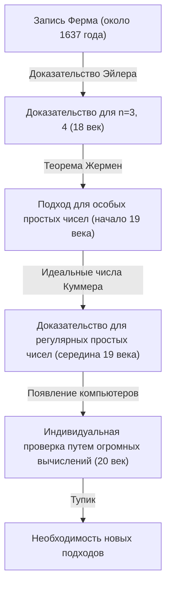
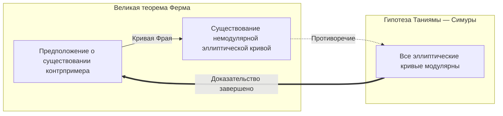

## 1. Введение: Самая известная математическая загадка в мире

В истории математики есть проблема, которая очаровывала и мучила большинство людей. Это **[Великая теорема Ферма](https://kenji.blog/ru/p/fermats-last-theorem/)** (Fermat's Last Theorem). Грандиозная математическая драма длиной в 360 лет началась с короткой заметки, которую Пьер де Ферма, французский судья и математик-любитель 17 века, оставил на полях своей любимой книги «Арифметика» [Диофант](https://kenji.blog/ru/p/diophantus/)а.

Сама суть теоремы настолько проста, что её может понять даже школьник.

$$
x^n + y^n = z^n
$$

«Для любого натурального числа $n$ больше 2 не существует ненулевых натуральных чисел $x, y, z$, удовлетворяющих этому уравнению.»

Однако доказательство этого простого утверждения оказалось для человечества невообразимо трудным путем. В этой статье мы проследим историю того, как появилась **[Великая теорема Ферма](https://kenji.blog/ru/p/fermats-last-theorem/)**, какие математики бросали ей вызов и как она, наконец, была доказана.

## 2. «Дьявольское очарование», оставленное на полях

[Пьер де Ферма](https://kenji.blog/ru/p/fermat/) не был профессиональным математиком. Он работал судьей в парламенте Тулузы и занимался математикой в свободное время. Однако его математическая интуиция и талант были на высочайшем уровне того времени, и считается, что он заложил основы современной теории чисел.

У Ферма была привычка записывать идеи и теоремы, которые приходили ему в голову во время чтения, на полях книг. Среди оставленных им записей дольше всего оставалась недоказанной эта «Великая теорема». Ферма оставил на полях следующие знаменитые слова:

> «Я нашел поистине удивительное доказательство этого предложения, но поля здесь слишком узки, чтобы его вместить.»

Эти слова стали вызовом для последующих поколений математиков. Действительно ли у него было доказательство? Большинство современных математиков считают, что в доказательстве Ферма где-то была ошибка. Ведь для окончательного доказательства потребовались сложные теории современной математики, которых просто не существовало во времена Ферма.

## 3. Вызовы и неудачи гениев

После смерти Ферма другие оставленные им теоремы доказывались одна за другой, но только эта последняя теорема стояла как непреодолимая стена. Многие математики пытались доказать её для конкретных $n$.

- **[Леонард Эйлер](https://kenji.blog/ru/p/euler/)** : Величайший математик 18 века Эйлер успешно доказал случаи для $n = 3$ и $n = 4$ (считается, что $n = 4$ доказал сам Ферма).
- **Софи Жермен** : В начале 19 века женщина-математик Софи Жермен показала, что теорема выполняется для простых чисел, удовлетворяющих определенным условиям (сегодня они называются «простые числа Софи Жермен»). Это стало большим шагом к общему доказательству.
- **[Эрнст Куммер](https://kenji.blog/ru/p/kummer/)** : В середине 19 века Куммер ввел понятие «идеальных чисел» и доказал теорему для множества простых чисел, называемых регулярными простыми числами.

Однако цель — доказать теорему для всех бесконечных натуральных чисел $n$ — всё ещё оставалась далекой.

## 4. Мост современной математики: Гипотеза Таниямы — Симуры

В 20 веке [Великая теорема Ферма](https://kenji.blog/ru/p/fermats-last-theorem/) оказалась связана с совершенно другой областью математики, на первый взгляд не имеющей к ней никакого отношения. Это **гипотеза Таниямы — Симуры**.

В 1955 году молодые японские математики [Ютака Танияма](https://kenji.blog/ru/p/taniyama-yutaka/) и [Горо Симура](https://kenji.blog/ru/p/shimura-goro/) выдвинули смелую гипотезу: «все эллиптические кривые модулярны».

- **Эллиптические кривые** : Кривые, задаваемые уравнениями вида $y^2 = x^3 + ax + b$.
- **Модулярные формы** : Специальные функции на комплексной плоскости с очень высокой симметрией.

Эта гипотеза о том, что концепции из совершенно разных областей — «эллиптические кривые» и «модулярные формы» — на самом деле являются одним и тем же, потрясла математический мир того времени.

А в 1980-х годах Герхард Фрай предположил, что если существует контрпример к Великой теореме Ферма (то есть существуют натуральные числа, для которых $A^n + B^n = C^n$), то эллиптическая кривая, построенная из них и называемая **кривой Фрая**, будет обладать аномальными свойствами и **не сможет быть модулярной**. Позже Кен Рибет строго доказал эту идею Фрая.

В результате, если доказать **гипотезу Таниямы — Симуры**, то **[Великая теорема Ферма](https://kenji.blog/ru/p/fermats-last-theorem/)** будет доказана автоматически.

## 5. Триумф [Эндрю Уайлс](https://kenji.blog/ru/p/wiles/)а

Этот драматический поворот событий сильно вдохновил британского математика **[Эндрю Уайлс](https://kenji.blog/ru/p/wiles/)а**. Он встретил книгу о Великой теореме Ферма в библиотеке, когда ему было 10 лет, и решил стать математиком.

Уайлс прервал все свои другие исследования и, запершись на чердаке, тайно взялся за доказательство **гипотезы Таниямы — Симуры**. После 7 лет одиночных исследований, в июне 1993 года, в конце своей лекции в Кембриджском университете он написал на доске вывод доказательства и тихо заявил: «Я думаю, на этом я остановлюсь». Зал взорвался громом аплодисментов.

Но на этом драма не закончилась. В процессе рецензирования в доказательстве был обнаружен фатальный недостаток. Уайлс оказался на краю отчаяния, но заручился помощью своего бывшего студента Ричарда Тейлора, чтобы внести исправления.

После года напряженной работы, в сентябре 1994 года, к Уайлсу наконец пришло озарение. Объединив однажды отброшенный подход с текущим, он наконец завершил полное доказательство. В 1995 году его статья была официально опубликована, и самая большая загадка математического мира, длившаяся 360 лет, была наконец решена.

## 6. Заключение

Доказательство **Великой теоремы Ферма** означает нечто большее, чем просто решение одной старой проблемы. Многочисленные математические методы и теории, разработанные в ходе этого процесса (например, теория Ивасавы и метод Колывагина — Флаха), сегодня служат мощными инструментами современной математики.

Загадка, оставленная на полях книги математиком-любителем, веками служила путеводной звездой для математиков и раздвинула границы человеческих знаний. Великую теорему Ферма можно по праву назвать вечным памятником, символизирующим величие человеческого духа, продолжающего бросать вызов невозможному.
