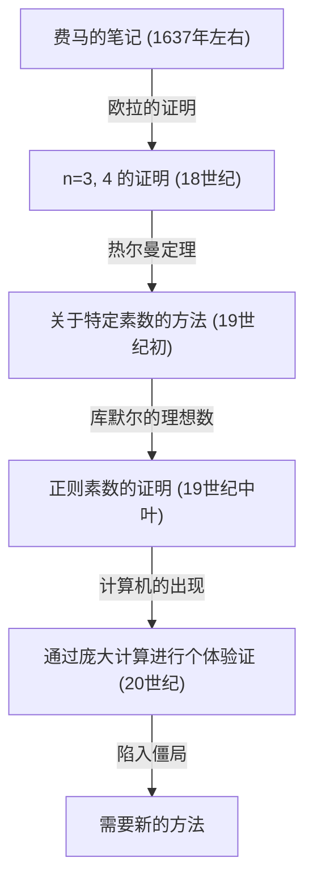
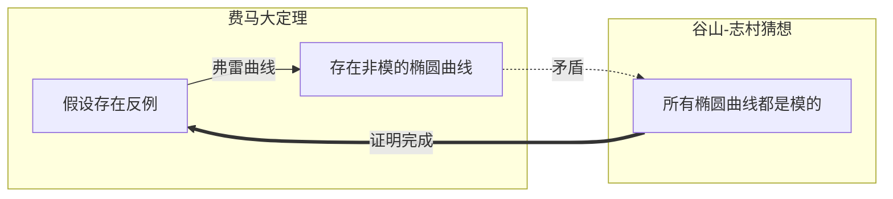

## 1. 引言：世界上最著名的数学之谜

在数学的历史中，存在着一个最令人们着迷，同时也最让人们痛苦的问题。那就是 **[费马大定理](https://kenji.blog/zh-cn/p/fermats-last-theorem/)** （[Fermat's Last Theorem](https://kenji.blog/zh-cn/p/fermats-last-theorem/)）。17世纪法国的法官兼业余数学家[皮埃尔·德·费马](https://kenji.blog/zh-cn/p/fermat/)，在阅读他喜爱的[丢番图](https://kenji.blog/zh-cn/p/diophantus/)《算术》一书的空白处写下了一段简短的笔记，由此拉开了一场长达360年的宏大数学戏剧的序幕。

定理的内容本身非常简单，甚至连初中生都能理解。

$$
x^n + y^n = z^n
$$

“当 $n$ 是大于等于3的自然数时，不存在满足此方程式的非零自然数 $x, y, z$ 的组合。”

然而，要证明这个简单的命题，对人类来说却是一段超乎想象的艰难旅程。在本文中，我们将追溯这段历史，了解 **[费马大定理](https://kenji.blog/zh-cn/p/fermats-last-theorem/)** 是如何诞生的，有哪些数学家向其发起了挑战，以及它最终是如何被证明的。

## 2. 留在空白处的“恶魔的魅惑”

[皮埃尔·德·费马](https://kenji.blog/zh-cn/p/fermat/)并不是一位职业数学家。他作为图卢兹高等法院的法官工作，在业余时间享受数学的乐趣。然而，他的数学直觉和才华处于当时的最高水平，被认为奠定了现代数论的基础。

费马有一个习惯，就是把读书时想到的点子或定理写在书的空白处。在他留下的笔记中，唯一一个到最后都未能被证明的就是这个“大定理”。费马在空白处留下了以下著名的话语：

> “关于此，我确信已发现了一种美妙的证法，可惜这里空白的地方太小，写不下。”

这句话成了向后世数学家发出的挑战书。他真的拥有证明吗？许多现代数学家认为，费马所掌握的证明在某处一定存在错误。因为，最终的证明需要费马时代并不存在的高深现代数学理论作为不可或缺的基础。

## 3. 天才们的挑战与挫折

费马死后，他留下的其他定理接连被证明，唯独这个大定理像一堵墙一样阻挡在人们面前。许多数学家尝试证明特定的 $n$。

- **[莱昂哈德·欧拉](https://kenji.blog/zh-cn/p/euler/)** ：18世纪最伟大的数学家欧拉成功证明了 $n = 3$ 和 $n = 4$ 的情况（也有说法认为 $n = 4$ 已由费马本人证明）。
- **索菲·热尔曼** ：19世纪初，女性数学家索菲·热尔曼证明了定理对满足特定条件的素数（今天被称为“索菲·热尔曼素数”）成立。这是迈向一般性证明的一大步。
- **[恩斯特·库默尔](https://kenji.blog/zh-cn/p/kummer/)** ：19世纪中叶，库默尔引入了“理想数”的概念，证明了定理对许多被称为正则素数的素数成立。

然而，要实现证明所有无限自然数 $n$ 的目标，依然遥不可及。

## 4. 现代数学的桥梁：谷山-志村猜想

进入20世纪后，[费马大定理](https://kenji.blog/zh-cn/p/fermats-last-theorem/)与一个看似毫无关联的数学分支产生了联系。那就是 **谷山-志村猜想** 。

1955年，日本年轻数学家[谷山丰](https://kenji.blog/zh-cn/p/taniyama-yutaka/)和[志村五郎](https://kenji.blog/zh-cn/p/shimura-goro/)提出了一个大胆的猜想：“所有椭圆曲线都是模的”。

- **椭圆曲线** ：由类似 $y^2 = x^3 + ax + b$ 这种形式的方程表示的曲线。
- **模形式** ：在复平面上具有极高对称性的特殊函数。

“椭圆曲线”和“模形式”这两个完全不同领域的概念，实际上是相同的东西，这一猜想在当时的数学界引起了轰动。

到了20世纪80年代，格哈德·弗雷指出，如果[费马大定理](https://kenji.blog/zh-cn/p/fermats-last-theorem/)存在反例（即存在满足 $A^n + B^n = C^n$ 的自然数），那么由其构造出的被称为 **弗雷曲线** 的椭圆曲线将具有异常性质，并且 **不可能是模的** 。随后，肯·里贝特严格证明了弗雷的这一想法。

由此一来，只要证明了 **谷山-志村猜想** ， **[费马大定理](https://kenji.blog/zh-cn/p/fermats-last-theorem/)** 也将自动得到证明。

## 5. [安德鲁·怀尔斯](https://kenji.blog/zh-cn/p/wiles/)的荣耀

受到这一戏剧性进展强烈刺激的，是英国出生的数学家 **[安德鲁·怀尔斯](https://kenji.blog/zh-cn/p/wiles/)** 。他在10岁时在图书馆偶然发现了一本关于[费马大定理](https://kenji.blog/zh-cn/p/fermats-last-theorem/)的书，从此立志成为一名数学家。

怀尔斯中断了所有其他研究，闭门不出，在阁楼里秘密挑战 **谷山-志村猜想** 的证明。经过7年孤独的研究，在1993年6月剑桥大学的演讲最后，他在黑板上写下了证明的结论，并平静地宣布：“我想就此结束。”会场瞬间爆发出雷鸣般的掌声。

然而，戏剧并没有就此结束。在同行评审的过程中，人们发现证明中存在一个致命的缺陷。怀尔斯陷入了绝望的深渊，但他在曾经的学生理查德·泰勒的协助下投入到修改工作中。

经过约1年的苦战，在1994年9月，怀尔斯终于获得了灵感。通过将曾经放弃的方法与当前的方法相结合，他终于完成了完美的证明。1995年，他的论文正式出版，长达360年的数学界最大谜团终于被解开。

## 6. 结语

**[费马大定理](https://kenji.blog/zh-cn/p/fermats-last-theorem/)** 的证明，其意义远不止解决了一个古老的问题。在此过程中发展出的诸多数学方法和理论（例如岩泽理论和科利瓦金-弗莱切方法等），如今都已成为现代数学的强大工具。

一位业余数学家留在书本空白处的谜题，成为了几个世纪以来指引数学家们的明星，拓展了人类智慧的边界。可以说，[费马大定理](https://kenji.blog/zh-cn/p/fermats-last-theorem/)象征着人类不断挑战不可能的伟大精神，是一座永恒的丰碑。
