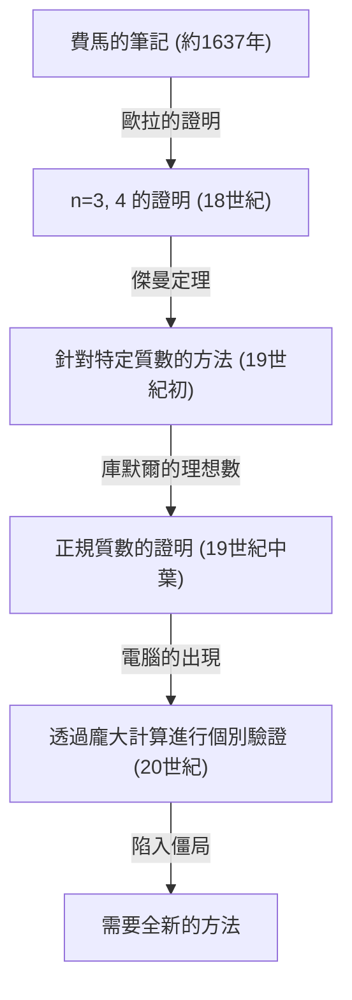
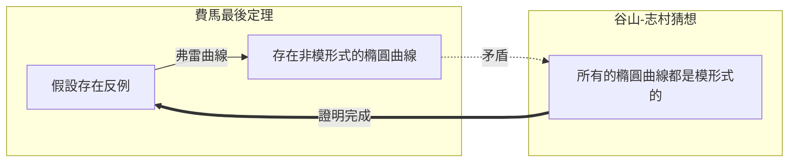

## 1. 前言：世界上最著名的數學之謎

在數學的歷史上，有一個問題讓無數人為之著迷，同時也讓他們備受折磨。那就是 **[費馬最後定理](https://kenji.blog/zh-tw/p/fermats-last-theorem/)** （[Fermat's Last Theorem](https://kenji.blog/zh-tw/p/fermats-last-theorem/)）。17世紀的法國法官、業餘數學家[皮埃爾·德·費馬](https://kenji.blog/zh-tw/p/fermat/)（[Pierre de Fermat](https://kenji.blog/zh-tw/p/fermat/)），在他愛不釋手的[丟番圖](https://kenji.blog/zh-tw/p/diophantus/)《算術》一書的空白處留下了短短的筆記，從此展開了長達360年波瀾壯闊的數學史詩。

定理的內容本身非常簡單，連國中生都能理解。

$$
x^n + y^n = z^n
$$

「當 $n$ 為大於等於 3 的自然數時，不存在能夠滿足此方程式的非零自然數 $x, y, z$ 的組合。」

然而，要證明這個簡單的結論，對人類來說卻是一段難以想像的艱辛歷程。本篇文章將帶您回顧 **[費馬最後定理](https://kenji.blog/zh-tw/p/fermats-last-theorem/)** 是如何誕生、有哪些數學家曾發起挑戰，以及最終是如何被證明的歷史。

## 2. 寫在空白處的「惡魔的誘惑」

[皮埃爾·德·費馬](https://kenji.blog/zh-tw/p/fermat/)並非職業數學家。他在土魯斯的高等法院擔任法官，僅在閒暇之餘享受數學的樂趣。然而，他的數學直覺與才華卻處於當時的最高水準，甚至被認為奠定了現代數論的基礎。

費馬有一個習慣，就是將閱讀時想到的點子或定理寫在書頁的空白處。在他留下的筆記中，直到最後都未被證明出來的，就是這個「最後定理」。費馬在空白處寫下了以下這段著名的話：

> 「我對這個命題有一個十分美妙的證明，但這裡的空白太小了，寫不下。」

這句話成為了對後世數學家們的挑戰書。他真的握有證明嗎？現代的大多數數學家都認為，費馬當時的證明某處一定有誤。因為最終的證明，必須仰賴費馬時代根本不存在的高深現代數學理論。

## 3. 天才們的挑戰與挫折

在費馬死後，他留下的其他定理陸續被證明出來，唯獨這個最後定理如同一堵高牆般屹立不搖。許多數學家嘗試針對特定的 $n$ 進行證明。

- **[李昂哈德·歐拉](https://kenji.blog/zh-tw/p/euler/)** ：18世紀最偉大的數學家歐拉，成功證明了 $n = 3$ 與 $n = 4$ 的情況（也有人說 $n = 4$ 是費馬親自證明的）。
- **蘇菲·傑曼** ：19世紀初，女性數學家蘇菲·傑曼證明了針對滿足特定條件的質數（現今被稱為「蘇菲·傑曼質數」），該定理是成立的。這是邁向一般性證明的一大步。
- **[恩斯特·庫默爾](https://kenji.blog/zh-tw/p/kummer/)** ：19世紀中葉，庫默爾導入了「理想數」的概念，並證明了針對許多被稱為正規質數的質數，該定理也是成立的。

儘管如此，距離證明所有無限多個自然數 $n$ 的目標，依然遙不可及。

## 4. 現代數學的橋樑：谷山-志村猜想

進入20世紀後，[費馬最後定理](https://kenji.blog/zh-tw/p/fermats-last-theorem/)與一個看似毫無關聯的其他數學領域產生了連結。那就是 **谷山-志村猜想** 。

1955年，日本年輕的數學家[谷山豐](https://kenji.blog/zh-tw/p/taniyama-yutaka/)與[志村五郎](https://kenji.blog/zh-tw/p/shimura-goro/)，提出了一個大膽的猜想：「所有的橢圓曲線都是模形式（Modular）的」。

- **橢圓曲線** ：由 $y^2 = x^3 + ax + b$ 這種形式的方程式所表示的曲線。
- **模形式** ：在複數平面上具有極高對稱性的特殊函數。

「橢圓曲線」與「模形式」這兩個截然不同領域的概念，實際上竟是相同的東西——這個猜想震驚了當時的數學界。

接著在1980年代，格哈德·弗雷（Gerhard Frey）指出，如果[費馬最後定理](https://kenji.blog/zh-tw/p/fermats-last-theorem/)存在反例（即存在滿足 $A^n + B^n = C^n$ 的自然數），那麼由此構成的被稱為 **弗雷曲線** 的橢圓曲線，將會具有異常的性質，並且 **不可能成為模形式** 。隨後，肯·里貝特（Ken Ribet）嚴格證明了弗雷的這個想法。

如此一來，只要證明了 **谷山-志村猜想** ，就等於自動證明了 **[費馬最後定理](https://kenji.blog/zh-tw/p/fermats-last-theorem/)** 。

## 5. [安德魯·懷爾斯](https://kenji.blog/zh-tw/p/wiles/)的榮耀

受到這戲劇性發展強烈刺激的，是英國出身的數學家 **[安德魯·懷爾斯](https://kenji.blog/zh-tw/p/wiles/)** （[Andrew Wiles](https://kenji.blog/zh-tw/p/wiles/)）。他大約在10歲時，於圖書館接觸到了關於[費馬最後定理](https://kenji.blog/zh-tw/p/fermats-last-theorem/)的書籍，從此立志成為一名數學家。

懷爾斯中斷了其他所有的研究，把自己關在閣樓裡，秘密地挑戰證明 **谷山-志村猜想** 。經過7年孤獨的研究，1993年6月，在劍橋大學的演講尾聲，他在黑板上寫下了證明的結論，並平靜地宣佈：「我想在這裡結束。」會場頓時響起了如雷的掌聲。

然而，戲劇並未就此落幕。在同行評審的過程中，他的證明被發現存在一個致命的缺陷。懷爾斯一度陷入絕望的深淵，但在他過去的學生理查·泰勒（Richard Taylor）的協助下，他重新投入了修正工作。

歷經約一年的苦戰，1994年9月，懷爾斯終於獲得了靈感。透過將曾經放棄的方法與現在的方法結合在一起，他終於完成了完美的證明。1995年，他的論文正式出版，這個長達360年的數學界最大謎團，終於宣告破案。

## 6. 結語

**[費馬最後定理](https://kenji.blog/zh-tw/p/fermats-last-theorem/)** 被證明，其意義不僅僅在於解開了一個古老的問題。在這個過程中所發展出的許多數學方法與理論（例如岩澤理論、科利瓦金-弗萊切方法等），都成為了現代數學中強而有力的工具。

一位業餘數學家寫在書頁空白處的謎題，成為了幾個世紀以來指引數學家們的星辰，並拓展了人類智慧的邊界。可以說，[費馬最後定理](https://kenji.blog/zh-tw/p/fermats-last-theorem/)是一座永恆的紀念碑，象徵著人類持續挑戰不可能的偉大精神。
