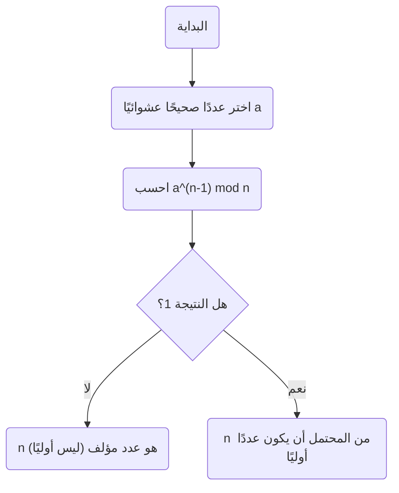
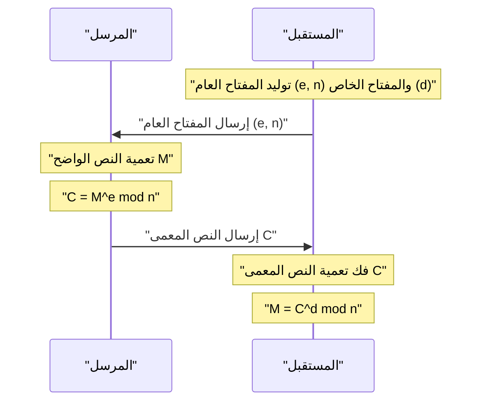

في مجتمع الإنترنت الحديث، يعود الفضل في قدرتنا على التواصل بأمان إلى **التعمية (التشفير)**. في أساس هذه التعمية تكمن مبرهنة جميلة اكتشفها عالم الرياضيات في القرن السابع عشر [بيير دي فيرما](https://kenji.blog/ar/p/fermat/).

في هذه المقالة، سنشرح **[مبرهنة فيرما الصغرى](https://kenji.blog/ar/p/fermats-little-theorem/)**، وهي حجر الزاوية الحاسم في نظرية الأعداد، بطريقة سهلة الفهم، مع تغطية معناها، وإثباتها، وكيفية تطبيقها في تعمية [RSA](https://kenji.blog/ar/p/modern-cryptography-public-key-hash-signature/) الحديثة.

## ما هي [مبرهنة فيرما الصغرى](https://kenji.blog/ar/p/fermats-little-theorem/)؟

[مبرهنة فيرما الصغرى](https://kenji.blog/ar/p/fermats-little-theorem/) هي مبرهنة بسيطة للغاية ولكنها قوية توضح العلاقة بين الأعداد الأولية والأعداد الصحيحة.

تنص المبرهنة على ما يلي:

> **[مبرهنة فيرما الصغرى](https://kenji.blog/ar/p/fermats-little-theorem/)**
> ليكن $p$ عددًا أوليًا، و $a$ أي عدد صحيح غير قابل للقسمة على $p$ (مما يعني أن $a$ و $p$ أوليان فيما بينهما). إذن، علاقة التطابق التالية صحيحة:
> 
> $$ a^{p-1} \equiv 1 \pmod p $$

هذا يعني أنه "عندما يُرفع العدد الصحيح $a$ إلى القوة $p-1$ ويُقسم على العدد الأولي $p$، يكون الباقي دائمًا $1$".

أيضًا، بضرب كلا الطرفين في $a$، يمكن تحويلها إلى شكل أكثر عمومية يزيل شرط أن "$a$ ليس من مضاعفات $p$".

> $$ a^p \equiv a \pmod p $$
> (يتحقق لأي عدد صحيح $a$)

### التحقق بأمثلة ملموسة

دعونا نعوض ببعض الأرقام الفعلية للتحقق مما إذا كانت المبرهنة صحيحة.

**مثال 1: $p = 5$ (أولي)، $a = 2$**
- $p-1 = 4$.
- $a^{p-1} = 2^4 = 16$.
- عندما يُقسم $16$ على $5$، يكون الناتج $3$ و **الباقي هو $1$** ($16 \equiv 1 \pmod 5$).

**مثال 2: $p = 7$ (أولي)، $a = 3$**
- $p-1 = 6$.
- $a^{p-1} = 3^6 = 729$.
- عندما يُقسم $729$ على $7$، يكون الناتج $104$ و **الباقي هو $1$** ($729 = 7 \times 104 + 1$).

بهذه الطريقة، بغض النظر عن العدد الأولي $p$ الذي تختاره، فإن هذا القانون الغامض يظل صحيحًا.

## إثبات المبرهنة

هناك عدة طرق لإثبات [مبرهنة فيرما الصغرى](https://kenji.blog/ar/p/fermats-little-theorem/)، ولكننا نقدم هنا طريقة إثبات تمثيلية تعتمد على نظرية الأعداد.

ليكن $p$ عددًا أوليًا و $a$ عددًا صحيحًا غير قابل للقسمة على $p$.
اعتبر المجموعة $S = \{1, 2, 3, \dots, p-1\}$. لتكن $S'$ مجموعة جديدة تم إنشاؤها بضرب كل عنصر من عناصر هذه المجموعة في $a$.

$$ S' = \{a, 2a, 3a, \dots, (p-1)a\} $$

ضع في اعتبارك الباقي عند قسمة كل عنصر من هذه المجموعة $S'$ على $p$. والمثير للدهشة أن جميع هذه البواقي متميزة، وعلاوة على ذلك، لا يوجد أي منها يساوي $0$. بعبارة أخرى، مجموعة البواقي تتطابق تمامًا مع المجموعة الأصلية $S$ (مع تجاهل الترتيب).

لذلك، فإن حاصل ضرب عناصر $S$ وحاصل ضرب عناصر $S'$ متطابقان قياس $p$.

$$ 1 \times 2 \times \dots \times (p-1) \equiv a \times 2a \times \dots \times (p-1)a \pmod p $$

تبسيط هذا يعطي:

$$ (p-1)! \equiv a^{p-1} \times (p-1)! \pmod p $$

نظرًا لأن $(p-1)!$ و $p$ أوليان فيما بينهما، يمكننا قسمة كلا الطرفين على $(p-1)!$ (خاصية القسمة في علاقات التطابق). ونتيجة لذلك، يتم اشتقاق المبرهنة التالية:

$$ 1 \equiv a^{p-1} \pmod p $$

وهذا يكمل الإثبات.

## اختبار فيرما للأولية: التطبيق في اختبار الأعداد الأولية

يتم تطبيق هذه المبرهنة في **خوارزمية اختبار الأولية** (اختبار فيرما للأولية) لتحديد ما إذا كان رقم معين أوليًا.

إذا كنت تريد معرفة ما إذا كان رقم ضخم $n$ أوليًا، فاختر عشوائيًا $a$ وتحقق مما إذا كان $a^{n-1} \equiv 1 \pmod n$ صحيحًا. إذا لم يكن صحيحًا، فإن $n$ **بالتأكيد ليس عددًا أوليًا** (إنه عدد مؤلف).

ومع ذلك، نظرًا لوجود أرقام استثنائية تسمى **أرقام كارمايكل**، وهي أرقام مؤلفة ولكنها تحقق $a^{n-1} \equiv 1 \pmod n$، فإن هذا الاختبار وحده لا يمكنه إثبات الأولية بشكل قاطع. لذلك، في الممارسة العملية، يتم استخدام طرق مثل اختبار ميلر-رابين للأولية.

## التطبيق في التعمية الحديثة: تعمية [RSA](https://kenji.blog/ar/p/modern-cryptography-public-key-hash-signature/)

أهم تطبيق ل[مبرهنة فيرما الصغرى](https://kenji.blog/ar/p/fermats-little-theorem/) (وتعميمها، **مبرهنة أويلر**) هو **تعمية [RSA](https://kenji.blog/ar/p/modern-cryptography-public-key-hash-signature/)**، التي تدعم أمن الإنترنت.

تعتمد تعمية RSA على صعوبة تحليل الأعداد الهائلة لأمنها. ضمن آليتها، يلعب مبدأ "[مبرهنة فيرما الصغرى](https://kenji.blog/ar/p/fermats-little-theorem/)" دورًا حاسمًا في عمليات توليد المفاتيح وفك التعمية.

في تعمية [RSA](https://kenji.blog/ar/p/modern-cryptography-public-key-hash-signature/)، يتم إعداد عددين أوليين ضخمين، $p$ و $q$، ونضع $n = p \times q$.
بواسطة مبرهنة أويلر، تم تصميم المفاتيح ($e$ و $d$) بحيث يكون $M^{ed} \equiv M \pmod n$ صحيحًا في عمليات التعمية وفك التعمية. هنا، تعتمد الظاهرة السحرية المتمثلة في عودة النص الواضح $M$ إلى شكله الأصلي بشكل أساسي على الخصائص الرياضية التي تضمنها [مبرهنة فيرما الصغرى](https://kenji.blog/ar/p/fermats-little-theorem/).

## خاتمة

أصبحت مبرهنة صغيرة اكتشفها [بيير دي فيرما](https://kenji.blog/ar/p/fermat/) في القرن السابع عشر عنصرًا لا غنى عنه يدعم أساس أمن المعلومات في المجتمع الحديث بعد مئات السنين.

يمكن القول إن **[مبرهنة فيرما الصغرى](https://kenji.blog/ar/p/fermats-little-theorem/)** هي واحدة من أجمل الأمثلة التي توضح كيف ترتبط الرياضيات البحتة بالتكنولوجيا العملية (التعمية والخوارزميات). لا يسع المرء إلا أن يندهش من عمق الرياضيات واتساع نطاق تطبيقها.
