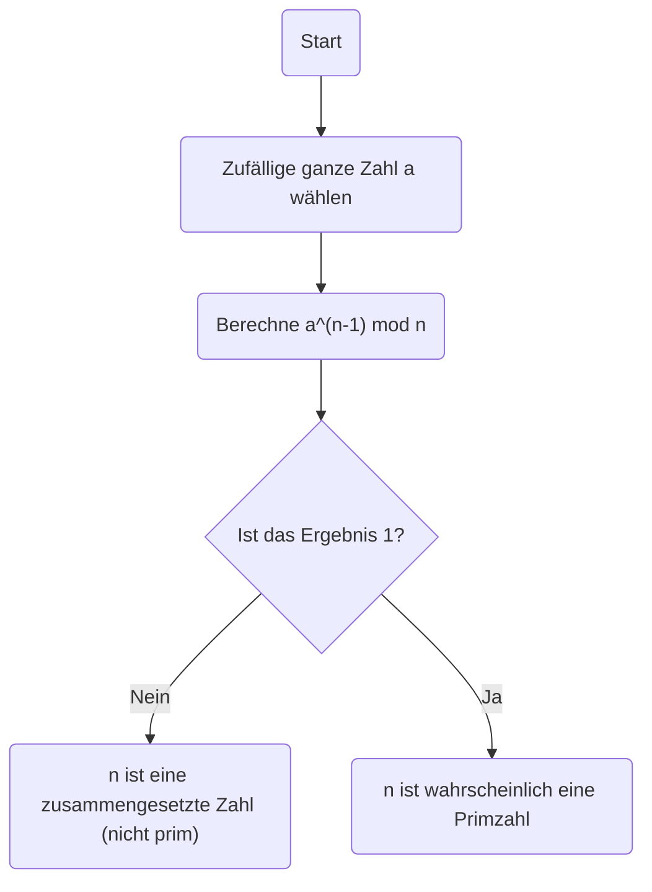
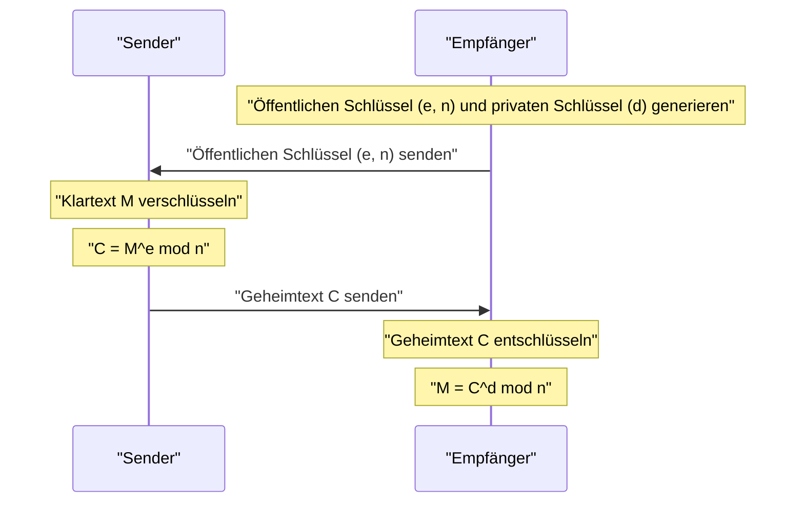

In der modernen Internetgesellschaft verdanken wir unsere Fähigkeit zur sicheren Kommunikation der **Kryptographie**. An der eigentlichen Basis dieser Kryptographie liegt ein wunderschöner Satz, der im 17. Jahrhundert von dem Mathematiker [Pierre de Fermat](https://kenji.blog/p/fermat/) entdeckt wurde.

In diesem Artikel werden wir **den kleinen Satz von Fermat**, einen entscheidenden Grundstein der Zahlentheorie, auf leicht verständliche Weise erklären und dabei seine Bedeutung, seinen Beweis und seine Anwendung in der modernen RSA-Kryptographie behandeln.

## Was ist der kleine Satz von Fermat?

[Der kleine Satz von Fermat](https://kenji.blog/p/fermats-little-theorem/) ist ein extrem einfacher, aber mächtiger Satz, der die Beziehung zwischen Primzahlen und ganzen Zahlen aufzeigt.

Der Satz besagt Folgendes:

> **[Der kleine Satz von Fermat](https://kenji.blog/p/fermats-little-theorem/)**
> Sei $p$ eine Primzahl und $a$ eine beliebige ganze Zahl, die nicht durch $p$ teilbar ist (was bedeutet, dass $a$ und $p$ teilerfremd sind). Dann gilt die folgende Kongruenzrelation:
> 
> $$ a^{p-1} \equiv 1 \pmod p $$

Dies bedeutet, dass "wenn die ganze Zahl $a$ mit der Potenz $p-1$ potenziert und durch die Primzahl $p$ dividiert wird, der Rest immer $1$ ist".

Durch Multiplikation beider Seiten mit $a$ kann er in eine allgemeinere Form umgewandelt werden, die die Bedingung entfernt, dass "$a$ kein Vielfaches von $p$ ist".

> $$ a^p \equiv a \pmod p $$
> (Gilt für jede ganze Zahl $a$)

### Überprüfung an konkreten Beispielen

Setzen wir einige tatsächliche Zahlen ein, um zu überprüfen, ob der Satz zutrifft.

**Beispiel 1: $p = 5$ (prim), $a = 2$**
- $p-1 = 4$.
- $a^{p-1} = 2^4 = 16$.
- Wenn $16$ durch $5$ geteilt wird, ist der Quotient $3$ und **der Rest ist $1$** ($16 \equiv 1 \pmod 5$).

**Beispiel 2: $p = 7$ (prim), $a = 3$**
- $p-1 = 6$.
- $a^{p-1} = 3^6 = 729$.
- Wenn $729$ durch $7$ geteilt wird, ist der Quotient $104$ und **der Rest ist $1$** ($729 = 7 \times 104 + 1$).

Auf diese Weise gilt dieses mysteriöse Gesetz, egal welche Primzahl $p$ Sie wählen.

## Beweis des Satzes

Es gibt mehrere Ansätze, um den kleinen Satz von Fermat zu beweisen, aber hier stellen wir eine repräsentative Beweismethode vor, die auf der Zahlentheorie basiert.

Sei $p$ eine Primzahl und $a$ eine ganze Zahl, die nicht durch $p$ teilbar ist.
Betrachten Sie die Menge $S = \{1, 2, 3, \dots, p-1\}$. Sei $S'$ eine neue Menge, die durch Multiplikation jedes Elements dieser Menge mit $a$ gebildet wird.

$$ S' = \{a, 2a, 3a, \dots, (p-1)a\} $$

Betrachten Sie den Rest, wenn jedes Element dieser Menge $S'$ durch $p$ geteilt wird. Überraschenderweise sind alle diese Reste verschieden, und außerdem ist keiner von ihnen $0$. Mit anderen Worten, die Menge der Reste stimmt perfekt mit der ursprünglichen Menge $S$ überein (wenn man die Reihenfolge ignoriert).

Daher sind das Produkt der Elemente von $S$ und das Produkt der Elemente von $S'$ kongruent modulo $p$.

$$ 1 \times 2 \times \dots \times (p-1) \equiv a \times 2a \times \dots \times (p-1)a \pmod p $$

Wenn man dies vereinfacht, ergibt sich:

$$ (p-1)! \equiv a^{p-1} \times (p-1)! \pmod p $$

Da $(p-1)!$ und $p$ teilerfremd sind, können wir beide Seiten durch $(p-1)!$ teilen (eine Eigenschaft der Division in Kongruenzrelationen). Daraus leitet sich der folgende Satz ab:

$$ 1 \equiv a^{p-1} \pmod p $$

Dies schließt den Beweis ab.

## Fermat-Primzahltest: Anwendung beim Primzahlentest

Dieser Satz wird in einem **Primzahltest-Algorithmus** (dem Fermat-Primzahltest) angewendet, um zu bestimmen, ob eine gegebene Zahl prim ist.

Wenn Sie wissen wollen, ob eine riesige Zahl $n$ prim ist, wählen Sie zufällig $a$ und überprüfen Sie, ob $a^{n-1} \equiv 1 \pmod n$ gilt. Wenn dies nicht zutrifft, ist $n$ **absolut keine Primzahl** (es ist eine zusammengesetzte Zahl).

Da es jedoch Ausnahmezahlen gibt, die sogenannten **Carmichael-Zahlen**, die zusammengesetzte Zahlen sind, aber dennoch $a^{n-1} \equiv 1 \pmod n$ erfüllen, kann dieser Test allein die Primalität nicht definitiv beweisen. Daher werden in der Praxis Methoden wie der Miller-Rabin-Primzahltest verwendet.

## Anwendung in der modernen Kryptographie: RSA-Kryptographie

Die wichtigste Anwendung des kleinen Satzes von Fermat (und seiner Verallgemeinerung, des **Satzes von Euler**) ist die **RSA-Kryptographie**, die der Internetsicherheit zugrunde liegt.

Die RSA-Kryptographie beruht für ihre Sicherheit auf der Schwierigkeit, massive Zahlen zu faktorisieren. Innerhalb ihres Mechanismus spielt das Prinzip des "kleinen Satzes von Fermat" eine entscheidende Rolle bei den Schlüsselerzeugungs- und Entschlüsselungsprozessen.

In der RSA-Kryptographie werden zwei riesige Primzahlen, $p$ und $q$, vorbereitet, und wir setzen $n = p \times q$.
Nach dem Satz von Euler werden die Schlüssel ($e$ und $d$) so konstruiert, dass $M^{ed} \equiv M \pmod n$ bei den Verschlüsselungs- und Entschlüsselungsprozessen gilt. Hierbei beruht das magische Phänomen, dass der Klartext $M$ in seine ursprüngliche Form zurückkehrt, im Wesentlichen auf den mathematischen Eigenschaften, die durch den kleinen Satz von Fermat garantiert werden.

## Fazit

Ein kleiner Satz, der im 17. Jahrhundert von [Pierre de Fermat](https://kenji.blog/p/fermat/) entdeckt wurde, ist zu einem unverzichtbaren Element geworden, das Hunderte von Jahren später die Grundlage der Informationssicherheit in der modernen Gesellschaft bildet.

**[Der kleine Satz von Fermat](https://kenji.blog/p/fermats-little-theorem/)** kann als eines der schönsten Beispiele dafür angesehen werden, wie reine Mathematik mit praktischer Technologie (Kryptographie und Algorithmen) in Verbindung steht. Man kann nicht umhin, über die Tiefe der Mathematik und die Breite ihrer Anwendbarkeit zu staunen.
