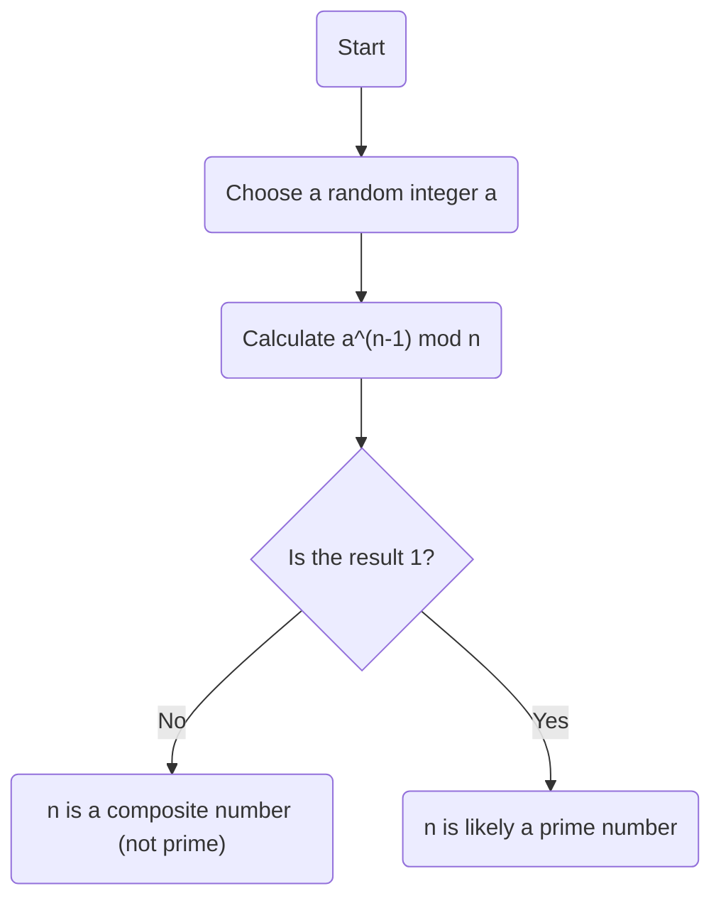
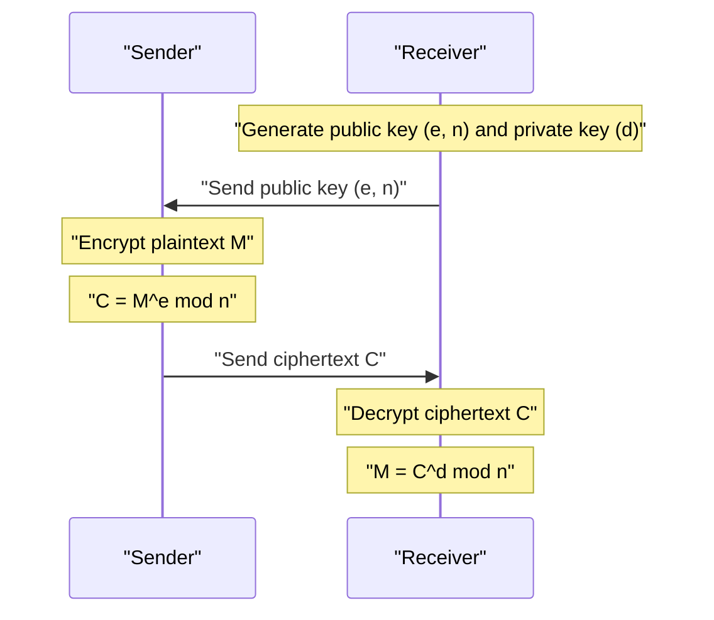

In modern internet society, we owe our ability to communicate securely to **cryptography**. At the very foundation of this cryptography lies a beautiful theorem discovered by the 17th-century mathematician [Pierre de Fermat](https://kenji.blog/en/p/fermat/).

In this article, we will explain **[Fermat's Little Theorem](https://kenji.blog/en/p/fermats-little-theorem/)**, a crucial cornerstone of number theory, in an easy-to-understand manner, covering its meaning, proof, and how it is applied to modern RSA cryptography.

## What is [Fermat's Little Theorem](https://kenji.blog/en/p/fermats-little-theorem/)?

[Fermat's Little Theorem](https://kenji.blog/en/p/fermats-little-theorem/) is an extremely simple yet powerful theorem that demonstrates the relationship between prime numbers and integers.

The theorem states the following:

> **[Fermat's Little Theorem](https://kenji.blog/en/p/fermats-little-theorem/)**
> Let $p$ be a prime number, and $a$ be any integer not divisible by $p$ (meaning $a$ and $p$ are coprime). Then, the following congruence relation holds true:
> 
> $$ a^{p-1} \equiv 1 \pmod p $$

This means that "when the integer $a$ is raised to the power of $p-1$ and divided by the prime number $p$, the remainder is always $1$".

Also, by multiplying both sides by $a$, it can be transformed into a more general form that removes the condition that "$a$ is not a multiple of $p$".

> $$ a^p \equiv a \pmod p $$
> (Holds true for any integer $a$)

### Verifying with Concrete Examples

Let's plug in some actual numbers to verify if the theorem holds true.

**Example 1: $p = 5$ (prime), $a = 2$**
- $p-1 = 4$.
- $a^{p-1} = 2^4 = 16$.
- When $16$ is divided by $5$, the quotient is $3$ and the **remainder is $1$** ($16 \equiv 1 \pmod 5$).

**Example 2: $p = 7$ (prime), $a = 3$**
- $p-1 = 6$.
- $a^{p-1} = 3^6 = 729$.
- When $729$ is divided by $7$, the quotient is $104$ and the **remainder is $1$** ($729 = 7 \times 104 + 1$).

In this way, no matter what prime number $p$ you choose, this mysterious law holds true.

## Proof of the Theorem

There are several approaches to proving [Fermat's Little Theorem](https://kenji.blog/en/p/fermats-little-theorem/), but here we introduce a representative proof method based on number theory.

Let $p$ be a prime number and $a$ be an integer not divisible by $p$.
Consider the set $S = \{1, 2, 3, \dots, p-1\}$. Let $S'$ be a new set created by multiplying each element of this set by $a$.

$$ S' = \{a, 2a, 3a, \dots, (p-1)a\} $$

Consider the remainder when each element of this set $S'$ is divided by $p$. Surprisingly, all these remainders are distinct, and furthermore, none of them are $0$. In other words, the set of remainders perfectly matches the original set $S$ (ignoring the order).

Therefore, the product of the elements of $S$ and the product of the elements of $S'$ are congruent modulo $p$.

$$ 1 \times 2 \times \dots \times (p-1) \equiv a \times 2a \times \dots \times (p-1)a \pmod p $$

Simplifying this gives:

$$ (p-1)! \equiv a^{p-1} \times (p-1)! \pmod p $$

Since $(p-1)!$ and $p$ are coprime, we can divide both sides by $(p-1)!$ (a property of division in congruence relations). As a result, the following theorem is derived:

$$ 1 \equiv a^{p-1} \pmod p $$

This completes the proof.

## [Fermat](https://kenji.blog/en/p/fermat/) Primality Test: Application to Prime Testing

This theorem is applied in a **primality test algorithm** (the [Fermat](https://kenji.blog/en/p/fermat/) primality test) to determine whether a given number is prime.

If you want to know whether a huge number $n$ is prime, randomly choose $a$ and check if $a^{n-1} \equiv 1 \pmod n$ holds true. If it does not hold true, then $n$ is **absolutely not a prime number** (it is a composite number).

However, because there exist exceptional numbers called **Carmichael numbers**, which are composite numbers yet satisfy $a^{n-1} \equiv 1 \pmod n$, this test alone cannot definitively prove primality. Therefore, in practice, methods like the Miller-Rabin primality test are used.

## Application to Modern [Crypto](https://kenji.blog/en/p/cryptocurrency-and-bitcoin/)graphy: RSA [Crypto](https://kenji.blog/en/p/cryptocurrency-and-bitcoin/)graphy

The most important application of [Fermat's Little Theorem](https://kenji.blog/en/p/fermats-little-theorem/) (and its generalization, **Euler's Theorem**) is **RSA cryptography**, which underpins internet security.

RSA cryptography relies on the difficulty of factoring massive numbers for its security. Within its mechanism, the principle of "[Fermat's Little Theorem](https://kenji.blog/en/p/fermats-little-theorem/)" plays a decisive role in the key generation and decryption processes.

In RSA cryptography, two huge prime numbers, $p$ and $q$, are prepared, and we set $n = p \times q$.
By Euler's Theorem, the keys ($e$ and $d$) are designed so that $M^{ed} \equiv M \pmod n$ holds true in the encryption and decryption processes. Here, the magical phenomenon of the plaintext $M$ returning to its original form essentially relies on the mathematical properties guaranteed by [Fermat's Little Theorem](https://kenji.blog/en/p/fermats-little-theorem/).

## Conclusion

A small theorem discovered by [Pierre de Fermat](https://kenji.blog/en/p/fermat/) in the 17th century has become an indispensable element supporting the foundation of information security in modern society hundreds of years later.

**[Fermat's Little Theorem](https://kenji.blog/en/p/fermats-little-theorem/)** can be said to be one of the most beautiful examples demonstrating how pure mathematics connects to practical technology (cryptography and algorithms). One cannot help but be amazed by the depth of mathematics and the breadth of its applicability.
