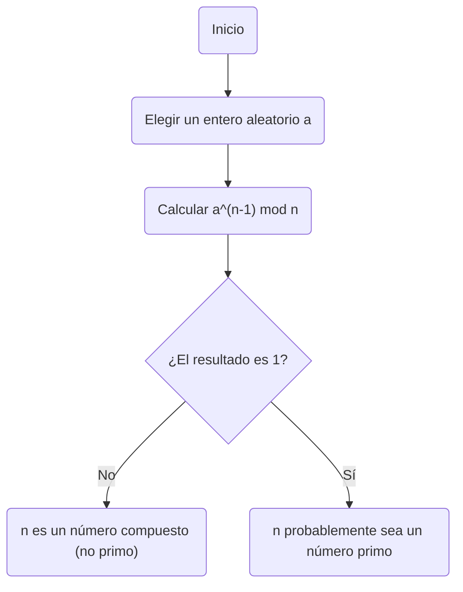
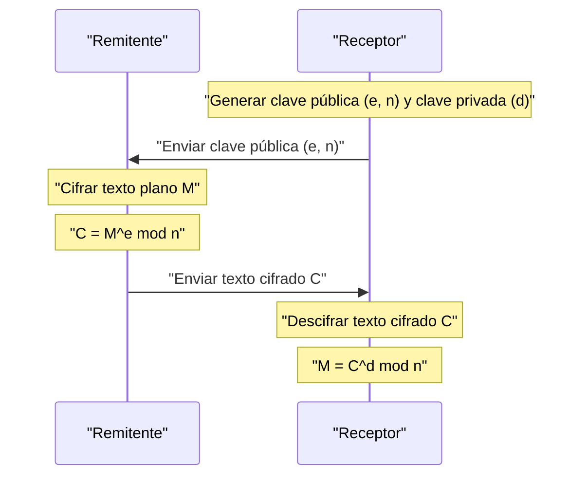

En la sociedad actual de Internet, nuestra capacidad para comunicarnos de forma segura se debe a la **criptografía**. En la base de esta criptografía se encuentra un hermoso teorema descubierto en el siglo XVII por el matemático [Pierre de Fermat](https://kenji.blog/es/p/fermat/).

En este artículo, explicaremos **el Pequeño Teorema de [Fermat](https://kenji.blog/es/p/fermat/)**, una piedra angular crucial de la teoría de números, de una manera fácil de entender, cubriendo su significado, demostración y cómo se aplica en la criptografía [RSA](https://kenji.blog/es/p/modern-cryptography-public-key-hash-signature/) moderna.

## ¿Qué es el Pequeño Teorema de [Fermat](https://kenji.blog/es/p/fermat/)?

[El Pequeño Teorema de Fermat](https://kenji.blog/es/p/fermats-little-theorem/) es un teorema extremadamente simple pero poderoso que demuestra la relación entre los números primos y los números enteros.

El teorema establece lo siguiente:

> **Pequeño Teorema de [Fermat](https://kenji.blog/es/p/fermat/)**
> Sea $p$ un número primo y $a$ un número entero cualquiera que no sea divisible por $p$ (es decir, $a$ y $p$ son coprimos). Entonces, se cumple la siguiente relación de congruencia:
> 
> $$ a^{p-1} \equiv 1 \pmod p $$

Esto significa que "cuando el número entero $a$ se eleva a la potencia de $p-1$ y se divide por el número primo $p$, el resto es siempre $1$".

Además, multiplicando ambos lados por $a$, se puede transformar en una forma más general que elimina la condición de que "$a$ no sea un múltiplo de $p$".

> $$ a^p \equiv a \pmod p $$
> (Se cumple para cualquier número entero $a$)

### Verificación con ejemplos concretos

Introduzcamos algunos números reales para verificar si el teorema se cumple.

**Ejemplo 1: $p = 5$ (primo), $a = 2$**
- $p-1 = 4$.
- $a^{p-1} = 2^4 = 16$.
- Cuando $16$ se divide por $5$, el cociente es $3$ y **el resto es $1$** ($16 \equiv 1 \pmod 5$).

**Ejemplo 2: $p = 7$ (primo), $a = 3$**
- $p-1 = 6$.
- $a^{p-1} = 3^6 = 729$.
- Cuando $729$ se divide por $7$, el cociente es $104$ y **el resto es $1$** ($729 = 7 \times 104 + 1$).

De esta manera, sin importar qué número primo $p$ elija, esta misteriosa ley se cumple.

## Demostración del Teorema

Hay varios enfoques para demostrar el Pequeño Teorema de [Fermat](https://kenji.blog/es/p/fermat/), pero aquí introducimos un método de demostración representativo basado en la teoría de números.

Sea $p$ un número primo y $a$ un número entero no divisible por $p$.
Consideremos el conjunto $S = \{1, 2, 3, \dots, p-1\}$. Sea $S'$ un nuevo conjunto creado multiplicando cada elemento de este conjunto por $a$.

$$ S' = \{a, 2a, 3a, \dots, (p-1)a\} $$

Consideremos el resto cuando cada elemento de este conjunto $S'$ se divide por $p$. Sorprendentemente, todos estos restos son distintos y, además, ninguno de ellos es $0$. En otras palabras, el conjunto de los restos coincide perfectamente con el conjunto original $S$ (ignorando el orden).

Por lo tanto, el producto de los elementos de $S$ y el producto de los elementos de $S'$ son congruentes módulo $p$.

$$ 1 \times 2 \times \dots \times (p-1) \equiv a \times 2a \times \dots \times (p-1)a \pmod p $$

Simplificando esto obtenemos:

$$ (p-1)! \equiv a^{p-1} \times (p-1)! \pmod p $$

Dado que $(p-1)!$ y $p$ son coprimos, podemos dividir ambos lados por $(p-1)!$ (una propiedad de la división en relaciones de congruencia). Como resultado, se deriva el siguiente teorema:

$$ 1 \equiv a^{p-1} \pmod p $$

Con esto se completa la demostración.

## Test de Primalidad de [Fermat](https://kenji.blog/es/p/fermat/): Aplicación en la Detección de Primos

Este teorema se aplica en un **algoritmo de test de primalidad** (el test de primalidad de [Fermat](https://kenji.blog/es/p/fermat/)) para determinar si un número dado es primo.

Si desea saber si un número enorme $n$ es primo, elija aleatoriamente $a$ y verifique si se cumple $a^{n-1} \equiv 1 \pmod n$. Si no se cumple, entonces $n$ **absolutamente no es un número primo** (es un número compuesto).

Sin embargo, debido a que existen números excepcionales llamados **números de Carmichael**, que son números compuestos pero que satisfacen $a^{n-1} \equiv 1 \pmod n$, esta prueba por sí sola no puede probar definitivamente la primalidad. Por lo tanto, en la práctica, se utilizan métodos como el test de primalidad de Miller-Rabin.

## Aplicación a la Criptografía Moderna: Criptografía [RSA](https://kenji.blog/es/p/modern-cryptography-public-key-hash-signature/)

La aplicación más importante del Pequeño Teorema de [Fermat](https://kenji.blog/es/p/fermat/) (y su generalización, el **Teorema de Euler**) es la **criptografía [RSA](https://kenji.blog/es/p/modern-cryptography-public-key-hash-signature/)**, que sustenta la seguridad de Internet.

La criptografía RSA se basa en la dificultad de factorizar números masivos para su seguridad. Dentro de su mecanismo, el principio del "Pequeño Teorema de [Fermat](https://kenji.blog/es/p/fermat/)" juega un papel decisivo en los procesos de generación de claves y descifrado.

En la criptografía [RSA](https://kenji.blog/es/p/modern-cryptography-public-key-hash-signature/), se preparan dos enormes números primos, $p$ y $q$, y establecemos $n = p \times q$.
Por el Teorema de Euler, las claves ($e$ y $d$) se diseñan para que $M^{ed} \equiv M \pmod n$ se cumpla en los procesos de cifrado y descifrado. Aquí, el fenómeno mágico de que el texto plano $M$ vuelva a su forma original depende esencialmente de las propiedades matemáticas garantizadas por el Pequeño Teorema de [Fermat](https://kenji.blog/es/p/fermat/).

## Conclusión

Un pequeño teorema descubierto por [Pierre de Fermat](https://kenji.blog/es/p/fermat/) en el siglo XVII se ha convertido en un elemento indispensable que sustenta la base de la seguridad de la información en la sociedad moderna cientos de años después.

**[El Pequeño Teorema de Fermat](https://kenji.blog/es/p/fermats-little-theorem/)** puede considerarse uno de los ejemplos más hermosos que demuestran cómo las matemáticas puras se conectan con la tecnología práctica (criptografía y algoritmos). Uno no puede evitar asombrarse por la profundidad de las matemáticas y la amplitud de su aplicabilidad.
