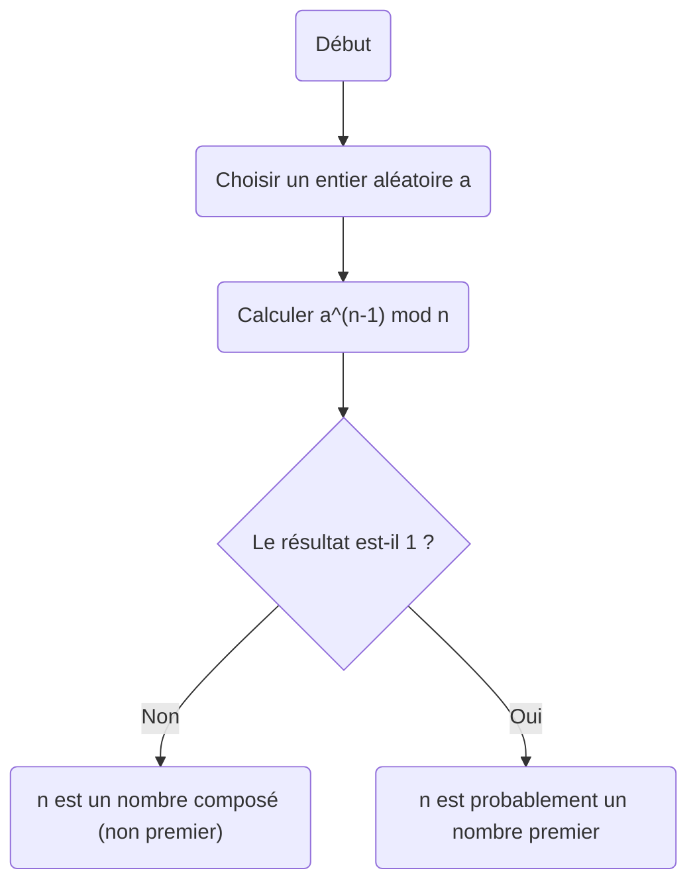
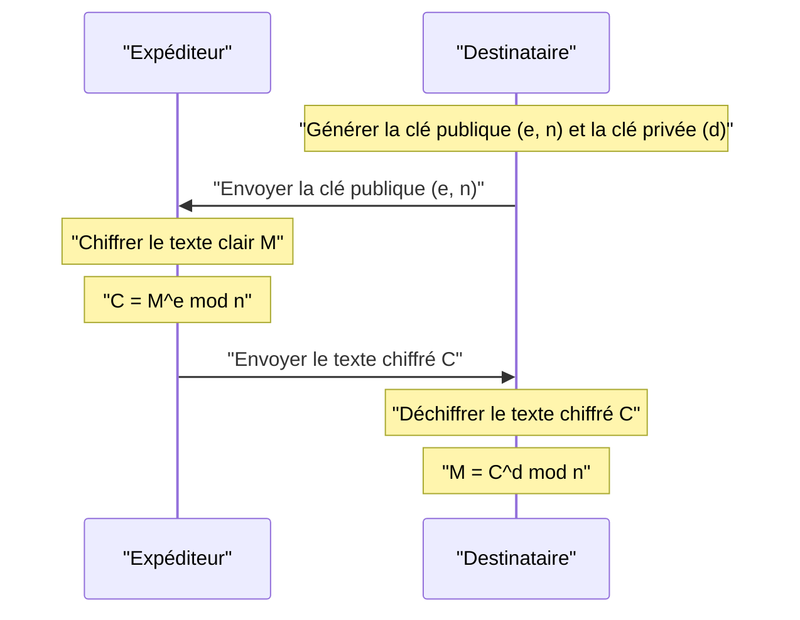

Dans la société Internet moderne, nous devons notre capacité à communiquer en toute sécurité à la **cryptographie**. À la base même de cette cryptographie se trouve un magnifique théorème découvert par le mathématicien du XVIIe siècle Pierre de Fermat.

Dans cet article, nous expliquerons **le petit théorème de Fermat**, une pierre angulaire cruciale de la théorie des nombres, d'une manière facile à comprendre, en couvrant sa signification, sa démonstration et la façon dont il est appliqué à la cryptographie RSA moderne.

## Qu'est-ce que le petit théorème de Fermat ?

Le petit théorème de Fermat est un théorème extrêmement simple mais puissant qui démontre la relation entre les nombres premiers et les nombres entiers.

Le théorème énonce ce qui suit :

> **Petit Théorème de Fermat**
> Soit $p$ un nombre premier, et $a$ un nombre entier quelconque non divisible par $p$ (c'est-à-dire que $a$ et $p$ sont premiers entre eux). Alors, la relation de congruence suivante est vraie :
> 
> $$ a^{p-1} \equiv 1 \pmod p $$

Cela signifie que "lorsque l'entier $a$ est élevé à la puissance $p-1$ et divisé par le nombre premier $p$, le reste est toujours $1$".

De plus, en multipliant les deux côtés par $a$, il peut être transformé en une forme plus générale qui supprime la condition selon laquelle "$a$ n'est pas un multiple de $p$".

> $$ a^p \equiv a \pmod p $$
> (Vrai pour tout entier $a$)

### Vérification avec des exemples concrets

Insérons quelques nombres réels pour vérifier si le théorème est vrai.

**Exemple 1 : $p = 5$ (premier), $a = 2$**
- $p-1 = 4$.
- $a^{p-1} = 2^4 = 16$.
- Lorsque $16$ est divisé par $5$, le quotient est $3$ et **le reste est $1$** ($16 \equiv 1 \pmod 5$).

**Exemple 2 : $p = 7$ (premier), $a = 3$**
- $p-1 = 6$.
- $a^{p-1} = 3^6 = 729$.
- Lorsque $729$ est divisé par $7$, le quotient est $104$ et **le reste est $1$** ($729 = 7 \times 104 + 1$).

De cette façon, peu importe le nombre premier $p$ que vous choisissez, cette loi mystérieuse est vraie.

## Démonstration du théorème

Il existe plusieurs approches pour démontrer le petit théorème de Fermat, mais nous introduisons ici une méthode de démonstration représentative basée sur la théorie des nombres.

Soit $p$ un nombre premier et $a$ un entier non divisible par $p$.
Considérez l'ensemble $S = \{1, 2, 3, \dots, p-1\}$. Soit $S'$ un nouvel ensemble créé en multipliant chaque élément de cet ensemble par $a$.

$$ S' = \{a, 2a, 3a, \dots, (p-1)a\} $$

Considérez le reste lorsque chaque élément de cet ensemble $S'$ est divisé par $p$. Étonnamment, tous ces restes sont distincts et, de plus, aucun d'entre eux n'est $0$. En d'autres termes, l'ensemble des restes correspond parfaitement à l'ensemble d'origine $S$ (en ignorant l'ordre).

Par conséquent, le produit des éléments de $S$ et le produit des éléments de $S'$ sont congrus modulo $p$.

$$ 1 \times 2 \times \dots \times (p-1) \equiv a \times 2a \times \dots \times (p-1)a \pmod p $$

En simplifiant cela, on obtient :

$$ (p-1)! \equiv a^{p-1} \times (p-1)! \pmod p $$

Puisque $(p-1)!$ et $p$ sont premiers entre eux, nous pouvons diviser les deux côtés par $(p-1)!$ (une propriété de la division dans les relations de congruence). Par conséquent, le théorème suivant est dérivé :

$$ 1 \equiv a^{p-1} \pmod p $$

Ceci complète la démonstration.

## Test de primalité de Fermat : Application à la détection de nombres premiers

Ce théorème est appliqué dans un **algorithme de test de primalité** (le test de primalité de Fermat) pour déterminer si un nombre donné est premier.

Si vous voulez savoir si un nombre énorme $n$ est premier, choisissez au hasard $a$ et vérifiez si $a^{n-1} \equiv 1 \pmod n$ est vrai. Si ce n'est pas le cas, alors $n$ n'est **absolument pas un nombre premier** (c'est un nombre composé).

Cependant, parce qu'il existe des nombres exceptionnels appelés **nombres de Carmichael**, qui sont des nombres composés mais satisfont à $a^{n-1} \equiv 1 \pmod n$, ce test seul ne peut pas prouver définitivement la primalité. Par conséquent, dans la pratique, des méthodes comme le test de primalité de Miller-Rabin sont utilisées.

## Application à la cryptographie moderne : Cryptographie RSA

L'application la plus importante du petit théorème de Fermat (et de sa généralisation, le **théorème d'Euler**) est la **cryptographie RSA**, qui sous-tend la sécurité d'Internet.

La cryptographie RSA repose sur la difficulté de factoriser des nombres massifs pour sa sécurité. Dans son mécanisme, le principe du « petit théorème de Fermat » joue un rôle décisif dans les processus de génération de clés et de déchiffrement.

Dans la cryptographie RSA, deux énormes nombres premiers, $p$ et $q$, sont préparés, et nous définissons $n = p \times q$.
Par le théorème d'Euler, les clés ($e$ et $d$) sont conçues pour que $M^{ed} \equiv M \pmod n$ soit vrai dans les processus de chiffrement et de déchiffrement. Ici, le phénomène magique du texte clair $M$ reprenant sa forme d'origine repose essentiellement sur les propriétés mathématiques garanties par le petit théorème de Fermat.

## Conclusion

Un petit théorème découvert par Pierre de Fermat au XVIIe siècle est devenu un élément indispensable soutenant le fondement de la sécurité de l'information dans la société moderne des centaines d'années plus tard.

**Le petit théorème de Fermat** peut être considéré comme l'un des plus beaux exemples démontrant comment les mathématiques pures se connectent à la technologie pratique (cryptographie et algorithmes). On ne peut s'empêcher d'être étonné par la profondeur des mathématiques et l'étendue de leur applicabilité.
