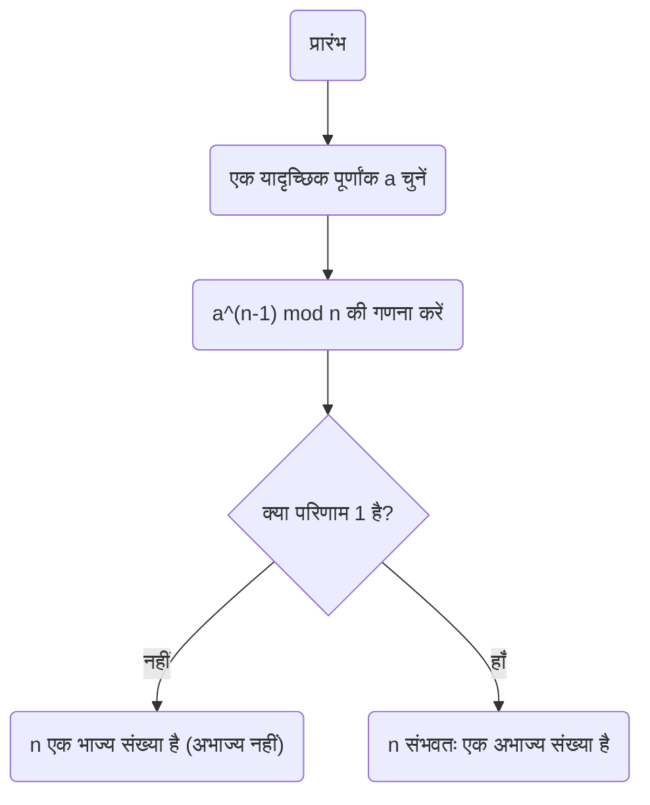
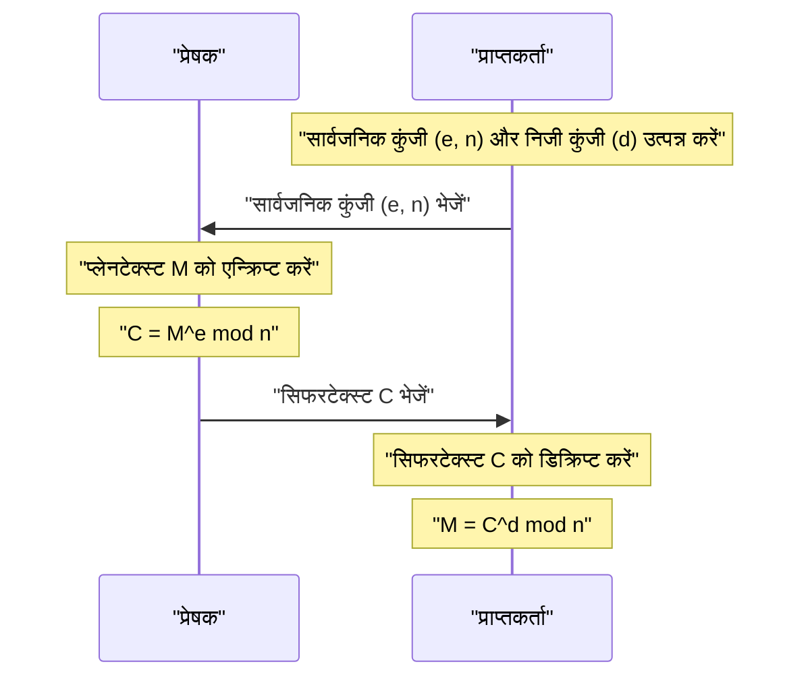

आधुनिक इंटरनेट समाज में, सुरक्षित रूप से संवाद करने की हमारी क्षमता **क्रिप्टोग्राफी** के कारण है। इस क्रिप्टोग्राफी के मूल में 17 वीं शताब्दी के गणितज्ञ पियरे डी फर्मेंट द्वारा खोजा गया एक सुंदर प्रमेय निहित है।

इस लेख में, हम संख्या सिद्धांत की एक महत्वपूर्ण आधारशिला, **[फर्मेंट का छोटा प्रमेय](https://kenji.blog/hi/p/fermats-little-theorem/)**, को आसानी से समझने योग्य तरीके से समझाएंगे, जिसमें इसके अर्थ, प्रमाण और आधुनिक [RSA](https://kenji.blog/hi/p/modern-cryptography-public-key-hash-signature/) क्रिप्टोग्राफी में इसे कैसे लागू किया जाता है, शामिल है।

## [फर्मेंट का छोटा प्रमेय](https://kenji.blog/hi/p/fermats-little-theorem/) क्या है?

[फर्मेंट का छोटा प्रमेय](https://kenji.blog/hi/p/fermats-little-theorem/) एक अत्यंत सरल लेकिन शक्तिशाली प्रमेय है जो अभाज्य संख्याओं और पूर्णांकों के बीच संबंध को प्रदर्शित करता है।

प्रमेय निम्नलिखित बताता है:

> **[फर्मेंट का छोटा प्रमेय](https://kenji.blog/hi/p/fermats-little-theorem/)**
> मान लीजिए $p$ एक अभाज्य संख्या है, और $a$ कोई भी पूर्णांक है जो $p$ से विभाज्य नहीं है (जिसका अर्थ है $a$ और $p$ सह-अभाज्य हैं)। तब, निम्नलिखित सर्वांगसमता संबंध सत्य होता है:
> 
> $$ a^{p-1} \equiv 1 \pmod p $$

इसका अर्थ है कि "जब पूर्णांक $a$ को $p-1$ की घात तक बढ़ाया जाता है और अभाज्य संख्या $p$ से विभाजित किया जाता है, तो शेषफल हमेशा $1$ होता है"।

इसके अलावा, दोनों पक्षों को $a$ से गुणा करके, इसे एक अधिक सामान्य रूप में बदला जा सकता है जो इस शर्त को हटा देता है कि "$a$, $p$ का गुणज नहीं है"।

> $$ a^p \equiv a \pmod p $$
> (किसी भी पूर्णांक $a$ के लिए सत्य है)

### ठोस उदाहरणों के साथ सत्यापन

आइए यह सत्यापित करने के लिए कुछ वास्तविक संख्याओं को प्लग इन करें कि क्या प्रमेय सत्य है।

**उदाहरण 1: $p = 5$ (अभाज्य), $a = 2$**
- $p-1 = 4$.
- $a^{p-1} = 2^4 = 16$.
- जब $16$ को $5$ से विभाजित किया जाता है, तो भागफल $3$ होता है और **शेषफल $1$ होता है** ($16 \equiv 1 \pmod 5$).

**उदाहरण 2: $p = 7$ (अभाज्य), $a = 3$**
- $p-1 = 6$.
- $a^{p-1} = 3^6 = 729$.
- जब $729$ को $7$ से विभाजित किया जाता है, तो भागफल $104$ होता है और **शेषफल $1$ होता है** ($729 = 7 \times 104 + 1$).

इस तरह, चाहे आप कोई भी अभाज्य संख्या $p$ चुनें, यह रहस्यमय नियम सत्य होता है।

## प्रमेय का प्रमाण

फर्मेंट के छोटे प्रमेय को सिद्ध करने के कई दृष्टिकोण हैं, लेकिन यहाँ हम संख्या सिद्धांत पर आधारित एक प्रतिनिधि प्रमाण पद्धति प्रस्तुत करते हैं।

मान लीजिए $p$ एक अभाज्य संख्या है और $a$ एक पूर्णांक है जो $p$ से विभाज्य नहीं है।
सेट $S = \{1, 2, 3, \dots, p-1\}$ पर विचार करें। मान लीजिए $S'$ इस सेट के प्रत्येक तत्व को $a$ से गुणा करके बनाया गया एक नया सेट है।

$$ S' = \{a, 2a, 3a, \dots, (p-1)a\} $$

जब इस सेट $S'$ के प्रत्येक तत्व को $p$ से विभाजित किया जाता है तो शेषफल पर विचार करें। आश्चर्यजनक रूप से, ये सभी शेषफल अलग-अलग हैं, और इसके अलावा, उनमें से कोई भी $0$ नहीं है। दूसरे शब्दों में, शेषफल का सेट मूल सेट $S$ (क्रम को अनदेखा करते हुए) से पूरी तरह मेल खाता है।

इसलिए, $S$ के तत्वों का गुणनफल और $S'$ के तत्वों का गुणनफल modulo $p$ के सर्वांगसम हैं।

$$ 1 \times 2 \times \dots \times (p-1) \equiv a \times 2a \times \dots \times (p-1)a \pmod p $$

इसे सरल करने पर प्राप्त होता है:

$$ (p-1)! \equiv a^{p-1} \times (p-1)! \pmod p $$

चूंकि $(p-1)!$ और $p$ सह-अभाज्य हैं, इसलिए हम दोनों पक्षों को $(p-1)!$ से विभाजित कर सकते हैं (सर्वांगसमता संबंधों में विभाजन का एक गुण)। परिणामस्वरूप, निम्नलिखित प्रमेय प्राप्त होता है:

$$ 1 \equiv a^{p-1} \pmod p $$

यह प्रमाण पूरा करता है।

## फर्मेंट प्राइमलिटी टेस्ट: अभाज्य परीक्षण के लिए अनुप्रयोग

यह प्रमेय यह निर्धारित करने के लिए **प्राइमलिटी टेस्ट एल्गोरिथम** (फर्मेंट प्राइमलिटी टेस्ट) में लागू किया जाता है कि क्या दी गई संख्या अभाज्य है।

यदि आप जानना चाहते हैं कि क्या कोई बड़ी संख्या $n$ अभाज्य है, तो यादृच्छिक रूप से $a$ चुनें और जांचें कि क्या $a^{n-1} \equiv 1 \pmod n$ सत्य है। यदि यह सत्य नहीं है, तो $n$ **बिल्कुल भी अभाज्य संख्या नहीं है** (यह एक भाज्य संख्या है)।

हालाँकि, क्योंकि **कार्माइकल संख्याएँ** नामक असाधारण संख्याएँ मौजूद हैं, जो भाज्य संख्याएँ हैं फिर भी $a^{n-1} \equiv 1 \pmod n$ को संतुष्ट करती हैं, यह परीक्षण अकेले निश्चित रूप से अभाज्य होने का प्रमाण नहीं दे सकता है। इसलिए, व्यवहार में, मिलर-राबिन प्राइमलिटी टेस्ट जैसी विधियों का उपयोग किया जाता है।

## आधुनिक क्रिप्टोग्राफी में अनुप्रयोग: [RSA](https://kenji.blog/hi/p/modern-cryptography-public-key-hash-signature/) क्रिप्टोग्राफी

फर्मेंट के छोटे प्रमेय (और इसके सामान्यीकरण, **यूलर के प्रमेय**) का सबसे महत्वपूर्ण अनुप्रयोग **RSA क्रिप्टोग्राफी** है, जो इंटरनेट सुरक्षा को रेखांकित करता है।

RSA क्रिप्टोग्राफी अपनी सुरक्षा के लिए भारी संख्याओं को फैक्टर करने की कठिनाई पर निर्भर करती है। इसके तंत्र के भीतर, "फर्मेंट के छोटे प्रमेय" का सिद्धांत कुंजी निर्माण और डिक्रिप्शन प्रक्रियाओं में निर्णायक भूमिका निभाता है।

[RSA](https://kenji.blog/hi/p/modern-cryptography-public-key-hash-signature/) क्रिप्टोग्राफी में, दो विशाल अभाज्य संख्याएँ, $p$ और $q$, तैयार की जाती हैं, और हम $n = p \times q$ सेट करते हैं।
यूलर के प्रमेय द्वारा, कुंजियों ($e$ और $d$) को इस तरह से डिज़ाइन किया गया है कि एन्क्रिप्शन और डिक्रिप्शन प्रक्रियाओं में $M^{ed} \equiv M \pmod n$ सत्य हो। यहाँ, प्लेनटेक्स्ट $M$ के अपने मूल रूप में लौटने की जादुई घटना अनिवार्य रूप से फर्मेंट के छोटे प्रमेय द्वारा गारंटीकृत गणितीय गुणों पर निर्भर करती है।

## निष्कर्ष

17 वीं शताब्दी में पियरे डी फर्मेंट द्वारा खोजा गया एक छोटा सा प्रमेय सैकड़ों वर्षों बाद आधुनिक समाज में सूचना सुरक्षा की नींव का समर्थन करने वाला एक अनिवार्य तत्व बन गया है।

**फर्मेंट के छोटे प्रमेय** को यह प्रदर्शित करने वाले सबसे सुंदर उदाहरणों में से एक कहा जा सकता है कि कैसे शुद्ध गणित व्यावहारिक प्रौद्योगिकी (क्रिप्टोग्राफी और एल्गोरिदम) से जुड़ता है। कोई भी गणित की गहराई और इसकी प्रयोज्यता की चौड़ाई पर चकित हुए बिना नहीं रह सकता।
