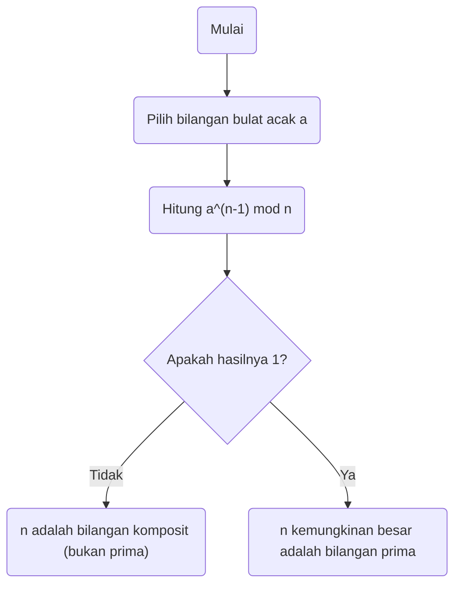
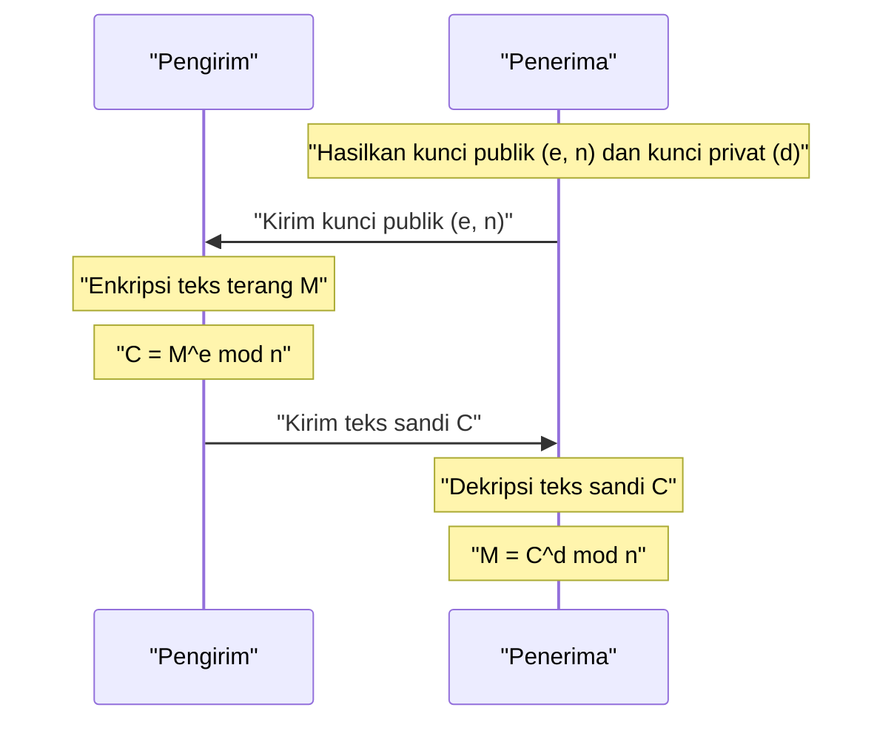

Dalam masyarakat internet modern, kemampuan kita untuk berkomunikasi secara aman berkat **kriptografi**. Di dasar kriptografi ini terdapat sebuah teorema indah yang ditemukan pada abad ke-17 oleh matematikawan [Pierre de Fermat](https://kenji.blog/id/p/fermat/).

Dalam artikel ini, kita akan menjelaskan **[Teorema Kecil Fermat](https://kenji.blog/id/p/fermats-little-theorem/)**, landasan penting dari teori bilangan, dengan cara yang mudah dipahami, mencakup makna, pembuktian, dan bagaimana hal itu diterapkan pada kriptografi RSA modern.

## Apa itu [Teorema Kecil Fermat](https://kenji.blog/id/p/fermats-little-theorem/)?

[Teorema Kecil Fermat](https://kenji.blog/id/p/fermats-little-theorem/) adalah teorema yang sangat sederhana namun kuat yang menunjukkan hubungan antara bilangan prima dan bilangan bulat.

Teorema tersebut menyatakan sebagai berikut:

> **[Teorema Kecil Fermat](https://kenji.blog/id/p/fermats-little-theorem/)**
> Misalkan $p$ adalah bilangan prima, dan $a$ adalah bilangan bulat apa pun yang tidak habis dibagi oleh $p$ (artinya $a$ dan $p$ adalah koprima). Maka, relasi kongruensi berikut berlaku:
> 
> $$ a^{p-1} \equiv 1 \pmod p $$

Ini berarti bahwa "ketika bilangan bulat $a$ dipangkatkan $p-1$ dan dibagi dengan bilangan prima $p$, sisanya selalu $1$".

Selain itu, dengan mengalikan kedua ruas dengan $a$, dapat diubah menjadi bentuk yang lebih umum yang menghilangkan syarat bahwa "$a$ bukan kelipatan $p$".

> $$ a^p \equiv a \pmod p $$
> (Berlaku untuk semua bilangan bulat $a$)

### Verifikasi dengan Contoh Konkret

Mari kita masukkan beberapa angka nyata untuk memverifikasi apakah teorema tersebut berlaku.

**Contoh 1: $p = 5$ (prima), $a = 2$**
- $p-1 = 4$.
- $a^{p-1} = 2^4 = 16$.
- Ketika $16$ dibagi dengan $5$, hasil baginya adalah $3$ dan **sisanya adalah $1$** ($16 \equiv 1 \pmod 5$).

**Contoh 2: $p = 7$ (prima), $a = 3$**
- $p-1 = 6$.
- $a^{p-1} = 3^6 = 729$.
- Ketika $729$ dibagi dengan $7$, hasil baginya adalah $104$ dan **sisanya adalah $1$** ($729 = 7 \times 104 + 1$).

Dengan cara ini, tidak peduli bilangan prima $p$ apa yang Anda pilih, hukum misterius ini berlaku.

## Pembuktian Teorema

Ada beberapa pendekatan untuk membuktikan [Teorema Kecil Fermat](https://kenji.blog/id/p/fermats-little-theorem/), namun di sini kami memperkenalkan metode pembuktian representatif berdasarkan teori bilangan.

Misalkan $p$ adalah bilangan prima dan $a$ bilangan bulat yang tidak habis dibagi oleh $p$.
Pertimbangkan himpunan $S = \{1, 2, 3, \dots, p-1\}$. Misalkan $S'$ adalah himpunan baru yang dibuat dengan mengalikan setiap elemen dari himpunan ini dengan $a$.

$$ S' = \{a, 2a, 3a, \dots, (p-1)a\} $$

Pertimbangkan sisa pembagian ketika setiap elemen dari himpunan $S'$ ini dibagi dengan $p$. Secara mengejutkan, semua sisa pembagian ini berbeda, dan lebih jauh lagi, tak satu pun dari sisa tersebut adalah $0$. Dengan kata lain, himpunan sisa pembagian tersebut sangat cocok dengan himpunan asli $S$ (mengabaikan urutannya).

Oleh karena itu, hasil kali elemen-elemen $S$ dan hasil kali elemen-elemen $S'$ adalah kongruen modulo $p$.

$$ 1 \times 2 \times \dots \times (p-1) \equiv a \times 2a \times \dots \times (p-1)a \pmod p $$

Menyederhanakannya memberikan:

$$ (p-1)! \equiv a^{p-1} \times (p-1)! \pmod p $$

Karena $(p-1)!$ dan $p$ adalah koprima, kita dapat membagi kedua ruas dengan $(p-1)!$ (sifat pembagian dalam relasi kongruensi). Sebagai hasilnya, teorema berikut diturunkan:

$$ 1 \equiv a^{p-1} \pmod p $$

Ini melengkapi pembuktian.

## Uji Primalitas Fermat: Aplikasi pada Pengujian Bilangan Prima

Teorema ini diterapkan dalam sebuah **algoritma uji primalitas** (uji primalitas Fermat) untuk menentukan apakah suatu bilangan prima.

Jika Anda ingin tahu apakah suatu bilangan besar $n$ adalah prima, pilih $a$ secara acak dan periksa apakah $a^{n-1} \equiv 1 \pmod n$ berlaku. Jika tidak berlaku, maka $n$ **sama sekali bukan bilangan prima** (itu adalah bilangan komposit).

Namun, karena terdapat bilangan-bilangan pengecualian yang disebut **bilangan Carmichael**, yang merupakan bilangan komposit namun memenuhi $a^{n-1} \equiv 1 \pmod n$, uji ini saja tidak dapat membuktikan keprimaan secara definitif. Oleh karena itu, dalam praktiknya, metode seperti uji primalitas Miller-Rabin digunakan.

## Aplikasi pada Kriptografi Modern: Kriptografi RSA

Aplikasi terpenting dari [Teorema Kecil Fermat](https://kenji.blog/id/p/fermats-little-theorem/) (dan generalisasinya, **Teorema Euler**) adalah **kriptografi RSA**, yang mendasari keamanan internet.

Kriptografi RSA bergantung pada kesulitan memfaktorkan bilangan besar untuk keamanannya. Dalam mekanismenya, prinsip "[Teorema Kecil Fermat](https://kenji.blog/id/p/fermats-little-theorem/)" memainkan peran yang sangat penting dalam proses pembuatan kunci dan dekripsi.

Dalam kriptografi RSA, dua bilangan prima besar, $p$ dan $q$, disiapkan, dan kita menetapkan $n = p \times q$.
Menurut Teorema Euler, kunci ($e$ dan $d$) dirancang sedemikian rupa sehingga $M^{ed} \equiv M \pmod n$ berlaku dalam proses enkripsi dan dekripsi. Di sini, fenomena magis dari teks terang $M$ yang kembali ke bentuk aslinya pada dasarnya bergantung pada sifat-sifat matematis yang dijamin oleh [Teorema Kecil Fermat](https://kenji.blog/id/p/fermats-little-theorem/).

## Kesimpulan

Sebuah teorema kecil yang ditemukan oleh [Pierre de Fermat](https://kenji.blog/id/p/fermat/) pada abad ke-17 telah menjadi elemen tak terpisahkan yang mendukung fondasi keamanan informasi dalam masyarakat modern ratusan tahun kemudian.

**[Teorema Kecil Fermat](https://kenji.blog/id/p/fermats-little-theorem/)** dapat dikatakan sebagai salah satu contoh paling indah yang menunjukkan bagaimana matematika murni terhubung dengan teknologi praktis (kriptografi dan algoritma). Seseorang tidak bisa tidak kagum dengan kedalaman matematika dan luasnya penerapannya.
