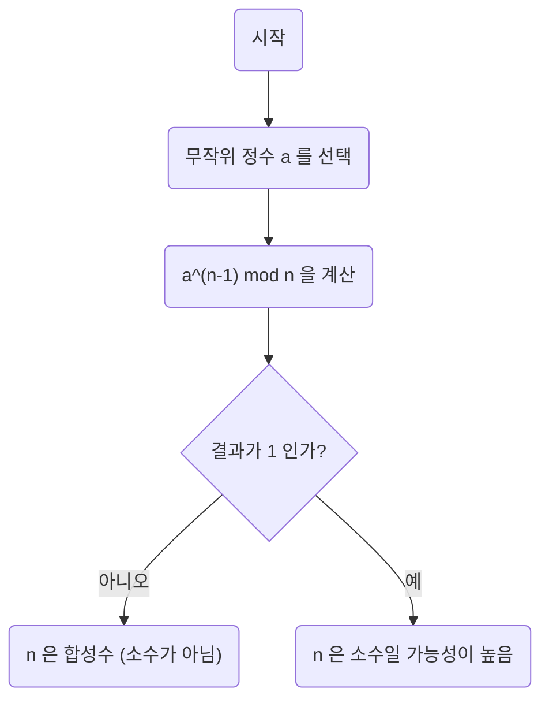
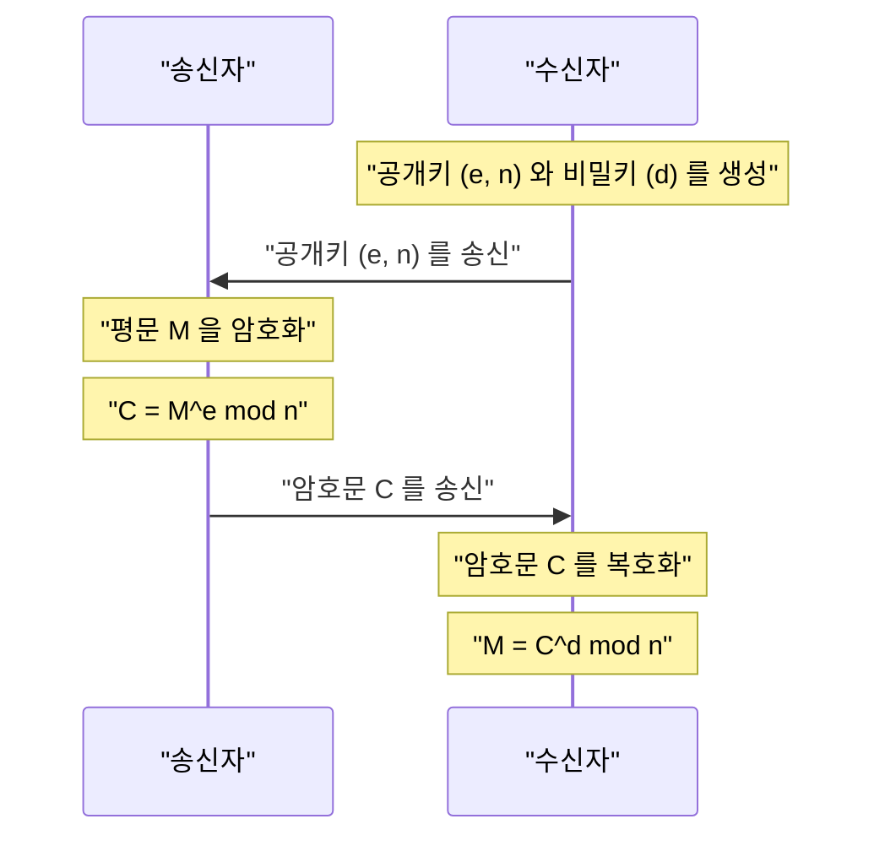

현대 인터넷 사회에서 우리가 안전하게 통신할 수 있는 것은 **암호 이론** 덕분입니다. 그리고 그 암호 이론의 근저에는 17세기 수학자 [피에르 드 페르마](https://kenji.blog/ko/p/fermat/)([Pierre de Fermat](https://kenji.blog/ko/p/fermat/))가 발견한 아름다운 정리가 존재하고 있습니다.

본 기사에서는 정수론의 중요한 기초인 **[페르마의 소정리](https://kenji.blog/ko/p/fermats-little-theorem/)** ([Fermat's Little Theorem](https://kenji.blog/ko/p/fermats-little-theorem/))에 대해, 그 의미와 증명, 그리고 현대의 [RSA](https://kenji.blog/ko/p/modern-cryptography-public-key-hash-signature/) 암호에 어떻게 응용되고 있는지를 알기 쉽게 해설합니다.

## [페르마의 소정리](https://kenji.blog/ko/p/fermats-little-theorem/)란?

[페르마의 소정리](https://kenji.blog/ko/p/fermats-little-theorem/)는 소수와 정수의 관계를 보여주는 매우 간단하면서도 강력한 정리입니다.

정리의 주장은 다음과 같습니다.

> **[페르마의 소정리](https://kenji.blog/ko/p/fermats-little-theorem/)**
> $p$ 를 소수라 하고, $a$ 를 $p$ 의 배수가 아닌 임의의 정수(즉, $a$ 와 $p$ 는 서로소)라고 합시다. 이때, 다음 합동식이 성립합니다.
> 
> $$ a^{p-1} \equiv 1 \pmod p $$

이것은 "정수 $a$ 를 $p-1$ 제곱하여 소수 $p$ 로 나누었을 때의 나머지는 항상 $1$ 이 된다"는 것을 의미합니다.

또한 양변에 $a$ 를 곱함으로써 "$a$ 가 $p$ 의 배수가 아니다"라는 조건을 제외한, 보다 일반적인 형태로 변형할 수도 있습니다.

> $$ a^p \equiv a \pmod p $$
> (임의의 정수 $a$ 에 대해 성립)

### 구체적인 예로 확인해 보자

실제로 숫자를 대입하여 정리가 성립하는지 확인해 봅시다.

**예 1: $p = 5$(소수), $a = 2$ 인 경우**
- $p-1 = 4$ 입니다.
- $a^{p-1} = 2^4 = 16$ 입니다.
- $16$ 을 $5$ 로 나누면 몫이 $3$ 이고 **나머지가 $1$** 이 됩니다 ($16 \equiv 1 \pmod 5$).

**예 2: $p = 7$(소수), $a = 3$ 인 경우**
- $p-1 = 6$ 입니다.
- $a^{p-1} = 3^6 = 729$ 입니다.
- $729$ 를 $7$ 로 나누면 몫이 $104$ 이고 **나머지가 $1$** 이 됩니다 ($729 = 7 \times 104 + 1$).

이처럼 어떤 소수 $p$ 를 선택하더라도 이 신기한 법칙이 성립합니다.

## 정리의 증명

[페르마의 소정리](https://kenji.blog/ko/p/fermats-little-theorem/)를 증명하는 데는 몇 가지 접근법이 있지만, 여기서는 정수론에 기반한 대표적인 증명 방법을 소개합니다.

$p$ 를 소수라 하고, $a$ 를 $p$ 의 배수가 아닌 정수라고 합시다.
집합 $S = \{1, 2, 3, \dots, p-1\}$ 을 생각합니다. 이 집합의 각 원소에 $a$ 를 곱한 새로운 집합을 $S'$ 라고 합시다.

$$ S' = \{a, 2a, 3a, \dots, (p-1)a\} $$

이 집합 $S'$ 의 각 원소를 $p$ 로 나누었을 때의 나머지를 생각합니다. 놀랍게도 이 나머지들은 모두 다르며, 게다가 $0$ 이 되지 않습니다. 즉, 나머지의 집합은 원래의 집합 $S$ 와 (순서를 무시하면) 완전히 일치합니다.

따라서 $S$ 의 원소들의 곱과 $S'$ 의 원소들의 곱은 $p$ 를 법으로 하여 합동이 됩니다.

$$ 1 \times 2 \times \dots \times (p-1) \equiv a \times 2a \times \dots \times (p-1)a \pmod p $$

이것을 정리하면 다음과 같이 됩니다.

$$ (p-1)! \equiv a^{p-1} \times (p-1)! \pmod p $$

$(p-1)!$ 은 $p$ 와 서로소이므로, 양변을 $(p-1)!$ 로 나눌 수 있습니다(합동식에서의 나눗셈의 성질). 그 결과, 다음 정리가 도출됩니다.

$$ 1 \equiv a^{p-1} \pmod p $$

이것으로 증명이 완료되었습니다.

## 페르마 테스트: 소수 판정에의 응용

이 정리는 어떤 수가 소수인지 판정하는 **소수 판정 알고리즘** (페르마 테스트)에 응용되고 있습니다.

어떤 거대한 수 $n$ 이 소수인지 알고 싶을 때, 무작위로 $a$ 를 선택하여 $a^{n-1} \equiv 1 \pmod n$ 이 성립하는지 확인합니다. 만약 성립하지 않는다면, $n$ 은 **절대로 소수가 아닙니다** (합성수입니다).

다만, 합성수임에도 불구하고 $a^{n-1} \equiv 1 \pmod n$ 을 만족시켜 버리는 **카마이클 수** (Carmichael numbers)라고 불리는 예외적인 수가 존재하기 때문에, 이 테스트 단독으로는 확실한 소수 판정을 할 수 없습니다. 그래서 실용적으로는 밀러-라빈 소수 판정법 등이 사용됩니다.

## 현대 암호 이론에의 응용: [RSA](https://kenji.blog/ko/p/modern-cryptography-public-key-hash-signature/) 암호

[페르마의 소정리](https://kenji.blog/ko/p/fermats-little-theorem/)(및 그 일반화인 **오일러의 정리** )의 가장 중요한 응용처가 바로 인터넷의 보안을 지탱하는 **[RSA](https://kenji.blog/ko/p/modern-cryptography-public-key-hash-signature/) 암호** 입니다.

RSA 암호는 거대한 수의 소인수분해가 어렵다는 점을 안전성의 근거로 삼고 있습니다. 그 구조에 있어서, '[페르마의 소정리](https://kenji.blog/ko/p/fermats-little-theorem/)'의 원리가 키의 생성과 복호화 과정에서 결정적인 역할을 하고 있습니다.

[RSA](https://kenji.blog/ko/p/modern-cryptography-public-key-hash-signature/) 암호에서는 $p$ 와 $q$ 라는 2개의 거대한 소수를 준비하고, $n = p \times q$ 로 둡니다.
오일러의 정리에 의해 암호화와 복호화 과정에서 $M^{ed} \equiv M \pmod n$ 이 성립하도록 키($e$ 와 $d$)가 설계됩니다. 여기서 평문 $M$ 이 원래 모습으로 돌아간다는 마법 같은 현상은 본질적으로 [페르마의 소정리](https://kenji.blog/ko/p/fermats-little-theorem/)가 보장하고 있는 수학적 성질에 의존하고 있는 것입니다.

## 요약

17세기에 [피에르 드 페르마](https://kenji.blog/ko/p/fermat/)에 의해 발견된 작은 정리는 수백 년 후인 현대 사회에서 정보 보안의 근간을 지탱하는 불가결한 요소가 되었습니다.

**[페르마의 소정리](https://kenji.blog/ko/p/fermats-little-theorem/)** 는 순수 수학이 어떻게 실용적인 기술(암호 이론이나 알고리즘)로 결부되는지를 보여주는 가장 아름다운 예 중 하나라고 할 수 있을 것입니다. 수학의 심오함과 그 응용력의 넓이에는 놀라울 따름입니다.
