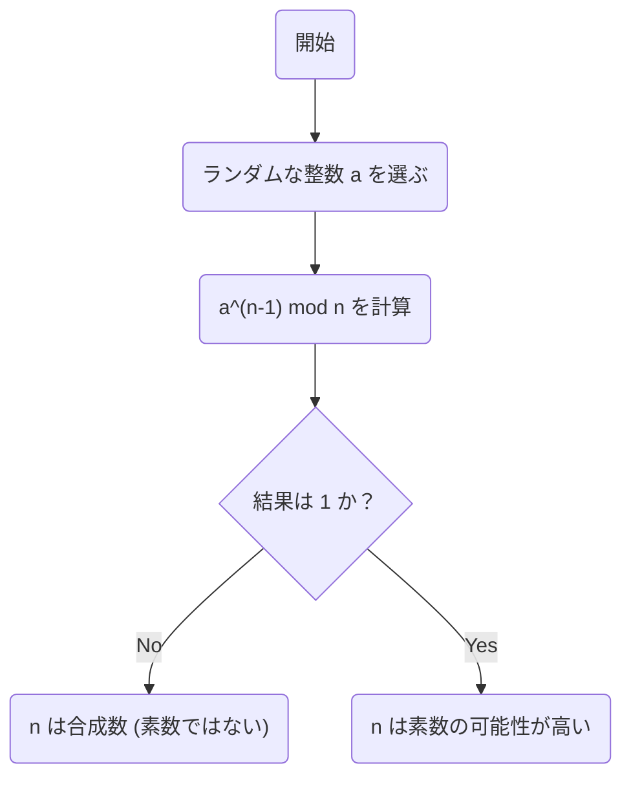
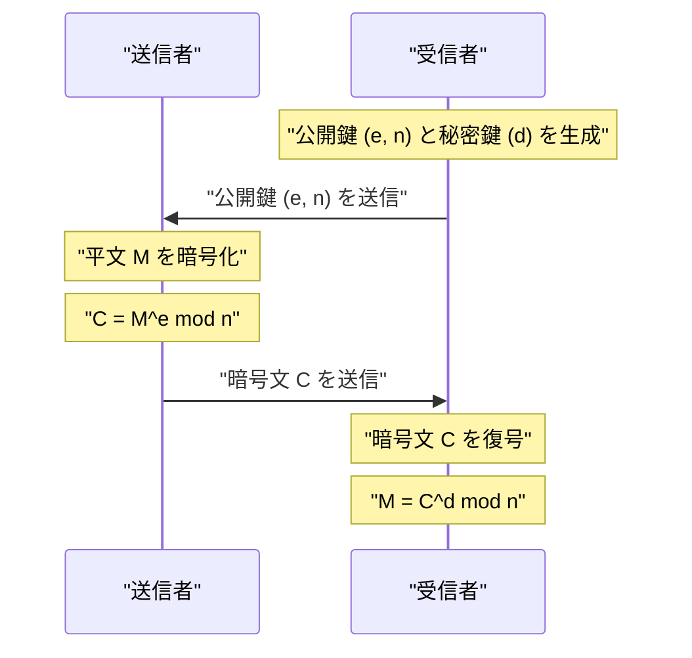

現代のインターネット社会において、私たちが安全に通信できるのは **暗号理論** のおかげです。そして、その暗号理論の根底には、17世紀の数学者[ピエール・ド・フェルマー](https://kenji.blog/p/fermat/)（[Pierre de Fermat](https://kenji.blog/p/fermat/)）が発見した美しい定理が存在しています。

本記事では、整数論の重要な基礎である **[フェルマーの小定理](https://kenji.blog/p/fermats-little-theorem/)** （[Fermat's Little Theorem](https://kenji.blog/p/fermats-little-theorem/)）について、その意味や証明、そして現代の[RSA](https://kenji.blog/p/modern-cryptography-public-key-hash-signature/)暗号にどのように応用されているのかを分かりやすく解説します。

## [フェルマーの小定理](https://kenji.blog/p/fermats-little-theorem/)とは？

[フェルマーの小定理](https://kenji.blog/p/fermats-little-theorem/)は、素数と整数の関係を示す非常にシンプルで強力な定理です。

定理の主張は以下の通りです。

> **[フェルマーの小定理](https://kenji.blog/p/fermats-little-theorem/)**
> $p$ を素数とし、$a$ を $p$ の倍数ではない任意の整数（つまり、$a$ と $p$ は互いに素）とします。このとき、次の合同式が成り立ちます。
> 
> $$ a^{p-1} \equiv 1 \pmod p $$

これは、「整数 $a$ を $p-1$ 乗して素数 $p$ で割ったときの余りは、必ず $1$ になる」ということを意味しています。

また、両辺に $a$ を掛けることで、条件「$a$ が $p$ の倍数ではない」を外した、より一般的な形に変形することもできます。

> $$ a^p \equiv a \pmod p $$
> （任意の整数 $a$ に対して成立）

### 具体例で確認してみよう

実際に数字を当てはめて、定理が成り立つか確認してみましょう。

**例1：$p = 5$（素数）、$a = 2$ の場合**
- $p-1 = 4$ です。
- $a^{p-1} = 2^4 = 16$ です。
- $16$ を $5$ で割ると、商が $3$ で **余りが $1$** になります（$16 \equiv 1 \pmod 5$）。

**例2：$p = 7$（素数）、$a = 3$ の場合**
- $p-1 = 6$ です。
- $a^{p-1} = 3^6 = 729$ です。
- $729$ を $7$ で割ると、商が $104$ で **余りが $1$** になります（$729 = 7 \times 104 + 1$）。

このように、どんな素数 $p$ を選んでも、この不思議な法則が成り立ちます。

## 定理の証明

[フェルマーの小定理](https://kenji.blog/p/fermats-little-theorem/)の証明にはいくつかのアプローチがありますが、ここでは整数論に基づく代表的な証明方法を紹介します。

$p$ を素数とし、$a$ を $p$ の倍数ではない整数とします。
集合 $S = \{1, 2, 3, \dots, p-1\}$ を考えます。この集合の各要素に $a$ を掛けた新しい集合を $S'$ とします。

$$ S' = \{a, 2a, 3a, \dots, (p-1)a\} $$

この集合 $S'$ の各要素を $p$ で割った余りを考えます。驚くべきことに、これらの余りはすべて異なり、さらに $0$ になることはありません。つまり、余りの集合は元の集合 $S$ と（順番を無視すれば）完全に一致します。

したがって、$S$ の要素の積と $S'$ の要素の積は、$p$ を法として合同になります。

$$ 1 \times 2 \times \dots \times (p-1) \equiv a \times 2a \times \dots \times (p-1)a \pmod p $$

これを整理すると、次のようになります。

$$ (p-1)! \equiv a^{p-1} \times (p-1)! \pmod p $$

$(p-1)!$ は $p$ と互いに素であるため、両辺を $(p-1)!$ で割ることができます（合同式における除算の性質）。その結果、以下の定理が導かれます。

$$ 1 \equiv a^{p-1} \pmod p $$

これで証明は完了です。

## [フェルマー](https://kenji.blog/p/fermat/)テスト：素数判定への応用

この定理は、ある数が素数かどうかを判定する **素数判定アルゴリズム** （[フェルマー](https://kenji.blog/p/fermat/)テスト）に応用されています。

ある巨大な数 $n$ が素数かどうかを知りたい場合、ランダムに $a$ を選び、$a^{n-1} \equiv 1 \pmod n$ が成り立つかを確認します。もし成り立たなければ、$n$ は **絶対に素数ではありません** （合成数です）。

ただし、合成数であるにもかかわらず $a^{n-1} \equiv 1 \pmod n$ を満たしてしまう **カーマイケル数** （Carmichael numbers）と呼ばれる例外的な数が存在するため、このテスト単体では確実な素数判定はできません。そのため、実用上はミラー・ラビン素数判定法などが使われます。

## 現代の暗号理論への応用：[RSA](https://kenji.blog/p/modern-cryptography-public-key-hash-signature/)暗号

[フェルマーの小定理](https://kenji.blog/p/fermats-little-theorem/)（およびその一般化である **[オイラー](https://kenji.blog/p/euler/)の定理** ）の最も重要な応用先が、インターネットのセキュリティを支える **[RSA](https://kenji.blog/p/modern-cryptography-public-key-hash-signature/)暗号** です。

RSA暗号は、巨大な数の素因数分解が困難であることを安全性の根拠としています。その仕組みにおいて、「[フェルマーの小定理](https://kenji.blog/p/fermats-little-theorem/)」の原理が鍵の生成と復号プロセスで決定的な役割を果たしています。

[RSA](https://kenji.blog/p/modern-cryptography-public-key-hash-signature/)暗号では、$p$ と $q$ という2つの巨大な素数を用意し、$n = p \times q$ とします。
[オイラー](https://kenji.blog/p/euler/)の定理により、[暗号化](https://kenji.blog/p/modern-cryptography-public-key-hash-signature/)と復号のプロセスにおいて $M^{ed} \equiv M \pmod n$ が成り立つように鍵（$e$ と $d$）が設計されます。ここで、平文 $M$ が元の姿に戻るという魔法のような現象は、本質的に[フェルマーの小定理](https://kenji.blog/p/fermats-little-theorem/)が保証している数学的性質に依存しているのです。

## まとめ

17世紀に[ピエール・ド・フェルマー](https://kenji.blog/p/fermat/)によって発見された小さな定理は、数百年後の現代社会において、情報セキュリティの根幹を支える不可欠な要素となっています。

**[フェルマーの小定理](https://kenji.blog/p/fermats-little-theorem/)** は、純粋数学がいかにして実用的な技術（暗号理論やアルゴリズム）へと結びつくかを示す、最も美しい例の一つと言えるでしょう。数学の奥深さと、その応用力の広さには驚かされるばかりです。
