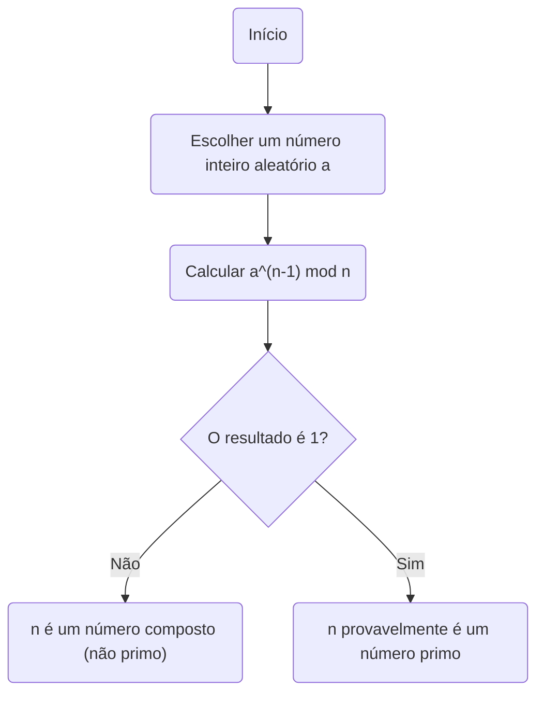
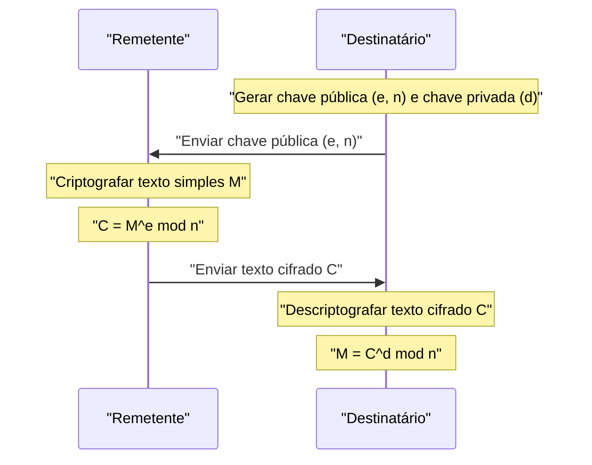

Na sociedade moderna da internet, devemos nossa capacidade de comunicação segura à **criptografia**. Na própria base desta criptografia reside um belo teorema descoberto pelo matemático do século XVII [Pierre de Fermat](https://kenji.blog/pt/p/fermat/).

Neste artigo, explicaremos **o Pequeno Teorema de [Fermat](https://kenji.blog/pt/p/fermat/)**, uma pedra angular crucial da teoria dos números, de uma maneira fácil de entender, cobrindo seu significado, prova e como ele é aplicado na moderna criptografia RSA.

## O que é o Pequeno Teorema de [Fermat](https://kenji.blog/pt/p/fermat/)?

[O Pequeno Teorema de Fermat](https://kenji.blog/pt/p/fermats-little-theorem/) é um teorema extremamente simples, mas poderoso, que demonstra a relação entre números primos e inteiros.

O teorema afirma o seguinte:

> **Pequeno Teorema de [Fermat](https://kenji.blog/pt/p/fermat/)**
> Seja $p$ um número primo e $a$ um número inteiro qualquer não divisível por $p$ (o que significa que $a$ e $p$ são coprimos). Então, a seguinte relação de congruência é verdadeira:
> 
> $$ a^{p-1} \equiv 1 \pmod p $$

Isso significa que "quando o inteiro $a$ é elevado à potência de $p-1$ e dividido pelo número primo $p$, o resto é sempre $1$".

Além disso, multiplicando ambos os lados por $a$, pode ser transformado em uma forma mais geral que remove a condição de que "$a$ não é um múltiplo de $p$".

> $$ a^p \equiv a \pmod p $$
> (Verdadeiro para qualquer inteiro $a$)

### Verificando com Exemplos Concretos

Vamos conectar alguns números reais para verificar se o teorema é verdadeiro.

**Exemplo 1: $p = 5$ (primo), $a = 2$**
- $p-1 = 4$.
- $a^{p-1} = 2^4 = 16$.
- Quando $16$ é dividido por $5$, o quociente é $3$ e **o resto é $1$** ($16 \equiv 1 \pmod 5$).

**Exemplo 2: $p = 7$ (primo), $a = 3$**
- $p-1 = 6$.
- $a^{p-1} = 3^6 = 729$.
- Quando $729$ é dividido por $7$, o quociente é $104$ e **o resto é $1$** ($729 = 7 \times 104 + 1$).

Dessa forma, não importa qual número primo $p$ você escolha, essa lei misteriosa é verdadeira.

## Prova do Teorema

Existem várias abordagens para provar o Pequeno Teorema de [Fermat](https://kenji.blog/pt/p/fermat/), mas aqui introduzimos um método de prova representativo baseado na teoria dos números.

Seja $p$ um número primo e $a$ um número inteiro não divisível por $p$.
Considere o conjunto $S = \{1, 2, 3, \dots, p-1\}$. Seja $S'$ um novo conjunto criado multiplicando cada elemento deste conjunto por $a$.

$$ S' = \{a, 2a, 3a, \dots, (p-1)a\} $$

Considere o resto quando cada elemento deste conjunto $S'$ é dividido por $p$. Surpreendentemente, todos esses restos são distintos e, além disso, nenhum deles é $0$. Em outras palavras, o conjunto de restos combina perfeitamente com o conjunto original $S$ (ignorando a ordem).

Portanto, o produto dos elementos de $S$ e o produto dos elementos de $S'$ são congruentes módulo $p$.

$$ 1 \times 2 \times \dots \times (p-1) \equiv a \times 2a \times \dots \times (p-1)a \pmod p $$

Simplificando isso, obtém-se:

$$ (p-1)! \equiv a^{p-1} \times (p-1)! \pmod p $$

Como $(p-1)!$ e $p$ são coprimos, podemos dividir ambos os lados por $(p-1)!$ (uma propriedade de divisão em relações de congruência). Como resultado, o seguinte teorema é derivado:

$$ 1 \equiv a^{p-1} \pmod p $$

Isso conclui a prova.

## Teste de Primalidade de [Fermat](https://kenji.blog/pt/p/fermat/): Aplicação ao Teste de Primos

Este teorema é aplicado em um **algoritmo de teste de primalidade** (o teste de primalidade de [Fermat](https://kenji.blog/pt/p/fermat/)) para determinar se um determinado número é primo.

Se você quiser saber se um número enorme $n$ é primo, escolha aleatoriamente $a$ e verifique se $a^{n-1} \equiv 1 \pmod n$ é verdadeiro. Se não for verdade, então $n$ **absolutamente não é um número primo** (é um número composto).

No entanto, como existem números excepcionais chamados **números de Carmichael**, que são números compostos, mas satisfazem $a^{n-1} \equiv 1 \pmod n$, esse teste por si só não pode provar definitivamente a primalidade. Portanto, na prática, métodos como o teste de primalidade de Miller-Rabin são usados.

## Aplicação na Criptografia Moderna: Criptografia RSA

A aplicação mais importante do Pequeno Teorema de [Fermat](https://kenji.blog/pt/p/fermat/) (e de sua generalização, o **Teorema de Euler**) é a **criptografia RSA**, que sustenta a segurança da internet.

A criptografia RSA baseia-se na dificuldade de fatorar números massivos para sua segurança. Dentro de seu mecanismo, o princípio do "Pequeno Teorema de [Fermat](https://kenji.blog/pt/p/fermat/)" desempenha um papel decisivo nos processos de geração de chaves e descriptografia.

Na criptografia RSA, dois enormes números primos, $p$ e $q$, são preparados e definimos $n = p \times q$.
Pelo Teorema de Euler, as chaves ($e$ e $d$) são projetadas de forma que $M^{ed} \equiv M \pmod n$ seja verdadeiro nos processos de criptografia e descriptografia. Aqui, o fenômeno mágico do texto simples $M$ retornando à sua forma original baseia-se essencialmente nas propriedades matemáticas garantidas pelo Pequeno Teorema de [Fermat](https://kenji.blog/pt/p/fermat/).

## Conclusão

Um pequeno teorema descoberto por [Pierre de Fermat](https://kenji.blog/pt/p/fermat/) no século XVII tornou-se um elemento indispensável que sustenta a base da segurança da informação na sociedade moderna centenas de anos depois.

**[O Pequeno Teorema de Fermat](https://kenji.blog/pt/p/fermats-little-theorem/)** pode ser considerado um dos mais belos exemplos que demonstram como a matemática pura se conecta à tecnologia prática (criptografia e algoritmos). Não se pode deixar de se surpreender com a profundidade da matemática e a amplitude de sua aplicabilidade.
