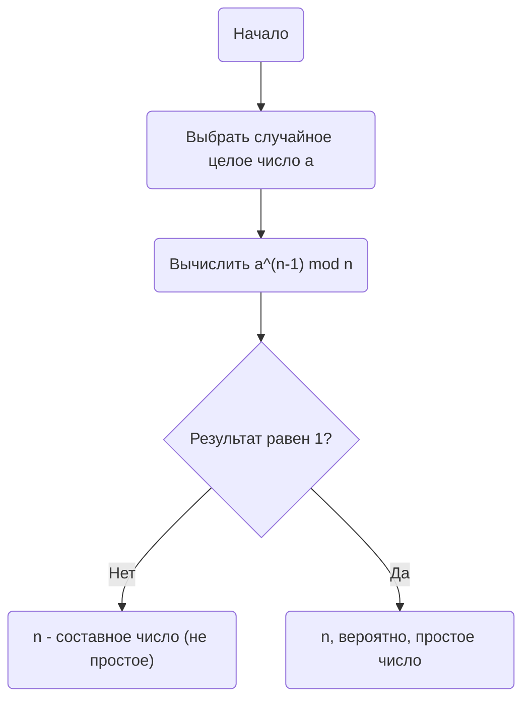
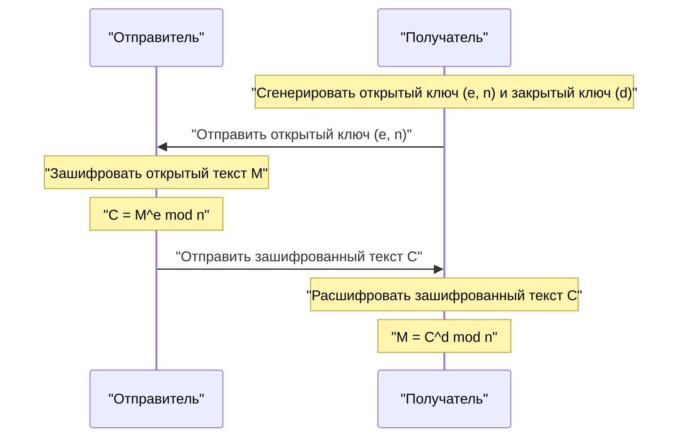

В современном интернет-обществе мы обязаны своей способностью безопасно общаться **криптографии**. В самой основе этой криптографии лежит красивая теорема, открытая в 17 веке математиком Пьером де Ферма.

В этой статье мы объясним **Малую теорему Ферма**, важнейший краеугольный камень теории чисел, простым для понимания способом, охватывая ее значение, доказательство и то, как она применяется в современной криптографии [RSA](https://kenji.blog/ru/p/modern-cryptography-public-key-hash-signature/).

## Что такое [Малая теорема Ферма](https://kenji.blog/ru/p/fermats-little-theorem/)?

[Малая теорема Ферма](https://kenji.blog/ru/p/fermats-little-theorem/) — это чрезвычайно простая, но мощная теорема, демонстрирующая связь между простыми и целыми числами.

Теорема гласит следующее:

> **[Малая теорема Ферма](https://kenji.blog/ru/p/fermats-little-theorem/)**
> Пусть $p$ — простое число, а $a$ — любое целое число, не делящееся на $p$ (это означает, что $a$ и $p$ взаимно просты). Тогда справедливо следующее отношение сравнения:
> 
> $$ a^{p-1} \equiv 1 \pmod p $$

Это означает, что «когда целое число $a$ возводится в степень $p-1$ и делится на простое число $p$, остаток всегда равен $1$».

Кроме того, умножив обе части на $a$, ее можно преобразовать в более общую форму, которая снимает условие о том, что «$a$ не является кратным $p$».

> $$ a^p \equiv a \pmod p $$
> (Справедливо для любого целого числа $a$)

### Проверка на конкретных примерах

Давайте подставим несколько реальных чисел, чтобы проверить, верна ли теорема.

**Пример 1: $p = 5$ (простое), $a = 2$**
- $p-1 = 4$.
- $a^{p-1} = 2^4 = 16$.
- При делении $16$ на $5$ частное равно $3$, а **остаток равен $1$** ($16 \equiv 1 \pmod 5$).

**Пример 2: $p = 7$ (простое), $a = 3$**
- $p-1 = 6$.
- $a^{p-1} = 3^6 = 729$.
- При делении $729$ на $7$ частное равно $104$, а **остаток равен $1$** ($729 = 7 \times 104 + 1$).

Таким образом, какое бы простое число $p$ вы ни выбрали, этот загадочный закон выполняется.

## Доказательство теоремы

Существует несколько подходов к доказательству Малой теоремы Ферма, но здесь мы представим типичный метод доказательства, основанный на теории чисел.

Пусть $p$ — простое число, а $a$ — целое число, не делящееся на $p$.
Рассмотрим множество $S = \{1, 2, 3, \dots, p-1\}$. Пусть $S'$ — новое множество, созданное путем умножения каждого элемента этого множества на $a$.

$$ S' = \{a, 2a, 3a, \dots, (p-1)a\} $$

Рассмотрим остаток при делении каждого элемента этого множества $S'$ на $p$. Удивительно, но все эти остатки различны, и более того, ни один из них не равен $0$. Другими словами, множество остатков полностью совпадает с исходным множеством $S$ (без учета порядка).

Следовательно, произведение элементов $S$ и произведение элементов $S'$ сравнимы по модулю $p$.

$$ 1 \times 2 \times \dots \times (p-1) \equiv a \times 2a \times \dots \times (p-1)a \pmod p $$

Упрощение этого дает:

$$ (p-1)! \equiv a^{p-1} \times (p-1)! \pmod p $$

Поскольку $(p-1)!$ и $p$ взаимно просты, мы можем разделить обе части на $(p-1)!$ (свойство деления в отношениях сравнения). В результате выводится следующая теорема:

$$ 1 \equiv a^{p-1} \pmod p $$

Это завершает доказательство.

## Тест простоты Ферма: Применение к тестированию простых чисел

Эта теорема применяется в **алгоритме проверки простоты** (тест простоты Ферма), чтобы определить, является ли заданное число простым.

Если вы хотите узнать, является ли огромное число $n$ простым, выберите случайным образом $a$ и проверьте, выполняется ли условие $a^{n-1} \equiv 1 \pmod n$. Если это не выполняется, то $n$ **абсолютно не является простым числом** (это составное число).

Однако, поскольку существуют исключительные числа, называемые **числами Кармайкла**, которые являются составными числами, но при этом удовлетворяют условию $a^{n-1} \equiv 1 \pmod n$, этот тест сам по себе не может окончательно доказать простоту. Поэтому на практике используются такие методы, как тест простоты Миллера-Рабина.

## Применение в современной криптографии: Криптография [RSA](https://kenji.blog/ru/p/modern-cryptography-public-key-hash-signature/)

Наиболее важным применением Малой теоремы Ферма (и ее обобщения, **Теоремы Эйлера**) является **криптография RSA**, которая лежит в основе безопасности в Интернете.

Безопасность криптографии RSA опирается на сложность факторизации огромных чисел. В ее механизме принцип «Малой теоремы Ферма» играет решающую роль в процессах генерации ключей и расшифровки.

В криптографии [RSA](https://kenji.blog/ru/p/modern-cryptography-public-key-hash-signature/) подготавливаются два огромных простых числа, $p$ и $q$, и мы устанавливаем $n = p \times q$.
По теореме Эйлера ключи ($e$ и $d$) разрабатываются таким образом, чтобы условие $M^{ed} \equiv M \pmod n$ выполнялось в процессах шифрования и расшифровки. Здесь волшебное явление возвращения открытого текста $M$ к своей первоначальной форме по существу опирается на математические свойства, гарантированные Малой теоремой Ферма.

## Заключение

Небольшая теорема, открытая Пьером де Ферма в 17 веке, сотни лет спустя стала незаменимым элементом, поддерживающим основу информационной безопасности в современном обществе.

**Малую теорему Ферма** можно назвать одним из самых красивых примеров того, как чистая математика связывается с практическими технологиями (криптографией и алгоритмами). Нельзя не удивляться глубине математики и широте ее применимости.
