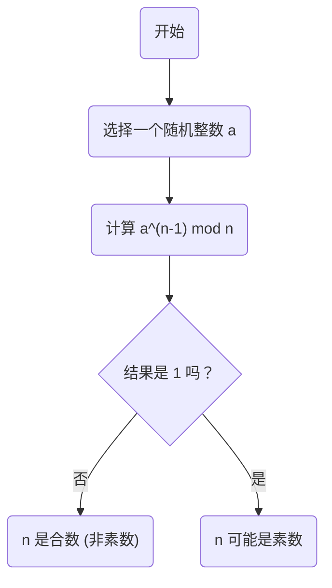
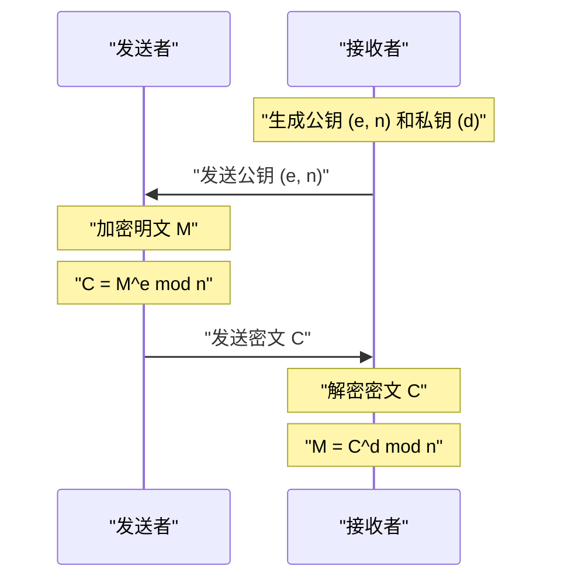

在现代互联网社会中，我们能够安全地进行通信，全靠 **密码学** 的功劳。而在这密码学的基础之中，存在着由17世纪数学家[皮埃尔·德·费马](https://kenji.blog/zh-cn/p/fermat/)（[Pierre de Fermat](https://kenji.blog/zh-cn/p/fermat/)）发现的一条优美的定理。

本文将以通俗易懂的方式，为您讲解数论的重要基础—— **[费马小定理](https://kenji.blog/zh-cn/p/fermats-little-theorem/)** （Fermat's Little Theorem），探讨它的含义、证明方法，以及它是如何被应用到现代[RSA](https://kenji.blog/zh-cn/p/modern-cryptography-public-key-hash-signature/)密码学中的。

## 什么是[费马小定理](https://kenji.blog/zh-cn/p/fermats-little-theorem/)？

[费马小定理](https://kenji.blog/zh-cn/p/fermats-little-theorem/)是一个揭示素数与整数之间关系的非常简单却强大的定理。

该定理的主张如下：

> **[费马小定理](https://kenji.blog/zh-cn/p/fermats-little-theorem/)**
> 设 $p$ 为一个素数，且 $a$ 是任意一个不是 $p$ 的倍数的整数（即 $a$ 与 $p$ 互素）。此时，以下同余式成立：
> 
> $$ a^{p-1} \equiv 1 \pmod p $$

这意味着，“将整数 $a$ 进行 $p-1$ 次方后除以素数 $p$，其余数必定为 $1$”。

此外，通过在两边同时乘以 $a$，可以去除“$a$ 不是 $p$ 的倍数”这一条件，从而变形为一个更普遍的形式。

> $$ a^p \equiv a \pmod p $$
> （对任意整数 $a$ 均成立）

### 通过具体例子来验证

让我们代入实际的数字，看看定理是否成立。

**例1：$p = 5$（素数），$a = 2$ 的情况**
- $p-1 = 4$。
- $a^{p-1} = 2^4 = 16$。
- 将 $16$ 除以 $5$ 时，商为 $3$， **余数为 $1$** （$16 \equiv 1 \pmod 5$）。

**例2：$p = 7$（素数），$a = 3$ 的情况**
- $p-1 = 6$。
- $a^{p-1} = 3^6 = 729$。
- 将 $729$ 除以 $7$ 时，商为 $104$， **余数为 $1$** （$729 = 7 \times 104 + 1$）。

就像这样，无论选择哪个素数 $p$，这个神奇的法则都会成立。

## 定理的证明

[费马小定理](https://kenji.blog/zh-cn/p/fermats-little-theorem/)的证明有多种途径，这里我们介绍一种基于数论的经典证明方法。

设 $p$ 为素数，$a$ 为不是 $p$ 的倍数的整数。
考虑集合 $S = \{1, 2, 3, \dots, p-1\}$。我们将这个集合中的每一个元素都乘以 $a$，得到一个新的集合 $S'$。

$$ S' = \{a, 2a, 3a, \dots, (p-1)a\} $$

考虑集合 $S'$ 中的每一个元素除以 $p$ 的余数。令人惊讶的是，这些余数全部互不相同，而且都不会是 $0$。换句话说，余数的集合与原集合 $S$ （忽略顺序的话）是完全一致的。

因此，$S$ 中所有元素的乘积，与 $S'$ 中所有元素的乘积，在模 $p$ 的意义下是同余的。

$$ 1 \times 2 \times \dots \times (p-1) \equiv a \times 2a \times \dots \times (p-1)a \pmod p $$

整理后可以得到：

$$ (p-1)! \equiv a^{p-1} \times (p-1)! \pmod p $$

由于 $(p-1)!$ 与 $p$ 互素，我们可以在两边同时除以 $(p-1)!$ （同余式中的除法性质）。结果就导出了以下定理：

$$ 1 \equiv a^{p-1} \pmod p $$

至此证明完成。

## 费马素性检验：在素数判定中的应用

这个定理被应用于判断一个数是否为素数的 **素数判定算法** （费马素性检验）中。

当我们想知道一个巨大的数字 $n$ 是否为素数时，可以随机选择一个 $a$，然后检查 $a^{n-1} \equiv 1 \pmod n$ 是否成立。如果不成立，那么 $n$ **绝对不是素数** （它是合数）。

不过，由于存在一种被称为 **卡迈克尔数** （Carmichael numbers）的特殊数字，它们虽然是合数，却能满足 $a^{n-1} \equiv 1 \pmod n$，因此仅凭这个检验无法百分之百确定素数。所以，在实际应用中，通常会使用米勒-拉宾（Miller-Rabin）素性检验法等。

## 在现代密码学中的应用：[RSA](https://kenji.blog/zh-cn/p/modern-cryptography-public-key-hash-signature/)密码

[费马小定理](https://kenji.blog/zh-cn/p/fermats-little-theorem/)（以及它的推广，即 **欧拉定理** ）最重要的应用领域，就是支撑着互联网安全的 **[RSA](https://kenji.blog/zh-cn/p/modern-cryptography-public-key-hash-signature/)密码**。

RSA密码的安全性建立在大整数分解的困难性之上。在其机制中，“[费马小定理](https://kenji.blog/zh-cn/p/fermats-little-theorem/)”的原理在密钥生成与解密过程中发挥着决定性的作用。

在[RSA](https://kenji.blog/zh-cn/p/modern-cryptography-public-key-hash-signature/)密码中，准备两个巨大的素数 $p$ 和 $q$，并令 $n = p \times q$。
根据欧拉定理，在加密和解密的过程中，密钥（$e$ 和 $d$）被设计成使得 $M^{ed} \equiv M \pmod n$ 成立。在这里，明文 $M$ 能够神奇地恢复原貌，本质上正是依赖于[费马小定理](https://kenji.blog/zh-cn/p/fermats-little-theorem/)所保证的数学性质。

## 总结

17世纪由[皮埃尔·德·费马](https://kenji.blog/zh-cn/p/fermat/)发现的这个小小的定理，在几百年后的现代社会中，已经成为了支撑信息安全根基的不可或缺的元素。

**[费马小定理](https://kenji.blog/zh-cn/p/fermats-little-theorem/)** 可以说是展示纯数学如何与实用技术（密码学和算法）相结合的最优美的例子之一。我们不禁要为数学的深奥与其应用范围的广泛而惊叹。
