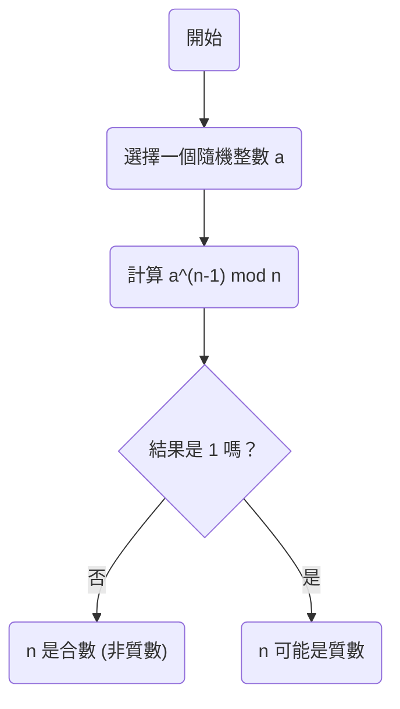
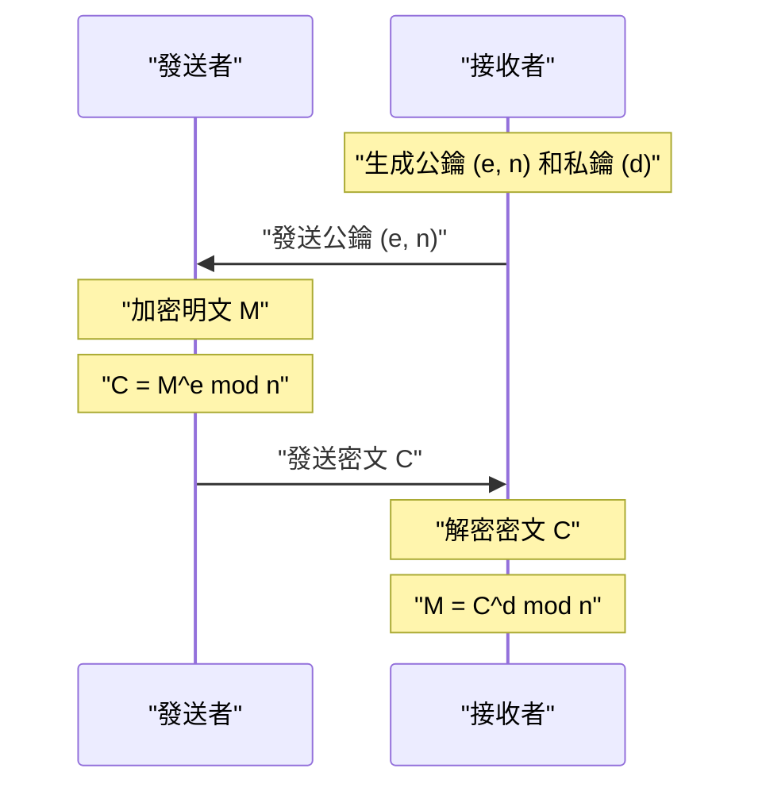

在現代網際網路社會中，我們能夠安全地進行通訊，全靠 **密碼學** 的功勞。而在這密碼學的基礎之中，存在著由17世紀數學家[皮埃爾·德·費馬](https://kenji.blog/zh-tw/p/fermat/)（[Pierre de Fermat](https://kenji.blog/zh-tw/p/fermat/)）發現的一條優美的定理。

本文將以通俗易懂的方式，為您講解數論的重要基礎—— **[費馬小定理](https://kenji.blog/zh-tw/p/fermats-little-theorem/)** （[Fermat's Little Theorem](https://kenji.blog/zh-tw/p/fermats-little-theorem/)），探討它的含義、證明方法，以及它是如何被應用到現代[RSA](https://kenji.blog/zh-tw/p/modern-cryptography-public-key-hash-signature/)密碼學中的。

## 什麼是[費馬小定理](https://kenji.blog/zh-tw/p/fermats-little-theorem/)？

[費馬小定理](https://kenji.blog/zh-tw/p/fermats-little-theorem/)是一個揭示質數與整數之間關係的非常簡單卻強大的定理。

該定理的主張如下：

> **[費馬小定理](https://kenji.blog/zh-tw/p/fermats-little-theorem/)**
> 設 $p$ 為一個質數，且 $a$ 是任意一個不是 $p$ 的倍數的整數（即 $a$ 與 $p$ 互質）。此時，以下同餘式成立：
> 
> $$ a^{p-1} \equiv 1 \pmod p $$

這意味著，「將整數 $a$ 進行 $p-1$ 次方後除以質數 $p$，其餘數必定為 $1$」。

此外，透過在兩邊同時乘以 $a$，可以去除「$a$ 不是 $p$ 的倍數」這一條件，從而變形為一個更普遍的形式。

> $$ a^p \equiv a \pmod p $$
> （對任意整數 $a$ 均成立）

### 透過具體例子來驗證

讓我們代入實際的數字，看看定理是否成立。

**例1：$p = 5$（質數），$a = 2$ 的情況**
- $p-1 = 4$。
- $a^{p-1} = 2^4 = 16$。
- 將 $16$ 除以 $5$ 時，商為 $3$， **餘數為 $1$** （$16 \equiv 1 \pmod 5$）。

**例2：$p = 7$（質數），$a = 3$ 的情況**
- $p-1 = 6$。
- $a^{p-1} = 3^6 = 729$。
- 將 $729$ 除以 $7$ 時，商為 $104$， **餘數為 $1$** （$729 = 7 \times 104 + 1$）。

就像這樣，無論選擇哪個質數 $p$，這個神奇的法則都會成立。

## 定理的證明

[費馬小定理](https://kenji.blog/zh-tw/p/fermats-little-theorem/)的證明有多種途徑，這裡我們介紹一種基於數論的經典證明方法。

設 $p$ 為質數，$a$ 為不是 $p$ 的倍數的整數。
考慮集合 $S = \{1, 2, 3, \dots, p-1\}$。我們將這個集合中的每一個元素都乘以 $a$，得到一個新的集合 $S'$。

$$ S' = \{a, 2a, 3a, \dots, (p-1)a\} $$

考慮集合 $S'$ 中的每一個元素除以 $p$ 的餘數。令人驚訝的是，這些餘數全部互不相同，而且都不會是 $0$。換句話說，餘數的集合與原集合 $S$ （忽略順序的話）是完全一致的。

因此，$S$ 中所有元素的乘積，與 $S'$ 中所有元素的乘積，在模 $p$ 的意義下是同餘的。

$$ 1 \times 2 \times \dots \times (p-1) \equiv a \times 2a \times \dots \times (p-1)a \pmod p $$

整理後可以得到：

$$ (p-1)! \equiv a^{p-1} \times (p-1)! \pmod p $$

由於 $(p-1)!$ 與 $p$ 互質，我們可以在兩邊同時除以 $(p-1)!$ （同餘式中的除法性質）。結果就導出了以下定理：

$$ 1 \equiv a^{p-1} \pmod p $$

至此證明完成。

## 費馬質數檢驗：在質數判定中的應用

這個定理被應用於判斷一個數是否為質數的 **質數判定演算法** （費馬質數檢驗）中。

當我們想知道一個巨大的數字 $n$ 是否為質數時，可以隨機選擇一個 $a$，然後檢查 $a^{n-1} \equiv 1 \pmod n$ 是否成立。如果不成立，那麼 $n$ **絕對不是質數** （它是合數）。

不過，由於存在一種被稱為 **卡邁克爾數** （Carmichael numbers）的特殊數字，它們雖然是合數，卻能滿足 $a^{n-1} \equiv 1 \pmod n$，因此僅憑這個檢驗無法百分之百確定質數。所以，在實際應用中，通常會使用米勒-拉賓（Miller-Rabin）質數檢驗法等。

## 在現代密碼學中的應用：[RSA](https://kenji.blog/zh-tw/p/modern-cryptography-public-key-hash-signature/)密碼

[費馬小定理](https://kenji.blog/zh-tw/p/fermats-little-theorem/)（以及它的推廣，即 **歐拉定理** ）最重要的應用領域，就是支撐著網際網路安全的 **[RSA](https://kenji.blog/zh-tw/p/modern-cryptography-public-key-hash-signature/)密碼**。

RSA密碼的安全性建立在大整數分解的困難性之上。在其機制中，「[費馬小定理](https://kenji.blog/zh-tw/p/fermats-little-theorem/)」的原理在金鑰生成與解密過程中發揮著決定性的作用。

在[RSA](https://kenji.blog/zh-tw/p/modern-cryptography-public-key-hash-signature/)密碼中，準備兩個巨大的質數 $p$ 和 $q$，並令 $n = p \times q$。
根據歐拉定理，在加密和解密的過程中，金鑰（$e$ 和 $d$）被設計成使得 $M^{ed} \equiv M \pmod n$ 成立。在這裡，明文 $M$ 能夠神奇地恢復原貌，本質上正是依賴於[費馬小定理](https://kenji.blog/zh-tw/p/fermats-little-theorem/)所保證的數學性質。

## 總結

17世紀由[皮埃爾·德·費馬](https://kenji.blog/zh-tw/p/fermat/)發現的這個小小的定理，在幾百年後的現代社會中，已經成為了支撐資訊安全根基的不可或缺的元素。

**[費馬小定理](https://kenji.blog/zh-tw/p/fermats-little-theorem/)** 可以說是展示純數學如何與實用技術（密碼學和演算法）相結合的最優美的例子之一。我們不禁要為數學的深奧與其應用範圍的廣泛而驚嘆。
