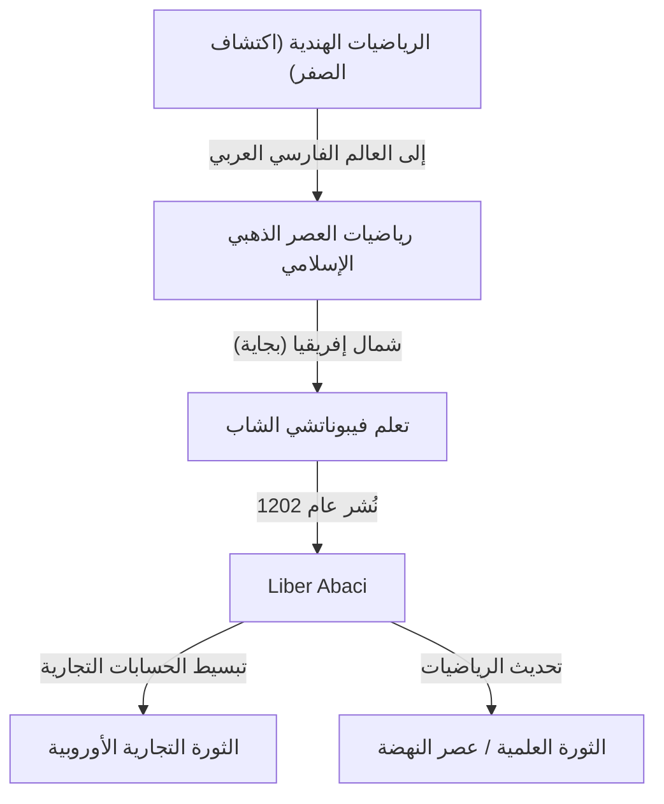
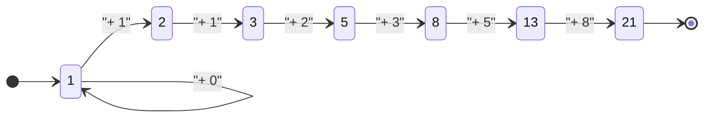

## المقدمة: النور الرياضي الذي أضاء العصور المظلمة

في أوروبا خلال العصور الوسطى، وخلال ما يسمى غالبًا "بالعصور المظلمة"، كان تقدم العلم راكدًا. ومع ذلك، في بداية القرن الثالث عشر، ظهر عبقري غير تاريخ الرياضيات الأوروبية إلى الأبد. كان اسمه ليوناردو البيزي. هذا الشخص، الذي عُرف لاحقًا باسم **فيبوناتشي** ، كان القوة الدافعة وراء نشر "الأرقام العربية" (الأرقام الهندية العربية) التي نستخدمها يوميًا في العصر الحديث، ومكتشف "متتالية فيبوناتشي" التي تكشف أسرار العالم الطبيعي.

في هذا المقال، سنتعمق في حياة فيبوناتشي المضطربة، وتأثير تحفته الفنية "Liber Abaci" (كتاب الحساب) على المجتمع، وإرثه الرياضي الذي يمتد إلى العلوم الحديثة والعالم الطبيعي.

## حياة فيبوناتشي والخلفية التاريخية

### ولادته في بيزا وأصل اسم "فيبوناتشي"

وُلد [ليوناردو فيبوناتشي](https://kenji.blog/p/fibonacci/) حوالي عام 1170 في مدينة بيزا الإيطالية. ازدهرت بيزا في ذلك الوقت كمركز للتجارة في البحر الأبيض المتوسط، وكانت جمهورية مزدهرة تمتلك قوة بحرية وشبكة تجارية قوية. كان والده، غولييلمو بوناتشي، تاجرًا ثريًا يعمل أيضًا كمسؤول جمركي لبيزا.

في الواقع، لم يُستخدم اسم "فيبوناتشي" خلال حياته. بل هو مصطلح صاغه المؤرخون اللاحقون، اختصارًا للكلمة اللاتينية "filius Bonacci" (ابن بوناتشي). كان يطلق على نفسه اسم "ليوناردو بيزانو" (ليوناردو البيزي) أو "بيغولو" (والتي تعني المتجول أو الكسول)، نظرًا لحبه للسفر.

### التعليم في شمال إفريقيا واللقاء بثقافات مختلفة

أخذ مصير الشاب ليوناردو منعطفًا كبيرًا عندما تم تعيين والده غولييلمو لتمثيل مستعمرة بيزا التجارية في بجاية (في الجزائر الحالية)، بشمال إفريقيا. استدعاه والده إلى بجاية لتعلم الأعمال العملية للتاجر.

هناك، أتيحت لليوناردو الفرصة لتعلم الرياضيات من معلم عربي. كان العالم الإسلامي في ذلك الوقت في طليعة الرياضيات، حيث كان يستخدم على نطاق واسع نظام الأرقام الموضعية ذي الأساس 10 الذي نشأ في الهند، والذي تضمن "0" (الأرقام الهندية العربية). كانت الحسابات باستخدام الأرقام الرومانية (I، V، X، L، C، D، M) السائدة في أوروبا مرهقة للغاية، مما جعل المعداد (العداد) لا غنى عنه للعمليات الحسابية المتقدمة. ومع ذلك، باستخدام الأرقام الهندية العربية، يمكن إجراء الحسابات المعقدة بسرعة وبدقة باستخدام الورقة والقلم فقط.

### السفر في عالم البحر الأبيض المتوسط والبحث عن المعرفة

أدرك ليوناردو التفوق الساحق للأرقام الهندية العربية، فسافر عبر عالم البحر الأبيض المتوسط بحثًا عن المزيد من المعرفة. زار المراكز التجارية والأكاديمية في ذلك الوقت، مثل مصر، وسوريا، واليونان، وصقلية، وبروفانس، مستوعبًا تقنيات رياضية وطرق حساب تجارية متنوعة أثناء تفاعله مع العلماء المحليين.

من خلال هذه الرحلات الواسعة، أصبح مقتنعًا بأن الأرقام الهندية العربية لم تكن مجرد أدوات مريحة للتجارة، بل نظامًا قويًا أساسيًا لتطوير الرياضيات البحتة. في حوالي عام 1200، عاد إلى مسقط رأسه بيزا وبدأ في تجميع المعرفة الهائلة التي اكتسبها.

## "Liber Abaci" وتأثيره

في عام 1202، أكمل فيبوناتشي تحفته الفنية "Liber Abaci" (كتاب الحساب)، وتم نشر طبعة منقحة في عام 1228. على الرغم من أن العنوان يذكر "المعداد"، إلا أنه كان في الواقع كتابًا رائدًا يوضح كيفية إجراء العمليات الحسابية باستخدام نظام الأرقام الجديد دون استخدام المعداد.

### إدخال الأرقام العربية

تبدأ مقدمة "Liber Abaci" بهذه الجملة التاريخية:

> "الأرقام الهندية التسعة هي: 9 8 7 6 5 4 3 2 1. بهذه الأرقام التسعة، ومع العلامة 0 التي يسميها العرب zephirum (الصفر)، يمكن كتابة أي رقم مهما كان."

لم يقتصر هذا الكتاب على تعليم كيفية كتابة الأرقام فحسب؛ بل غطى بشكل شامل أساسيات الحساب التي تُدرس في المدارس الابتدائية والمتوسطة الحديثة، بما في ذلك الطرق المكتوبة للجمع والطرح والضرب والقسمة، والعمليات على الكسور، وكيفية إيجاد الجذور التربيعية والتكعيبية.

### التطبيق على الرياضيات التجارية

لإثبات مدى عملية هذا النظام الرياضي الجديد بشكل استثنائي، قام فيبوناتشي بتضمين العديد من المشكلات الواقعية التي يواجهها التجار.

- حساب أسعار الصرف المعقدة بين العملات المختلفة
- حساب الأرباح والخسائر على البضائع
- تحديد النسب العادلة في المقايضة
- حسابات الفائدة المركبة

ونتيجة لذلك، لم يصبح "Liber Abaci" نصًا أكاديميًا فحسب، بل أصبح الدليل العملي النهائي للتجار الأوروبيين. ومن خلال تأثيره، انتقل التجار الإيطاليون تدريجيًا من الأرقام الرومانية إلى الأرقام العربية، مما أرسى أساسًا مهمًا للتطور اللاحق للاقتصادات الرأسمالية والثورة العلمية خلال عصر النهضة.

## متتالية فيبوناتشي والنسبة الذهبية: شفرة الطبيعة

الجزء الأكثر شهرة في "Liber Abaci" هو "مسألة الأرانب" التي تظهر في الفصل الثاني عشر. أدى هذا اللغز البسيط على ما يبدو إلى ولادة متتالية استثنائية سميت لاحقًا بـ "متتالية فيبوناتشي".

### مسألة الأرانب

المسألة هي كما يلي:

> "وضع رجل زوجًا من الأرانب في مكان محاط بجدار من جميع الجوانب. كم زوجًا من الأرانب يمكن إنتاجه من ذلك الزوج في عام واحد، إذا افترضنا أن كل شهر ينجب كل زوج زوجًا جديدًا يصبح منتجًا بدءًا من الشهر الثاني؟"

من خلال تتبع عدد أزواج الأرانب كل شهر، نحصل على المتتالية التالية:

$1, 1, 2, 3, 5, 8, 13, 21, 34, 55, 89, 144, ...$

انتظام هذه المتتالية جميل بشكل استثنائي: "مجموع الرقمين السابقين يساوي الرقم التالي". ومن الناحية الرياضية، فإنها تشكل علاقة التكرار التالية:

$$
F_n = 
\begin{cases} 
0 & \text{إذا كان } n = 0 \\
1 & \text{إذا كان } n = 1 \\
F_{n-1} + F_{n-2} & \text{إذا كان } n > 1
\end{cases}
$$

### العلاقة المذهلة مع النسبة الذهبية

من أكثر الميزات الغامضة لمتتالية فيبوناتشي أنه عندما تأخذ نسبة رقمين متجاورين ($F_{n+1} / F_n$)، فإنها تقترب من ثابت محدد.

- $1 / 1 = 1.000$
- $2 / 1 = 2.000$
- $3 / 2 = 1.500$
- $5 / 3 \approx 1.667$
- $8 / 5 = 1.600$
- $13 / 8 = 1.625$
- $21 / 13 \approx 1.615$
- $34 / 21 \approx 1.619$

كلما كبرت الأرقام، تقترب هذه النسبة من رقم غير نسبي يُسمى $\phi$ (فاي).

$$
\phi = \frac{1 + \sqrt{5}}{2} \approx 1.6180339887...
$$

تُعرف هذه باسم "النسبة الذهبية"، وتعتبر منذ اليونان القديمة النسبة الأكثر جمالاً وتناغماً. تُستخدم هذه النسبة عن قصد (أو بغير وعي) في العمارة التاريخية والأعمال الفنية، مثل البارثينون والموناليزا.

علاوة على ذلك، اكتشف عالم الرياضيات في القرن التاسع عشر جاك فيليب ماري بينيه "صيغة بينيه"، التي تجد الحد العام لمتتالية فيبوناتشي باستخدام النسبة الذهبية:

$$
F_n = \frac{\phi^n - (1-\phi)^n}{\sqrt{5}}
$$

### أرقام فيبوناتشي في الطبيعة

متتالية فيبوناتشي والنسبة الذهبية ليستا مجرد تلاعب رياضي. المذهل أن هذه المتتالية مخفية في كل مكان في العالم الطبيعي.

1. **عدد البتلات**: عدد بتلات العديد من الزهور هو رقم فيبوناتشي (على سبيل المثال، الزنابق لها 3، الحوذان 5، العايق 8، المخملية 13، عباد الشمس 21، 34، 55، إلخ).
2. **ترتيب الأوراق (Phyllotaxis)**: تطور نمط ترتيب الأوراق التي تنمو من جذع النبات بحيث لا تتداخل الأوراق العلوية والسفلية وتحجب ضوء الشمس. تصبح هذه الزاوية "الزاوية الذهبية" (حوالي 137.5 درجة)، مما يؤدي إلى ظهور أرقام فيبوناتشي.
3. **أكواز الصنوبر والأناناس**: عند حساب عدد اللوالب على السطح، تشكل اللوالب في اتجاه عقارب الساعة وعكس اتجاه عقارب الساعة أرقام فيبوناتشي متجاورة، مثل 8 و 13، أو 13 و 21.
4. **أصداف النوتيلوس**: "اللولب اللوغاريتمي (اللولب الذهبي)" المرسوم بناءً على النسبة الذهبية يتطابق تمامًا مع نمط نمو أصداف الحلزون.

## إنجازات رياضية أخرى

لم تقتصر إنجازات فيبوناتشي على "Liber Abaci". وصلت شهرته إلى مسامع الإمبراطور الروماني المقدس فريدريك الثاني، الذي دعاه إلى بلاطه لمواجهة العديد من التحديات الرياضية.

### "Liber Quadratorum" (كتاب المربعات)

كُتب هذا الكتاب عام 1225، وهو أطروحة متقدمة حول المعادلات الديوفانتية (المعادلات التي تبحث عن حلول صحيحة). يستكشف مفهوم "الأعداد المتطابقة" ويظهر رؤى عميقة حول نظرية فيثاغورس. ويعتبر على نطاق واسع أعظم تحفة في نظرية الأعداد في أوروبا خلال العصور الوسطى.

### "Practica Geometriae" (الهندسة العملية)

كُتب هذا الكتاب عام 1220، ويفصل المساحة والهندسة. وقدم طرقًا صارمة لحساب المساحة والحجم، والتطبيقات العملية لمبادئ الهندسة الإقليدية اليونانية القديمة، مما جعله موردًا قيمًا للمهندسين والمساحين في ذلك الوقت.

## المجتمع الحديث وإرث فيبوناتشي

لا تزال اكتشافات فيبوناتشي، الذي عاش قبل حوالي 800 عام، تلعب دورًا مهمًا في أكثر المجالات تقدمًا في المجتمع الحديث.

### التطبيقات في علوم الكمبيوتر

في خوارزميات الكمبيوتر، تعتبر متتالية فيبوناتشي مفيدة للغاية. الخوارزمية التي تسمى "بحث فيبوناتشي" يمكنها البحث عن البيانات بكفاءة أكبر من البحث الثنائي في ظل ظروف محددة. بالإضافة إلى ذلك، فإن بنية البيانات المعروفة باسم "كومة فيبوناتشي" (Fibonacci heap) لا غنى عنها لتسريع خوارزميات نظرية الرسم البياني مثل خوارزمية ديكسترا.

### تصحيح فيبوناتشي في الأسواق المالية

من المدهش أن اسمه يُسمع كثيرًا في عالم التمويل أيضًا. تُستخدم طريقة تحليل فني تسمى "تصحيح فيبوناتشي" للتنبؤ بالنقاط التي سترتد فيها أسعار الأسهم أو أسعار الصرف أو تتراجع على الرسوم البيانية. يرسم المتداولون خطوط الدعم والمقاومة بناءً على نسب فيبوناتشي مثل 23.6٪ و 38.2٪ و 61.8٪ (كمقلوب النسبة الذهبية). الفكرة القائلة بأن نفس قوانين الطبيعة تنطبق على موجات السوق الناتجة عن علم نفس المجموعة البشرية هي فكرة رائعة للغاية.

## الخاتمة

كان [ليوناردو فيبوناتشي](https://kenji.blog/p/fibonacci/) جسراً بين معرفة العالم الإسلامي وأوروبا، وجلب نور الرياضيات إلى العالم الغربي. بدون الأرقام العربية التي روج لها من خلال "Liber Abaci"، ربما لم تكن الثورة العلمية اللاحقة والمجتمع الرقمي الحديث موجودين.

علاوة على ذلك، المتتالية التي ولدت من "مسألة الأرانب" المرحة تجسد جمال الرياضيات البحتة وتستمر في سحرنا اليوم كقانون عالمي يمتد من نمو النباتات إلى اللوالب المجرية، وحتى النشاط الاقتصادي البشري. يعلمنا إرث فيبوناتشي عبر الزمن أن الرياضيات ليست مجرد تقنية حسابية، ولكنها "لغة مشتركة" لفتح حقائق الكون.
