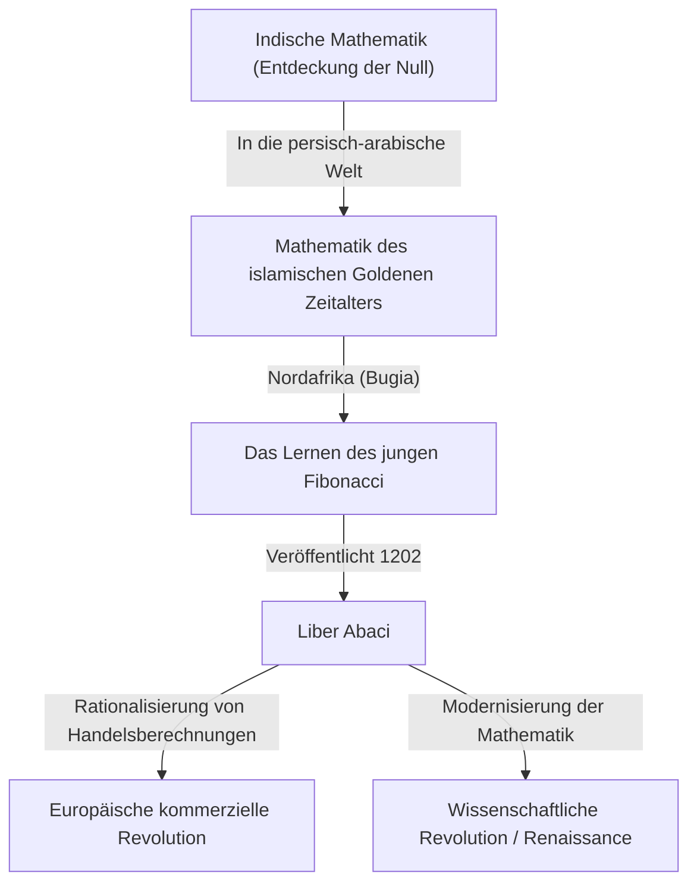
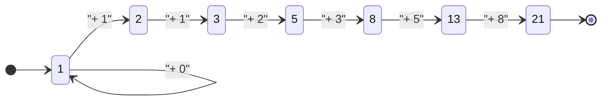

## Einleitung: Das mathematische Licht, das das dunkle Zeitalter erhellt

Im mittelalterlichen Europa, in dem oft sogenannten "Dunklen Zeitalter", stagnierte der Fortschritt der Wissenschaft. Zu Beginn des 13. Jahrhunderts tauchte jedoch ein Genie auf, das die Geschichte der europäischen Mathematik für immer verändern sollte. Sein Name war Leonardo von Pisa. Diese Figur, später als **[Fibonacci](https://kenji.blog/de/p/fibonacci/)** bekannt, war die treibende Kraft hinter der Popularisierung der "arabischen Ziffern" (indo-arabischen Ziffern), die wir heute täglich verwenden, und der Entdecker der "[Fibonacci](https://kenji.blog/de/p/fibonacci/)-Folge", die die Geheimnisse der natürlichen Welt entschlüsselt.

In diesem Artikel werden wir tief in das turbulente Leben von [Fibonacci](https://kenji.blog/de/p/fibonacci/) eintauchen, die Auswirkungen seines Hauptwerks "Liber Abaci" auf die Gesellschaft und sein mathematisches Erbe, das bis in die moderne Wissenschaft und die Natur reicht, untersuchen.

## Leben von [Fibonacci](https://kenji.blog/de/p/fibonacci/) und historischer Hintergrund

### Geburt in Pisa und der Ursprung des Namens "[Fibonacci](https://kenji.blog/de/p/fibonacci/)"

[Leonardo Fibonacci](https://kenji.blog/de/p/fibonacci/) wurde um 1170 in der italienischen Stadtstaat Pisa geboren. Pisa blühte zu dieser Zeit als Zentrum des Mittelmeerhandels, eine wohlhabende Republik mit einer starken Marine und einem Handelsnetzwerk. Sein Vater, Guglielmo Bonacci, war ein wohlhabender Kaufmann, der auch als Zollbeamter für Pisa arbeitete.

Der Name "[Fibonacci](https://kenji.blog/de/p/fibonacci/)" wurde zu seinen Lebzeiten eigentlich nicht verwendet. Es ist ein geprägter Begriff späterer Historiker, der das lateinische "filius Bonacci" (Sohn des Bonacci) abkürzt. Er nannte sich selbst "Leonardo Pisano" (Leonardo von Pisa) oder aufgrund seiner Liebe zum Reisen "Bigollo" (was Wanderer oder Faulenzer bedeutet).

### Ausbildung in Nordafrika und Begegnungen mit anderen Kulturen

Das Schicksal des jungen Leonardo nahm eine große Wendung, als sein Vater Guglielmo ernannt wurde, um die pisanische Handelskolonie in Bugia (dem heutigen Béjaïa in Algerien) in Nordafrika zu vertreten. Sein Vater rief ihn nach Bugia, um das praktische Geschäft eines Kaufmanns zu erlernen.

Dort hatte Leonardo die Gelegenheit, bei einem arabischen Lehrer Mathematik zu lernen. Die islamische Welt war zu dieser Zeit führend in der Mathematik und verwendete weitgehend das aus Indien stammende Stellenwertsystem zur Basis 10, das die "0" (indo-arabische Ziffern) enthielt. Berechnungen mit den in Europa vorherrschenden römischen Ziffern (I, V, X, L, C, D, M) waren äußerst umständlich, was den Abakus für fortgeschrittene Berechnungen unverzichtbar machte. Mit indo-arabischen Ziffern konnten komplexe Berechnungen jedoch schnell und genau mit nur Papier und Stift durchgeführt werden.

### Reisen im Mittelmeerraum und die Suche nach Wissen

Als Leonardo die überwältigende Überlegenheit der indo-arabischen Ziffern erkannte, bereiste er den Mittelmeerraum auf der Suche nach weiterem Wissen. Er besuchte Handels- und Wissenschaftszentren der Zeit wie Ägypten, Syrien, Griechenland, Sizilien und die Provence und nahm verschiedene mathematische Techniken und kaufmännische Berechnungsmethoden auf, während er mit lokalen Gelehrten interagierte.

Durch diese ausgedehnten Reisen gelangte er zu der Überzeugung, dass indo-arabische Ziffern nicht nur bequeme Werkzeuge für den Handel waren, sondern ein mächtiges System, das für die Entwicklung der reinen Mathematik unerlässlich war. Um das Jahr 1200 kehrte er in seine Heimatstadt Pisa zurück und begann mit der Zusammenstellung des enormen Wissens, das er erworben hatte.

## "Liber Abaci" und seine Auswirkungen

1202 vollendete [Fibonacci](https://kenji.blog/de/p/fibonacci/) sein Hauptwerk, den "Liber Abaci" (Das Buch der Berechnung), mit einer überarbeiteten Ausgabe, die 1228 veröffentlicht wurde. Obwohl der Titel den "Abakus" erwähnt, war es tatsächlich ein bahnbrechendes Buch, das erklärte, wie man mit dem neuen Zahlensystem ohne Verwendung eines Abakus Berechnungen durchführt.

### Einführung der arabischen Ziffern

Der Beginn des "Liber Abaci" beginnt mit diesem historischen Satz:

> "Die neun indischen Ziffern sind: 9 8 7 6 5 4 3 2 1. Mit diesen neun Ziffern und mit dem Zeichen 0, das die Araber zephirum nennen, kann jede beliebige Zahl geschrieben werden."

Dieses Buch lehrte nicht nur, wie man Zahlen schreibt; es deckte umfassend die Grundlagen der Arithmetik ab, die in modernen Grund- und Mittelschulen gelehrt werden, einschließlich schriftlicher Methoden für Addition, Subtraktion, Multiplikation, Division, Bruchrechnung und wie man Quadrat- und Kubikwurzeln zieht.

### Anwendung in der Handelsmathematik

Um zu beweisen, wie außergewöhnlich praktisch dieses neue mathematische System war, bezog [Fibonacci](https://kenji.blog/de/p/fibonacci/) zahlreiche realistische Probleme ein, mit denen Kaufleute konfrontiert waren.

- Berechnung komplexer Wechselkurse zwischen verschiedenen Währungen
- Berechnung von Gewinnen und Verlusten bei Waren
- Bestimmung fairer Verhältnisse beim Tauschhandel
- Zinseszinsberechnungen

Infolgedessen wurde der "Liber Abaci" nicht nur ein akademischer Text, sondern auch das ultimative praktische Handbuch für europäische Kaufleute. Durch seinen Einfluss stellten italienische Kaufleute nach und nach von römischen auf arabische Ziffern um und legten damit einen wichtigen Grundstein für die spätere Entwicklung kapitalistischer Volkswirtschaften und der wissenschaftlichen Revolution während der Renaissance.

## Die [Fibonacci](https://kenji.blog/de/p/fibonacci/)-Folge und der Goldene Schnitt: Der Code der Natur

Der berühmteste Teil des "Liber Abaci" ist das "Kaninchenproblem", das in Kapitel 12 erscheint. Dieses scheinbar einfache Rätsel brachte eine phänomenale Folge hervor, die später "[Fibonacci](https://kenji.blog/de/p/fibonacci/)-Folge" genannt wurde.

### Das Kaninchenproblem

Das Problem lautet wie folgt:

> "Ein Mann setzte ein Paar Kaninchen an einen Ort, der allseitig von einer Mauer umgeben war. Wie viele Kaninchenpaare können in einem Jahr von diesem Paar erzeugt werden, wenn angenommen wird, dass jeden Monat jedes Paar ein neues Paar zeugt, das ab dem zweiten Monat produktiv wird?"

Indem man die Anzahl der Kaninchenpaare jeden Monat verfolgt, erhält man die folgende Folge:

$1, 1, 2, 3, 5, 8, 13, 21, 34, 55, 89, 144, ...$

Die Regelmäßigkeit dieser Folge ist außergewöhnlich schön: "Die Summe der beiden vorherigen Zahlen entspricht der nächsten Zahl." Mathematisch definiert bildet es die folgende Rekursionsbeziehung:

$$
F_n = 
\begin{cases} 
0 & \text{wenn } n = 0 \\
1 & \text{wenn } n = 1 \\
F_{n-1} + F_{n-2} & \text{wenn } n > 1
\end{cases}
$$

### Die erstaunliche Beziehung zum Goldenen Schnitt

Eines der mystischsten Merkmale der [Fibonacci](https://kenji.blog/de/p/fibonacci/)-Folge ist, dass, wenn man das Verhältnis von zwei benachbarten Zahlen ($F_{n+1} / F_n$) nimmt, dieses gegen eine bestimmte Konstante konvergiert.

- $1 / 1 = 1.000$
- $2 / 1 = 2.000$
- $3 / 2 = 1.500$
- $5 / 3 \approx 1.667$
- $8 / 5 = 1.600$
- $13 / 8 = 1.625$
- $21 / 13 \approx 1.615$
- $34 / 21 \approx 1.619$

Je größer die Zahlen werden, desto mehr nähert sich dieses Verhältnis einer irrationalen Zahl namens $\phi$ (Phi).

$$
\phi = \frac{1 + \sqrt{5}}{2} \approx 1.6180339887...
$$

Dies ist als "Goldener Schnitt" bekannt und gilt seit dem antiken Griechenland als die schönste und harmonischste Proportion. Dieses Verhältnis wird absichtlich (oder unbewusst) in historischen Architekturen und Kunstwerken wie dem Parthenon und der Mona Lisa verwendet.

Darüber hinaus entdeckte der Mathematiker Jacques Philippe Marie Binet aus dem 19. Jahrhundert die "Binet-Formel", die das allgemeine Glied der [Fibonacci](https://kenji.blog/de/p/fibonacci/)-Folge unter Verwendung des Goldenen Schnitts findet:

$$
F_n = \frac{\phi^n - (1-\phi)^n}{\sqrt{5}}
$$

### [Fibonacci](https://kenji.blog/de/p/fibonacci/)-Zahlen in der Natur

Die [Fibonacci](https://kenji.blog/de/p/fibonacci/)-Folge und der Goldene Schnitt sind kein reines Zahlenspiel. Erstaunlicherweise ist diese Folge überall in der natürlichen Welt verborgen.

1. **Anzahl der Blütenblätter**: Die Blütenblattzahl vieler Blumen ist eine [Fibonacci](https://kenji.blog/de/p/fibonacci/)-Zahl (z. B. Lilien haben 3, Hahnenfuß 5, Rittersporn 8, Ringelblumen 13, Sonnenblumen 21, 34, 55 usw.).
2. **Phyllotaxis (Blattstellung)**: Das Anordnungsmuster von Blättern, die aus dem Stiel einer Pflanze wachsen, hat sich so entwickelt, dass sich obere und untere Blätter nicht überlappen und das Sonnenlicht blockieren. Dieser Winkel wird zum "Goldenen Winkel" (etwa 137,5 Grad), was zum Auftreten von [Fibonacci](https://kenji.blog/de/p/fibonacci/)-Zahlen führt.
3. **Tannenzapfen und Ananas**: Wenn man die Anzahl der Spiralen auf der Oberfläche zählt, bilden die Spiralen im und gegen den Uhrzeigersinn benachbarte [Fibonacci](https://kenji.blog/de/p/fibonacci/)-Zahlen wie 8 und 13 oder 13 und 21.
4. **Nautilus-Schalen**: Die "logarithmische Spirale (Goldene Spirale)", die auf der Grundlage des Goldenen Schnitts gezeichnet wird, stimmt perfekt mit dem Wachstumsmuster von Schneckenhäusern überein.

## Weitere mathematische Errungenschaften

Die Leistungen von [Fibonacci](https://kenji.blog/de/p/fibonacci/) beschränkten sich nicht auf den "Liber Abaci". Sein Ruhm drang bis zu den Ohren des Kaisers des Heiligen Römischen Reiches Friedrich II., der ihn an seinen Hof einlud, um sich zahlreichen mathematischen Herausforderungen zu stellen.

### "Liber Quadratorum" (Das Buch der Quadrate)

Dieses im Jahr 1225 geschriebene Buch ist eine fortgeschrittene Abhandlung über diophantische Gleichungen (Gleichungen, die ganzzahlige Lösungen suchen). Es untersucht das Konzept "kongruenter Zahlen" und zeigt tiefe Einblicke in den Satz des [Pythagoras](https://kenji.blog/de/p/pythagoras/). Es gilt weithin als das größte Meisterwerk der Zahlentheorie im mittelalterlichen Europa.

### "Practica Geometriae" (Praktische Geometrie)

Dieses Buch aus dem Jahr 1220 beschreibt detailliert Vermessung und Geometrie. Es lieferte strenge Methoden zur Berechnung von Fläche und Volumen sowie praktische Anwendungen der Prinzipien der altgriechischen euklidischen Geometrie, was es zu einer wertvollen Ressource für Ingenieure und Vermesser der damaligen Zeit machte.

## Die moderne Gesellschaft und [Fibonacci](https://kenji.blog/de/p/fibonacci/)s Erbe

Die Entdeckungen von [Fibonacci](https://kenji.blog/de/p/fibonacci/), der vor etwa 800 Jahren lebte, spielen in den fortschrittlichsten Bereichen der modernen Gesellschaft weiterhin eine wichtige Rolle.

### Anwendungen in der Informatik

In Computeralgorithmen ist die [Fibonacci](https://kenji.blog/de/p/fibonacci/)-Folge äußerst nützlich. Der Algorithmus namens "[Fibonacci](https://kenji.blog/de/p/fibonacci/)-Suche" kann Daten unter bestimmten Bedingungen effizienter suchen als die binäre Suche. Darüber hinaus ist eine als "[Fibonacci](https://kenji.blog/de/p/fibonacci/)-[Heap](https://kenji.blog/de/p/c-language-pointers-memory-management-stack-heap/)" bekannte Datenstruktur unverzichtbar für die Beschleunigung graphentheoretischer Algorithmen wie dem [Dijkstra](https://kenji.blog/de/p/graph-theory-dijkstra-a-star/)-Algorithmus.

### [Fibonacci](https://kenji.blog/de/p/fibonacci/)-Retracement auf den Finanzmärkten

Überraschenderweise wird sein Name auch in der Finanzwelt häufig gehört. Eine technische Analysemethode namens "[Fibonacci](https://kenji.blog/de/p/fibonacci/)-Retracement" wird verwendet, um die Punkte vorherzusagen, an denen Aktienkurse oder Wechselkurse in Diagrammen abprallen oder zurückgehen. Händler zeichnen Unterstützungs- und Widerstandslinien basierend auf [Fibonacci](https://kenji.blog/de/p/fibonacci/)-Verhältnissen wie 23,6 %, 38,2 % und 61,8 % (wie dem Kehrwert des Goldenen Schnitts). Die Idee, dass die gleichen Naturgesetze für die von der menschlichen Gruppenpsychologie erzeugten Marktwellen gelten, ist zutiefst faszinierend.

## Fazit

[Leonardo Fibonacci](https://kenji.blog/de/p/fibonacci/) überbrückte das Wissen der islamischen Welt und Europas und brachte das Licht der Mathematik in die westliche Welt. Ohne die arabischen Ziffern, die er durch den "Liber Abaci" populär machte, hätten die spätere wissenschaftliche Revolution und die moderne digitale Gesellschaft möglicherweise nicht existiert.

Darüber hinaus verkörpert die Folge, die aus dem spielerischen "Kaninchenproblem" entstand, die Schönheit der reinen Mathematik und fasziniert uns noch heute als universelles Gesetz, das sich vom Pflanzenwachstum bis zu galaktischen Spiralen und sogar bis zur menschlichen Wirtschaftstätigkeit erstreckt. [Fibonacci](https://kenji.blog/de/p/fibonacci/)s Erbe lehrt uns im Laufe der Zeit, dass Mathematik nicht nur eine Berechnungstechnik ist, sondern eine "gemeinsame Sprache" zur Entschlüsselung der Wahrheiten des Universums.
