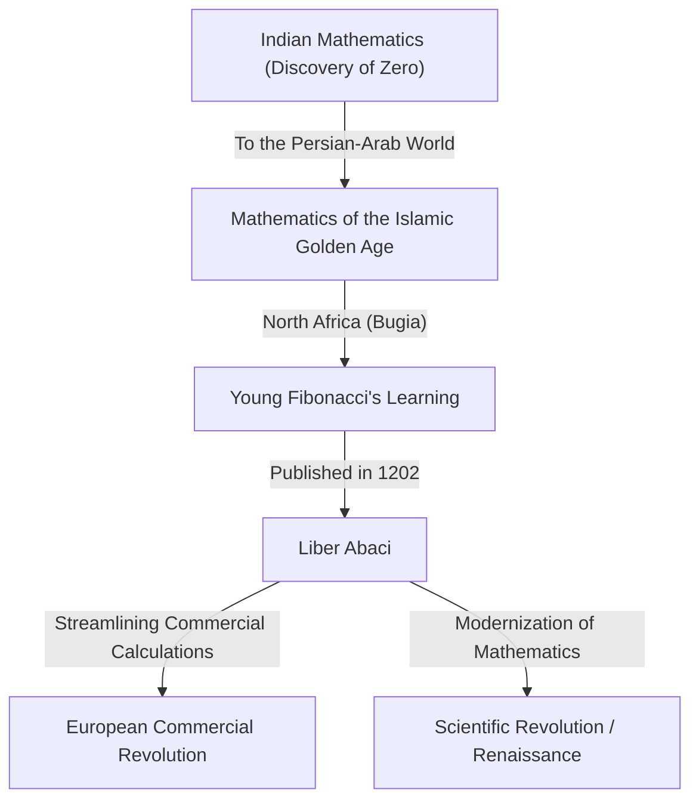
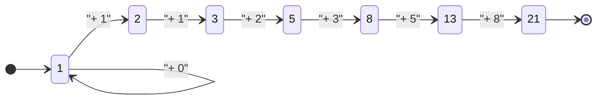

## Introduction: The Mathematical Light Illuminating the Dark Ages

In medieval Europe, during what is often called the "Dark Ages," the progress of scholarship was stagnant. However, at the beginning of the 13th century, a genius emerged who would change the history of European mathematics forever. His name was Leonardo of Pisa. This figure, later known as **[Fibonacci](https://kenji.blog/en/p/fibonacci/)**, was the driving force behind popularizing the "Arabic numerals" (Hindu-Arabic numerals) that we use daily in modern times, and the discoverer of the "[Fibonacci](https://kenji.blog/en/p/fibonacci/) sequence" that unlocks the mysteries of the natural world.

In this article, we will delve deeply into [Fibonacci](https://kenji.blog/en/p/fibonacci/)'s turbulent life, the impact his magnum opus "Liber Abaci" had on society, and his mathematical legacy that extends to modern science and the natural world.

## Life of [Fibonacci](https://kenji.blog/en/p/fibonacci/) and Historical Background

### Birth in Pisa and the Origin of the Name "[Fibonacci](https://kenji.blog/en/p/fibonacci/)"

[Leonardo Fibonacci](https://kenji.blog/en/p/fibonacci/) was born around 1170 in the Italian city-state of Pisa. Pisa at the time flourished as a center of Mediterranean trade, a prosperous republic with a powerful navy and commercial network. His father, Guglielmo Bonacci, was a wealthy merchant who also worked as a customs official for Pisa.

The name "[Fibonacci](https://kenji.blog/en/p/fibonacci/)" was actually not used during his lifetime. It is a coined term created by later historians, abbreviating the Latin "filius Bonacci" (son of Bonacci). He called himself "Leonardo Pisano" (Leonardo of Pisa) or, due to his love for travel, "Bigollo" (meaning wanderer or idler).

### Education in North Africa and Encounters with Different Cultures

Young Leonardo's destiny took a major turn when his father Guglielmo was appointed to represent the Pisan trading colony in Bugia (present-day Béjaïa in Algeria), North Africa. His father summoned him to Bugia to learn the practical business of a merchant.

There, Leonardo had the opportunity to learn mathematics from an Arab teacher. The Islamic world at the time was at the forefront of mathematics, widely using the base-10 positional numeral system originating from India, which included "0" (Hindu-Arabic numerals). Calculations using the Roman numerals (I, V, X, L, C, D, M) prevalent in Europe were extremely cumbersome, making the abacus indispensable for advanced calculations. However, with Hindu-Arabic numerals, complex calculations could be performed quickly and accurately using just paper and pen.

### Travels in the Mediterranean World and the Quest for Knowledge

Realizing the overwhelming superiority of Hindu-Arabic numerals, Leonardo traveled the Mediterranean world in search of further knowledge. He visited commercial and academic hubs of the time, such as Egypt, Syria, Greece, Sicily, and Provence, absorbing various mathematical techniques and commercial calculation methods while interacting with local scholars.

Through these extensive travels, he became convinced that Hindu-Arabic numerals were not just convenient tools for commerce, but a powerful system essential for the development of pure mathematics. Around the year 1200, he returned to his hometown of Pisa and began compiling the vast knowledge he had acquired.

## "Liber Abaci" and Its Impact

In 1202, [Fibonacci](https://kenji.blog/en/p/fibonacci/) completed his magnum opus, "Liber Abaci" (The Book of Calculation), with a revised edition published in 1228. Although the title mentions the "abacus," it was actually a groundbreaking book that explained how to perform calculations using the new number system without using an abacus.

### Introduction of Arabic Numerals

The beginning of "Liber Abaci" starts with this historic sentence:

> "The nine Indian figures are: 9 8 7 6 5 4 3 2 1. With these nine figures, and with the sign 0 which the Arabs call zephirum, any number whatsoever is written."

This book did not merely teach how to write numbers; it comprehensively covered the basics of arithmetic taught in modern elementary and middle schools, including written methods for addition, subtraction, multiplication, division, operations with fractions, and how to find square and cube roots.

### Application to Commercial Mathematics

To prove how exceptionally practical this new mathematical system was, [Fibonacci](https://kenji.blog/en/p/fibonacci/) included numerous realistic problems faced by merchants.

- Calculating complex exchange rates between different currencies
- Calculating profits and losses on goods
- Determining fair ratios in bartering
- Compound interest calculations

As a result, "Liber Abaci" became not only an academic text but also the ultimate practical manual for European merchants. Through his influence, Italian merchants gradually transitioned from Roman to Arabic numerals, laying an important foundation for the subsequent development of capitalist economies and the Scientific Revolution during the Renaissance.

## The [Fibonacci](https://kenji.blog/en/p/fibonacci/) Sequence and the Golden Ratio: Nature's Code

The most famous part of "Liber Abaci" is the "Rabbit Problem" that appears in Chapter 12. This seemingly simple puzzle gave birth to a phenomenal sequence later named the "[Fibonacci](https://kenji.blog/en/p/fibonacci/) Sequence."

### The Rabbit Problem

The problem is as follows:

> "A certain man put a pair of rabbits in a place surrounded on all sides by a wall. How many pairs of rabbits can be produced from that pair in a year if it is supposed that every month each pair begets a new pair which from the second month on becomes productive?"

By tracking the number of rabbit pairs each month, the following sequence is obtained:

$1, 1, 2, 3, 5, 8, 13, 21, 34, 55, 89, 144, ...$

The regularity of this sequence is exceptionally beautiful: "The sum of the previous two numbers equals the next number." Mathematically defined, it forms the following recurrence relation:

$$
F_n = 
\begin{cases} 
0 & \text{if } n = 0 \\
1 & \text{if } n = 1 \\
F_{n-1} + F_{n-2} & \text{if } n > 1
\end{cases}
$$

### The Surprising Relationship with the Golden Ratio

One of the most mystical features of the [Fibonacci](https://kenji.blog/en/p/fibonacci/) sequence is that as you take the ratio of two adjacent numbers ($F_{n+1} / F_n$), it converges to a specific constant.

- $1 / 1 = 1.000$
- $2 / 1 = 2.000$
- $3 / 2 = 1.500$
- $5 / 3 \approx 1.667$
- $8 / 5 = 1.600$
- $13 / 8 = 1.625$
- $21 / 13 \approx 1.615$
- $34 / 21 \approx 1.619$

As the numbers grow larger, this ratio approaches an irrational number called $\phi$ (phi).

$$
\phi = \frac{1 + \sqrt{5}}{2} \approx 1.6180339887...
$$

This is known as the "Golden Ratio," considered since ancient Greece to be the most beautiful and harmonious proportion. This ratio is intentionally (or unconsciously) used in historic architecture and artworks, such as the Parthenon and the Mona Lisa.

Furthermore, the 19th-century mathematician Jacques Philippe Marie Binet discovered "Binet's Formula," which finds the general term of the [Fibonacci](https://kenji.blog/en/p/fibonacci/) sequence using the Golden Ratio:

$$
F_n = \frac{\phi^n - (1-\phi)^n}{\sqrt{5}}
$$

### [Fibonacci](https://kenji.blog/en/p/fibonacci/) Numbers in Nature

The [Fibonacci](https://kenji.blog/en/p/fibonacci/) sequence and the Golden Ratio are not mere mathematical play. Astoundingly, this sequence is hidden everywhere in the natural world.

1. **Number of Petals**: The petal count of many flowers is a [Fibonacci](https://kenji.blog/en/p/fibonacci/) number (e.g., lilies have 3, buttercups 5, delphiniums 8, marigolds 13, sunflowers 21, 34, 55, etc.).
2. **Phyllotaxis (Leaf Arrangement)**: The arrangement pattern of leaves growing from a plant's stem evolved so that upper and lower leaves do not overlap and block sunlight. This angle becomes the "Golden Angle" (about 137.5 degrees), resulting in the appearance of [Fibonacci](https://kenji.blog/en/p/fibonacci/) numbers.
3. **Pinecones and Pineapples**: When counting the number of spirals on the surface, the clockwise and counterclockwise spirals form adjacent [Fibonacci](https://kenji.blog/en/p/fibonacci/) numbers, such as 8 and 13, or 13 and 21.
4. **Nautilus Shells**: The "logarithmic spiral (golden spiral)" drawn based on the golden ratio perfectly matches the growth pattern of snail shells.

## Other Mathematical Achievements

[Fibonacci](https://kenji.blog/en/p/fibonacci/)'s accomplishments were not limited to "Liber Abaci." His fame reached the ears of the Holy Roman Emperor Frederick II, who invited him to his court to tackle numerous mathematical challenges.

### "Liber Quadratorum" (The Book of Squares)

Written in 1225, this book is an advanced treatise on Diophantine equations (equations seeking integer solutions). It explores the concept of "congruent numbers" and shows deep insights into the Pythagorean theorem. It is highly regarded as the greatest masterpiece of number theory in medieval Europe.

### "Practica Geometriae" (Practical Geometry)

Authored in 1220, this book details surveying and geometry. It provided rigorous methods for calculating area and volume, and practical applications of the principles of ancient Greek [Euclide](https://kenji.blog/en/p/euclid/)an geometry, making it a valuable resource for engineers and surveyors of the time.

## Modern Society and [Fibonacci](https://kenji.blog/en/p/fibonacci/)'s Legacy

The discoveries of [Fibonacci](https://kenji.blog/en/p/fibonacci/), who lived about 800 years ago, continue to play an important role in the most advanced fields of modern society.

### Applications in Computer Science

In computer algorithms, the [Fibonacci](https://kenji.blog/en/p/fibonacci/) sequence is highly useful. The algorithm called "Fibonacci search" can search data more efficiently than binary search under specific conditions. Additionally, a data structure known as a "Fibonacci heap" is indispensable for accelerating graph theory algorithms like [Dijkstra](https://kenji.blog/en/p/graph-theory-dijkstra-a-star/)'s algorithm.

### [Fibonacci](https://kenji.blog/en/p/fibonacci/) Retracement in Financial Markets

Surprisingly, his name is frequently heard in the world of finance as well. A technical analysis method called "[Fibonacci](https://kenji.blog/en/p/fibonacci/) retracement" is used to predict the points where stock prices or exchange rates will rebound or fall back on charts. Traders draw support and resistance lines based on [Fibonacci](https://kenji.blog/en/p/fibonacci/) ratios such as 23.6%, 38.2%, and 61.8% (like the reciprocal of the golden ratio). The idea that the same laws of nature apply to the market waves created by human group psychology is profoundly fascinating.

## Conclusion

[Leonardo Fibonacci](https://kenji.blog/en/p/fibonacci/) bridged the knowledge of the Islamic world and Europe, bringing the light of mathematics to the Western world. Without the Arabic numerals he popularized through "Liber Abaci," the subsequent Scientific Revolution and modern digital society might not have existed.

Moreover, the sequence born from the playful "Rabbit Problem" embodies the beauty of pure mathematics and continues to captivate us today as a universal law extending from plant growth to galactic spirals, and even human economic activity. [Fibonacci](https://kenji.blog/en/p/fibonacci/)'s legacy teaches us across time that mathematics is not just a calculation technique, but a "common language" for unlocking the truths of the universe.
