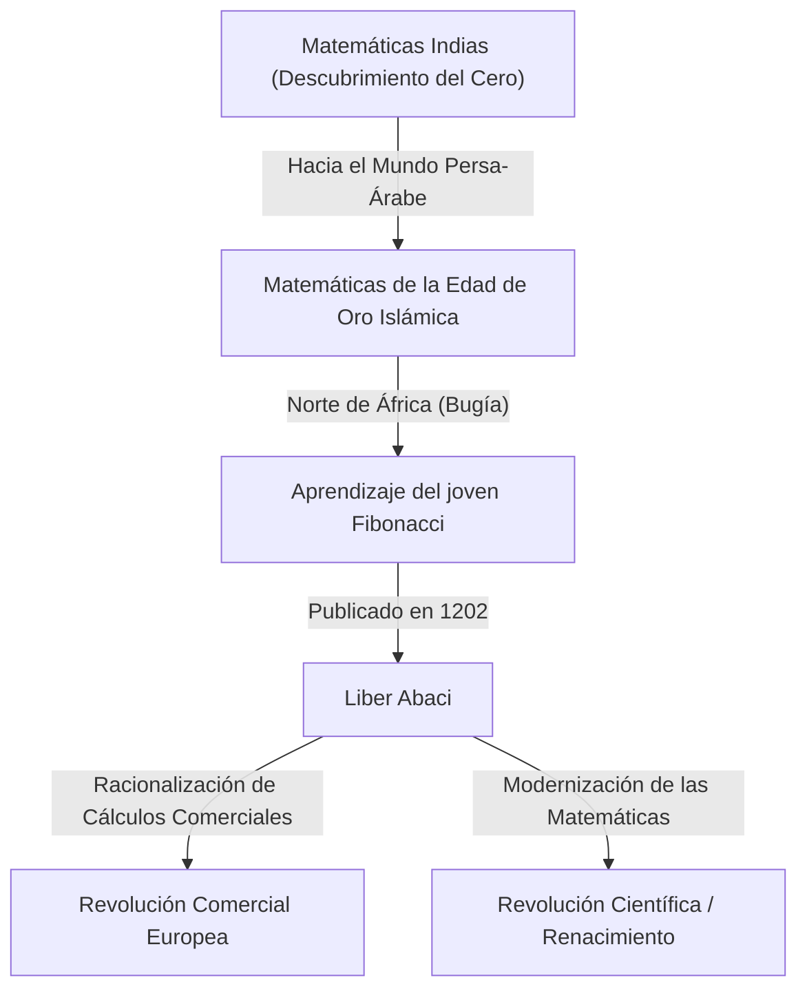
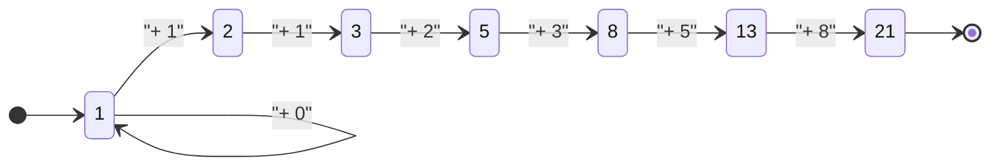

## Introducción: La Luz Matemática que Iluminó la Edad Oscura

En la Europa medieval, durante lo que a menudo se llama la "Edad Oscura", el progreso académico estaba estancado. Sin embargo, a principios del siglo XIII, surgió un genio que cambiaría para siempre la historia de las matemáticas europeas. Su nombre era Leonardo de Pisa. Esta figura, más tarde conocida como **Fibonacci**, fue la fuerza impulsora detrás de la popularización de los "números arábigos" (números indoarábigos) que usamos a diario en la actualidad, y el descubridor de la "sucesión de Fibonacci" que desentraña los misterios del mundo natural.

En este artículo, profundizaremos en la turbulenta vida de Fibonacci, el impacto que su obra magna "Liber Abaci" tuvo en la sociedad y su legado matemático que se extiende hasta la ciencia moderna y la naturaleza.

## Vida de Fibonacci y Contexto Histórico

### Nacimiento en Pisa y el Origen del Nombre "Fibonacci"

[Leonardo Fibonacci](https://kenji.blog/es/p/fibonacci/) nació alrededor de 1170 en la ciudad-estado italiana de Pisa. Pisa en ese momento florecía como un centro de comercio mediterráneo, una república próspera con una poderosa armada y red comercial. Su padre, Guglielmo Bonacci, era un rico comerciante que también trabajaba como funcionario de aduanas para Pisa.

El nombre "Fibonacci" en realidad no se usó durante su vida. Es un término acuñado por historiadores posteriores, que abrevia el latín "filius Bonacci" (hijo de Bonacci). Él se llamaba a sí mismo "Leonardo Pisano" (Leonardo de Pisa) o, debido a su amor por los viajes, "Bigollo" (que significa vagabundo o perezoso).

### Educación en el Norte de África y Encuentros con Diferentes Culturas

El destino del joven Leonardo dio un gran giro cuando su padre Guglielmo fue nombrado representante de la colonia comercial pisana en Bugía (actual Bejaia en Argelia), en el norte de África. Su padre lo llamó a Bugía para que aprendiera el negocio práctico de un comerciante.

Allí, Leonardo tuvo la oportunidad de aprender matemáticas de un maestro árabe. El mundo islámico en ese momento estaba a la vanguardia de las matemáticas, utilizando ampliamente el sistema numérico posicional de base 10 originario de la India, que incluía el "0" (números indoarábigos). Los cálculos que usaban los números romanos (I, V, X, L, C, D, M) predominantes en Europa eran extremadamente engorrosos, haciendo que el ábaco fuera indispensable para cálculos avanzados. Sin embargo, con los números indoarábigos, los cálculos complejos podían realizarse de manera rápida y precisa usando solo papel y lápiz.

### Viajes por el Mundo Mediterráneo y la Búsqueda del Conocimiento

Al darse cuenta de la abrumadora superioridad de los números indoarábigos, Leonardo viajó por el mundo mediterráneo en busca de más conocimiento. Visitó centros comerciales y académicos de la época, como Egipto, Siria, Grecia, Sicilia y Provenza, absorbiendo diversas técnicas matemáticas y métodos de cálculo comercial mientras interactuaba con eruditos locales.

A través de estos extensos viajes, se convenció de que los números indoarábigos no eran solo herramientas convenientes para el comercio, sino un sistema poderoso esencial para el desarrollo de las matemáticas puras. Alrededor del año 1200, regresó a su ciudad natal de Pisa y comenzó a recopilar el vasto conocimiento que había adquirido.

## "Liber Abaci" y su Impacto

En 1202, Fibonacci completó su obra magna, "Liber Abaci" (El Libro del Cálculo), publicándose una edición revisada en 1228. Aunque el título menciona el "ábaco", en realidad era un libro revolucionario que explicaba cómo realizar cálculos usando el nuevo sistema numérico sin usar un ábaco.

### Introducción de los Números Arábigos

El comienzo del "Liber Abaci" inicia con esta histórica frase:

> "Las nueve cifras de los indios son: 9 8 7 6 5 4 3 2 1. Con estas nueve cifras, y con el signo 0 que los árabes llaman zephirum, se puede escribir cualquier número."

Este libro no solo enseñaba cómo escribir números; cubría de manera integral los conceptos básicos de aritmética que se enseñan en las escuelas primarias y secundarias modernas, incluyendo métodos escritos para sumas, restas, multiplicaciones, divisiones, operaciones con fracciones y cómo encontrar raíces cuadradas y cúbicas.

### Aplicación a las Matemáticas Comerciales

Para demostrar lo excepcionalmente práctico que era este nuevo sistema matemático, Fibonacci incluyó numerosos problemas realistas a los que se enfrentaban los comerciantes.

- Cálculo de tipos de cambio complejos entre diferentes monedas
- Cálculo de ganancias y pérdidas en bienes
- Determinación de proporciones justas en el trueque
- Cálculos de interés compuesto

Como resultado, el "Liber Abaci" se convirtió no solo en un texto académico sino también en el manual práctico definitivo para los comerciantes europeos. A través de su influencia, los comerciantes italianos hicieron gradualmente la transición de los números romanos a los arábigos, sentando una base importante para el posterior desarrollo de las economías capitalistas y la Revolución Científica durante el Renacimiento.

## La Sucesión de Fibonacci y la Proporción Áurea: El Código de la Naturaleza

La parte más famosa del "Liber Abaci" es el "Problema de los Conejos" que aparece en el Capítulo 12. Este rompecabezas aparentemente simple dio a luz a una sucesión fenomenal más tarde llamada la "Sucesión de Fibonacci".

### El Problema de los Conejos

El problema es el siguiente:

> "Cierto hombre puso un par de conejos en un lugar rodeado por todos lados por un muro. ¿Cuántos pares de conejos se pueden producir a partir de ese par en un año si se supone que cada mes cada par engendra un nuevo par que a partir del segundo mes se vuelve productivo?"

Al rastrear el número de pares de conejos cada mes, se obtiene la siguiente sucesión:

$1, 1, 2, 3, 5, 8, 13, 21, 34, 55, 89, 144, ...$

La regularidad de esta secuencia es excepcionalmente hermosa: "La suma de los dos números anteriores es igual al siguiente número". Matemáticamente definido, forma la siguiente relación de recurrencia:

$$
F_n = 
\begin{cases} 
0 & \text{si } n = 0 \\
1 & \text{si } n = 1 \\
F_{n-1} + F_{n-2} & \text{si } n > 1
\end{cases}
$$

### La Asombrosa Relación con la Proporción Áurea

Una de las características más místicas de la sucesión de Fibonacci es que a medida que se toma la proporción de dos números adyacentes ($F_{n+1} / F_n$), esta converge a una constante específica.

- $1 / 1 = 1.000$
- $2 / 1 = 2.000$
- $3 / 2 = 1.500$
- $5 / 3 \approx 1.667$
- $8 / 5 = 1.600$
- $13 / 8 = 1.625$
- $21 / 13 \approx 1.615$
- $34 / 21 \approx 1.619$

A medida que los números crecen, esta proporción se acerca a un número irracional llamado $\phi$ (phi).

$$
\phi = \frac{1 + \sqrt{5}}{2} \approx 1.6180339887...
$$

Esto se conoce como la "Proporción Áurea", considerada desde la antigua Grecia como la proporción más hermosa y armoniosa. Esta proporción se utiliza intencionalmente (o inconscientemente) en la arquitectura histórica y en obras de arte, como el Partenón y la Mona Lisa.

Además, el matemático del siglo XIX Jacques Philippe Marie Binet descubrió la "Fórmula de Binet", que encuentra el término general de la sucesión de Fibonacci usando la Proporción Áurea:

$$
F_n = \frac{\phi^n - (1-\phi)^n}{\sqrt{5}}
$$

### Los Números de Fibonacci en la Naturaleza

La sucesión de Fibonacci y la Proporción Áurea no son un mero juego matemático. Sorprendentemente, esta secuencia está oculta en todas partes en el mundo natural.

1. **Número de Pétalos**: El recuento de pétalos de muchas flores es un número de Fibonacci (ej., los lirios tienen 3, los ranúnculos 5, las espuelas de caballero 8, las caléndulas 13, los girasoles 21, 34, 55, etc.).
2. **Filotaxis (Disposición de las Hojas)**: El patrón de disposición de las hojas que crecen en el tallo de una planta evolucionó para que las hojas superiores e inferiores no se superpongan y bloqueen la luz solar. Este ángulo se convierte en el "Ángulo Áureo" (alrededor de 137.5 grados), resultando en la aparición de números de Fibonacci.
3. **Piñas y Piñas Tropicales**: Al contar el número de espirales en la superficie, las espirales en sentido horario y antihorario forman números de Fibonacci adyacentes, como 8 y 13, o 13 y 21.
4. **Conchas de Nautilus**: La "espiral logarítmica (espiral áurea)" dibujada basándose en la proporción áurea coincide perfectamente con el patrón de crecimiento de las conchas de caracol.

## Otros Logros Matemáticos

Los logros de Fibonacci no se limitaron al "Liber Abaci". Su fama llegó a oídos del Emperador del Sacro Imperio Romano Germánico, Federico II, quien lo invitó a su corte para abordar numerosos desafíos matemáticos.

### "Liber Quadratorum" (El Libro de los Cuadrados)

Escrito en 1225, este libro es un tratado avanzado sobre ecuaciones diofánticas (ecuaciones que buscan soluciones enteras). Explora el concepto de "números congruentes" y muestra profundas percepciones sobre el teorema de Pitágoras. Es muy considerado como la mayor obra maestra de la teoría de números en la Europa medieval.

### "Practica Geometriae" (Geometría Práctica)

Escrito en 1220, este libro detalla la topografía y la geometría. Proporcionó métodos rigurosos para calcular áreas y volúmenes, y aplicaciones prácticas de los principios de la geometría euclidiana griega antigua, convirtiéndolo en un recurso valioso para los ingenieros y topógrafos de la época.

## La Sociedad Moderna y el Legado de Fibonacci

Los descubrimientos de Fibonacci, que vivió hace unos 800 años, continúan desempeñando un papel importante en los campos más avanzados de la sociedad moderna.

### Aplicaciones en Ciencias de la Computación

En los algoritmos informáticos, la sucesión de Fibonacci es muy útil. El algoritmo llamado "búsqueda de Fibonacci" puede buscar datos de manera más eficiente que la búsqueda binaria bajo condiciones específicas. Además, una estructura de datos conocida como "montículo de Fibonacci" es indispensable para acelerar algoritmos de la teoría de grafos como el algoritmo de Dijkstra.

### Retroceso de Fibonacci en los Mercados Financieros

Sorprendentemente, su nombre también se escucha con frecuencia en el mundo de las finanzas. Un método de análisis técnico llamado "retroceso de Fibonacci" se utiliza para predecir los puntos donde los precios de las acciones o los tipos de cambio rebotarán o retrocederán en los gráficos. Los operadores dibujan líneas de soporte y resistencia basadas en proporciones de Fibonacci como 23.6%, 38.2% y 61.8% (como el recíproco de la proporción áurea). La idea de que las mismas leyes de la naturaleza se aplican a las olas del mercado creadas por la psicología de grupo humana es profundamente fascinante.

## Conclusión

[Leonardo Fibonacci](https://kenji.blog/es/p/fibonacci/) tendió un puente entre el conocimiento del mundo islámico y Europa, trayendo la luz de las matemáticas al mundo occidental. Sin los números arábigos que popularizó a través del "Liber Abaci", la posterior Revolución Científica y la sociedad digital moderna podrían no haber existido.

Además, la sucesión nacida del lúdico "Problema de los Conejos" encarna la belleza de las matemáticas puras y continúa cautivándonos hoy como una ley universal que se extiende desde el crecimiento de las plantas hasta las espirales galácticas e incluso la actividad económica humana. El legado de Fibonacci nos enseña a través del tiempo que las matemáticas no son solo una técnica de cálculo, sino un "lenguaje común" para desbloquear las verdades del universo.
