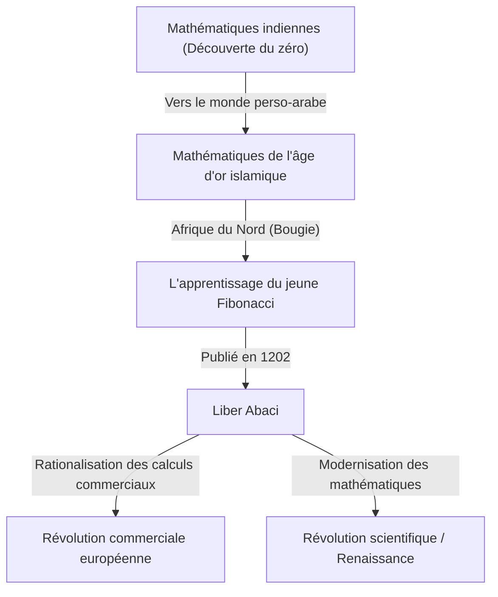
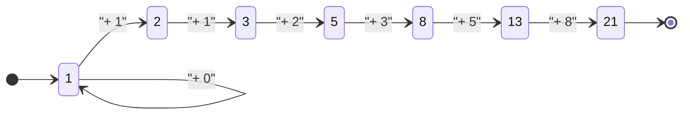

## Introduction : La lumière mathématique illuminant l'âge des ténèbres

Dans l'Europe médiévale, au cours de ce que l'on appelle souvent "l'âge des ténèbres", les progrès du savoir stagnaient. Cependant, au début du XIIIe siècle, un génie a émergé qui allait changer à jamais l'histoire des mathématiques européennes. Son nom était Léonard de Pise. Cette figure, plus tard connue sous le nom de **[Fibonacci](https://kenji.blog/fr/p/fibonacci/)**, fut le moteur de la popularisation des "chiffres arabes" (chiffres indo-arabes) que nous utilisons quotidiennement à l'époque moderne, et le découvreur de la "suite de [Fibonacci](https://kenji.blog/fr/p/fibonacci/)" qui dévoile les mystères du monde naturel.

Dans cet article, nous plongerons profondément dans la vie mouvementée de [Fibonacci](https://kenji.blog/fr/p/fibonacci/), l'impact de son œuvre majeure "Liber Abaci" sur la société, et son héritage mathématique qui s'étend à la science moderne et au monde naturel.

## La vie de [Fibonacci](https://kenji.blog/fr/p/fibonacci/) et le contexte historique

### Naissance à Pise et origine du nom "[Fibonacci](https://kenji.blog/fr/p/fibonacci/)"

[Leonardo Fibonacci](https://kenji.blog/fr/p/fibonacci/) est né vers 1170 dans la cité-État italienne de Pise. À l'époque, Pise prospérait en tant que centre du commerce méditerranéen, une république prospère dotée d'une marine et d'un réseau commercial puissants. Son père, Guglielmo Bonacci, était un riche marchand qui travaillait également comme fonctionnaire des douanes pour Pise.

Le nom "[Fibonacci](https://kenji.blog/fr/p/fibonacci/)" n'a en fait pas été utilisé de son vivant. C'est un terme inventé par des historiens ultérieurs, abrégeant le latin "filius Bonacci" (fils de Bonacci). Il s'appelait lui-même "Leonardo Pisano" (Léonard de Pise) ou, en raison de son amour pour les voyages, "Bigollo" (signifiant vagabond ou paresseux).

### Éducation en Afrique du Nord et rencontres avec différentes cultures

Le destin du jeune Léonard a pris un tournant majeur lorsque son père Guglielmo a été nommé pour représenter la colonie commerciale pisane à Bougie (l'actuelle Béjaïa en Algérie), en Afrique du Nord. Son père l'a convoqué à Bougie pour apprendre le métier pratique de marchand.

Là, Léonard a eu l'opportunité d'apprendre les mathématiques avec un professeur arabe. Le monde islamique de l'époque était à la pointe des mathématiques, utilisant largement le système de numération de position en base 10 originaire d'Inde, qui incluait le "0" (chiffres indo-arabes). Les calculs utilisant les chiffres romains (I, V, X, L, C, D, M) prédominants en Europe étaient extrêmement lourds, rendant le boulier indispensable pour les calculs avancés. Cependant, avec les chiffres indo-arabes, des calculs complexes pouvaient être effectués rapidement et avec précision en n'utilisant que du papier et un stylo.

### Voyages dans le monde méditerranéen et quête du savoir

Conscient de la supériorité écrasante des chiffres indo-arabes, Léonard a parcouru le monde méditerranéen à la recherche de connaissances supplémentaires. Il a visité les centres commerciaux et universitaires de l'époque, tels que l'Égypte, la Syrie, la Grèce, la Sicile et la Provence, absorbant diverses techniques mathématiques et méthodes de calcul commercial tout en interagissant avec des érudits locaux.

À travers ces longs voyages, il a acquis la conviction que les chiffres indo-arabes n'étaient pas seulement des outils pratiques pour le commerce, mais un système puissant essentiel pour le développement des mathématiques pures. Vers l'an 1200, il est retourné dans sa ville natale de Pise et a commencé à compiler les vastes connaissances qu'il avait acquises.

## "Liber Abaci" et son impact

En 1202, [Fibonacci](https://kenji.blog/fr/p/fibonacci/) a achevé son œuvre majeure, "Liber Abaci" (Le Livre du calcul), avec une édition révisée publiée en 1228. Bien que le titre mentionne le "boulier", il s'agissait en fait d'un livre révolutionnaire expliquant comment effectuer des calculs en utilisant le nouveau système numérique sans utiliser de boulier.

### Introduction des chiffres arabes

Le début du "Liber Abaci" commence par cette phrase historique :

> "Les neuf chiffres des Indiens sont : 9 8 7 6 5 4 3 2 1. Avec ces neuf chiffres, et avec le signe 0 que les Arabes appellent zephirum, n'importe quel nombre peut être écrit."

Ce livre n'enseignait pas seulement comment écrire les nombres ; il couvrait de manière exhaustive les bases de l'arithmétique enseignées dans les écoles primaires et secondaires modernes, y compris les méthodes écrites pour l'addition, la soustraction, la multiplication, la division, les opérations avec les fractions, et comment trouver des racines carrées et cubiques.

### Application aux mathématiques commerciales

Pour prouver à quel point ce nouveau système mathématique était exceptionnellement pratique, [Fibonacci](https://kenji.blog/fr/p/fibonacci/) a inclus de nombreux problèmes réalistes rencontrés par les marchands.

- Calcul des taux de change complexes entre différentes devises
- Calcul des profits et des pertes sur les marchandises
- Détermination des ratios équitables dans le troc
- Calculs d'intérêts composés

En conséquence, le "Liber Abaci" est devenu non seulement un texte académique, mais aussi le manuel pratique ultime pour les marchands européens. Grâce à son influence, les marchands italiens sont progressivement passés des chiffres romains aux chiffres arabes, posant une base importante pour le développement ultérieur des économies capitalistes et de la Révolution scientifique pendant la Renaissance.

## La suite de [Fibonacci](https://kenji.blog/fr/p/fibonacci/) et le nombre d'or : Le code de la nature

La partie la plus célèbre du "Liber Abaci" est le "Problème des lapins" qui apparaît au chapitre 12. Ce puzzle apparemment simple a donné naissance à une suite phénoménale appelée plus tard la "Suite de [Fibonacci](https://kenji.blog/fr/p/fibonacci/)".

### Le problème des lapins

Le problème est le suivant :

> "Un homme place un couple de lapins dans un lieu entouré de tous côtés par un mur. Combien de couples de lapins peuvent être produits à partir de ce couple en un an s'il est supposé que chaque mois chaque couple engendre un nouveau couple qui, à partir du deuxième mois, devient productif ?"

En suivant le nombre de couples de lapins chaque mois, on obtient la séquence suivante :

$1, 1, 2, 3, 5, 8, 13, 21, 34, 55, 89, 144, ...$

La régularité de cette séquence est exceptionnellement belle : "La somme des deux nombres précédents est égale au nombre suivant". Mathématiquement définie, elle forme la relation de récurrence suivante :

$$
F_n = 
\begin{cases} 
0 & \text{si } n = 0 \\
1 & \text{si } n = 1 \\
F_{n-1} + F_{n-2} & \text{si } n > 1
\end{cases}
$$

### La relation étonnante avec le nombre d'or

L'une des caractéristiques les plus mystiques de la suite de [Fibonacci](https://kenji.blog/fr/p/fibonacci/) est qu'au fur et à mesure que l'on prend le rapport de deux nombres adjacents ($F_{n+1} / F_n$), celui-ci converge vers une constante spécifique.

- $1 / 1 = 1.000$
- $2 / 1 = 2.000$
- $3 / 2 = 1.500$
- $5 / 3 \approx 1.667$
- $8 / 5 = 1.600$
- $13 / 8 = 1.625$
- $21 / 13 \approx 1.615$
- $34 / 21 \approx 1.619$

À mesure que les nombres deviennent plus grands, ce rapport se rapproche d'un nombre irrationnel appelé $\phi$ (phi).

$$
\phi = \frac{1 + \sqrt{5}}{2} \approx 1.6180339887...
$$

C'est ce qu'on appelle le "Nombre d'Or", considéré depuis la Grèce antique comme la proportion la plus belle et la plus harmonieuse. Ce ratio est intentionnellement (ou inconsciemment) utilisé dans l'architecture historique et les œuvres d'art, comme le Parthénon et la Joconde.

De plus, le mathématicien du 19ème siècle Jacques Philippe Marie Binet a découvert la "Formule de Binet", qui trouve le terme général de la suite de [Fibonacci](https://kenji.blog/fr/p/fibonacci/) en utilisant le Nombre d'Or :

$$
F_n = \frac{\phi^n - (1-\phi)^n}{\sqrt{5}}
$$

### Les nombres de [Fibonacci](https://kenji.blog/fr/p/fibonacci/) dans la nature

La suite de [Fibonacci](https://kenji.blog/fr/p/fibonacci/) et le Nombre d'Or ne sont pas de simples jeux mathématiques. Étonnamment, cette séquence est cachée partout dans le monde naturel.

1. **Nombre de pétales** : Le nombre de pétales de nombreuses fleurs est un nombre de [Fibonacci](https://kenji.blog/fr/p/fibonacci/) (par exemple, les lys en ont 3, les renoncules 5, les delphiniums 8, les soucis 13, les tournesols 21, 34, 55, etc.).
2. **Phyllotaxie (Disposition des feuilles)** : Le motif de disposition des feuilles poussant sur la tige d'une plante a évolué de sorte que les feuilles supérieures et inférieures ne se chevauchent pas et ne bloquent pas la lumière du soleil. Cet angle devient "l'Angle d'Or" (environ 137,5 degrés), ce qui entraîne l'apparition de nombres de [Fibonacci](https://kenji.blog/fr/p/fibonacci/).
3. **Pommes de pin et ananas** : En comptant le nombre de spirales sur la surface, les spirales dans le sens des aiguilles d'une montre et dans le sens inverse forment des nombres de [Fibonacci](https://kenji.blog/fr/p/fibonacci/) adjacents, tels que 8 et 13, ou 13 et 21.
4. **Coquilles de nautile** : La "spirale logarithmique (spirale d'or)" dessinée sur la base du nombre d'or correspond parfaitement au modèle de croissance des coquilles d'escargots.

## Autres réalisations mathématiques

Les accomplissements de [Fibonacci](https://kenji.blog/fr/p/fibonacci/) ne se sont pas limités au "Liber Abaci". Sa renommée est parvenue aux oreilles de l'empereur romain germanique Frédéric II, qui l'a invité à sa cour pour s'attaquer à de nombreux défis mathématiques.

### "Liber Quadratorum" (Le livre des carrés)

Écrit en 1225, ce livre est un traité avancé sur les équations diophantiennes (équations cherchant des solutions entières). Il explore le concept de "nombres congruents" et montre des aperçus profonds sur le théorème de Pythagore. Il est hautement considéré comme le plus grand chef-d'œuvre de la théorie des nombres dans l'Europe médiévale.

### "Practica Geometriae" (Géométrie pratique)

Rédigé en 1220, ce livre détaille l'arpentage et la géométrie. Il a fourni des méthodes rigoureuses pour calculer la surface et le volume, et des applications pratiques des principes de la géométrie euclidienne grecque antique, en faisant une ressource précieuse pour les ingénieurs et les arpenteurs de l'époque.

## La société moderne et l'héritage de [Fibonacci](https://kenji.blog/fr/p/fibonacci/)

Les découvertes de [Fibonacci](https://kenji.blog/fr/p/fibonacci/), qui a vécu il y a environ 800 ans, continuent de jouer un rôle important dans les domaines les plus avancés de la société moderne.

### Applications en informatique

Dans les algorithmes informatiques, la suite de [Fibonacci](https://kenji.blog/fr/p/fibonacci/) est très utile. L'algorithme appelé "recherche de [Fibonacci](https://kenji.blog/fr/p/fibonacci/)" peut rechercher des données plus efficacement que la recherche binaire dans des conditions spécifiques. De plus, une structure de données connue sous le nom de "tas de [Fibonacci](https://kenji.blog/fr/p/fibonacci/)" est indispensable pour accélérer les algorithmes de la théorie des graphes comme l'algorithme de [Dijkstra](https://kenji.blog/fr/p/graph-theory-dijkstra-a-star/).

### Retracement de [Fibonacci](https://kenji.blog/fr/p/fibonacci/) sur les marchés financiers

Étonnamment, son nom est également fréquemment entendu dans le monde de la finance. Une méthode d'analyse technique appelée "retracement de [Fibonacci](https://kenji.blog/fr/p/fibonacci/)" est utilisée pour prédire les points où les cours des actions ou les taux de change rebondiront ou reculeront sur les graphiques. Les traders tracent des lignes de support et de résistance basées sur des ratios de [Fibonacci](https://kenji.blog/fr/p/fibonacci/) tels que 23,6 %, 38,2 % et 61,8 % (comme l'inverse du nombre d'or). L'idée que les mêmes lois de la nature s'appliquent aux vagues du marché créées par la psychologie de groupe humaine est profondément fascinante.

## Conclusion

[Leonardo Fibonacci](https://kenji.blog/fr/p/fibonacci/) a jeté un pont entre les connaissances du monde islamique et l'Europe, apportant la lumière des mathématiques au monde occidental. Sans les chiffres arabes qu'il a popularisés à travers le "Liber Abaci", la Révolution scientifique ultérieure et la société numérique moderne n'auraient peut-être pas existé.

De plus, la séquence née du ludique "Problème des lapins" incarne la beauté des mathématiques pures et continue de nous captiver aujourd'hui en tant que loi universelle s'étendant de la croissance des plantes aux spirales galactiques, et même à l'activité économique humaine. L'héritage de [Fibonacci](https://kenji.blog/fr/p/fibonacci/) nous enseigne à travers le temps que les mathématiques ne sont pas seulement une technique de calcul, mais un "langage commun" pour déverrouiller les vérités de l'univers.
