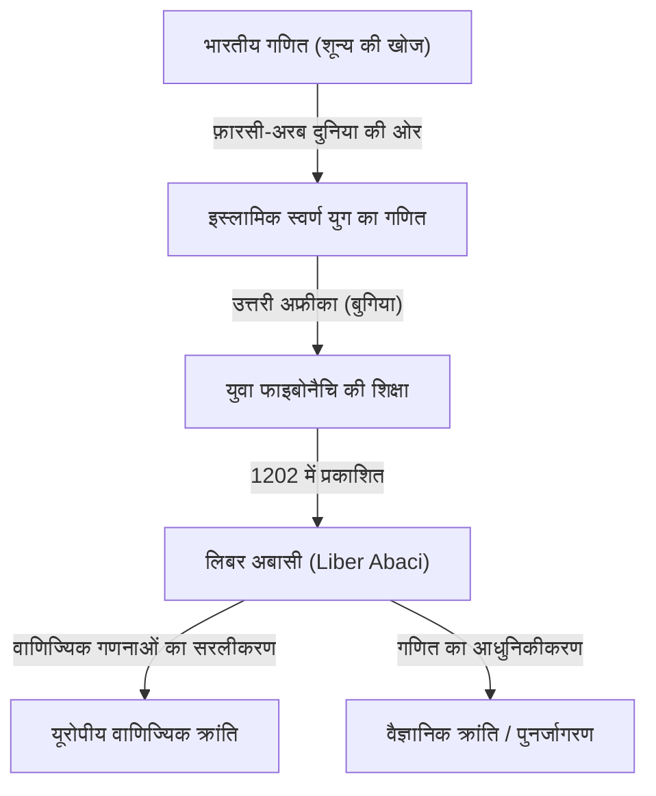
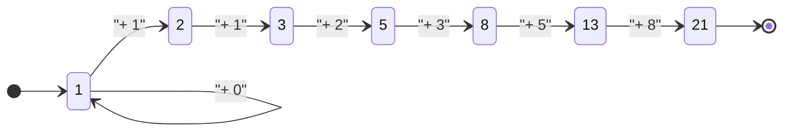

## प्रस्तावना: अंधकार युग को रोशन करने वाला गणितीय प्रकाश

मध्ययुगीन यूरोप में, जिसे अक्सर "अंधकार युग" कहा जाता है, विद्वता की प्रगति रुकी हुई थी। हालाँकि, 13वीं शताब्दी की शुरुआत में, एक ऐसी प्रतिभा का उदय हुआ जिसने यूरोपीय गणित के इतिहास को हमेशा के लिए बदल दिया। उनका नाम पीसा का लियोनार्डो था। यह व्यक्ति, जिसे बाद में **फाइबोनैचि** के रूप में जाना गया, आधुनिक समय में हम रोज़मर्रा इस्तेमाल करने वाले "अरबी अंकों" (हिंदू-अरबी अंकों) को लोकप्रिय बनाने के पीछे का प्रेरक बल था, और "फाइबोनैचि अनुक्रम" का खोजकर्ता था जो प्राकृतिक दुनिया के रहस्यों को खोलता है।

इस लेख में, हम फाइबोनैचि के उथल-पुथल भरे जीवन, उनके महान कार्य "लिबर अबासी" के समाज पर पड़े प्रभाव, और उनकी गणितीय विरासत पर गहराई से विचार करेंगे जो आधुनिक विज्ञान और प्राकृतिक दुनिया तक फैली हुई है।

## फाइबोनैचि का जीवन और ऐतिहासिक पृष्ठभूमि

### पीसा में जन्म और "फाइबोनैचि" नाम की उत्पत्ति

लियोनार्डो फाइबोनैचि का जन्म 1170 के आसपास इटली के शहर-राज्य पीसा में हुआ था। उस समय पीसा भूमध्यसागरीय व्यापार के केंद्र के रूप में फला-फूला, जो एक शक्तिशाली नौसेना और वाणिज्यिक नेटवर्क के साथ एक समृद्ध गणराज्य था। उनके पिता, गुग्लिल्मो बोनाची, एक धनी व्यापारी थे, जो पीसा के लिए एक सीमा शुल्क अधिकारी के रूप में भी काम करते थे।

"फाइबोनैचि" नाम वास्तव में उनके जीवनकाल में इस्तेमाल नहीं किया गया था। यह बाद के इतिहासकारों द्वारा गढ़ा गया शब्द है, जो लैटिन "filius Bonacci" (बोनाची का पुत्र) का संक्षिप्त रूप है। उन्होंने खुद को "लियोनार्डो पिसानो" (पीसा का लियोनार्डो) कहा, या यात्रा के प्रति अपने प्रेम के कारण, "बिगोलो" (जिसका अर्थ है पथिक या आलसी)।

### उत्तरी अफ्रीका में शिक्षा और विभिन्न संस्कृतियों से मुलाकात

युवा लियोनार्डो का भाग्य तब बदल गया जब उनके पिता गुग्लिल्मो को उत्तरी अफ्रीका के बुगिया (वर्तमान अल्जीरिया में बेजाया) में पीसा के व्यापारिक उपनिवेश का प्रतिनिधित्व करने के लिए नियुक्त किया गया। उनके पिता ने उन्हें एक व्यापारी का व्यावहारिक व्यवसाय सीखने के लिए बुगिया बुलाया।

वहाँ, लियोनार्डो को एक अरब शिक्षक से गणित सीखने का अवसर मिला। उस समय इस्लामी दुनिया गणित में सबसे आगे थी, जो भारत से उत्पन्न बेस-10 स्थितीय अंक प्रणाली का व्यापक रूप से उपयोग करती थी, जिसमें "0" (हिंदू-अरबी अंक) शामिल था। यूरोप में प्रचलित रोमन अंकों (I, V, X, L, C, D, M) का उपयोग करके गणना करना अत्यंत बोझिल था, जिससे उन्नत गणनाओं के लिए अबैकस अनिवार्य हो गया। हालाँकि, हिंदू-अरबी अंकों के साथ, जटिल गणनाएँ केवल कागज और कलम का उपयोग करके तेज़ी से और सटीक रूप से की जा सकती थीं।

### भूमध्यसागरीय दुनिया की यात्रा और ज्ञान की खोज

हिंदू-अरबी अंकों की भारी श्रेष्ठता को महसूस करते हुए, लियोनार्डो ने अधिक ज्ञान की तलाश में भूमध्यसागरीय दुनिया की यात्रा की। उन्होंने उस समय के वाणिज्यिक और शैक्षणिक केंद्रों, जैसे कि मिस्र, सीरिया, ग्रीस, सिसिली और प्रोवेंस का दौरा किया, और स्थानीय विद्वानों के साथ बातचीत करते हुए विभिन्न गणितीय तकनीकों और वाणिज्यिक गणना विधियों को आत्मसात किया।

इन व्यापक यात्राओं के माध्यम से, वह आश्वस्त हो गए कि हिंदू-अरबी अंक वाणिज्य के लिए केवल सुविधाजनक उपकरण नहीं थे, बल्कि शुद्ध गणित के विकास के लिए आवश्यक एक शक्तिशाली प्रणाली थे। वर्ष 1200 के आसपास, वे अपने गृहनगर पीसा लौट आए और अपने द्वारा प्राप्त विशाल ज्ञान को संकलित करना शुरू कर दिया।

## "लिबर अबासी" (Liber Abaci) और इसका प्रभाव

1202 में, फाइबोनैचि ने अपना महान कार्य, "लिबर अबासी" (गणना की पुस्तक) पूरा किया, जिसका संशोधित संस्करण 1228 में प्रकाशित हुआ। यद्यपि शीर्षक में "अबैकस" का उल्लेख है, यह वास्तव में एक अभूतपूर्व पुस्तक थी जिसने बताया कि बिना अबैकस के नई संख्या प्रणाली का उपयोग करके गणना कैसे की जाए।

### अरबी अंकों का परिचय

"लिबर अबासी" की शुरुआत इस ऐतिहासिक वाक्य से होती है:

> "भारतीयों के नौ अंक हैं: 9 8 7 6 5 4 3 2 1। इन नौ अंकों और चिह्न 0 के साथ, जिसे अरब लोग ज़ेफिरम (zephirum) कहते हैं, कोई भी संख्या लिखी जा सकती है।"

इस पुस्तक ने केवल संख्याएँ लिखना नहीं सिखाया; इसने आधुनिक प्राथमिक और मध्य विद्यालयों में पढ़ाए जाने वाले अंकगणित की मूल बातें व्यापक रूप से शामिल कीं, जिसमें जोड़, घटाव, गुणा, भाग, अंशों के साथ संचालन, और वर्ग और घन मूल खोजने के लिखित तरीके शामिल हैं।

### वाणिज्यिक गणित में अनुप्रयोग

यह नया गणितीय सिस्टम कितना असाधारण रूप से व्यावहारिक था, यह साबित करने के लिए फाइबोनैचि ने व्यापारियों द्वारा सामना की जाने वाली कई यथार्थवादी समस्याओं को शामिल किया।

- विभिन्न मुद्राओं के बीच जटिल विनिमय दरों की गणना
- वस्तुओं पर लाभ और हानि की गणना
- वस्तु विनिमय में उचित अनुपात का निर्धारण
- चक्रवृद्धि ब्याज की गणना

परिणामस्वरूप, "लिबर अबासी" न केवल एक शैक्षणिक पाठ बन गया बल्कि यूरोपीय व्यापारियों के लिए अंतिम व्यावहारिक मैनुअल भी बन गया। उनके प्रभाव से, इतालवी व्यापारी धीरे-धीरे रोमन अंकों से अरबी अंकों की ओर चले गए, जिसने बाद के पूंजीवादी अर्थव्यवस्थाओं के विकास और पुनर्जागरण के दौरान वैज्ञानिक क्रांति के लिए एक महत्वपूर्ण आधार तैयार किया।

## फाइबोनैचि अनुक्रम और स्वर्ण अनुपात: प्रकृति का कोड

"लिबर अबासी" का सबसे प्रसिद्ध भाग "खरगोश की समस्या" है जो अध्याय 12 में दिखाई देती है। इस सरल सी पहेली ने एक अभूतपूर्व अनुक्रम को जन्म दिया जिसे बाद में "फाइबोनैचि अनुक्रम" नाम दिया गया।

### खरगोश की समस्या

समस्या इस प्रकार है:

> "एक आदमी ने एक ऐसी जगह पर खरगोशों का एक जोड़ा रखा जो चारों ओर से एक दीवार से घिरी हुई थी। एक साल में उस जोड़े से कितने खरगोशों के जोड़े पैदा किए जा सकते हैं, यदि यह मान लिया जाए कि हर महीने प्रत्येक जोड़ा एक नया जोड़ा पैदा करता है जो दूसरे महीने से उत्पादक बन जाता है?"

प्रत्येक माह खरगोश के जोड़ों की संख्या को ट्रैक करने पर, निम्नलिखित अनुक्रम प्राप्त होता है:

$1, 1, 2, 3, 5, 8, 13, 21, 34, 55, 89, 144, ...$

इस अनुक्रम की नियमितता असाधारण रूप से सुंदर है: "पिछले दो संख्याओं का योग अगली संख्या के बराबर होता है।" गणितीय रूप से परिभाषित, यह निम्नलिखित पुनरावृत्ति संबंध बनाता है:

$$
F_n = 
\begin{cases} 
0 & \text{यदि } n = 0 \\
1 & \text{यदि } n = 1 \\
F_{n-1} + F_{n-2} & \text{यदि } n > 1
\end{cases}
$$

### स्वर्ण अनुपात के साथ आश्चर्यजनक संबंध

फाइबोनैचि अनुक्रम की सबसे रहस्यमय विशेषताओं में से एक यह है कि जैसे ही आप दो आसन्न संख्याओं ($F_{n+1} / F_n$) का अनुपात लेते हैं, यह एक विशिष्ट स्थिरांक में परिवर्तित हो जाता है।

- $1 / 1 = 1.000$
- $2 / 1 = 2.000$
- $3 / 2 = 1.500$
- $5 / 3 \approx 1.667$
- $8 / 5 = 1.600$
- $13 / 8 = 1.625$
- $21 / 13 \approx 1.615$
- $34 / 21 \approx 1.619$

जैसे-जैसे संख्याएँ बड़ी होती जाती हैं, यह अनुपात एक अपरिमेय संख्या के करीब पहुंचता है जिसे $\phi$ (फाई) कहा जाता है।

$$
\phi = \frac{1 + \sqrt{5}}{2} \approx 1.6180339887...
$$

इसे "स्वर्ण अनुपात (Golden Ratio)" के रूप में जाना जाता है, जिसे प्राचीन ग्रीस के बाद से सबसे सुंदर और सामंजस्यपूर्ण अनुपात माना जाता है। इस अनुपात का उपयोग जानबूझकर (या अनजाने में) ऐतिहासिक वास्तुकला और कलाकृतियों में किया गया है, जैसे कि पार्थेनन और मोना लिसा।

इसके अलावा, 19वीं सदी के गणितज्ञ जैक्स फिलिप मैरी बिनेट ने "बिनेट के सूत्र" की खोज की, जो स्वर्ण अनुपात का उपयोग करके फाइबोनैचि अनुक्रम का सामान्य पद खोजता है:

$$
F_n = \frac{\phi^n - (1-\phi)^n}{\sqrt{5}}
$$

### प्रकृति में फाइबोनैचि संख्याएँ

फाइबोनैचि अनुक्रम और स्वर्ण अनुपात केवल गणितीय खेल नहीं हैं। आश्चर्यजनक रूप से, यह अनुक्रम प्राकृतिक दुनिया में हर जगह छिपा हुआ है।

1. **पंखुड़ियों की संख्या**: कई फूलों की पंखुड़ियों की गिनती एक फाइबोनैचि संख्या है (उदा. लिली में 3, बटरकप में 5, डेल्फीनियम में 8, गेंदे में 13, सूरजमुखी में 21, 34, 55, आदि होते हैं)।
2. **पर्णविन्यास (Phyllotaxis)**: पौधे के तने से बढ़ने वाले पत्तों की व्यवस्था का पैटर्न इस तरह विकसित हुआ है कि ऊपरी और निचले पत्ते ओवरलैप नहीं करते हैं और सूरज की रोशनी को अवरुद्ध नहीं करते हैं। यह कोण "स्वर्ण कोण" (लगभग 137.5 डिग्री) बन जाता है, जिसके परिणामस्वरूप फाइबोनैचि संख्याएँ दिखाई देती हैं।
3. **पाइनकोन और अनानास**: सतह पर सर्पिलों की संख्या गिनते समय, दक्षिणावर्त और वामावर्त सर्पिल आसन्न फाइबोनैचि संख्याएँ बनाते हैं, जैसे कि 8 और 13, या 13 और 21।
4. **नॉटिलस शैल**: स्वर्ण अनुपात के आधार पर तैयार किया गया "लघुगणकीय सर्पिल (स्वर्ण सर्पिल)" घोंघे के गोले के विकास पैटर्न से पूरी तरह मेल खाता है।

## अन्य गणितीय उपलब्धियां

फाइबोनैचि की उपलब्धियां केवल "लिबर अबासी" तक सीमित नहीं थीं। उनकी प्रसिद्धि पवित्र रोमन सम्राट फ्रेडरिक द्वितीय के कानों तक पहुँची, जिन्होंने उन्हें कई गणितीय चुनौतियों से निपटने के लिए अपने दरबार में आमंत्रित किया।

### "लिबर क्वाड्रैटोरम" (Liber Quadratorum - वर्गों की पुस्तक)

1225 में लिखी गई, यह पुस्तक डायोफैंटाइन समीकरणों (पूर्णांक समाधान चाहने वाले समीकरण) पर एक उन्नत ग्रंथ है। यह "सर्वांगसम संख्याओं (congruent numbers)" की अवधारणा की खोज करता है और पाइथागोरस प्रमेय में गहरी अंतर्दृष्टि दिखाता है। इसे व्यापक रूप से मध्यकालीन यूरोप में संख्या सिद्धांत की सबसे बड़ी उत्कृष्ट कृति माना जाता है।

### "प्रैक्टिका ज्योमेट्री" (Practica Geometriae)

1220 में लिखित, यह पुस्तक सर्वेक्षण और ज्यामिति का विवरण देती है। इसने क्षेत्रफल और आयतन की गणना के लिए कठोर तरीके प्रदान किए, और प्राचीन ग्रीक यूक्लिडियन ज्यामिति के सिद्धांतों के व्यावहारिक अनुप्रयोग दिए, जिससे यह उस समय के इंजीनियरों और सर्वेक्षकों के लिए एक मूल्यवान संसाधन बन गया।

## आधुनिक समाज और फाइबोनैचि की विरासत

लगभग 800 साल पहले रहने वाले फाइबोनैचि की खोजें, आधुनिक समाज के सबसे उन्नत क्षेत्रों में महत्वपूर्ण भूमिका निभाती आ रही हैं।

### कंप्यूटर विज्ञान में अनुप्रयोग

कंप्यूटर एल्गोरिदम में, फाइबोनैचि अनुक्रम अत्यधिक उपयोगी है। "फाइबोनैचि खोज" नामक एल्गोरिथ्म विशिष्ट परिस्थितियों में बाइनरी खोज की तुलना में डेटा को अधिक कुशलता से खोज सकता है। इसके अतिरिक्त, "फाइबोनैचि हीप" (Fibonacci heap) के रूप में जाना जाने वाला एक डेटा संरचना डिजक्स्ट्रा के एल्गोरिथ्म जैसे ग्राफ सिद्धांत एल्गोरिदम को गति देने के लिए अपरिहार्य है।

### वित्तीय बाजारों में फाइबोनैचि रिट्रेसमेंट

आश्चर्य की बात यह है कि वित्त की दुनिया में भी उनका नाम अक्सर सुना जाता है। "फाइबोनैचि रिट्रेसमेंट" नामक तकनीकी विश्लेषण पद्धति का उपयोग उन बिंदुओं की भविष्यवाणी करने के लिए किया जाता है जहां चार्ट पर स्टॉक की कीमतें या विनिमय दरें वापस उछलेंगी या वापस गिरेंगी। व्यापारी फाइबोनैचि अनुपातों जैसे 23.6%, 38.2% और 61.8% (स्वर्ण अनुपात के व्युत्क्रम की तरह) के आधार पर समर्थन और प्रतिरोध रेखाएँ खींचते हैं। यह विचार कि मानव समूह मनोविज्ञान द्वारा बनाई गई बाजार की लहरों पर प्रकृति के समान ही नियम लागू होते हैं, बहुत आकर्षक है।

## निष्कर्ष

लियोनार्डो फाइबोनैचि ने इस्लामी दुनिया और यूरोप के ज्ञान को पाटा, जिससे पश्चिमी दुनिया में गणित का प्रकाश आया। "लिबर अबासी" के माध्यम से उनके द्वारा लोकप्रिय किए गए अरबी अंकों के बिना, बाद की वैज्ञानिक क्रांति और आधुनिक डिजिटल समाज का अस्तित्व शायद नहीं होता।

इसके अलावा, चंचल "खरगोश की समस्या" से पैदा हुआ अनुक्रम शुद्ध गणित की सुंदरता का प्रतीक है और आज भी हमें एक सार्वभौमिक नियम के रूप में मोहित करता है जो पौधों के विकास से लेकर गांगेय सर्पिलों और यहाँ तक कि मानव आर्थिक गतिविधि तक फैला हुआ है। फाइबोनैचि की विरासत हमें समय के साथ सिखाती है कि गणित केवल एक गणना तकनीक नहीं है, बल्कि ब्रह्मांड के सत्य को खोलने के लिए एक "सामान्य भाषा" है।
