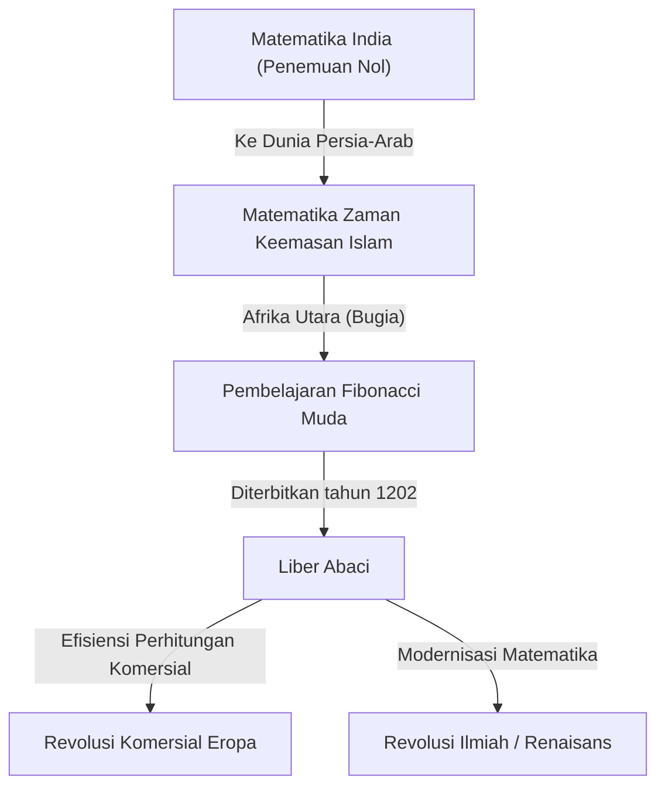
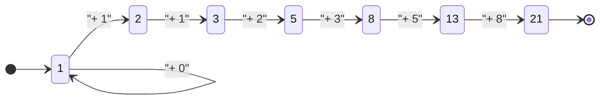

## Pengantar: Cahaya Matematika yang Menerangi Zaman Kegelapan

Di Eropa abad pertengahan, selama masa yang sering disebut "Zaman Kegelapan", kemajuan ilmu pengetahuan mengalami stagnasi. Namun, pada awal abad ke-13, seorang jenius muncul yang akan mengubah sejarah matematika Eropa selamanya. Namanya adalah Leonardo dari Pisa. Tokoh ini, yang kemudian dikenal sebagai **Fibonacci**, adalah kekuatan pendorong di balik mempopulerkan "angka Arab" (angka Hindu-Arab) yang kita gunakan sehari-hari di zaman modern, dan penemu "deret Fibonacci" yang mengungkap misteri alam semesta.

Dalam artikel ini, kita akan menggali lebih dalam kehidupan Fibonacci yang penuh gejolak, dampak karya besarnya "Liber Abaci" terhadap masyarakat, dan warisan matematikanya yang meluas hingga sains modern dan alam.

## Kehidupan Fibonacci dan Latar Belakang Sejarah

### Kelahiran di Pisa dan Asal Usul Nama "Fibonacci"

Leonardo Fibonacci lahir sekitar tahun 1170 di negara-kota Italia, Pisa. Pisa pada saat itu berkembang pesat sebagai pusat perdagangan Mediterania, sebuah republik yang makmur dengan angkatan laut dan jaringan komersial yang kuat. Ayahnya, Guglielmo Bonacci, adalah seorang pedagang kaya yang juga bekerja sebagai pejabat bea cukai untuk Pisa.

Nama "Fibonacci" sebenarnya tidak digunakan selama masa hidupnya. Itu adalah istilah ciptaan yang dibuat oleh sejarawan di kemudian hari, menyingkat bahasa Latin "filius Bonacci" (putra Bonacci). Ia menyebut dirinya "Leonardo Pisano" (Leonardo dari Pisa) atau, karena kecintaannya pada perjalanan, "Bigollo" (yang berarti pengembara atau pemalas).

### Pendidikan di Afrika Utara dan Perjumpaan dengan Budaya Berbeda

Nasib Leonardo muda berubah drastis ketika ayahnya, Guglielmo, ditunjuk untuk mewakili koloni perdagangan Pisa di Bugia (sekarang Béjaïa di Aljazair), Afrika Utara. Ayahnya memanggilnya ke Bugia untuk mempelajari bisnis praktis seorang pedagang.

Di sana, Leonardo mendapat kesempatan untuk belajar matematika dari seorang guru Arab. Dunia Islam pada saat itu berada di garis depan matematika, secara luas menggunakan sistem bilangan posisional basis-10 yang berasal dari India, yang mencakup "0" (angka Hindu-Arab). Perhitungan menggunakan angka Romawi (I, V, X, L, C, D, M) yang lazim di Eropa sangat merepotkan, membuat sempoa menjadi sangat diperlukan untuk perhitungan tingkat lanjut. Namun, dengan angka Hindu-Arab, perhitungan rumit dapat dilakukan dengan cepat dan akurat hanya dengan menggunakan kertas dan pena.

### Perjalanan di Dunia Mediterania dan Pencarian Pengetahuan

Menyadari keunggulan luar biasa dari angka Hindu-Arab, Leonardo melakukan perjalanan ke dunia Mediterania untuk mencari lebih banyak pengetahuan. Ia mengunjungi pusat-pusat komersial dan akademik pada masa itu, seperti Mesir, Suriah, Yunani, Sisilia, dan Provence, menyerap berbagai teknik matematika dan metode perhitungan komersial sambil berinteraksi dengan para sarjana lokal.

Melalui perjalanan ekstensif ini, ia menjadi yakin bahwa angka Hindu-Arab bukan sekadar alat yang nyaman untuk perdagangan, melainkan sistem kuat yang esensial untuk pengembangan matematika murni. Sekitar tahun 1200, ia kembali ke kampung halamannya di Pisa dan mulai menyusun pengetahuan luas yang telah ia peroleh.

## "Liber Abaci" dan Dampaknya

Pada tahun 1202, Fibonacci menyelesaikan karya besarnya, "Liber Abaci" (Buku Perhitungan), dengan edisi revisi yang diterbitkan pada tahun 1228. Meskipun judulnya menyebutkan "sempoa" (abacus), ini sebenarnya adalah buku terobosan yang menjelaskan cara melakukan perhitungan menggunakan sistem angka baru tanpa menggunakan sempoa.

### Pengenalan Angka Arab

Bagian awal "Liber Abaci" dimulai dengan kalimat bersejarah ini:

> "Sembilan angka orang India adalah: 9 8 7 6 5 4 3 2 1. Dengan sembilan angka ini, dan dengan tanda 0 yang oleh orang Arab disebut zephirum, angka apa pun dapat ditulis."

Buku ini tidak sekadar mengajarkan cara menulis angka; buku ini secara komprehensif mencakup dasar-dasar aritmatika yang diajarkan di sekolah dasar dan menengah modern, termasuk metode tertulis untuk penjumlahan, pengurangan, perkalian, pembagian, operasi dengan pecahan, dan cara mencari akar kuadrat serta akar pangkat tiga.

### Aplikasi pada Matematika Komersial

Untuk membuktikan betapa praktisnya sistem matematika baru ini, Fibonacci memasukkan banyak masalah realistis yang dihadapi oleh para pedagang.

- Menghitung nilai tukar mata uang yang kompleks
- Menghitung keuntungan dan kerugian atas barang
- Menentukan rasio yang adil dalam sistem barter
- Perhitungan bunga majemuk

Hasilnya, "Liber Abaci" menjadi bukan hanya teks akademik tetapi juga manual praktis utama bagi para pedagang Eropa. Melalui pengaruhnya, para pedagang Italia secara bertahap beralih dari angka Romawi ke angka Arab, meletakkan fondasi penting bagi perkembangan ekonomi kapitalis selanjutnya dan Revolusi Ilmiah selama Renaisans.

## Deret Fibonacci dan Rasio Emas: Kode Alam

Bagian paling terkenal dari "Liber Abaci" adalah "Masalah Kelinci" yang muncul di Bab 12. Teka-teki yang tampaknya sederhana ini melahirkan deret fenomenal yang kemudian dinamakan "Deret Fibonacci".

### Masalah Kelinci

Masalahnya adalah sebagai berikut:

> "Seorang pria menaruh sepasang kelinci di suatu tempat yang dikelilingi tembok di semua sisinya. Berapa pasang kelinci yang dapat dihasilkan dari pasangan tersebut dalam setahun jika diasumsikan bahwa setiap bulan setiap pasangan melahirkan pasangan baru yang dari bulan kedua dan seterusnya menjadi produktif?"

Dengan melacak jumlah pasangan kelinci setiap bulannya, diperoleh deret berikut:

$1, 1, 2, 3, 5, 8, 13, 21, 34, 55, 89, 144, ...$

Keteraturan dari deret ini sangat indah: "Jumlah dua angka sebelumnya sama dengan angka berikutnya". Secara matematis didefinisikan, deret ini membentuk relasi rekurensi berikut:

$$
F_n = 
\begin{cases} 
0 & \text{jika } n = 0 \\
1 & \text{jika } n = 1 \\
F_{n-1} + F_{n-2} & \text{jika } n > 1
\end{cases}
$$

### Hubungan Menakjubkan dengan Rasio Emas

Salah satu fitur paling mistis dari deret Fibonacci adalah bahwa saat Anda mengambil rasio dari dua angka yang berdekatan ($F_{n+1} / F_n$), rasio tersebut konvergen ke konstanta tertentu.

- $1 / 1 = 1.000$
- $2 / 1 = 2.000$
- $3 / 2 = 1.500$
- $5 / 3 \approx 1.667$
- $8 / 5 = 1.600$
- $13 / 8 = 1.625$
- $21 / 13 \approx 1.615$
- $34 / 21 \approx 1.619$

Semakin besar angkanya, rasio ini mendekati bilangan irasional yang disebut $\phi$ (phi).

$$
\phi = \frac{1 + \sqrt{5}}{2} \approx 1.6180339887...
$$

Ini dikenal sebagai "Rasio Emas", yang dianggap sejak Yunani kuno sebagai proporsi yang paling indah dan harmonis. Rasio ini sengaja (atau tidak sadar) digunakan dalam arsitektur bersejarah dan karya seni, seperti Parthenon dan Mona Lisa.

Selain itu, matematikawan abad ke-19 Jacques Philippe Marie Binet menemukan "Rumus Binet", yang menemukan suku umum deret Fibonacci menggunakan Rasio Emas:

$$
F_n = \frac{\phi^n - (1-\phi)^n}{\sqrt{5}}
$$

### Angka Fibonacci di Alam

Deret Fibonacci dan Rasio Emas bukan sekadar permainan matematika. Menakjubkannya, deret ini tersembunyi di mana-mana di alam semesta.

1. **Jumlah Kelopak Bunga**: Jumlah kelopak banyak bunga adalah angka Fibonacci (misal, lili punya 3, buttercup 5, delphinium 8, marigold 13, bunga matahari 21, 34, 55, dll.).
2. **Filotaksis (Susunan Daun)**: Pola susunan daun yang tumbuh dari batang tanaman berevolusi sedemikian rupa sehingga daun atas dan bawah tidak saling tumpang tindih dan menghalangi sinar matahari. Sudut ini menjadi "Sudut Emas" (sekitar 137,5 derajat), yang menghasilkan munculnya angka Fibonacci.
3. **Biji Pinus dan Nanas**: Saat menghitung jumlah spiral di permukaannya, spiral searah jarum jam dan berlawanan arah jarum jam membentuk angka Fibonacci yang berdekatan, seperti 8 dan 13, atau 13 dan 21.
4. **Cangkang Nautilus**: "Spiral logaritmik (spiral emas)" yang digambar berdasarkan rasio emas sangat cocok dengan pola pertumbuhan cangkang siput.

## Prestasi Matematika Lainnya

Pencapaian Fibonacci tidak terbatas pada "Liber Abaci". Ketenarannya mencapai telinga Kaisar Romawi Suci Frederick II, yang mengundangnya ke istananya untuk mengatasi berbagai tantangan matematika.

### "Liber Quadratorum" (Buku Persegi)

Ditulis pada tahun 1225, buku ini adalah risalah lanjutan tentang persamaan Diophantine (persamaan yang mencari solusi bilangan bulat). Buku ini mengeksplorasi konsep "angka kongruen" dan menunjukkan wawasan mendalam tentang teorema Pythagoras. Buku ini sangat dianggap sebagai mahakarya terbesar teori bilangan di Eropa abad pertengahan.

### "Practica Geometriae" (Geometri Praktis)

Ditulis pada tahun 1220, buku ini merinci survei dan geometri. Buku ini menyediakan metode yang ketat untuk menghitung luas dan volume, dan penerapan praktis dari prinsip-prinsip geometri Euclidean Yunani kuno, menjadikannya sumber daya yang berharga bagi para insinyur dan surveyor pada masa itu.

## Masyarakat Modern dan Warisan Fibonacci

Penemuan Fibonacci, yang hidup sekitar 800 tahun yang lalu, terus memainkan peran penting dalam bidang-bidang paling maju di masyarakat modern.

### Aplikasi dalam Ilmu Komputer

Dalam algoritma komputer, deret Fibonacci sangat berguna. Algoritma yang disebut "Pencarian Fibonacci" dapat mencari data lebih efisien daripada pencarian biner di bawah kondisi tertentu. Selain itu, struktur data yang dikenal sebagai "tumpukan Fibonacci (Fibonacci heap)" sangat diperlukan untuk mempercepat algoritma teori graf seperti algoritma Dijkstra.

### Retracement Fibonacci di Pasar Keuangan

Mengejutkannya, namanya juga sering terdengar di dunia keuangan. Sebuah metode analisis teknis yang disebut "Fibonacci retracement" digunakan untuk memprediksi titik di mana harga saham atau nilai tukar akan melambung atau turun kembali pada grafik. Para trader menarik garis support dan resistance berdasarkan rasio Fibonacci seperti 23,6%, 38,2%, dan 61,8% (seperti kebalikan dari rasio emas). Gagasan bahwa hukum alam yang sama berlaku untuk gelombang pasar yang diciptakan oleh psikologi kelompok manusia sangatlah menarik.

## Kesimpulan

Leonardo Fibonacci menjembatani pengetahuan dunia Islam dan Eropa, membawa cahaya matematika ke dunia Barat. Tanpa angka Arab yang ia populerkan melalui "Liber Abaci", Revolusi Ilmiah yang menyusul dan masyarakat digital modern mungkin tidak akan pernah ada.

Lebih jauh lagi, deret yang lahir dari "Masalah Kelinci" yang main-main mewujudkan keindahan matematika murni dan terus memikat kita hari ini sebagai hukum universal yang meluas dari pertumbuhan tanaman hingga spiral galaksi, dan bahkan aktivitas ekonomi manusia. Warisan Fibonacci mengajarkan kita melintasi waktu bahwa matematika bukan sekadar teknik berhitung, melainkan "bahasa universal" untuk membuka kebenaran alam semesta.
