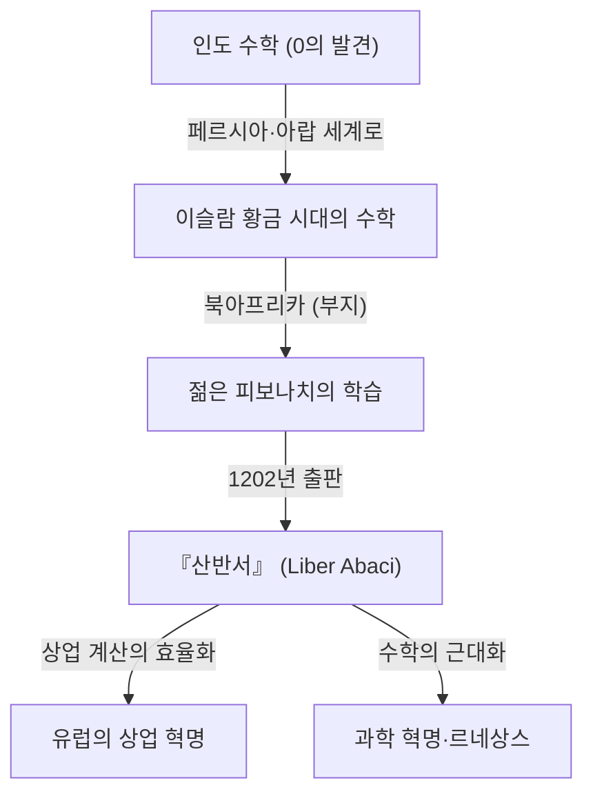
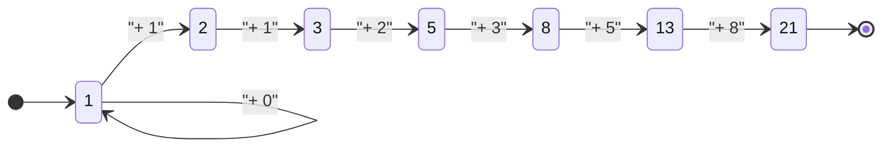

## 서론: 암흑 시대를 밝힌 수학의 빛

중세 유럽, 흔히 '암흑 시대'라 불리던 시기에는 학문의 발전이 정체되어 있었습니다. 그러나 13세기 초, 유럽 수학의 역사를 영원히 바꿀 한 명의 천재가 등장합니다. 그의 이름은 피사의 레오나르도. 훗날 **피보나치** (Fibonacci)로 알려지게 되는 이 인물은 현대 우리가 일상적으로 사용하는 '아라비아 숫자(인도-아라비아 숫자)'를 유럽에 대중화시킨 주역이자, 자연계의 신비를 풀어내는 '피보나치 수열'의 발견자입니다.

이 글에서는 피보나치의 파란만장한 생애, 그의 대표작 『산반서』가 사회에 미친 영향, 그리고 현대 과학과 자연계에까지 미치는 그의 수학적 유산에 대해 자세히 알아보겠습니다.

## 피보나치의 생애와 시대적 배경

### 피사에서의 탄생과 '피보나치'라는 이름의 유래

레오나르도 피보나치는 1170년경 이탈리아의 도시 국가 피사에서 태어났습니다. 당시 피사는 지중해 무역의 중심지로 번영을 누렸으며, 강력한 해군과 상업망을 갖춘 부유한 공화국이었습니다. 그의 아버지 굴리엘모 보나치(Guglielmo Bonacci)는 부유한 상인이자 피사의 세관 관리로도 일했습니다.

'피보나치(Fibonacci)'라는 이름은 사실 그가 살아있는 동안에는 사용되지 않았습니다. 이는 후대의 역사가들이 라틴어 'filius Bonacci(보나치의 아들)'를 줄여서 만든 신조어입니다. 그는 스스로를 '레오나르도 피사노(피사의 레오나르도)'라고 불렀고, 여행을 좋아했기 때문에 '비골로(Bigollo, 방랑자 또는 게으름뱅이라는 뜻)'라고 칭하기도 했습니다.

### 북아프리카에서의 교육과 타문화와의 만남

어린 레오나르도의 운명은 아버지 굴리엘모가 북아프리카 부지(Bugia, 현재 알제리의 베자이아)에 있는 피사 상업 거류지의 대표로 임명되면서 큰 전환점을 맞이합니다. 아버지는 아들에게 상인으로서의 실무를 가르치기 위해 그를 부지로 불렀습니다.

그곳에서 레오나르도는 아랍인 교사로부터 수학을 배울 기회를 얻게 됩니다. 당시 이슬람 세계는 수학의 최첨단을 걷고 있었으며, 인도에서 유래한 '0'을 포함하는 10진법 위치 기수법(인도-아라비아 숫자)을 널리 사용하고 있었습니다. 유럽에서 주류였던 로마 숫자(I, V, X, L, C, D, M)를 사용한 계산은 매우 번거로워 고도의 계산에는 주판이 필수적이었으나, 인도-아라비아 숫자를 사용하면 종이와 펜만으로도 복잡한 계산을 빠르고 정확하게 수행할 수 있었습니다.

### 지중해 세계 여행과 지식의 탐구

인도-아라비아 숫자의 압도적인 우수성을 깨달은 레오나르도는 더 많은 지식을 찾아 지중해 세계를 여행합니다. 이집트, 시리아, 그리스, 시칠리아, 프로방스 등 당시 상업과 학문의 중심지를 순회하며 현지 학자들과 교류하고 다양한 수학적 기법과 상업 계산 기술을 흡수했습니다.

이 광범위한 여행을 통해 그는 인도-아라비아 숫자가 단순히 상업용으로 편리한 도구에 그치지 않고, 순수 수학의 발전에도 필수적인 강력한 체계임을 확신하게 되었습니다. 그리고 1200년경 그는 고향인 피사로 돌아와 그때까지 얻은 방대한 지식을 집대성하는 작업에 착수합니다.

## 『산반서』(Liber Abaci)와 그 충격

1202년, 피보나치는 자신의 집대성이라 할 수 있는 대저 『산반서(Liber Abaci)』를 완성했습니다(1228년에 개정판 출판). '산반'이라는 제목이 붙어 있지만, 실제로는 주판(아바쿠스)을 사용하지 않고 새로운 숫자 시스템을 사용하여 계산을 수행하는 방법을 설명한 획기적인 서적이었습니다.

### 아라비아 숫자의 도입

『산반서』의 서두는 역사적인 다음 문장으로 시작합니다.

> "인도인의 아홉 개 숫자는 다음과 같다. 9 8 7 6 5 4 3 2 1. 이 아홉 개의 숫자와 아랍인들이 제피룸(zephirum)이라고 부르는 기호 0을 사용하면 어떤 수라도 기록할 수 있다."

이 책은 단순히 숫자 쓰는 법을 가르치는 데 그치지 않고, 덧셈, 뺄셈, 곱셈, 나눗셈의 필산법, 분수 계산, 제곱근과 세제곱근을 구하는 방법 등 현대의 초등학교나 중학교에서 가르치는 산수의 기초를 망라하고 있었습니다.

### 상업 수학에의 응용

피보나치는 이 새로운 수학 시스템이 얼마나 실용적으로 뛰어난지 증명하기 위해 상인들이 직면하는 현실적인 문제들을 다수 수록했습니다.

- 서로 다른 통화 간의 복잡한 환율 계산
- 상품의 이익과 손실 계산
- 물물교환 시의 적정 비율 결정
- 복리 계산

이로 인해 『산반서』는 학술서로서뿐만 아니라 유럽 상인들을 위한 궁극의 실용 매뉴얼이 되었습니다. 그의 영향으로 이탈리아의 상인들은 점차 로마 숫자에서 아라비아 숫자로 전환하게 되었고, 이는 훗날 자본주의 경제의 발전과 르네상스 시기 과학 혁명의 중요한 기반이 되었습니다.

## 피보나치 수열과 황금비: 자연계의 암호

『산반서』에서 가장 유명한 것은 제12장에 등장하는 '토끼 문제'입니다. 이 겉보기에 단순한 퍼즐이 훗날 '피보나치 수열'이라고 불리는 경이로운 수열을 탄생시켰습니다.

### 토끼 문제

문제는 다음과 같습니다.

> "어떤 사람이 사방이 벽으로 둘러싸인 곳에 토끼 한 쌍을 넣었다. 이 토끼 쌍이 두 달 후부터 매달 암수 한 쌍의 새끼를 낳고, 태어난 새끼들도 두 달 후부터 매달 한 쌍의 새끼를 낳는다고 가정할 때, 1년 후에는 총 몇 쌍의 토끼가 되겠는가?"

이 문제의 매달 토끼 쌍의 수를 추적해보면 다음과 같은 수열을 얻게 됩니다.

$1, 1, 2, 3, 5, 8, 13, 21, 34, 55, 89, 144, ...$

이 수열의 규칙성은 매우 아름답습니다. "앞의 두 수를 더한 것이 다음 수가 된다"는 것입니다. 수학적으로 정의하면 다음과 같은 점화식이 됩니다.

$$
F_n = 
\begin{cases} 
0 & \text{if } n = 0 \\
1 & \text{if } n = 1 \\
F_{n-1} + F_{n-2} & \text{if } n > 1
\end{cases}
$$

### 황금비와의 놀라운 관계

피보나치 수열의 가장 신비로운 특징 중 하나는 인접한 두 수의 비($F_{n+1} / F_n$)를 계산해가면 어떤 특정한 상수에 수렴한다는 것입니다.

- $1 / 1 = 1.000$
- $2 / 1 = 2.000$
- $3 / 2 = 1.500$
- $5 / 3 \approx 1.667$
- $8 / 5 = 1.600$
- $13 / 8 = 1.625$
- $21 / 13 \approx 1.615$
- $34 / 21 \approx 1.619$

수가 커질수록 이 비율은 $\phi$(파이)라고 불리는 무리수에 가까워집니다.

$$
\phi = \frac{1 + \sqrt{5}}{2} \approx 1.6180339887...
$$

이것은 '황금비(Golden Ratio)'로 알려져 있으며, 고대 그리스 시대부터 가장 아름답고 조화로운 비율로 여겨져 왔습니다. 파르테논 신전이나 모나리자 등 역사적인 건축물이나 미술 작품에 이 비율이 의도적으로(혹은 무의식적으로) 사용되었습니다.

또한, 19세기의 수학자 자크 필리프 마리 비네는 황금비를 이용하여 피보나치 수열의 일반항을 구하는 '비네의 공식'을 발견했습니다.

$$
F_n = \frac{\phi^n - (1-\phi)^n}{\sqrt{5}}
$$

### 자연계의 피보나치 수

피보나치 수열과 황금비는 단순한 수학의 유희가 아닙니다. 놀랍게도 자연계 곳곳에 이 수열이 숨겨져 있습니다.

1. **꽃잎의 수**: 많은 꽃들의 꽃잎 수는 피보나치 수입니다 (예: 백합은 3장, 미나리아재비는 5장, 델피늄은 8장, 천수국은 13장, 해바라기는 21장, 34장, 55장 등).
2. **잎차례(Phyllotaxis)**: 식물의 줄기에서 잎이 돋아나는 배치 패턴(잎차례)은 위의 잎과 아래의 잎이 겹쳐서 햇빛을 가리지 않도록 진화했습니다. 이 각도가 '황금각(약 137.5도)'이 되며, 그 결과 피보나치 수가 나타납니다.
3. **솔방울과 파인애플**: 표면의 나선 수를 세어보면 시계 방향과 반시계 방향의 나선 수가 8과 13, 혹은 13과 21처럼 인접한 피보나치 수로 되어 있습니다.
4. **앵무조개의 껍데기**: 황금비에 기초하여 그려지는 '로그 나선(황금 나선)'은 달팽이류의 성장 패턴과 완전히 일치합니다.

## 기타 수학적 업적

피보나치의 업적은 『산반서』에만 그치지 않습니다. 그의 명성은 신성 로마 제국 황제 프리드리히 2세의 귀에도 들어갔고, 그는 궁정에 초청되어 수많은 수학적 난제에 도전했습니다.

### 『제곱수의 책』(Liber Quadratorum)

1225년에 쓰여진 이 책은 디오판토스 방정식(정수해를 구하는 방정식)에 관한 고도의 연구서입니다. 여기서는 '합동수(Congruent number)'의 개념이 탐구되었으며, 피타고라스의 정리에 관한 깊은 통찰이 제시되어 있습니다. 정수론에 있어서 중세 유럽 최대의 걸작으로도 평가받고 있습니다.

### 『실용 기하학』(Practica Geometriae)

1220년에 저술된 이 책에서는 측량이나 기하학에 대해 상세히 설명하고 있습니다. 면적이나 부피의 엄밀한 계산 방법이나, 고대 그리스의 유클리드 기하학의 원리를 실지에 응용하는 방법이 적혀 있어, 당시의 기술자나 측량사들에게 귀중한 자료가 되었습니다.

## 현대 사회와 피보나치의 유산

약 800년 전에 살았던 피보나치의 발견은 현대 사회의 최첨단 분야에서도 여전히 중요한 역할을 수행하고 있습니다.

### 컴퓨터 과학에서의 응용

컴퓨터 알고리즘에서 피보나치 수열은 매우 유용합니다. '피보나치 탐색'이라는 알고리즘은 특정 조건 하에서 이진 탐색보다 효율적으로 데이터를 검색할 수 있습니다. 또한, 데이터 구조의 하나인 '피보나치 힙'은 다익스트라 알고리즘 등 그래프 이론의 알고리즘을 고속화하는 데 불가결합니다.

### 금융 시장에서의 피보나치 되돌림

놀랍게도 금융 세계에서도 그의 이름을 자주 듣게 됩니다. '피보나치 되돌림(Fibonacci Retracement)'이라고 불리는 기술적 분석 기법은 주가나 환율의 차트에서 시세가 반등하거나 하락하는 포인트를 예측하기 위해 사용됩니다. 트레이더들은 23.6%, 38.2%, 61.8%(황금비의 역수 등)와 같은 피보나치 비율에 기초하여 지지선이나 저항선을 긋습니다. 인간의 집단 심리가 만들어내는 시장의 파도에 자연계와 동일한 법칙이 적용될 수 있다는 생각은 매우 흥미롭습니다.

## 결론

레오나르도 피보나치는 이슬람 세계와 유럽 지식의 가교가 되어 서양 세계에 수학의 빛을 가져왔습니다. 그가 『산반서』를 통해 퍼뜨린 아라비아 숫자가 없었다면, 그 후의 과학 혁명도, 현대의 디지털 사회도 존재하지 않았을지도 모릅니다.

또한 그가 유희로 고안한 '토끼 문제'에서 탄생한 수열은 순수 수학의 아름다움을 구현할 뿐만 아니라, 식물의 성장에서 은하의 소용돌이, 나아가 인간의 경제 활동에까지 통하는 보편적인 법칙으로서 지금도 여전히 우리를 매료시키고 있습니다. 피보나치의 유산은 수학이 단순한 계산 기술이 아니라 우주의 진리를 해명하기 위한 '공통 언어'임을 시대를 초월하여 가르쳐 줍니다.
