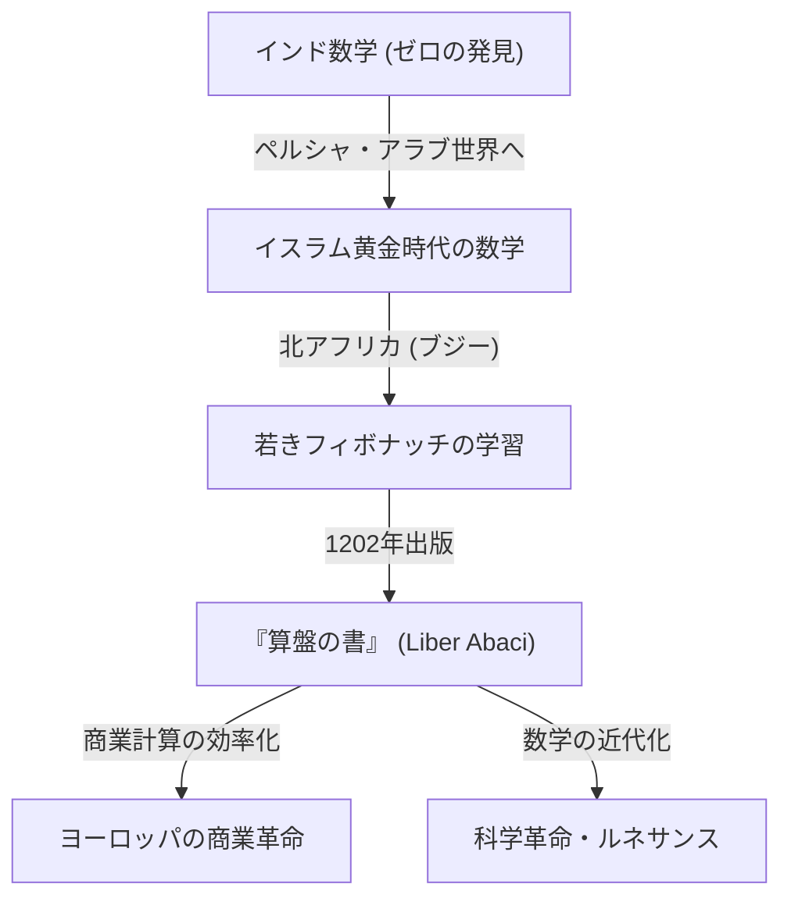
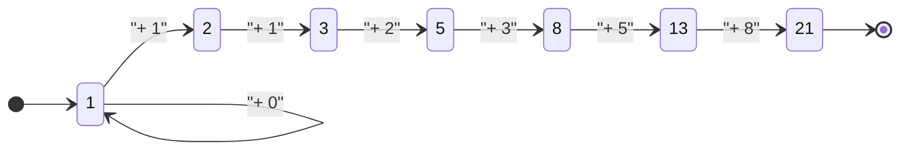

## はじめに：暗黒時代を照らした数学の光

中世ヨーロッパ、いわゆる「暗黒時代」と呼ばれた時代において、学問の進歩は停滞していました。しかし、13世紀初頭に一人の天才が現れ、ヨーロッパの数学史を永遠に変えることになります。彼の名はレオナルド・オブ・ピサ。後に **[フィボナッチ](https://kenji.blog/p/fibonacci/)** （[Fibonacci](https://kenji.blog/p/fibonacci/)）として知られるようになるこの人物は、現代の私たちが日常的に使用している「アラビア数字（インド・アラビア数字）」をヨーロッパに普及させた立役者であり、自然界の神秘を解き明かす「[フィボナッチ](https://kenji.blog/p/fibonacci/)数列」の発見者でもあります。

本記事では、[フィボナッチ](https://kenji.blog/p/fibonacci/)の波乱に満ちた生涯、彼の主著である『算盤の書』が社会に与えた衝撃、そして現代科学や自然界にまで及ぶ彼の数学的遺産について、詳細に解説していきます。

## [フィボナッチ](https://kenji.blog/p/fibonacci/)の生涯と時代背景

### ピサでの誕生と「[フィボナッチ](https://kenji.blog/p/fibonacci/)」の名前の由来

[レオナルド・フィボナッチ](https://kenji.blog/p/fibonacci/)は、1170年頃にイタリアの都市国家ピサで生まれました。当時のピサは地中海貿易の中心地として栄え、強力な海軍と商業ネットワークを持つ繁栄した共和国でした。彼の父であるグリエルモ・ボナッチ（Guglielmo Bonacci）は裕福な商人であり、ピサの税関役人としても働いていました。

「[フィボナッチ](https://kenji.blog/p/fibonacci/)（[Fibonacci](https://kenji.blog/p/fibonacci/)）」という名前は、実は彼が生きている間に使われていたものではありません。これは後世の歴史家がラテン語の「filius Bonacci（ボナッチの息子）」を短縮して作った造語です。彼自身は「レオナルド・ピサーノ（ピサのレオナルド）」や、旅を好んだことから「ビゴッロ（Bigollo、放浪者または怠け者の意）」と名乗っていました。

### 北アフリカでの教育と異文化との出会い

父グリエルモが北アフリカのブジー（現在のアルジェリアのベジャイア）にあるピサの商業居留地の代表に任命されたことで、若きレオナルドの運命は大きく動きます。父は息子に商人としての実務を学ばせるため、彼をブジーに呼び寄せました。

そこでレオナルドは、アラブ人の教師から数学を学ぶ機会を得ます。当時のイスラム世界は数学の最先端を走っており、インドから伝わった「0」を含む十進法の位取り記数法（インド・アラビア数字）が広く使われていました。ヨーロッパで主流だったローマ数字（I, V, X, L, C, D, M）を使った計算は非常に煩雑で、高度な計算には算盤（アバカス）が不可欠でしたが、インド・アラビア数字を使えば紙とペンだけで複雑な計算を迅速かつ正確に行うことができました。

### 地中海世界の旅と知識の探求

インド・アラビア数字の圧倒的な優位性に気づいたレオナルドは、さらなる知識を求めて地中海世界を旅します。エジプト、シリア、ギリシャ、シチリア、プロヴァンスなど、当時の商業と学問の中心地を巡り、現地の学者たちと交流しながら様々な数学的手法や商業計算の技術を吸収していきました。

この広範な旅を通じて、彼はインド・アラビア数字が単なる商業用の便利な道具にとどまらず、純粋数学の発展にも不可欠な強力な体系であることを確信しました。そして1200年頃、彼は故郷のピサに帰り、それまでに得た膨大な知識をまとめる作業に取り掛かります。

## 『算盤の書』（Liber Abaci）とその衝撃

1202年、[フィボナッチ](https://kenji.blog/p/fibonacci/)は自身の集大成とも言える大著『算盤の書（Liber Abaci）』を完成させました（1228年に改訂版が出版）。「算盤」というタイトルがついていますが、実際には算盤（アバカス）を使わずに、新しい数字システムを使って計算を行う方法を解説した画期的な書物でした。

### アラビア数字の導入

『算盤の書』の冒頭は、歴史的な次の一文で始まります。

> "インド人の9つの数字は次の通りである。9 8 7 6 5 4 3 2 1。これら9つの数字と、アラビア人がゼフィルム（zephirum）と呼ぶ記号 0 とを用いれば、いかなる数でも書き表すことができる。"

この本は、単に数字の書き方を教えるだけでなく、加減乗除の筆算法、分数の計算、平方根や立方根の求め方など、現代の小学校や中学校で教えられる算数の基礎を網羅していました。

### 商業数学への応用

[フィボナッチ](https://kenji.blog/p/fibonacci/)は、この新しい数学システムがいかに実用的に優れているかを証明するため、商人たちが直面する現実的な問題を多数収録しました。

- 異なる通貨間の複雑な為替レートの計算
- 商品の利益と損失の計算
- 物々交換における適正な比率の決定
- 複利計算

これにより、『算盤の書』は学術書としてだけでなく、ヨーロッパの商人たちのための究極の実用マニュアルとなりました。彼の影響力により、イタリアの商人たちは徐々にローマ数字からアラビア数字へと移行し、これが後の資本主義経済の発展やルネサンス期の科学革命の重要な基盤となりました。

## [フィボナッチ](https://kenji.blog/p/fibonacci/)数列と黄金比：自然界の暗号

『算盤の書』の中で最も有名なのは、第12章に登場する「兎の問題」です。この一見単純なパズルが、後に「[フィボナッチ](https://kenji.blog/p/fibonacci/)数列」と呼ばれる驚異的な数列を生み出しました。

### 兎の問題

問題は次のようなものです。

> 「1対の兎がいる。兎は生後2ヶ月目から毎月1対の兎を産む。死ぬ兎はいないと仮定した場合、1年後には何対の兎がいるか？」

この問題の毎月の兎の対数を追っていくと、次のような数列が得られます。

$1, 1, 2, 3, 5, 8, 13, 21, 34, 55, 89, 144, ...$

この数列の規則性は非常に美しく、「前の2つの数を足したものが、次の数になる」というものです。数学的に定義すると、次の漸化式になります。

$$
F_n = 
egin{cases} 
0 & 	ext{if } n = 0 \
1 & 	ext{if } n = 1 \
F_{n-1} + F_{n-2} & 	ext{if } n > 1
\end{cases}
$$

### 黄金比との驚くべき関係

[フィボナッチ](https://kenji.blog/p/fibonacci/)数列の最も神秘的な特徴の一つは、隣り合う2つの数の比（$F_{n+1} / F_n$）をとっていくと、ある特定の定数に収束していくことです。

- $1 / 1 = 1.000$
- $2 / 1 = 2.000$
- $3 / 2 = 1.500$
- $5 / 3 pprox 1.667$
- $8 / 5 = 1.600$
- $13 / 8 = 1.625$
- $21 / 13 pprox 1.615$
- $34 / 21 pprox 1.619$

数が大きくなるにつれて、この比は $\phi$（ファイ）と呼ばれる無理数に近づいていきます。

$$
\phi = rac{1 + \sqrt{5}}{2} pprox 1.6180339887...
$$

これは「黄金比（Golden Ratio）」として知られており、古代ギリシャから最も美しく調和のとれた比率とされてきました。パルテノン神殿やモナ・リザなど、歴史的な建築や美術作品にこの比率が意図的（あるいは無意識的）に用いられています。

また、19世紀の数学者ジャック・フィリップ・マリー・ビネは、黄金比を用いて[フィボナッチ](https://kenji.blog/p/fibonacci/)数列の一般項を求める「ビネの公式」を発見しました。

$$
F_n = rac{\phi^n - (1-\phi)^n}{\sqrt{5}}
$$

### 自然界における[フィボナッチ](https://kenji.blog/p/fibonacci/)数

[フィボナッチ](https://kenji.blog/p/fibonacci/)数列と黄金比は、単なる数学の遊びではありません。驚くべきことに、自然界の至る所にこの数列が隠されています。

1. **花びらの数**: 多くの花の花びらの数は[フィボナッチ](https://kenji.blog/p/fibonacci/)数です（例：ユリは3枚、バターカップは5枚、デルフィニウムは8枚、マリーゴールドは13枚、ヒマワリは21枚、34枚、55枚など）。
2. **葉序（Phyllotaxis）**: 植物の茎から葉が生える際の配置パターン（葉序）は、上の葉と下の葉が重なって日光を遮らないように進化しました。この角度が「黄金角（約137.5度）」となっており、結果として[フィボナッチ](https://kenji.blog/p/fibonacci/)数が現れます。
3. **松ぼっくりとパイナップル**: 表面の螺旋の数を数えると、時計回りと反時計回りの螺旋の数が、8と13、あるいは13と21のように隣り合う[フィボナッチ](https://kenji.blog/p/fibonacci/)数になっています。
4. **オウムガイの殻**: 黄金比に基づいて描かれる「対数螺旋（黄金螺旋）」は、巻貝の成長パターンと完全に一致しています。

## その他の数学的業績

[フィボナッチ](https://kenji.blog/p/fibonacci/)の業績は『算盤の書』だけにとどまりません。彼の名声は神聖ローマ皇帝フリードリヒ2世の耳にも届き、彼は宮廷に招かれて数々の数学的難問に挑戦しました。

### 『平方数の書』（Liber Quadratorum）

1225年に書かれたこの本は、[ディオファントス](https://kenji.blog/p/diophantus/)方程式（整数解を求める方程式）に関する高度な研究書です。ここでは「合同数（Congruent number）」の概念が探求されており、[ピタゴラス](https://kenji.blog/p/pythagoras/)の定理に関する深い洞察が示されています。数論における中世ヨーロッパ最大の傑作とも評価されています。

### 『実用幾何学』（Practica Geometriae）

1220年に著されたこの本では、測量や幾何学について詳述されています。面積や体積の厳密な計算方法や、古代ギリシャの[ユークリッド](https://kenji.blog/p/euclid/)幾何学の原理を実地に応用する方法が書かれており、当時の技術者や測量士にとって貴重な資料となりました。

## 現代社会と[フィボナッチ](https://kenji.blog/p/fibonacci/)の遺産

約800年前に生きた[フィボナッチ](https://kenji.blog/p/fibonacci/)の発見は、現代社会の最先端の分野でも依然として重要な役割を果たしています。

### コンピュータ科学における応用

コンピュータアルゴリズムにおいて、[フィボナッチ](https://kenji.blog/p/fibonacci/)数列は非常に有用です。「[フィボナッチ](https://kenji.blog/p/fibonacci/)探索」というアルゴリズムは、特定の条件下で[二分探索](https://kenji.blog/p/search-algorithms-linear-binary-hash-table-principles/)よりも効率的にデータを検索できます。また、データ構造の一つである「[フィボナッチ](https://kenji.blog/p/fibonacci/)ヒープ」は、[ダイクストラ法](https://kenji.blog/p/graph-theory-dijkstra-a-star/)などの[グラフ理論](https://kenji.blog/p/graph-theory-dijkstra-a-star/)のアルゴリズムを高速化するために不可欠です。

### 金融市場における[フィボナッチ](https://kenji.blog/p/fibonacci/)・リトレースメント

驚くべきことに、金融の世界でも彼の名前を頻繁に耳にします。「[フィボナッチ](https://kenji.blog/p/fibonacci/)・リトレースメント」と呼ばれるテクニカル分析の手法は、株価や為替レートのチャートにおいて、相場が反発・反落するポイントを予測するために用いられます。トレーダーたちは 23.6%、38.2%、61.8%（黄金比の逆数など）といった[フィボナッチ](https://kenji.blog/p/fibonacci/)比率に基づいてサポートラインやレジスタンスラインを引きます。人間の集団心理が作り出す市場の波に、自然界と同じ法則が適用できるという考え方は非常に興味深いものです。

## 結論

[レオナルド・フィボナッチ](https://kenji.blog/p/fibonacci/)は、イスラム世界とヨーロッパの知識の架け橋となり、西洋世界に数学の光をもたらしました。彼が『算盤の書』を通じて広めたアラビア数字がなければ、その後の科学革命も、現代のデジタル社会も存在しなかったかもしれません。

また、彼が遊び心で考えた「兎の問題」から生まれた数列は、純粋数学の美しさを体現するだけでなく、植物の成長から銀河の渦、さらには人間の経済活動にまで通じる普遍的な法則として、今もなお私たちを魅了し続けています。[フィボナッチ](https://kenji.blog/p/fibonacci/)の遺産は、数学が単なる計算技術ではなく、宇宙の真理を解き明かすための「共通言語」であることを、時を超えて教えてくれるのです。
