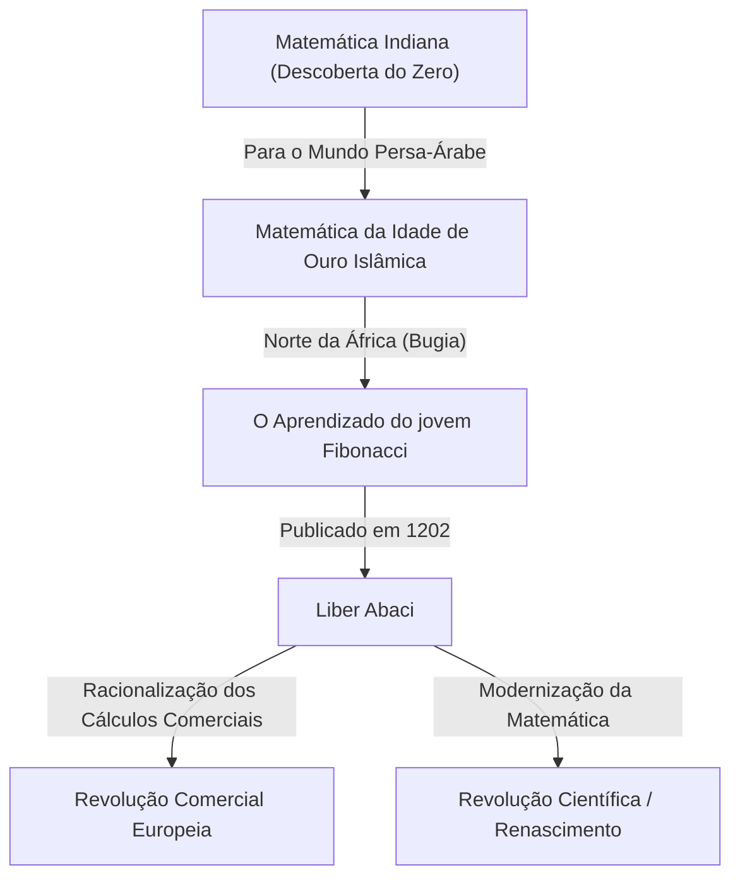
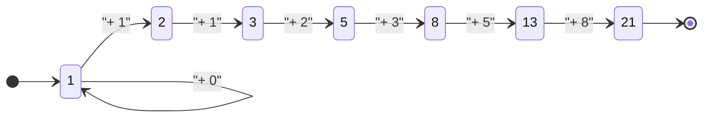

## Introdução: A Luz Matemática Iluminando a Idade das Trevas

Na Europa medieval, durante o que muitas vezes é chamado de "Idade das Trevas", o progresso acadêmico estava estagnado. No entanto, no início do século XIII, surgiu um gênio que mudaria para sempre a história da matemática europeia. Seu nome era Leonardo de Pisa. Esta figura, mais tarde conhecida como **Fibonacci**, foi a força motriz por trás da popularização dos "algarismos arábicos" (indo-arábicos) que usamos diariamente nos tempos modernos, e o descobridor da "sequência de Fibonacci" que desvenda os mistérios do mundo natural.

Neste artigo, vamos nos aprofundar na vida turbulenta de Fibonacci, no impacto que sua obra-prima "Liber Abaci" teve na sociedade e em seu legado matemático que se estende até a ciência moderna e a natureza.

## Vida de Fibonacci e Contexto Histórico

### Nascimento em Pisa e a Origem do Nome "Fibonacci"

[Leonardo Fibonacci](https://kenji.blog/p/fibonacci/) nasceu por volta de 1170 na cidade-estado italiana de Pisa. Pisa na época florescia como um centro de comércio mediterrâneo, uma república próspera com uma poderosa marinha e rede comercial. Seu pai, Guglielmo Bonacci, era um comerciante rico que também trabalhava como funcionário da alfândega para Pisa.

O nome "Fibonacci" na verdade não foi usado durante sua vida. É um termo cunhado por historiadores posteriores, abreviando o latim "filius Bonacci" (filho de Bonacci). Ele se autodenominava "Leonardo Pisano" (Leonardo de Pisa) ou, devido ao seu amor por viagens, "Bigollo" (que significa andarilho ou preguiçoso).

### Educação no Norte da África e Encontros com Diferentes Culturas

O destino do jovem Leonardo deu uma grande guinada quando seu pai, Guglielmo, foi nomeado para representar a colônia comercial pisana em Bugia (atual Bugia na Argélia), no Norte da África. Seu pai o chamou a Bugia para que aprendesse o negócio prático de um comerciante.

Lá, Leonardo teve a oportunidade de aprender matemática com um professor árabe. O mundo islâmico na época estava na vanguarda da matemática, utilizando amplamente o sistema numérico posicional de base 10 originário da Índia, que incluía o "0" (algarismos indo-arábicos). Os cálculos que usavam os algarismos romanos (I, V, X, L, C, D, M) predominantes na Europa eram extremamente difíceis, tornando o ábaco indispensável para cálculos avançados. No entanto, com os algarismos indo-arábicos, cálculos complexos podiam ser realizados com rapidez e precisão usando apenas papel e caneta.

### Viagens no Mundo Mediterrâneo e a Busca pelo Conhecimento

Percebendo a esmagadora superioridade dos algarismos indo-arábicos, Leonardo viajou pelo mundo mediterrâneo em busca de mais conhecimento. Ele visitou centros comerciais e acadêmicos da época, como Egito, Síria, Grécia, Sicília e Provença, absorvendo várias técnicas matemáticas e métodos de cálculo comercial enquanto interagia com estudiosos locais.

Através dessas longas viagens, ele se convenceu de que os algarismos indo-arábicos não eram apenas ferramentas convenientes para o comércio, mas um sistema poderoso essencial para o desenvolvimento da matemática pura. Por volta do ano 1200, ele retornou à sua cidade natal, Pisa, e começou a compilar o vasto conhecimento que havia adquirido.

## "Liber Abaci" e seu Impacto

Em 1202, Fibonacci concluiu sua obra-prima, "Liber Abaci" (O Livro do Cálculo), com uma edição revisada publicada em 1228. Embora o título mencione o "ábaco", na verdade era um livro inovador que explicava como realizar cálculos usando o novo sistema numérico sem usar um ábaco.

### Introdução dos Algarismos Arábicos

O início do "Liber Abaci" começa com esta frase histórica:

> "As nove figuras dos indianos são: 9 8 7 6 5 4 3 2 1. Com essas nove figuras, e com o sinal 0 que os árabes chamam de zephirum, qualquer número pode ser escrito."

Este livro não ensinava apenas como escrever números; ele cobria de forma abrangente os fundamentos da aritmética ensinados nas escolas primárias e secundárias modernas, incluindo métodos escritos para adição, subtração, multiplicação, divisão, operações com frações e como encontrar raízes quadradas e cúbicas.

### Aplicação à Matemática Comercial

Para provar o quão excepcionalmente prático era este novo sistema matemático, Fibonacci incluiu numerosos problemas realistas enfrentados pelos comerciantes.

- Cálculo de taxas de câmbio complexas entre moedas diferentes
- Cálculo de lucros e perdas em mercadorias
- Determinação de proporções justas em trocas
- Cálculos de juros compostos

Como resultado, o "Liber Abaci" tornou-se não apenas um texto acadêmico, mas também o manual prático definitivo para os comerciantes europeus. Por meio de sua influência, os comerciantes italianos gradualmente fizeram a transição dos algarismos romanos para os arábicos, estabelecendo uma base importante para o subsequente desenvolvimento das economias capitalistas e da Revolução Científica durante o Renascimento.

## A Sequência de Fibonacci e a Proporção Áurea: O Código da Natureza

A parte mais famosa do "Liber Abaci" é o "Problema dos Coelhos" que aparece no Capítulo 12. Este quebra-cabeça aparentemente simples deu origem a uma sequência fenomenal mais tarde chamada de "Sequência de Fibonacci".

### O Problema dos Coelhos

O problema é o seguinte:

> "Certo homem colocou um par de coelhos em um lugar cercado por todos os lados por um muro. Quantos pares de coelhos podem ser produzidos a partir desse par em um ano se for suposto que a cada mês cada par gera um novo par que, a partir do segundo mês, se torna produtivo?"

Ao rastrear o número de pares de coelhos a cada mês, obtém-se a seguinte sequência:

$1, 1, 2, 3, 5, 8, 13, 21, 34, 55, 89, 144, ...$

A regularidade desta sequência é excepcionalmente bela: "A soma dos dois números anteriores é igual ao próximo número". Matematicamente definida, forma a seguinte relação de recorrência:

$$
F_n = 
\begin{cases} 
0 & \text{se } n = 0 \\
1 & \text{se } n = 1 \\
F_{n-1} + F_{n-2} & \text{se } n > 1
\end{cases}
$$

### A Incrível Relação com a Proporção Áurea

Uma das características mais místicas da sequência de Fibonacci é que, conforme você pega a proporção de dois números adjacentes ($F_{n+1} / F_n$), ela converge para uma constante específica.

- $1 / 1 = 1.000$
- $2 / 1 = 2.000$
- $3 / 2 = 1.500$
- $5 / 3 \approx 1.667$
- $8 / 5 = 1.600$
- $13 / 8 = 1.625$
- $21 / 13 \approx 1.615$
- $34 / 21 \approx 1.619$

À medida que os números crescem, essa proporção se aproxima de um número irracional chamado $\phi$ (phi).

$$
\phi = \frac{1 + \sqrt{5}}{2} \approx 1.6180339887...
$$

Isso é conhecido como a "Proporção Áurea", considerada desde a Grécia antiga a proporção mais bela e harmoniosa. Essa proporção é usada intencionalmente (ou inconscientemente) na arquitetura histórica e em obras de arte, como o Partenon e a Mona Lisa.

Além disso, o matemático do século XIX Jacques Philippe Marie Binet descobriu a "Fórmula de Binet", que encontra o termo geral da sequência de Fibonacci usando a Proporção Áurea:

$$
F_n = \frac{\phi^n - (1-\phi)^n}{\sqrt{5}}
$$

### Os Números de Fibonacci na Natureza

A sequência de Fibonacci e a Proporção Áurea não são mero jogo matemático. Surpreendentemente, essa sequência está escondida em todos os lugares no mundo natural.

1. **Número de Pétalas**: A contagem de pétalas de muitas flores é um número de Fibonacci (ex: lírios têm 3, botões de ouro 5, delphiniuns 8, malmequeres 13, girassóis 21, 34, 55, etc.).
2. **Filotaxia (Arranjo das Folhas)**: O padrão de arranjo das folhas crescendo no caule de uma planta evoluiu de forma que as folhas superiores e inferiores não se sobreponham e bloqueiem a luz do sol. Esse ângulo se torna o "Ângulo Áureo" (cerca de 137,5 graus), resultando no aparecimento dos números de Fibonacci.
3. **Pinhas e Abacaxis**: Ao contar o número de espirais na superfície, as espirais no sentido horário e anti-horário formam números de Fibonacci adjacentes, como 8 e 13, ou 13 e 21.
4. **Conchas de Nautilus**: A "espiral logarítmica (espiral áurea)" desenhada com base na proporção áurea corresponde perfeitamente ao padrão de crescimento das conchas de caracol.

## Outras Conquistas Matemáticas

As conquistas de Fibonacci não se limitaram ao "Liber Abaci". Sua fama chegou aos ouvidos do Imperador do Sacro Império Romano, Frederico II, que o convidou para sua corte para enfrentar vários desafios matemáticos.

### "Liber Quadratorum" (O Livro dos Quadrados)

Escrito em 1225, este livro é um tratado avançado sobre equações diofantinas (equações que buscam soluções inteiras). Ele explora o conceito de "números congruentes" e mostra insights profundos sobre o teorema de Pitágoras. É amplamente considerado a maior obra-prima da teoria dos números na Europa medieval.

### "Practica Geometriae" (Geometria Prática)

Escrito em 1220, este livro detalha topografia e geometria. Ele forneceu métodos rigorosos para calcular área e volume, e aplicações práticas dos princípios da geometria euclidiana grega antiga, tornando-se um recurso valioso para engenheiros e agrimensores da época.

## A Sociedade Moderna e o Legado de Fibonacci

As descobertas de Fibonacci, que viveu há cerca de 800 anos, continuam a desempenhar um papel importante nos campos mais avançados da sociedade moderna.

### Aplicações na Ciência da Computação

Em algoritmos de computador, a sequência de Fibonacci é altamente útil. O algoritmo chamado "pesquisa de Fibonacci" pode pesquisar dados com mais eficiência do que a pesquisa binária sob condições específicas. Além disso, uma estrutura de dados conhecida como "heap de Fibonacci" é indispensável para acelerar algoritmos de teoria dos grafos, como o algoritmo de Dijkstra.

### Retração de Fibonacci nos Mercados Financeiros

Surpreendentemente, seu nome também é ouvido com frequência no mundo das finanças. Um método de análise técnica chamado "retração de Fibonacci" é usado para prever os pontos onde os preços das ações ou taxas de câmbio irão se recuperar ou recuar em gráficos. Os traders desenham linhas de suporte e resistência com base nas proporções de Fibonacci, como 23,6%, 38,2% e 61,8% (como o recíproco da proporção áurea). A ideia de que as mesmas leis da natureza se aplicam às ondas do mercado criadas pela psicologia humana de grupo é profundamente fascinante.

## Conclusão

[Leonardo Fibonacci](https://kenji.blog/p/fibonacci/) serviu de ponte entre o conhecimento do mundo islâmico e a Europa, trazendo a luz da matemática para o mundo ocidental. Sem os algarismos arábicos que ele popularizou através do "Liber Abaci", a subsequente Revolução Científica e a sociedade digital moderna poderiam não ter existido.

Além disso, a sequência nascida do lúdico "Problema dos Coelhos" incorpora a beleza da matemática pura e continua a nos cativar hoje como uma lei universal que se estende do crescimento das plantas até as espirais galácticas e até mesmo à atividade econômica humana. O legado de Fibonacci nos ensina através do tempo que a matemática não é apenas uma técnica de cálculo, mas uma "linguagem comum" para desvendar as verdades do universo.
