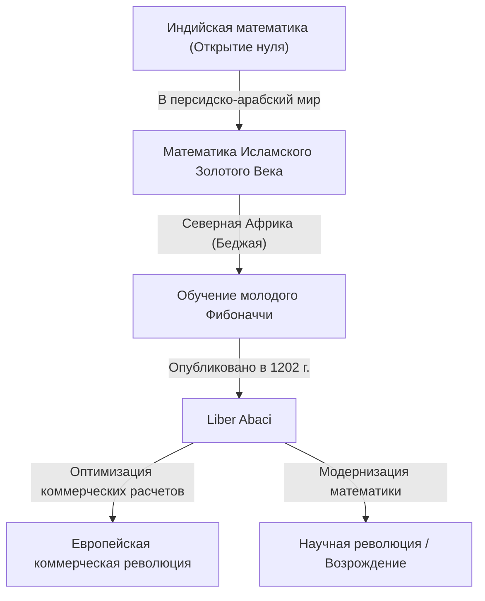
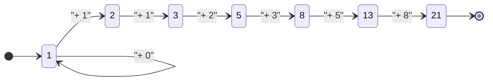

## Введение: Математический свет, озаривший Темные века

В средневековой Европе, в период, часто называемый «Темными веками», прогресс науки остановился. Однако в начале 13 века появился гений, который навсегда изменил историю европейской математики. Его звали Леонардо Пизанский. Эта фигура, позже известная как **Фибоначчи**, стала движущей силой популяризации «арабских цифр» (индо-арабских цифр), которые мы ежедневно используем в наше время, и первооткрывателем «последовательности Фибоначчи», раскрывающей тайны мира природы.

В этой статье мы подробно рассмотрим бурную жизнь Фибоначчи, влияние, которое его главный труд «Liber Abaci» оказал на общество, и его математическое наследие, распространяющееся на современную науку и мир природы.

## Жизнь Фибоначчи и исторический фон

### Рождение в Пизе и происхождение имени "Фибоначчи"

[Леонардо Фибоначчи](https://kenji.blog/p/fibonacci/) родился около 1170 года в итальянском городе-государстве Пиза. Пиза в то время процветала как центр средиземноморской торговли, была богатой республикой с мощным флотом и коммерческой сетью. Его отец, Гульельмо Боначчи, был богатым купцом, который также работал таможенным чиновником в Пизе.

Имя «Фибоначчи» на самом деле не использовалось при его жизни. Это придуманный термин, созданный более поздними историками путем сокращения латинского «filius Bonacci» (сын Боначчи). Сам он называл себя «Леонардо Пизано» (Леонардо Пизанский) или, из-за своей любви к путешествиям, «Биголло» (что означает странник или бездельник).

### Образование в Северной Африке и знакомство с другими культурами

Судьба юного Леонардо круто изменилась, когда его отец Гульельмо был назначен представителем пизанской торговой колонии в Беджае (Буджии), на территории современного Алжира в Северной Африке. Отец вызвал его в Беджаю, чтобы тот освоил практические навыки купца.

Там Леонардо получил возможность изучать математику у арабского учителя. Исламский мир в то время находился в авангарде математики, широко используя десятичную позиционную систему счисления родом из Индии, которая включала «0» (индо-арабские цифры). Вычисления с использованием римских цифр (I, V, X, L, C, D, M), преобладавших в Европе, были чрезвычайно громоздкими, что делало абак (счеты) незаменимым для сложных вычислений. Однако с помощью индо-арабских цифр сложные вычисления можно было выполнять быстро и точно, используя только бумагу и перо.

### Путешествия по Средиземноморью и поиск знаний

Осознав подавляющее превосходство индо-арабских цифр, Леонардо отправился в путешествие по Средиземноморью в поисках новых знаний. Он посетил торговые и академические центры того времени, такие как Египет, Сирия, Греция, Сицилия и Прованс, впитывая различные математические методы и способы коммерческих вычислений во время общения с местными учеными.

Благодаря этим обширным путешествиям он убедился, что индо-арабские цифры — это не просто удобные инструменты для торговли, а мощная система, необходимая для развития чистой математики. Около 1200 года он вернулся в свой родной город Пизу и начал систематизировать огромные знания, которые приобрел.

## "Liber Abaci" и его влияние

В 1202 году Фибоначчи завершил свой главный труд "Liber Abaci" (Книга абака), а в 1228 году было опубликовано пересмотренное издание. Хотя в названии упоминается «абак», на самом деле это была новаторская книга, в которой объяснялось, как выполнять вычисления с использованием новой системы счисления без использования абака.

### Внедрение арабских цифр

Начало "Liber Abaci" открывается этой исторической фразой:

> "Девять индийских знаков суть таковы: 9 8 7 6 5 4 3 2 1. С помощью этих девяти знаков и знака 0, который по-арабски называется zephirum, можно написать какое угодно число."

В этой книге не просто рассказывалось, как писать числа; в ней всесторонне освещались основы арифметики, преподаваемые в современных начальных и средних школах, включая письменные методы сложения, вычитания, умножения, деления, операции с дробями и способы нахождения квадратных и кубических корней.

### Применение в коммерческой математике

Чтобы доказать, насколько исключительно практичной была эта новая математическая система, Фибоначчи включил в книгу множество реальных задач, с которыми сталкивались купцы.

- Расчет сложных обменных курсов между различными валютами
- Расчет прибыли и убытков на товарах
- Определение справедливых пропорций при бартере
- Расчеты сложных процентов

В результате "Liber Abaci" стала не только академическим текстом, но и лучшим практическим руководством для европейских купцов. Благодаря его влиянию итальянские купцы постепенно перешли от римских цифр к арабским, заложив важную основу для последующего развития капиталистической экономики и Научной революции в эпоху Возрождения.

## Последовательность Фибоначчи и Золотое сечение: Код природы

Самой известной частью "Liber Abaci" является "Задача о кроликах", которая появляется в главе 12. Эта, казалось бы, простая головоломка породила феноменальную последовательность, позже названную "Последовательностью Фибоначчи".

### Задача о кроликах

Условие задачи звучит так:

> "Некто поместил пару кроликов в некое место, со всех сторон огражденное стеной. Сколько пар кроликов родится от этой пары в течение года, если природа кроликов такова, что каждый месяц, начиная со второго месяца, каждая пара кроликов производит на свет еще одну пару?"

Отслеживая количество пар кроликов каждый месяц, мы получаем следующую последовательность:

$1, 1, 2, 3, 5, 8, 13, 21, 34, 55, 89, 144, ...$

Закономерность этой последовательности исключительно красива: "Сумма двух предыдущих чисел равна следующему числу". Математически она определяется следующим рекуррентным соотношением:

$$
F_n = 
\begin{cases} 
0 & \text{если } n = 0 \\
1 & \text{если } n = 1 \\
F_{n-1} + F_{n-2} & \text{если } n > 1
\end{cases}
$$

### Удивительная связь с Золотым сечением

Одной из самых мистических особенностей последовательности Фибоначчи является то, что если взять отношение двух соседних чисел ($F_{n+1} / F_n$), оно сходится к определенной константе.

- $1 / 1 = 1.000$
- $2 / 1 = 2.000$
- $3 / 2 = 1.500$
- $5 / 3 \approx 1.667$
- $8 / 5 = 1.600$
- $13 / 8 = 1.625$
- $21 / 13 \approx 1.615$
- $34 / 21 \approx 1.619$

По мере увеличения чисел это отношение приближается к иррациональному числу, обозначаемому $\phi$ (фи).

$$
\phi = \frac{1 + \sqrt{5}}{2} \approx 1.6180339887...
$$

Оно известно как "Золотое сечение", которое со времен Древней Греции считалось самой красивой и гармоничной пропорцией. Это соотношение намеренно (или бессознательно) используется в исторической архитектуре и произведениях искусства, таких как Парфенон и Мона Лиза.

Более того, математик 19 века Жак Филипп Мари Бине открыл "Формулу Бине", которая находит общий член последовательности Фибоначчи с использованием Золотого сечения:

$$
F_n = \frac{\phi^n - (1-\phi)^n}{\sqrt{5}}
$$

### Числа Фибоначчи в природе

Последовательность Фибоначчи и Золотое сечение — это не просто математическая игра. Поразительно, но эта последовательность скрыта повсюду в мире природы.

1. **Количество лепестков**: Количество лепестков многих цветов является числом Фибоначчи (например, у лилий — 3, у лютиков — 5, у дельфиниумов — 8, у ноготков — 13, у подсолнухов — 21, 34, 55 и т.д.).
2. **Филлотаксис (Листорасположение)**: Узор расположения листьев, растущих на стебле растения, эволюционировал так, чтобы верхние и нижние листья не перекрывали друг друга и не блокировали солнечный свет. Этот угол становится «Золотым углом» (около 137,5 градусов), что приводит к появлению чисел Фибоначчи.
3. **Шишки и ананасы**: При подсчете количества спиралей на поверхности, спирали по часовой стрелке и против часовой стрелки образуют соседние числа Фибоначчи, такие как 8 и 13 или 13 и 21.
4. **Раковины наутилуса**: "Логарифмическая спираль (золотая спираль)", нарисованная на основе золотого сечения, идеально совпадает с моделью роста раковин улиток.

## Другие математические достижения

Достижения Фибоначчи не ограничивались "Liber Abaci". Его слава достигла ушей императора Священной Римской империи Фридриха II, который пригласил его к своему двору для решения многочисленных математических задач.

### "Liber Quadratorum" (Книга квадратов)

Написанная в 1225 году, эта книга представляет собой продвинутый трактат о диофантовых уравнениях (уравнениях, ищущих целочисленные решения). Она исследует концепцию "конгруэнтных чисел" и демонстрирует глубокое понимание теоремы Пифагора. Она по праву считается величайшим шедевром теории чисел в средневековой Европе.

### "Practica Geometriae" (Практическая геометрия)

Написанная в 1220 году, эта книга подробно описывает геодезию и геометрию. Она предоставила строгие методы вычисления площади и объема, а также практическое применение принципов древнегреческой евклидовой геометрии, что сделало ее ценным ресурсом для инженеров и землемеров того времени.

## Современное общество и наследие Фибоначчи

Открытия Фибоначчи, жившего около 800 лет назад, продолжают играть важную роль в самых передовых областях современного общества.

### Применение в информатике

В компьютерных алгоритмах последовательность Фибоначчи весьма полезна. Алгоритм, называемый «поиск Фибоначчи», может искать данные более эффективно, чем бинарный поиск, при определенных условиях. Кроме того, структура данных, известная как «куча Фибоначчи» (Fibonacci heap), незаменима для ускорения алгоритмов теории графов, таких как алгоритм Дейкстры.

### Уровни Фибоначчи (Fibonacci Retracement) на финансовых рынках

Удивительно, но его имя также часто звучит в мире финансов. Метод технического анализа, называемый «коррекцией Фибоначчи», используется для прогнозирования точек, в которых цены на акции или обменные курсы будут отскакивать или откатываться на графиках. Трейдеры рисуют линии поддержки и сопротивления на основе соотношений Фибоначчи, таких как 23,6%, 38,2% и 61,8% (как величина, обратная золотому сечению). Идея о том, что одни и те же законы природы применимы к рыночным волнам, создаваемым массовой психологией людей, глубоко увлекательна.

## Заключение

[Леонардо Фибоначчи](https://kenji.blog/p/fibonacci/) навел мосты между знаниями исламского мира и Европы, принеся свет математики в западный мир. Без арабских цифр, которые он популяризировал через "Liber Abaci", последующая Научная революция и современное цифровое общество могли бы и не существовать.

Более того, последовательность, родившаяся из шутливой «Задачи о кроликах», воплощает в себе красоту чистой математики и продолжает очаровывать нас сегодня как универсальный закон, распространяющийся от роста растений до галактических спиралей и даже экономической деятельности человека. Наследие Фибоначчи учит нас сквозь время, что математика — это не просто техника вычислений, а «общий язык» для раскрытия истин Вселенной.
