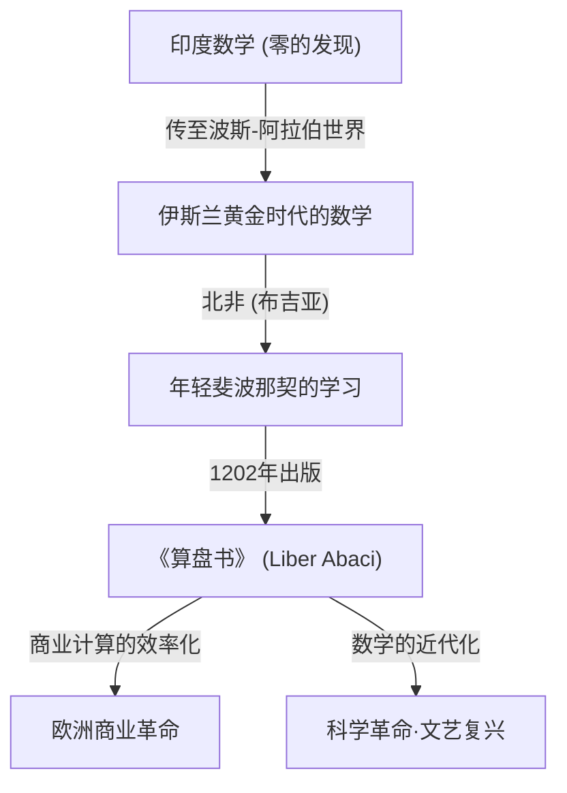
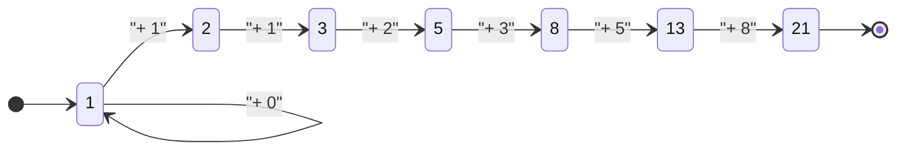

## 引言：照亮黑暗时代的数学之光

在中世纪欧洲，也就是通常被称为“黑暗时代”的时期，学术的进步处于停滞状态。然而，在13世纪初，一位天才的出现永远改变了欧洲数学的历史。他的名字叫比萨的莱昂纳多。这个后来被称为 **斐波那契** ([Fibonacci](https://kenji.blog/zh-cn/p/fibonacci/)) 的人物，不仅是将我们现代日常使用的“阿拉伯数字”（印度-阿拉伯数字）普及到欧洲的核心推手，还是揭示自然界奥秘的“斐波那契数列”的发现者。

本文将深入探讨斐波那契波澜壮阔的一生，他的主要著作《算盘书》对社会产生的深远影响，以及他延伸至现代科学和自然界的数学遗产。

## 斐波那契的生平与时代背景

### 在比萨的诞生与“斐波那契”名字的由来

[莱昂纳多·斐波那契](https://kenji.blog/zh-cn/p/fibonacci/)约于1170年出生于意大利城邦比萨。当时的比萨作为地中海贸易中心而繁荣，是一个拥有强大海军和商业网络的富裕共和国。他的父亲古列尔莫·博纳奇（Guglielmo Bonacci）是一位富有的商人，同时也担任比萨的海关官员。

实际上，“斐波那契（[Fibonacci](https://kenji.blog/zh-cn/p/fibonacci/)）”这个名字在他有生之年并没有被使用。这是后世历史学家将拉丁语“filius Bonacci（博纳奇之子）”缩写而创造的新词。他自称为“莱昂纳多·皮萨诺（比萨的莱昂纳多）”，因为他喜欢旅行，有时也自称为“比戈洛（Bigollo，意为流浪者或懒汉）”。

### 北非的教育与异文化的交汇

当父亲古列尔莫被任命为比萨在北非布吉亚（现阿尔及利亚的贝贾亚）商业贸易站的代表时，年轻莱昂纳多的命运迎来了重大转折。父亲为了让儿子学习商人的实务，将他召唤到了布吉亚。

在那里，莱昂纳多获得了向阿拉伯老师学习数学的机会。当时的伊斯兰世界走在数学的最前沿，广泛使用源自印度的包含“0”的十进制位置记数法（印度-阿拉伯数字）。而在欧洲占主导地位的罗马数字（I, V, X, L, C, D, M）进行计算时非常繁琐，进行高级计算时算盘是必不可少的。然而，使用印度-阿拉伯数字，仅用纸笔就能快速准确地完成复杂的计算。

### 地中海世界的旅行与知识的探索

意识到印度-阿拉伯数字的压倒性优势后，莱昂纳多为了寻求更多的知识，游历了地中海世界。他走访了埃及、叙利亚、希腊、西西里和普罗旺斯等当时的商业与学术中心，与当地的学者交流，吸收了各种数学方法和商业计算技术。

通过这些广泛的旅行，他确信印度-阿拉伯数字不仅是商业上的便利工具，也是纯粹数学发展不可或缺的强大体系。约在1200年，他回到了故乡比萨，开始着手整理他所获得的庞大知识。

## 《算盘书》（Liber Abaci）及其冲击

1202年，斐波那契完成了他的集大成之作《算盘书》（1228年出版了修订版）。虽然书名中带有“算盘”，但实际上这是一本划时代的著作，旨在讲解如何不使用算盘，而是运用新的数字系统进行计算。

### 阿拉伯数字的引入

《算盘书》的开篇有着这样一句历史性的话：

> “印度的九个数字是：9 8 7 6 5 4 3 2 1。有了这九个数字，以及阿拉伯人称为zephirum的符号0，就可以写出任何数字。”

这本书不仅教授如何书写数字，还全面涵盖了现代中小学教授的算术基础，包括加减乘除的笔算方法、分数的计算、以及如何求平方根和立方根。

### 在商业数学中的应用

为了证明这种新数学系统在实用性上有多么卓越，斐波那契收录了大量商人面临的实际问题。

- 不同货币之间复杂的汇率计算
- 商品的利润和损失计算
- 物物交换中合理比例的确定
- 复利计算

由此，《算盘书》不仅成为学术著作，还成为欧洲商人们的终极实用手册。在他的影响下，意大利商人逐渐从罗马数字转向阿拉伯数字，这为后来资本主义经济的发展和文艺复兴时期的科学革命奠定了重要基础。

## 斐波那契数列与黄金分割：自然界的密码

《算盘书》中最著名的是出现在第12章的“兔子问题”。这个看似简单的谜题，诞生了后来被称为“斐波那契数列”的惊人数列。

### 兔子问题

问题如下：

> “有人把一对兔子放在一个四面被墙围住的地方。假设每对兔子从第二个月起每个月生一对小兔子，而且没有兔子死亡，那么一年后共有多少对兔子？”

如果追踪每个月兔子的对数，就会得到如下的数列：

$1, 1, 2, 3, 5, 8, 13, 21, 34, 55, 89, 144, ...$

这个数列的规律性非常优美：“前两个数相加等于后一个数”。在数学上定义的话，它构成了如下的递推公式：

$$
F_n = 
\begin{cases} 
0 & \text{如果 } n = 0 \\
1 & \text{如果 } n = 1 \\
F_{n-1} + F_{n-2} & \text{如果 } n > 1
\end{cases}
$$

### 与黄金分割的惊人联系

斐波那契数列最神秘的特征之一是，如果计算相邻两个数的比值（$F_{n+1} / F_n$），它会收敛到一个特定的常数。

- $1 / 1 = 1.000$
- $2 / 1 = 2.000$
- $3 / 2 = 1.500$
- $5 / 3 \approx 1.667$
- $8 / 5 = 1.600$
- $13 / 8 = 1.625$
- $21 / 13 \approx 1.615$
- $34 / 21 \approx 1.619$

随着数字的增大，这个比值会无限接近一个无理数 $\phi$（Phi）。

$$
\phi = \frac{1 + \sqrt{5}}{2} \approx 1.6180339887...
$$

这就是著名的“黄金分割（Golden Ratio）”，自古希腊以来就被认为是最美丽和谐的比例。帕特农神庙、蒙娜丽莎等历史悠久的建筑和艺术作品都有意（或无意）地使用了这种比例。

此外，19世纪的数学家雅克·菲利普·玛丽·比内发现了“比内公式”，利用黄金分割求出了斐波那契数列的通项公式：

$$
F_n = \frac{\phi^n - (1-\phi)^n}{\sqrt{5}}
$$

### 自然界中的斐波那契数

斐波那契数列和黄金分割不仅仅是数学游戏。令人惊叹的是，这种数列隐藏在自然界的各个角落。

1. **花瓣的数量**：许多花的花瓣数都是斐波那契数（例如：百合3片，毛茛5片，飞燕草8片，万寿菊13片，向日葵21片、34片、55片等）。
2. **叶序（Phyllotaxis）**：植物茎上生长叶子的排列模式（叶序）进化成上下叶片不会重叠以遮挡阳光。这个角度成为“黄金角（约137.5度）”，结果就出现了斐波那契数。
3. **松果和菠萝**：数一数表面的螺旋数，顺时针和逆时针的螺旋数刚好是相邻的斐波那契数，如8和13，或者13和21。
4. **鹦鹉螺的壳**：基于黄金分割画出的“对数螺旋（黄金螺旋）”与海螺的生长模式完全一致。

## 其他数学成就

斐波那契的成就并不局限于《算盘书》。他的名声传到了神圣罗马帝国皇帝腓特烈二世的耳中，他被邀请到宫廷，挑战了许多数学难题。

### 《平方数之书》（Liber Quadratorum）

写于1225年的这本书是一部关于[丢番图](https://kenji.blog/zh-cn/p/diophantus/)方程（求整数解的方程）的高级研究著作。它探讨了“同余数（Congruent number）”的概念，展现了对勾股定理的深刻洞察。它被广泛认为是中世纪欧洲数论的最大杰作。

### 《实用几何学》（Practica Geometriae）

著于1220年，该书详细介绍了测量和几何学。它提供了计算面积和体积的严密方法，以及将古希腊[欧几里得](https://kenji.blog/zh-cn/p/euclid/)几何学原理应用于实践的方法，成为当时工程师和测量员的宝贵资料。

## 现代社会与斐波那契的遗产

生活在约800年前的斐波那契的发现，在现代社会的最前沿领域依然发挥着重要作用。

### 在计算机科学中的应用

在计算机算法中，斐波那契数列非常有用。一种名为“斐波那契搜索”的算法，在特定条件下能比二分搜索更高效地检索数据。此外，作为数据结构之一的“斐波那契堆”，对于加速图论中的戴克斯特拉算法等起着不可或缺的作用。

### 金融市场中的斐波那契回撤

令人惊讶的是，在金融世界中也经常能听到他的名字。一种被称为“斐波那契回撤（[Fibonacci](https://kenji.blog/zh-cn/p/fibonacci/) Retracement）”的技术分析方法，被用来预测股票价格或汇率图表中行情反弹或回落的点位。交易员们基于 23.6%、38.2%、61.8%（如黄金分割的倒数等）的斐波那契比率来绘制支撑线或阻力线。人类群体心理创造的市场波动，居然也能适用与自然界相同的法则，这种想法非常引人入胜。

## 结论

[莱昂纳多·斐波那契](https://kenji.blog/zh-cn/p/fibonacci/)成为了连接伊斯兰世界和欧洲知识的桥梁，为西方世界带来了数学之光。如果没有他通过《算盘书》普及的阿拉伯数字，也许就不会有后来的科学革命，也不会有现代的数字社会。

此外，他出于好玩而思考出的“兔子问题”所诞生的数列，不仅体现了纯粹数学的数学之美，作为一种贯穿植物生长、星系螺旋，甚至人类经济活动的普遍法则，至今仍让我们深深着迷。斐波那契的遗产跨越了时间告诉我们，数学不仅仅是计算技术，更是解开宇宙真理的“通用语言”。
