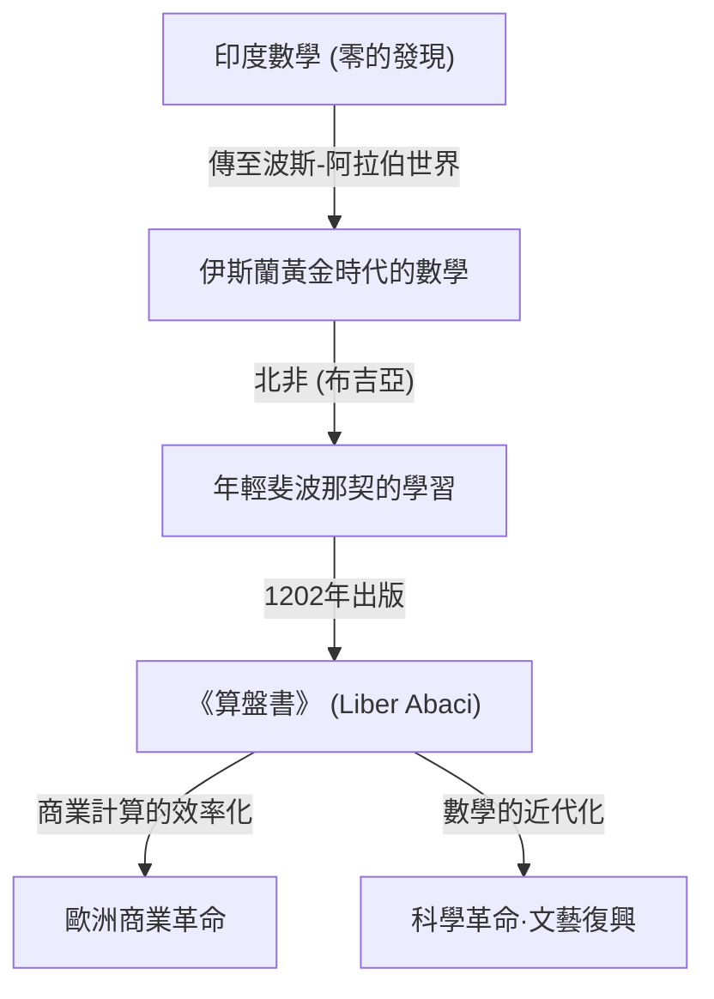
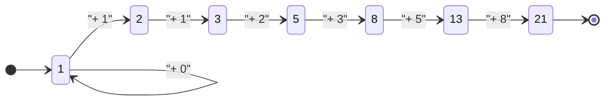

## 引言：照亮黑暗時代的數學之光

在中世紀歐洲，也就是通常被稱為「黑暗時代」的時期，學術的進步處於停滯狀態。然而，在13世紀初，一位天才的出現永遠改變了歐洲數學的歷史。他的名字叫比薩的李奧納多。這個後來被稱為 **斐波那契** ([Fibonacci](https://kenji.blog/zh-tw/p/fibonacci/)) 的人物，不僅是將我們現代日常使用的「阿拉伯數字」（印度-阿拉伯數字）普及到歐洲的核心推手，還是揭示自然界奧秘的「斐波那契數列」的發現者。

本文將深入探討斐波那契波瀾壯闊的一生，他的主要著作《算盤書》對社會產生的深遠影響，以及他延伸至現代科學和自然界的數學遺產。

## 斐波那契的生平與時代背景

### 在比薩的誕生與「斐波那契」名字的由來

[李奧納多·斐波那契](https://kenji.blog/zh-tw/p/fibonacci/)約於1170年出生於義大利城邦比薩。當時的比薩作為地中海貿易中心而繁榮，是一個擁有強大海軍和商業網絡的富裕共和國。他的父親古列爾莫·博納奇（Guglielmo Bonacci）是一位富有的商人，同時也擔任比薩的海關官員。

實際上，「斐波那契（[Fibonacci](https://kenji.blog/zh-tw/p/fibonacci/)）」這個名字在他有生之年並沒有被使用。這是後世歷史學家將拉丁語「filius Bonacci（博納奇之子）」縮寫而創造的新詞。他自稱為「李奧納多·皮薩諾（比薩的李奧納多）」，因為他喜歡旅行，有時也自稱為「比戈洛（Bigollo，意為流浪者或懶漢）」。

### 北非的教育與異文化的交匯

當父親古列爾莫被任命為比薩在北非布吉亞（現阿爾及利亞的貝賈亞）商業貿易站的代表時，年輕李奧納多的命運迎來了重大轉折。父親為了讓兒子學習商人的實務，將他召喚到了布吉亞。

在那裡，李奧納多獲得了向阿拉伯老師學習數學的機會。當時的伊斯蘭世界走在數學的最前沿，廣泛使用源自印度的包含「0」的十進位位置記數法（印度-阿拉伯數字）。而在歐洲占主導地位的羅馬數字（I, V, X, L, C, D, M）進行計算時非常繁瑣，進行高級計算時算盤是必不可少的。然而，使用印度-阿拉伯數字，僅用紙筆就能快速準確地完成複雜的計算。

### 地中海世界的旅行與知識的探索

意識到印度-阿拉伯數字的壓倒性優勢後，李奧納多為了尋求更多的知識，遊歷了地中海世界。他走訪了埃及、敘利亞、希臘、西西里和普羅旺斯等當時的商業與學術中心，與當地的學者交流，吸收了各種數學方法和商業計算技術。

通過這些廣泛的旅行，他確信印度-阿拉伯數字不僅是商業上的便利工具，也是純粹數學發展不可或缺的強大體系。約在1200年，他回到了故鄉比薩，開始著手整理他所獲得的龐大知識。

## 《算盤書》（Liber Abaci）及其衝擊

1202年，斐波那契完成了他的集大成之作《算盤書》（1228年出版了修訂版）。雖然書名中帶有「算盤」，但實際上這是一本劃時代的著作，旨在講解如何不使用算盤，而是運用新的數字系統進行計算。

### 阿拉伯數字的引入

《算盤書》的開篇有著這樣一句歷史性的話：

> 「印度的九個數字是：9 8 7 6 5 4 3 2 1。有了這九個數字，以及阿拉伯人稱為zephirum的符號0，就可以寫出任何數字。」

這本書不僅教授如何書寫數字，還全面涵蓋了現代中小學教授的算術基礎，包括加減乘除的筆算方法、分數的計算、以及如何求平方根和立方根。

### 在商業數學中的應用

為了證明這種新數學系統在實用性上有多麼卓越，斐波那契收錄了大量商人面臨的實際問題。

- 不同貨幣之間複雜的匯率計算
- 商品的利潤和損失計算
- 物物交換中合理比例的確定
- 複利計算

由此，《算盤書》不僅成為學術著作，還成為歐洲商人們的終極實用手冊。在他的影響下，義大利商人逐漸從羅馬數字轉向阿拉伯數字，這為後來資本主義經濟的發展和文藝復興時期的科學革命奠定了重要基礎。

## 斐波那契數列與黃金分割：自然界的密碼

《算盤書》中最著名的是出現在第12章的「兔子問題」。這個看似簡單的謎題，誕生了後來被稱為「斐波那契數列」的驚人數列。

### 兔子問題

問題如下：

> 「有人把一對兔子放在一個四面被牆圍住的地方。假設每對兔子從第二個月起每個月生一對小兔子，而且沒有兔子死亡，那麼一年後共有多少對兔子？」

如果追蹤每個月兔子的對數，就會得到如下的數列：

$1, 1, 2, 3, 5, 8, 13, 21, 34, 55, 89, 144, ...$

這個數列的規律性非常優美：「前兩個數相加等於後一個數」。在數學上定義的話，它構成了如下的遞迴公式：

$$
F_n = 
\begin{cases} 
0 & \text{如果 } n = 0 \\
1 & \text{如果 } n = 1 \\
F_{n-1} + F_{n-2} & \text{如果 } n > 1
\end{cases}
$$

### 與黃金分割的驚人聯繫

斐波那契數列最神秘的特徵之一是，如果計算相鄰兩個數的比值（$F_{n+1} / F_n$），它會收斂到一個特定的常數。

- $1 / 1 = 1.000$
- $2 / 1 = 2.000$
- $3 / 2 = 1.500$
- $5 / 3 \approx 1.667$
- $8 / 5 = 1.600$
- $13 / 8 = 1.625$
- $21 / 13 \approx 1.615$
- $34 / 21 \approx 1.619$

隨著數字的增大，這個比值會無限接近一個無理數 $\phi$（Phi）。

$$
\phi = \frac{1 + \sqrt{5}}{2} \approx 1.6180339887...
$$

這就是著名的「黃金分割（Golden Ratio）」，自古希臘以來就被認為是最美麗和諧的比例。帕德嫩神廟、蒙娜麗莎等歷史悠久的建築和藝術作品都有意（或無意）地使用了這種比例。

此外，19世紀的數學家雅克·菲利普·瑪麗·比內發現了「比內公式」，利用黃金分割求出了斐波那契數列的通項公式：

$$
F_n = \frac{\phi^n - (1-\phi)^n}{\sqrt{5}}
$$

### 自然界中的斐波那契數

斐波那契數列和黃金分割不僅僅是數學遊戲。令人驚嘆的是，這種數列隱藏在自然界的各個角落。

1. **花瓣的數量**：許多花的花瓣數都是斐波那契數（例如：百合3片，毛茛5片，飛燕草8片，萬壽菊13片，向日葵21片、34片、55片等）。
2. **葉序（Phyllotaxis）**：植物莖上生長葉子的排列模式（葉序）進化成上下葉片不會重疊以遮擋陽光。這個角度成為「黃金角（約137.5度）」，結果就出現了斐波那契數。
3. **松果和鳳梨**：數一數表面的螺旋數，順時針和逆時針的螺旋數剛好是相鄰的斐波那契數，如8和13，或者13和21。
4. **鸚鵡螺的殼**：基於黃金分割畫出的「對數螺旋（黃金螺旋）」與海螺的生長模式完全一致。

## 其他數學成就

斐波那契的成就並不侷限於《算盤書》。他的名聲傳到了神聖羅馬帝國皇帝腓特烈二世的耳中，他被邀請到宮廷，挑戰了許多數學難題。

### 《平方數之書》（Liber Quadratorum）

寫於1225年的這本書是一部關於[丟番圖](https://kenji.blog/zh-tw/p/diophantus/)方程（求整數解的方程）的高級研究著作。它探討了「同餘數（Congruent number）」的概念，展現了對畢氏定理的深刻洞察。它被廣泛認為是中世紀歐洲數論的最大傑作。

### 《實用幾何學》（Practica Geometriae）

著於1220年，該書詳細介紹了測量和幾何學。它提供了計算面積和體積的嚴密方法，以及將古希臘[歐幾里得](https://kenji.blog/zh-tw/p/euclid/)幾何學原理應用於實踐的方法，成為當時工程師和測量員的寶貴資料。

## 現代社會與斐波那契的遺產

生活在約800年前的斐波那契的發現，在現代社會的最前沿領域依然發揮著重要作用。

### 在計算機科學中的應用

在計算機算法中，斐波那契數列非常有用。一種名為「斐波那契搜尋」的算法，在特定條件下能比二分搜尋更高效地檢索數據。此外，作為數據結構之一的「斐波那契堆積」，對於加速圖論中的戴克斯特拉算法等起著不可或缺的作用。

### 金融市場中的斐波那契回撤

令人驚訝的是，在金融世界中也經常能聽到他的名字。一種被稱為「斐波那契回撤（[Fibonacci](https://kenji.blog/zh-tw/p/fibonacci/) Retracement）」的技術分析方法，被用來預測股票價格或匯率圖表中行情反彈或回落的點位。交易員們基於 23.6%、38.2%、61.8%（如黃金分割的倒數等）的斐波那契比率來繪製支撐線或阻力線。人類群體心理創造的市場波動，居然也能適用與自然界相同的法則，這種想法非常引人入勝。

## 結論

[李奧納多·斐波那契](https://kenji.blog/zh-tw/p/fibonacci/)成為了連接伊斯蘭世界和歐洲知識的橋樑，為西方世界帶來了數學之光。如果沒有他通過《算盤書》普及的阿拉伯數字，也許就不會有後來的科學革命，也不會有現代的數位社會。

此外，他出於好玩而思考出的「兔子問題」所誕生的數列，不僅體現了純粹數學的數學之美，作為一種貫穿植物生長、星系螺旋，甚至人類經濟活動的普遍法則，至今仍讓我們深深著迷。斐波那契的遺產跨越了時間告訴我們，數學不僅僅是計算技術，更是解開宇宙真理的「通用語言」。
