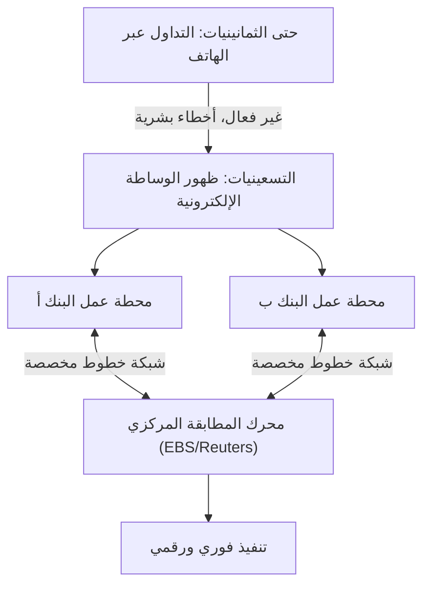

## 1. ولادة سوق مالي ضخم

تداول العملات الأجنبية (FX: Foreign Exchange) هو منتج مالي منتشر على نطاق واسع حتى بين المستثمرين الأفراد، ولكن "سوق العملات الأجنبية" الذي يشكل أساسه له خصائص تختلف جذريًا عن سوق الأسهم.
لا توجد بورصة محددة (مثل بورصة طوكيو أو بورصة نيويورك)، بل هو سوق شبكي ضخم يعتمد على "التداول المباشر (OTC: Over-The-Counter)" حيث تقوم البنوك والمؤسسات المالية في جميع أنحاء العالم بشراء وبيع العملات مباشرة عبر شبكات الكمبيوتر.

كيف تشكل هذا السوق الذي يتجاوز حجم تداوله اليومي 7 تريليونات دولار ويفتخر بأكبر سيولة في العالم، وكيف تحول بفضل التكنولوجيا؟

## 2. التاريخ: انهيار نظام بريتون وودز والانتقال إلى نظام سعر الصرف المرن

تعود جذور سوق الفوركس الحديث إلى التحول الكبير في النظام المالي الدولي في السبعينيات.

بعد الحرب العالمية الثانية، حافظ الاقتصاد العالمي على استقراره من خلال "نظام بريتون وودز (نظام سعر الصرف الثابت)"، الذي جعل الدولار الأمريكي هو العملة الأساسية وضمن قابلية تحويل الدولار إلى ذهب. كان ذلك في عصر كان فيه الدولار الواحد يعادل 360 ينًا.
ومع ذلك، في عام 1971، أعلن الرئيس الأمريكي نيكسون بشكل مفاجئ تعليق قابلية تحويل الدولار إلى ذهب (صدمة نيكسون). وأدى ذلك إلى انهيار نظام سعر الصرف الثابت، وانتقلت قيمة عملات كل دولة إلى " **نظام سعر الصرف المرن** " الذي يتغير لحظة بلحظة بناءً على العرض والطلب في السوق.

مع بدء تقلب أسعار العملات (أسعار الصرف)، اضطرت الشركات التجارية إلى تجنب (التحوط من) مخاطر تقلبات أسعار الصرف، وفي الوقت نفسه، نشطت صفقات المضاربة التي تهدف إلى تحقيق الأرباح من خلال "الشراء بسعر منخفض والبيع بسعر مرتفع". كانت هذه بداية سوق العملات الأجنبية الحديث.

## 3. تدخل التكنولوجيا: ظهور الوساطة الإلكترونية

حتى الثمانينيات، كانت معاملات العملات الأجنبية تتم بشكل رئيسي عبر "الهاتف". لقد كان عالمًا تناظريًا وإنسانيًا للغاية، حيث كان المتعاملون يمسكون بعدة سماعات هاتف ويصرخون بأسعار الصرف بصوت عالٍ بحثًا عن أطراف للتداول.

ما غيّر هذا العالم بشكل جذري هو ظهور " **نظام الوساطة الإلكترونية (مثل EBS و Reuters Matching)** " في أوائل التسعينيات.

تم ربط محطات عمل البنوك في جميع أنحاء العالم من خلال شبكة خطوط مخصصة، وأصبحت أسعار الصرف تُعرض على الشاشات في الوقت الفعلي. وبدلاً من إجراء مكالمات هاتفية، أصبح بإمكان المتعاملين إبرام صفقات بملايين الدولارات على الفور بمجرد النقر على لوحة المفاتيح.
ونتيجة لذلك، زادت شفافية السوق بشكل كبير، وانخفضت تكاليف المعاملات (الفروق: الفرق بين سعر الشراء وسعر البيع) بشكل كبير.

## 4. ثورة الإنترنت ودخول المستثمرين الأفراد (الفوركس بالتجزئة)

في أواخر التسعينيات، ومع انتشار الإنترنت، ظهر مشاركون جدد في سوق الفوركس، ألا وهم المستثمرون الأفراد.

حتى ذلك الحين، كان سوق العملات الأجنبية عالمًا مغلقًا يقتصر على المحترفين ويُعرف باسم سوق ما بين البنوك (الإنتربانك)، وكان الحد الأدنى لوحدة التداول هو مليون دولار أو أكثر كأمر طبيعي.
ومع ذلك، بدأت شركات الوساطة المالية عبر الإنترنت في تقديم أعمال "الفوركس بالتجزئة"، حيث قامت بتقسيم الصفقات الكبيرة في سوق ما بين البنوك إلى صفقات صغيرة وتقديمها للأفراد عبر الإنترنت. علاوة على ذلك، من خلال استخدام نظام "الهامش (الرافعة المالية)"، أصبح من الممكن إجراء صفقات كبيرة بمبالغ صغيرة من رأس المال.

في اليابان، تم تحرير تداول الفوركس للأفراد بالكامل من خلال تعديل قانون النقد الأجنبي في عام 1998، ونمت شريحة المستثمرين الأفراد اليابانيين المعروفة باسم "السيدة واتانابي" لتصبح قوة هائلة لا يمكن تجاهلها في سوق الفوركس العالمي.

## 5. صعود التداول الخوارزمي و HFT (التداول عالي التردد)

منذ العقد الأول من القرن الحادي والعشرين، دخلت رقمنة الأسواق المالية بعدًا جديدًا. إنه التحول من التداول المبني على التقدير البشري (الحدس والخبرة) إلى " **التداول الخوارزمي (التداول الآلي)** "، حيث تتخذ برامج الكمبيوتر قرارات البيع والشراء تلقائيًا.

من بين أساليب التداول الخوارزمي، الأسلوب الذي سعى وراء السرعة إلى أقصى حد هو " **HFT (High Frequency Trading: التداول عالي التردد)** ".

لا يهتم متداولو HFT بالأساسيات الاقتصادية للشركات أو الاتجاهات الاقتصادية طويلة الأجل على الإطلاق. ما يستهدفونه هو "تشوهات الأسعار (المراجحة)" التي تحدث لأجزاء من الألف من الثانية فقط بين الأسواق المتعددة.

* **الاستضافة المشتركة (ميزة الموقع)**: ما يحدد الفوز أو الخسارة في HFT هو تأخير الاتصال (زمن الوصول). ولأنهم يشعرون أن سرعة الضوء الذي يمر عبر الألياف الضوئية بطيئة، فإنهم يضعون خوادمهم الخاصة مباشرة داخل مراكز البيانات التي توجد بها خوادم البورصة (الاستضافة المشتركة). وذلك من أجل تقصير طول الكابلات المادية ولو ببضعة أمتار، لتقديم طلباتهم أسرع بميكروثانية واحدة (جزء من المليون من الثانية) مقارنة بالمنافسين.
* **المعالجة الآلية بواسطة FPGA**: نظرًا لأن المعالجة باستخدام وحدة المعالجة المركزية (CPU) العادية والبرمجيات تعتبر بطيئة أيضًا، فقد تم إدخال تقنيات تقوم بدمج خوارزميات التداول في دوائر رقائق أشباه الموصلات المخصصة المعروفة باسم FPGA (Field Programmable Gate Array) لمعالجة الأوامر على مستوى الأجهزة.

## 6. الانهيار الخاطف: مخاطر جديدة خلقتها التكنولوجيا

في حين يُحسب للتداول الخوارزمي أنه وفر قدرًا هائلاً من السيولة (أطراف التداول) في السوق وقلص الفروق السعرية إلى الحد الأدنى، إلا أنه جلب أيضًا آثارًا جانبية مرعبة. وهذا ما يُعرف باسم " **الانهيار الخاطف (Flash Crash - الانهيار اللحظي السريع)** ".

عند حدوث طلب غير طبيعي أو أخبار غير متوقعة في السوق، يقرر عدد لا يحصى من الذكاء الاصطناعي والخوارزميات في وقت واحد أن هناك "خطرًا"، ويغمرون السوق بأوامر البيع أو يسحبون السيولة في أجزاء من الألف من الثانية. وبدون أن يكون لدى المتعاملين البشريين الوقت لفهم الموقف، حدثت ظاهرة انهيار أسعار الصرف بعدة ينات في غضون بضع دقائق، ثم تعافت بسرعة وكأن شيئًا لم يكن، وقد تكرر هذا الأمر عدة مرات في السنوات الأخيرة.

## 7. الخلاصة

تاريخ الفوركس هو بحد ذاته تاريخ تطور التكنولوجيا حيث انتقلت أدوار البطولة من التناظرية إلى الرقمية، ومن الإنسان إلى الآلة.
بدأ بقرار سياسي بانهيار نظام بريتون وودز، وصولاً إلى تكامل السوق عبر الشبكات الإلكترونية، ودخول الأفراد عبر الإنترنت، ثم إلى عصر التداول فائق السرعة عبر الخوارزميات.

في الوقت الحاضر، تطور الأمر إلى مرحلة حيث يقوم الذكاء الاصطناعي باستخدام التعلم العميق (Deep Learning) ومعالجة اللغات الطبيعية بتحليل المقالات الإخبارية وتصريحات رؤساء البنوك المركزية بشكل فوري لإجراء التداولات.
سيظل سوق العملات الأجنبية، حيث تتحرك ثروات ضخمة، في طليعة المنافسة التكنولوجية البشرية حيث تتصادم أحدث علوم الكمبيوتر مع الهندسة المالية.
