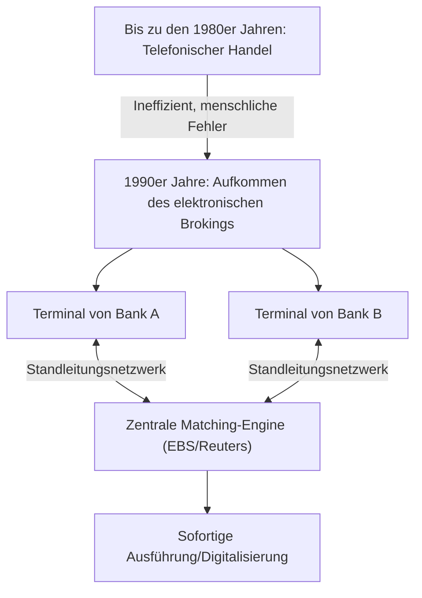

## 1. Die Entstehung eines riesigen Finanzmarktes

FX (Foreign Exchange: Devisenhandel) ist ein Finanzprodukt, das auch bei Privatanlegern in Japan weit verbreitet ist. Der zugrunde liegende "Devisenmarkt" weist jedoch grundlegend andere Merkmale auf als der Aktienmarkt.
Es gibt keine spezifische Börse (wie die Tokyo Stock Exchange oder die New York Stock Exchange). Es handelt sich um einen riesigen "Over-the-Counter" (OTC)-Netzwerkmarkt, in dem Banken und Finanzinstitute auf der ganzen Welt Währungen direkt über Computernetzwerke kaufen und verkaufen.

Mit einem täglichen Handelsvolumen von über 7 Billionen Dollar (ca. 1000 Billionen Yen) verfügt dieser Markt über die weltweit größte Liquidität. Wie ist er entstanden und wie wurde er durch Technologie verändert?

## 2. Geschichte: Der Zusammenbruch des Bretton-Woods-Systems und der Übergang zu flexiblen Wechselkursen

Der Ursprung des modernen FX-Marktes liegt in der großen Umstrukturierung des internationalen Finanzsystems in den 1970er Jahren.

Nach dem Zweiten Weltkrieg wurde die Weltwirtschaft durch das "Bretton-Woods-System (System fester Wechselkurse)" stabil gehalten, das auf dem US-Dollar als Leitwährung basierte und den Umtausch von Dollar und Gold garantierte. Es war die Ära von 1 Dollar = 360 Yen.
Im Jahr 1971 kündigte jedoch US-Präsident Nixon überraschend die Aussetzung der Konvertierbarkeit des Dollars in Gold an (Nixon-Schock). Infolgedessen brach das System fester Wechselkurse zusammen, und es kam zu einem Übergang zu "**flexiblen Wechselkursen**", bei denen sich der Wert der Währung jedes Landes durch Angebot und Nachfrage auf dem Markt ständig ändert.

Da die Währungspreise (Wechselkurse) nun schwankten, waren Handelsunternehmen gezwungen, das Wechselkursrisiko abzusichern (Hedging). Gleichzeitig nahm der spekulative Handel, der auf Gewinne durch "billig kaufen und teuer verkaufen" abzielte, zu. Dies war der Beginn des modernen Devisenmarktes.

## 3. Der Eingriff der Technologie: Das Aufkommen des elektronischen Brokings

Bis in die 1980er Jahre wurde der Devisenhandel hauptsächlich über das "Telefon" abgewickelt. Es war eine sehr analoge und menschliche Welt, in der Händler mehrere Telefonhörer in der Hand hielten und laut Kurse riefen, um nach Handelspartnern zu suchen.

Diese Welt wurde durch das Aufkommen von "**elektronischen Brokingsystemen (wie EBS und Reuters Matching)**" Anfang der 1990er Jahre dramatisch verändert.

Bankenterminals auf der ganzen Welt wurden durch Standleitungsnetzwerke verbunden, und Wechselkurse wurden in Echtzeit auf Bildschirmen angezeigt. Anstatt zu telefonieren, konnten Händler nun durch bloßes Tippen auf der Tastatur in Sekundenschnelle Transaktionen in Millionenhöhe abschließen.
Infolgedessen stieg die Markttransparenz dramatisch an, und die Transaktionskosten (Spread: die Differenz zwischen Kauf- und Verkaufspreis) schrumpften drastisch.

## 4. Die Internetrevolution und der Eintritt von Privatanlegern (Retail FX)

In den späten 1990er Jahren traten mit der Verbreitung des Internets neue Teilnehmer in den FX-Markt ein: Wir, die Privatanleger.

Bis dahin war der Devisenmarkt eine geschlossene Welt exklusiv für Profis, der sogenannte Interbankenmarkt, in dem eine Mindesthandelseinheit von 1 Million Dollar (ca. 100 Millionen Yen) die Norm war.
Jedoch begannen Online-Broker das "Retail FX"-Geschäft, indem sie große Transaktionen auf dem Interbankenmarkt in kleinere aufteilten und sie Einzelpersonen über das Internet anboten. Darüber hinaus ermöglichte der Einsatz eines "Margin (Leverage)"-Mechanismus den Handel mit großen Beträgen selbst mit wenig Kapital.

In Japan wurde der Devisenhandel für Privatpersonen 1998 durch die Änderung des Devisengesetzes vollständig liberalisiert, und japanische Privatanleger, bekannt als "Mrs. Watanabe", entwickelten sich zu einer massiven Präsenz auf dem globalen FX-Markt, die nicht ignoriert werden kann.

## 5. Der Aufstieg von algorithmischem Handel und HFT (Hochfrequenzhandel)

Seit den 2000er Jahren ist die IT-Entwicklung der Finanzmärkte in eine weitere Dimension vorgedrungen. Es ist der Wechsel vom Handel, der auf menschlichem Ermessen (Intuition und Erfahrung) basiert, zum "**algorithmischen Handel (automatisierten Handel)**", bei dem Computerprogramme automatisch Kauf- und Verkaufsentscheidungen treffen.

Unter den algorithmischen Handelsformen ist "**HFT (High Frequency Trading: Hochfrequenzhandel)**" diejenige, die Geschwindigkeit bis zum Äußersten treibt.

HFT-Unternehmen kümmern sich überhaupt nicht um die Fundamentaldaten von Unternehmen oder langfristige wirtschaftliche Trends. Worauf sie abzielen, sind "Preisverzerrungen (Arbitrage)", die für nur wenige Millisekunden (eine Tausendstelsekunde) zwischen mehreren Märkten auftreten.

* **Kolokation (Standortvorteil)**: Was über Sieg oder Niederlage im HFT entscheidet, ist die Kommunikationsverzögerung (Latenz). Sogar die Lichtgeschwindigkeit, die durch Glasfaserkabel wandert, fühlt sich für sie langsam an, sodass sie ihre eigenen Server direkt im selben Rechenzentrum platzieren (Kolokation), in dem sich die Börsenserver befinden. Dies geschieht, um ihre Aufträge eine Mikrosekunde (ein Millionstel einer Sekunde) schneller als andere Unternehmen zu übermitteln, indem die Länge der physischen Kabel auch nur um wenige Meter verkürzt wird.
* **Hardware-Verarbeitung durch FPGA**: Da selbst die Verarbeitung durch normale CPUs und Softwareprogramme zu langsam ist, werden Handelsalgorithmen direkt in die Schaltkreise von benutzerdefinierten Halbleiterchips gebrannt, die als FPGAs (Field Programmable Gate Arrays) bezeichnet werden, wodurch Technologien eingeführt werden, die Aufträge auf Hardwareebene verarbeiten.

## 6. Flash Crash: Ein neues Risiko durch Technologie

Während der algorithmische Handel das Verdienst hat, dem Markt massive Liquidität (Handelspartner) zur Verfügung zu stellen und Spreads zu minimieren, hat er auch eine erschreckende Nebenwirkung mit sich gebracht. Dies ist der "**Flash Crash (ein momentaner starker Preisverfall)**".

Wenn eine ungewöhnliche Order oder unerwartete Nachrichten auf dem Markt auftreten, beurteilen unzählige KIs und Algorithmen dies gleichzeitig als "Gefahr" und überschütten den Markt mit Verkaufsaufträgen in Millisekundenschnelle oder ziehen Liquidität ab. In den letzten Jahren kam es mehrfach vor, dass die Wechselkurse innerhalb weniger Minuten um mehrere Yen abstürzten und sich dann schnell wieder erholten, als wäre nichts gewesen, bevor menschliche Händler die Situation überhaupt begreifen konnten.

## 7. Zusammenfassung

Die Geschichte von FX ist die Geschichte der technologischen Entwicklung selbst, in der die Hauptakteure von analog zu digital und von Mensch zu Maschine gewechselt haben.
Angefangen mit der politischen Entscheidung, das Bretton-Woods-System aufzulösen, führte sie zur Marktintegration durch elektronische Netzwerke, zum Eintritt von Einzelpersonen durch das Internet und schließlich zur Ära des ultraschnellen Handels durch Algorithmen.

Heutzutage sind KIs, die Deep Learning und Natural Language Processing nutzen, so weit fortgeschritten, dass sie Nachrichtenartikel und Äußerungen von Zentralbankgouverneuren sofort interpretieren können, um Trades auszuführen.
Der Devisenmarkt, in dem enorme Vermögen bewegt werden, wird auch in Zukunft an vorderster Front des technologischen Wettbewerbs der Menschheit stehen, wo neueste Informatik und Financial Engineering aufeinandertreffen.
