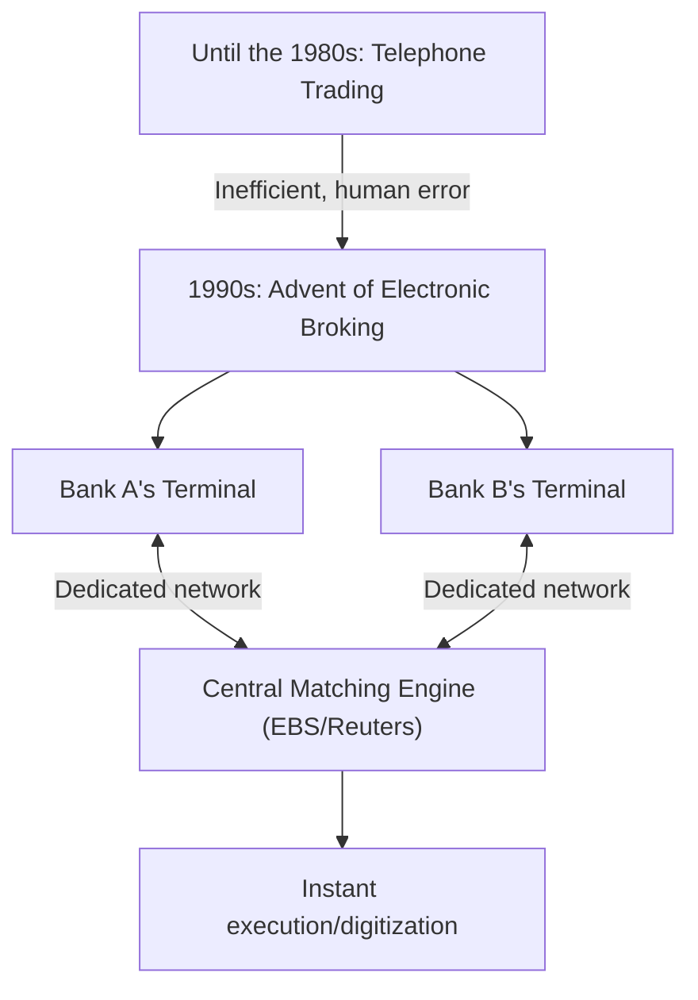

## 1. The Birth of a Giant Financial Market

FX (Foreign Exchange margin trading) is a financial product widely popular among individual investors even in Japan, but its foundational "foreign exchange market" has fundamentally different characteristics from the stock market.
There is no specific exchange (such as the Tokyo Stock Exchange or the New York Stock Exchange), and it is a massive "over-the-counter" (OTC) network market where banks and financial institutions worldwide buy and sell currencies directly through computer networks.

With a daily trading volume exceeding about 7 trillion dollars, this market, boasting the world's largest liquidity, how was it formed, and how has it been transformed by technology?

## 2. History: The Collapse of the Bretton Woods System and the Shift to Floating Exchange Rates

The origin of the modern FX market lies in the massive shift of the international financial system in the 1970s.

After World War II, the global economy was stabilized by the "Bretton Woods system (fixed exchange rate system)," which was based on the US dollar and guaranteed the exchange of dollars and gold. It was an era of 1 dollar = 360 yen.
However, in 1971, US President Nixon abruptly announced the suspension of the convertibility of the dollar into gold (the Nixon Shock). As a result, the fixed exchange rate system collapsed, shifting to a "**floating exchange rate system**" where the value of each country's currency changes moment by moment depending on market supply and demand.

As the price of currencies (exchange rates) began to fluctuate, trading companies were forced to hedge against exchange rate fluctuation risks, and simultaneously, speculative trading aimed at profiting by "buying low and selling high" became active. This marked the dawn of the modern foreign exchange market.

## 3. Technology Intervention: The Advent of Electronic Broking

Until the 1980s, foreign exchange trading was primarily conducted by "telephone." It was a highly analog and human world where dealers gripped multiple telephone receivers, shouting rates loudly while searching for trading counterparties.

What dramatically changed this world was the "**electronic broking system (such as EBS and Reuters Matching)**" introduced in the early 1990s.

Terminals of banks around the world were connected by a dedicated line network, and exchange rates began to be displayed on screens in real time. Instead of making phone calls, dealers were able to instantly execute trades worth millions of dollars simply by hitting a keyboard.
As a result, market transparency increased dramatically, and trading costs (spreads: the difference between the bid and ask prices) shrank dramatically.

## 4. The Internet Revolution and the Entry of Individual Investors (Retail FX)

In the late 1990s, the spread of the internet brought new participants to the FX market: us, individual investors.

Until then, the foreign exchange market was an exclusive world for professionals called the interbank market, and the minimum trading unit was normally 1 million dollars or more.
However, online brokerages divided the large trades of the interbank market into smaller units and started the "Retail FX" business offering them to individuals via the internet. Furthermore, by utilizing the mechanism of "margin (leverage)," large trades became possible even with a small amount of funds.

In Japan, individual FX trading was completely liberalized by the revision of the Foreign Exchange Act in 1998, and a segment of Japanese individual investors known as "Mrs. Watanabe" grew into a massive presence that cannot be ignored in the global FX market.

## 5. The Rise of Algorithmic Trading and HFT (High-Frequency Trading)

Since the 2000s, the ITization of financial markets has entered a further dimension. It is a shift from trading based on human discretion (intuition and experience) to "**algorithmic trading (automated trading)**," where computer programs automatically make buy and sell decisions.

Among algorithmic trading, what pursued speed to the limit was "**HFT (High-Frequency Trading)**."

HFT firms do not care about a company's fundamentals or long-term economic trends at all. What they target is the "price distortion (arbitrage)" that occurs for just a few milliseconds (one-thousandth of a second) between multiple markets.

* **Colocation (Location Advantage)**: What determines the victory or defeat of HFT is communication delay (latency). Feeling that even the speed of light traveling through optical fibers is slow, they place their own servers directly (colocation) inside the data center where the exchange's servers are located. This is to deliver orders 1 microsecond (one-millionth of a second) faster than other companies by shortening the physical length of the cable by even a few meters.
* **Hardware Processing by FPGA**: Since processing by normal CPUs and software programs is still slow, technologies have been introduced to burn trading algorithms directly into the circuits of custom semiconductor chips called FPGAs (Field Programmable Gate Arrays) to process orders at the hardware level.

## 6. Flash Crashes: A New Risk Created by Technology

While algorithmic trading is credited with providing a massive amount of liquidity (trading counterparties) to the market and minimizing spreads, it also brought a terrifying side effect. That is the "**flash crash (an instantaneous major collapse)**."

When some abnormal order or unexpected news occurs in the market, countless AIs and algorithms simultaneously judge it as "dangerous" and barrage sell orders or withdraw liquidity at a speed of milliseconds. Without giving human dealers time to grasp the situation, exchange rates plummet by several yen in a few minutes, and phenomenons where they rapidly recover as if nothing happened have occurred many times in recent years.

## 7. Summary

The history of FX is exactly the history of technological evolution where the main actors have changed from analog to digital, and from humans to machines.
Starting from the political decision of the collapse of the Bretton Woods system, it has led to market integration via electronic networks, the entry of individuals through the internet, and the era of ultra-high-speed trading by algorithms.

Currently, it has evolved to a stage where AI using deep learning and natural language processing instantly deciphers news articles and statements by central bank governors to conduct trades.
The foreign exchange market, where massive wealth moves, will continue to be the forefront of human technological competition, where the latest computer science and financial engineering collide.
